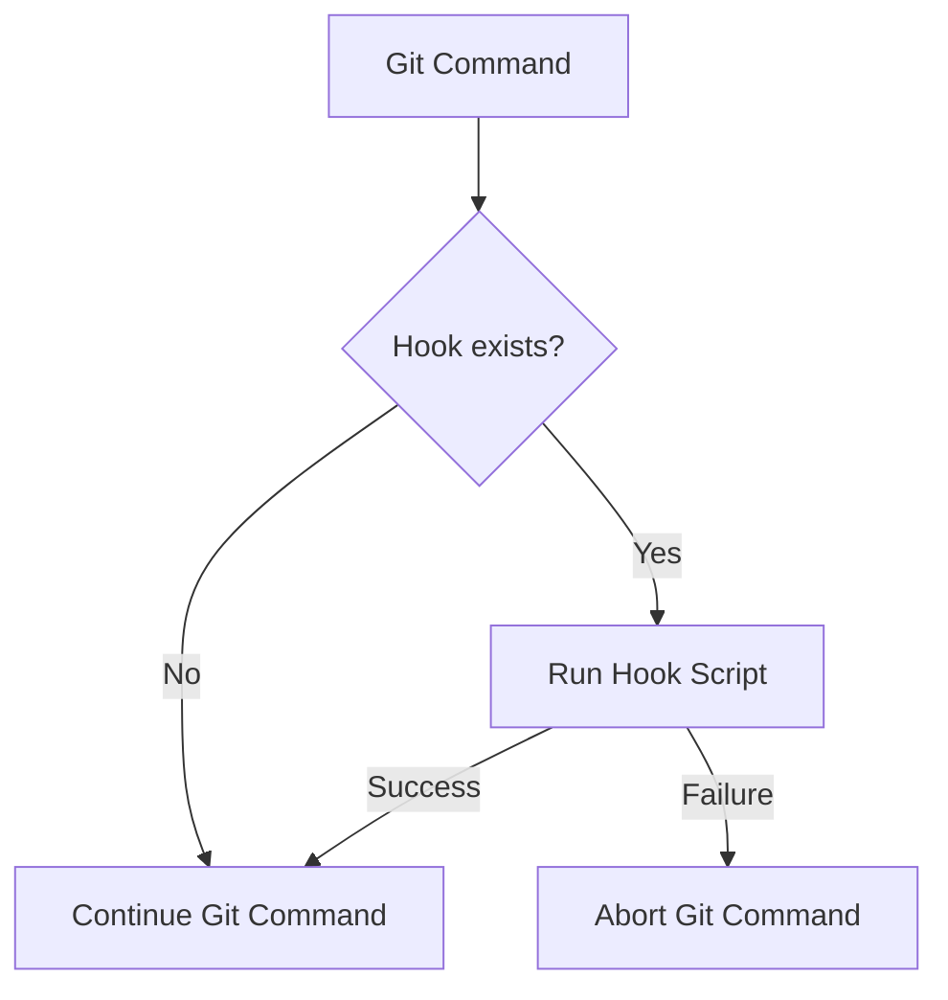

# Git Hooks

## Introduction

Git hooks are scripts that Git executes before or after events such as commit, push, and merge. They allow you to customize Git's internal behavior and trigger customizable actions at key points in the development workflow. Think of hooks as event listeners that can intercept Git commands and perform additional tasks.

Git hooks provide a powerful way to:
- Enforce coding standards
- Validate commit messages
- Run tests before committing
- Deploy code automatically
- Notify team members of changes
- And much more!

In this tutorial, you'll learn how Git hooks work, how to set them up, and how to use them effectively in your projects.

## How Git Hooks Work

Git hooks are stored as executable scripts in the `.git/hooks` directory of your Git repository. When a specific Git event occurs, Git checks if a corresponding hook script exists and executes it.

Here's a diagram showing the Git hooks workflow:



The important things to understand about Git hooks:

1. **Client-side vs Server-side hooks**: Some hooks run on your local machine (client-side), while others run on the Git server (server-side).
2. **Blocking vs Non-blocking**: Some hooks can block Git operations if they fail (exit with non-zero status), while others are just informational.
3. **Not version-controlled by default**: Git hooks reside in the `.git` directory, which isn't tracked by Git, so they aren't shared with other collaborators automatically.

## Common Git Hooks

Here are some of the most useful Git hooks:

### Client-side Hooks

| Hook | Triggered | Can Block | Purpose |
|------|-----------|-----------|---------|
| `pre-commit` | Before commit creation | Yes | Check code quality, run tests |
| `prepare-commit-msg` | After commit message created, before editor | No | Modify default commit messages |
| `commit-msg` | After commit message is entered | Yes | Validate commit message format |
| `post-commit` | After commit is completed | No | Notifications or tracking |
| `pre-push` | Before pushing changes | Yes | Run comprehensive tests |

### Server-side Hooks

| Hook | Triggered | Can Block | Purpose |
|------|-----------|-----------|---------|
| `pre-receive` | Before accepting pushed commits | Yes | Enforce project policies |
| `update` | Similar to pre-receive but per branch | Yes | Branch-specific policies |
| `post-receive` | After push is completed | No | Deployment, notifications |

## Creating Your First Git Hook

Let's create a simple `pre-commit` hook that checks for syntax errors in your JavaScript files:

### Step 1: Navigate to your hooks directory

```bash
cd .git/hooks
```

### Step 2: Create a new pre-commit script

Create a new file named `pre-commit` (no extension) with the following content:

```bash
#!/bin/sh

# Check for JavaScript syntax errors
FILES=$(git diff --cached --name-only --diff-filter=ACM | grep '\.js$')
if [ -n "$FILES" ]; then
    echo "Checking JavaScript syntax..."
    for FILE in $FILES; do
        node --check "$FILE"
        if [ $? -ne 0 ]; then
            echo "JavaScript syntax error in $FILE"
            exit 1
        fi
    done
fi

# If everything passes, proceed with the commit
exit 0
```

### Step 3: Make the hook executable

```bash
chmod +x pre-commit
```

Now, whenever you try to commit JavaScript files with syntax errors, Git will abort the commit and show you the error message.

## Example: Enforcing Commit Message Format

Let's create another hook that enforces a specific commit message format:

### Create a commit-msg hook

```bash
#!/bin/sh

# Regex pattern for conventional commits
COMMIT_MSG_PATTERN="^(feat|fix|docs|style|refactor|test|chore)(\(.+\))?: .{1,50}"

# Get the commit message
COMMIT_MSG=$(cat $1)

# Check if the commit message matches the pattern
if ! echo "$COMMIT_MSG" | grep -qE "$COMMIT_MSG_PATTERN"; then
    echo "Error: Commit message doesn't follow the conventional commit format."
    echo "Expected format: type(scope): message"
    echo "Example: feat(auth): add login functionality"
    echo "Types: feat, fix, docs, style, refactor, test, chore"
    exit 1
fi

exit 0
```

Don't forget to make it executable:

```bash
chmod +x .git/hooks/commit-msg
```

Now, your commits will be checked against the conventional commit format:

**Valid commit message:**
```
feat(auth): add login functionality
```

**Invalid commit message (will be rejected):**
```
added login feature
```

## Sharing Hooks with Your Team

Since Git hooks aren't version-controlled by default, sharing them with your team requires a different approach:

### Method 1: Store hooks in a shared directory

1. Create a `.hooks` directory at the root of your project
2. Place your hook scripts there
3. Configure Git to use this directory instead of the default:

```bash
git config core.hooksPath .hooks
```

You can add this configuration to your project setup instructions or create a setup script.

### Method 2: Use a hooks management tool

Several tools are available to help manage Git hooks across teams:

- [Husky](https://github.com/typicode/husky) - Easy hook management through package.json
- [pre-commit](https://pre-commit.com/) - A framework for managing multiple hooks
- [lefthook](https://github.com/evilmartians/lefthook) - Fast hooks manager

Example setup with Husky for a JavaScript project:

1. Install Husky:

```bash
npm install husky --save-dev
```

2. Configure hooks in package.json:

```json
{
  "husky": {
    "hooks": {
      "pre-commit": "npm run lint",
      "commit-msg": "node scripts/verify-commit-msg.js"
    }
  }
}
```

## Real-world Examples

Here are some practical examples of how Git hooks can be used in real projects:

### 1. Automated Testing

A `pre-push` hook that runs your test suite before pushing:

```bash
#!/bin/sh

# Run tests before pushing
echo "Running tests before push..."
npm test

# If tests fail, abort push
if [ $? -ne 0 ]; then
    echo "Tests failed! Aborting push."
    exit 1
fi

echo "Tests passed! Proceeding with push."
exit 0
```

### 2. Preventing Sensitive Data Leaks

A `pre-commit` hook that checks for API keys or passwords:

```bash
#!/bin/sh

# Check for potential API keys or passwords
if git diff --cached | grep -E "(api_key|API_KEY|password|PASSWORD|secret|SECRET)['\"]?\s*[:=]\s*['\"]?[A-Za-z0-9]{16,}"; then
    echo "Warning: Possible API key or password found in commit!"
    echo "Please remove sensitive data and try again."
    exit 1
fi

exit 0
```

### 3. Automatic Versioning

A `post-commit` hook that increments your project version:

```bash
#!/bin/sh

# Only run on main branch
BRANCH=$(git branch --show-current)
if [ "$BRANCH" != "main" ]; then
    exit 0
fi

# Increment patch version in package.json
npm version patch --no-git-tag-version

# Add the version bump to the repository
git add package.json
git commit --amend --no-edit

echo "Version incremented automatically!"
```

## Advanced Hook Techniques

### Using Hook Arguments

Many Git hooks receive arguments to provide additional context:

```bash
#!/bin/sh

# In commit-msg hook, $1 is the path to the commit message file
COMMIT_MSG_FILE=$1

# In pre-push hook, $1 is the name of the remote, $2 is the URL
REMOTE_NAME=$1
REMOTE_URL=$2

# In update hook, $1 is the ref name, $2 is the old object name, $3 is the new object name
REF_NAME=$1
OLD_SHA=$2
NEW_SHA=$3
```

### Skipping Hooks When Needed

Sometimes you need to bypass a hook. You can do this with the `--no-verify` flag:

```bash
git commit --no-verify -m "Emergency fix"
```

However, use this sparingly and only in legitimate cases. It's better to fix the issue that's causing the hook to fail.

## Troubleshooting Hook Issues

### Hook Not Executing

1. Check file permissions:
   ```bash
   ls -la .git/hooks/
   ```
   Ensure your hook has execute permission (`-rwxr-xr-x`).

2. Check the shebang line:
   Make sure the first line references the correct interpreter (e.g., `#!/bin/sh` or `#!/usr/bin/env python`).

3. Check for Windows line endings:
   Windows CRLF line endings can cause issues. Use:
   ```bash
   dos2unix .git/hooks/pre-commit
   ```

### Finding Hook Errors

If a hook is failing but not providing useful errors:

1. Add debugging to your hook:
   ```bash
   #!/bin/sh
   set -x  # Enable command tracing
   ```

2. Redirect hook output to a log file:
   ```bash
   #!/bin/sh
   exec > /tmp/git-hook-debug.log 2>&1
   set -x
   ```

## Summary

Git hooks provide a powerful way to automate and customize your Git workflow. They help enforce standards, prevent errors, and streamline development processes. Key points to remember:

- Hooks are scripts that execute at specific points in the Git workflow
- They can be client-side or server-side
- Some hooks can block Git operations if they fail
- Hooks aren't version-controlled by default, but there are strategies to share them
- Tools like Husky can help manage hooks in team environments

By incorporating Git hooks into your development process, you can catch issues early, maintain code quality, and automate repetitive tasks.

## Additional Resources

- [Git Documentation on Hooks](https://git-scm.com/docs/githooks)
- [Pro Git Book: Customizing Git - Git Hooks](https://git-scm.com/book/en/v2/Customizing-Git-Git-Hooks)

## Exercises

1. Create a `pre-commit` hook that prevents committing files larger than 5MB.
2. Implement a `prepare-commit-msg` hook that automatically adds the branch name to commit messages.
3. Set up a `post-commit` hook that sends a notification when a commit is made.
4. Create a `pre-push` hook that prevents pushing directly to the main branch.
5. Use Husky to implement and share hooks in a team project.