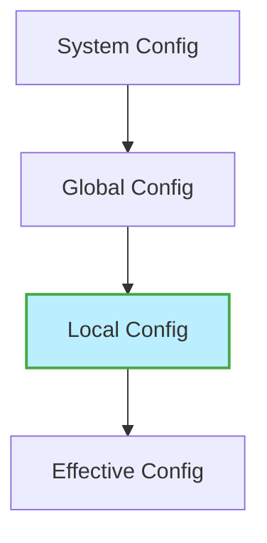

# Git Local Config

## Introduction

When working with Git, you'll often need to customize its behavior to suit your specific needs. Git provides a flexible configuration system that lets you control various aspects of its operation. One of the most useful features is the ability to create **local configurations** that apply only to specific repositories.

In this guide, we'll explore how to use Git's local configuration to customize your workflow on a per-repository basis. This knowledge is essential for collaborating with different teams, managing multiple projects, and adapting Git to different development environments.

## Understanding Git's Configuration Levels

Before we dive into local configurations, it's important to understand the three levels of Git configuration:

1. **System level** (`--system`): Applies to all users on the system and all their repositories
2. **Global level** (`--global`): Applies to all repositories for the current user
3. **Local level** (`--local`): Applies only to the current repository

Git reads these configurations in order (system → global → local), with each level overriding the previous one. This means your local configurations take precedence over global and system settings.



## Setting Up Local Git Configuration

Local Git configuration is stored in the `.git/config` file within your repository. Here's how you can work with it:

### Viewing Your Current Local Configuration

To see the current local configuration for a repository:

```bash
git config --local --list
```

This command displays all local configuration settings for the current repository.

**Output example:**
```
core.repositoryformatversion=0
core.filemode=true
remote.origin.url=https://github.com/username/repository.git
remote.origin.fetch=+refs/heads/*:refs/remotes/origin/*
branch.main.remote=origin
branch.main.merge=refs/heads/main
user.name=Repository Specific Username
user.email=repo-specific@example.com
```

### Setting Local Configuration Values

To set a configuration value at the local level:

```bash
git config --local user.name "Repository Specific Username"
git config --local user.email "repo-specific@example.com"
```

These commands set your name and email just for the current repository, which is particularly useful when you need different identities for different projects.

### Removing Local Configuration Values

To remove a specific configuration setting from the local config:

```bash
git config --local --unset user.name
```

This removes the `user.name` setting from the local configuration.

## Practical Examples

Let's explore some common scenarios where local Git configurations prove useful:

### Example 1: Project-Specific User Identity

Imagine you contribute to both work and personal projects from the same computer. You might want to use different email addresses for each:

```bash
# In your work repository
git config --local user.email "your.name@company.com"

# In your personal project
git config --local user.email "your.personal@email.com"
```

This ensures your commits are properly attributed without having to remember to change your global settings each time you switch projects.

### Example 2: Repository-Specific Line Ending Settings

Different projects might have different line ending requirements:

```bash
# Configure Windows-style line endings for a specific project
git config --local core.autocrlf true

# Configure Unix-style line endings for another project
git config --local core.autocrlf input
```

### Example 3: Custom Merge Tool for a Specific Project

If a particular project has specific merge tool requirements:

```bash
git config --local merge.tool kdiff3
git config --local mergetool.kdiff3.path "/path/to/kdiff3"
git config --local mergetool.kdiff3.trustExitCode true
```

### Example 4: Repository-Specific Aliases

Create aliases that make sense only for a specific project workflow:

```bash
git config --local alias.publish "push origin main"
git config --local alias.staged "diff --staged"
git config --local alias.project-deploy "!./deploy.sh"
```

## Editing the Config File Directly

While using the `git config` command is recommended, you can also edit the local configuration file directly:

```bash
# Open the local config file in your default editor
git config --local --edit
```

This opens the `.git/config` file, which has a simple INI-like format:

```ini
[user]
        name = Repository Specific Username
        email = repo-specific@example.com
[core]
        repositoryformatversion = 0
        filemode = true
[remote "origin"]
        url = https://github.com/username/repository.git
        fetch = +refs/heads/*:refs/remotes/origin/*
[branch "main"]
        remote = origin
        merge = refs/heads/main
[alias]
        publish = push origin main
        staged = diff --staged
```

## Conditional Includes

Git 2.13 and later allows you to conditionally include configuration files based on the repository path. This is useful when you want to apply specific settings to all repositories within a certain directory:

```bash
# In your global ~/.gitconfig
git config --global includeIf."gitdir:~/work/".path "~/.gitconfig-work"
git config --global includeIf."gitdir:~/personal/".path "~/.gitconfig-personal"
```

Then create `.gitconfig-work` and `.gitconfig-personal` files with specific settings that will automatically apply to repositories in those directories.

## Finding Local Config Priority

When working with multiple configuration levels, it can be helpful to check where a specific setting is coming from:

```bash
git config --show-origin user.name
```

**Output example:**
```
file:.git/config      Repository Specific Username
```

This shows the file source and the value of the configuration.

## Summary

Git's local configuration provides powerful flexibility to customize your version control workflow on a per-repository basis. By understanding and using local configurations effectively, you can:

- Maintain different identities for different projects
- Adapt Git's behavior to match project-specific requirements
- Create custom workflows with repository-specific aliases
- Override global settings without changing them permanently

This granular control makes Git adaptable to virtually any development environment or project requirement, allowing you to work more efficiently across diverse codebases.

## Exercises

1. Set up a local Git configuration that uses a different username and email from your global configuration.
2. Create a repository-specific alias that displays a log of your commits in a custom format.
3. Configure a specific repository to use a different default branch name than your global setting.
4. Use conditional includes to automatically apply different settings to repositories in different directories.
5. Explore the `.git/config` file in one of your existing repositories and identify any local configurations already in place.

## Additional Resources

- [Git Documentation: git-config](https://git-scm.com/docs/git-config)
- [Pro Git Book: Git Configuration](https://git-scm.com/book/en/v2/Customizing-Git-Git-Configuration)
- [Git Config Command Reference](https://git-scm.com/docs/git-config)