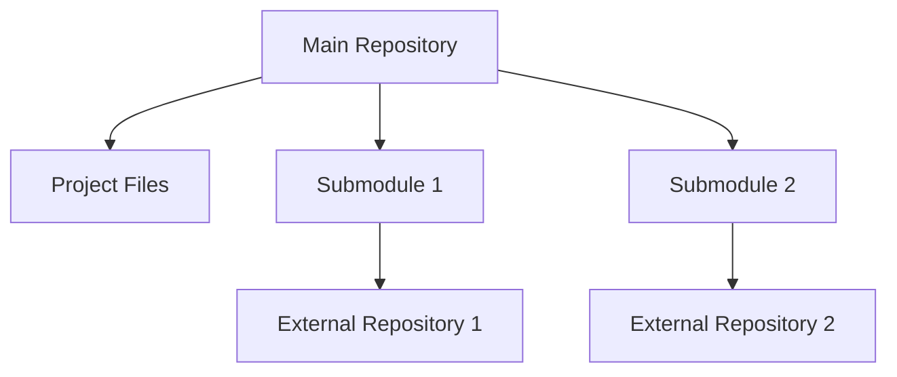

# Git Submodules

## Introduction

Have you ever needed to include code from another repository in your project? Perhaps a library, framework, or shared component that needs to be tracked separately but used within your main project? Git submodules are designed to solve exactly this problem.

A Git submodule allows you to keep a Git repository as a subdirectory of another Git repository. This lets you clone another repository into your project and keep your commits separate.

In this tutorial, we'll explore how Git submodules work, when to use them, and how to effectively manage them in your projects.

## What Are Git Submodules?

Git submodules are essentially repositories nested within another repository. They enable you to:

- Include external code in your project
- Keep the external code's history separate from your main project
- Update the external code when needed
- Commit to both your main project and the submodule independently



Think of submodules like building blocks that you can add to your project, with each block having its own history and management.

## When to Use Git Submodules

Submodules are particularly useful in these scenarios:

1. Including third-party libraries that you want to keep updated
2. Sharing code between multiple projects
3. Separating large projects into smaller, manageable components
4. Working on a feature in isolation before integrating it into the main project

However, submodules can add complexity to your workflow, so they should be used judiciously.

## Adding a Submodule to Your Repository

Let's start with adding a submodule to an existing repository:

```bash
# Navigate to your main repository
$ cd my-project

# Add a submodule
$ git submodule add https://github.com/example/library.git libs/library

# The command above will:
# 1. Clone the repository to the specified path
# 2. Add the submodule to .gitmodules file
# 3. Stage these changes

# Commit the changes
$ git commit -m "Add library submodule"
```

This creates a `.gitmodules` file that looks like this:

```
[submodule "libs/library"]
    path = libs/library
    url = https://github.com/example/library.git
```

The `.gitmodules` file is committed with your repository and tells Git where to look for the submodule repositories.

## Cloning a Repository with Submodules

When you clone a repository that contains submodules, the submodule directories are created, but no content is pulled down by default:

```bash
# Clone the main repository
$ git clone https://github.com/user/my-project.git

# Output:
# Cloning into 'my-project'...
# done.

$ cd my-project

# List files
$ ls -la libs/library
# You'll see an empty directory
```

To initialize and update the submodules, you have two options:

### Option 1: Clone with Submodules in One Command

```bash
# Clone and initialize submodules in one go
$ git clone --recurse-submodules https://github.com/user/my-project.git
```

### Option 2: Initialize Submodules After Cloning

```bash
# First clone the repository normally
$ git clone https://github.com/user/my-project.git
$ cd my-project

# Then initialize and update submodules
$ git submodule init
$ git submodule update
```

Alternatively, you can combine the initialization and update:

```bash
$ git submodule update --init --recursive
```

The `--recursive` flag is useful if your submodules contain their own submodules.

## Updating Submodules

When the upstream repository of a submodule changes, you need to update your submodule:

```bash
# Navigate to the submodule directory
$ cd libs/library

# Fetch and merge changes
$ git fetch
$ git merge origin/main

# Go back to the main repository
$ cd ../..

# Commit the submodule update
$ git commit -am "Update library submodule to latest version"
```

Alternatively, you can update all submodules at once from the parent repository:

```bash
# Update all submodules to their latest commits
$ git submodule update --remote
```

## Working with Submodules

### Checking Submodule Status

To see the status of your submodules:

```bash
$ git submodule status
```

This will show something like:

```
+d34db33f1ad6a1d501c571370fed20fd666cb8e0 libs/library (v1.0-2-gd34db33)
```

The leading `+` indicates that the submodule commit has changed from what is committed in the main repository.

### Making Changes to a Submodule

When you want to modify code in a submodule:

```bash
# Navigate to the submodule
$ cd libs/library

# Create a branch (best practice)
$ git checkout -b my-feature

# Make changes, stage and commit them
$ touch new-file.txt
$ git add new-file.txt
$ git commit -m "Add new file to library"

# Push changes to the submodule's remote
$ git push origin my-feature
```

Remember that after modifying a submodule, you also need to commit the changes in the main repository:

```bash
# Go back to the main repository
$ cd ../..

# Commit the submodule reference update
$ git add libs/library
$ git commit -m "Update library submodule to include new file"
```

## Common Submodule Issues and Solutions

### Detached HEAD in Submodules

By default, submodules are checked out in a detached HEAD state. To work on a branch:

```bash
$ cd libs/library
$ git checkout main  # or another branch
```

### Forgetting to Push Submodule Changes

If you commit a submodule update in the main repository without pushing the submodule changes first, others won't be able to access those changes:

```bash
# Always push submodule changes first
$ cd libs/library
$ git push origin main

# Then go back and push the main repository
$ cd ../..
$ git push origin main
```

### Simplifying with Configuration

Add this to your global Git config to always update submodules when pulling:

```bash
$ git config --global submodule.recurse true
```

## Real-World Example: Website with a Shared UI Component Library

Imagine you're building multiple websites that share the same UI components. You can maintain a separate UI library repository and include it as a submodule in each website project:

```bash
# Create the main website project
$ mkdir company-website
$ cd company-website
$ git init
$ touch index.html
$ git add index.html
$ git commit -m "Initial commit"

# Add the UI library as a submodule
$ git submodule add https://github.com/company/ui-library.git src/components
$ git commit -m "Add UI component library as submodule"
```

In your `index.html`, you can now use components from the library:

```html
<!DOCTYPE html>
<html>
<head>
    <title>Company Website</title>
    <link rel="stylesheet" href="src/components/dist/styles.css" />
</head>
<body>
    <div id="app"></div>
    <script src="src/components/dist/ui-library.js"></script>
    <script>
        // Use a component from the library
        const header = new UIComponents.Header({
            title: "Company Name",
            links: ["Home", "About", "Contact"]
        });
        document.getElementById("app").appendChild(header.render());
    </script>
</body>
</html>
```

When the UI library is updated with new components or fixes, you can update all websites that use it:

```bash
$ cd company-website
$ git submodule update --remote src/components
$ git commit -am "Update UI components to latest version"
```

## Summary

Git submodules provide a powerful way to include external repositories in your project while keeping their histories separate. They're particularly useful for shared libraries, components, or any code that needs to be maintained separately but used within multiple projects.

Key points to remember:

1. Submodules are separate repositories nested within your main repository
2. The `.gitmodules` file tracks submodule configuration
3. Clone with `--recurse-submodules` to automatically initialize submodules
4. Update submodules with `git submodule update --remote`
5. Changes to submodules need to be committed both in the submodule and the main repository
6. Always push submodule changes before pushing the main repository

While submodules add some complexity to your Git workflow, they provide a clean solution for managing external dependencies and shared code.

## Exercises

1. Create a new Git repository and add an open-source library as a submodule
2. Make a change to the submodule, commit it, and update the reference in the main repository
3. Try cloning your repository with and without the `--recurse-submodules` flag to observe the difference
4. Create a script that updates all submodules in your repository to their latest versions
5. Try removing a submodule and then adding it back

## Additional Resources

* [Git Documentation on Submodules](https://git-scm.com/book/en/v2/Git-Tools-Submodules)
* [Git Submodule Cheat Sheet](https://gist.github.com/gitaarik/8735255)
* [Pro Git Book](https://git-scm.com/book/en/v2)