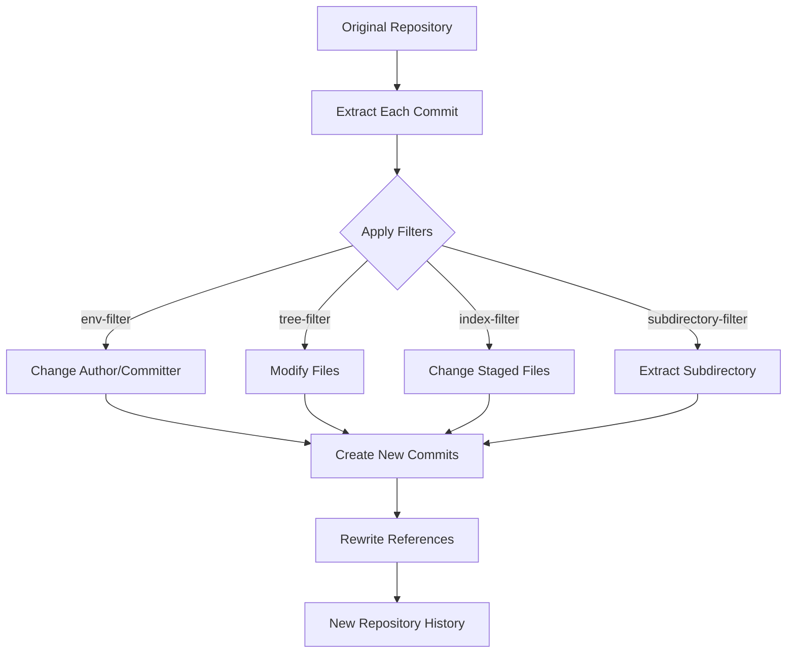

# Git Filter Branch

## Introduction

Git filter-branch is one of Git's powerful history rewriting tools that allows you to make sweeping changes across your repository history. Unlike simpler history modification commands that affect recent commits, `git filter-branch` can rewrite large portions of your commit history according to specified filters.

Think of it as a Swiss Army knife for repository maintenance - it enables you to permanently remove sensitive files, fix committer information across multiple commits, or restructure your entire repository in a single operation.

:::caution
`git filter-branch` is considered somewhat outdated, and Git now recommends using tools like `git-filter-repo` for most use cases. However, understanding filter-branch remains valuable as it comes built-in with Git and helps explain the concepts behind history rewriting.
:::

## Understanding Git Filter Branch

### What Does It Do?

`git filter-branch` applies specified filters to rewrite Git history. It essentially:

1. Extracts each commit from your history
2. Applies the filter(s) you specify  
3. Creates a new commit with the same metadata (but new hash)
4. Rebuilds your history with these modified commits

### When To Use It

Common scenarios for using `git filter-branch` include:

- Removing sensitive data accidentally committed (passwords, API keys)
- Removing large binary files that bloat repository size
- Changing author/committer information across many commits
- Moving subdirectories to their own repositories
- Restructuring your project's directory layout

## Basic Syntax

The basic syntax for `git filter-branch` is:

```bash
git filter-branch [options] [--] [<rev-list options>]
```

The command accepts various filter options that define what changes should be made. The most common filters include:

- `--env-filter`: Modify environment variables for the commit (author, committer)
- `--tree-filter`: Run a command on each checked-out tree
- `--index-filter`: Run a command modifying the index or staging area
- `--msg-filter`: Modify commit messages
- `--subdirectory-filter`: Extract a subdirectory as a new repository

## Practical Examples

Let's explore some practical examples to demonstrate how `git filter-branch` works in real-world scenarios.

### Example 1: Removing a Sensitive File From History

Imagine you accidentally committed a file containing API keys or passwords named `config.secret.json`:

```bash
git filter-branch --force --index-filter \
  "git rm --cached --ignore-unmatch config.secret.json" \
  --prune-empty -- --all
```

This command:
- Uses `--index-filter` (faster than tree-filter as it doesn't check out files)
- Runs `git rm --cached --ignore-unmatch config.secret.json` on each commit
- `--prune-empty` removes any commits that become empty after the change
- `--all` applies it to all branches and tags

The output would show something like:

```
Rewrite 3a7c9f5... (25/79) (2 seconds passed, remaining 6 predicted)
Rewrite 4b3d8c1... (26/79) (2 seconds passed, remaining 6 predicted)
...
Ref 'refs/heads/master' was rewritten
```

### Example 2: Changing Author Information Across All Commits

If you need to update your email across all commits:

```bash
git filter-branch --env-filter '
if [ "$GIT_AUTHOR_EMAIL" = "old-email@example.com" ]
then
    export GIT_AUTHOR_EMAIL="new-email@example.com"
    export GIT_AUTHOR_NAME="Your New Name"
fi
if [ "$GIT_COMMITTER_EMAIL" = "old-email@example.com" ]
then
    export GIT_COMMITTER_EMAIL="new-email@example.com" 
    export GIT_COMMITTER_NAME="Your New Name"
fi
' --tag-name-filter cat -- --all
```

This script:
- Uses `--env-filter` to modify environment variables
- Checks both author and committer information
- Uses `--tag-name-filter cat` to preserve tags pointing to rewritten commits

### Example 3: Moving a Subdirectory to Root (Creating a New Repository)

If you want to extract the `src/module1` directory to create a new repository:

```bash
git filter-branch --subdirectory-filter src/module1 -- --all
```

This command:
- Keeps only the history related to files in `src/module1`
- Makes that subdirectory the new project root
- Preserves commits that affected this directory

The result is a repository containing only the history of the specified subdirectory, with that subdirectory now as the root directory.

## The Process Visualized

Here's a visualization of what happens during a `git filter-branch` operation:



## Best Practices and Warnings

### Cautions

1. **Make a backup**: Always create a backup before using `git filter-branch`.
   ```bash
   git clone --mirror my-repo my-repo-backup
   ```

2. **Rewriting public history**: Never rewrite history that's been pushed to shared repositories without coordinating with all team members.

3. **Performance**: `git filter-branch` can be slow on large repositories. For better performance:
   - Use `--index-filter` instead of `--tree-filter` when possible
   - Consider using `git-filter-repo` for very large repositories

### After Running Filter Branch

After running `git filter-branch`, you'll want to:

1. Verify the changes look correct
2. Force push the rewritten history if working with remote repositories:
   ```bash
   git push origin --force --all
   git push origin --force --tags
   ```

3. Clean up the references created by filter-branch:
   ```bash
   git for-each-ref --format="delete %(refname)" refs/original/ | git update-ref --stdin
   git reflog expire --expire=now --all
   git gc --prune=now
   ```

## The Modern Alternative: git-filter-repo

While this tutorial focuses on `git filter-branch`, it's worth noting that Git recommends the newer `git-filter-repo` tool for most history rewriting tasks:

```bash
pip install git-filter-repo
```

Using it for file removal looks like:

```bash
git-filter-repo --path config.secret.json --invert-paths
```

This accomplishes the same thing as our first example but runs much faster and has fewer pitfalls.

## Summary

Git filter-branch is a powerful but complex tool for rewriting repository history. Its key strengths include:

- Comprehensive history modification capabilities
- Built-in to Git (no additional tools needed)
- Flexible filtering options for various use cases

However, due to its complexity and performance limitations, consider more modern alternatives like `git-filter-repo` for extensive history rewriting.

## Exercises

1. Create a test repository and practice removing a file using `git filter-branch`.
2. Try to extract a subdirectory from an existing project to create a standalone repository.
3. Experiment with changing author information on a test repository.
4. Compare the performance of `git filter-branch` vs `git-filter-repo` on a repository with many commits.

## Additional Resources

- [Git Documentation - git-filter-branch](https://git-scm.com/docs/git-filter-branch)
- [Git Filter Repo Project](https://github.com/newren/git-filter-repo)
- [GitHub Help - Removing sensitive data](https://docs.github.com/en/authentication/keeping-your-account-and-data-secure/removing-sensitive-data-from-a-repository)