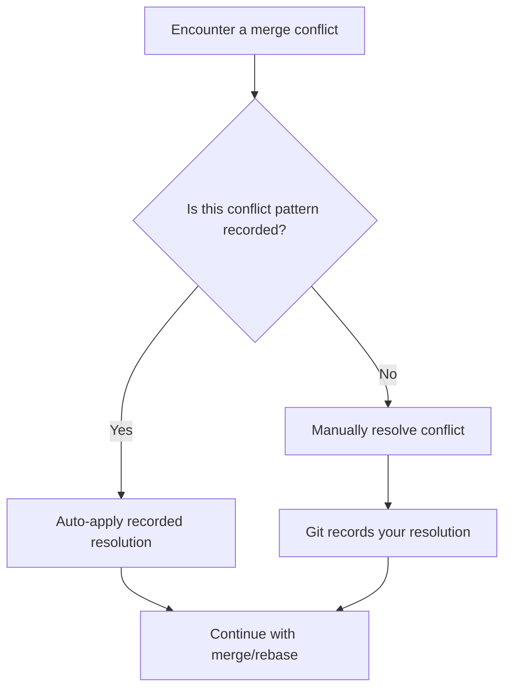

# Git Rerere: Reuse Recorded Resolution

## Introduction

Have you ever resolved the same merge conflicts over and over again in your Git repositories? If you work on long-lived feature branches or frequently rebase your work, you've likely encountered this frustrating situation. Git Rerere (which stands for "**re**use **re**corded **re**solution") is a powerful yet underutilized feature that can save you significant time and effort.

Git Rerere automatically remembers how you've resolved a particular merge conflict in the past and automatically applies the same resolution when it encounters an identical conflict in the future. This feature is particularly valuable for teams working on complex projects with multiple branches.

## Enabling Git Rerere

Git Rerere is not enabled by default. To turn it on, you need to set the `rerere.enabled` configuration option:

```bash
# Enable Git Rerere globally
git config --global rerere.enabled true

# Or enable it for a specific repository
git config rerere.enabled true
```

Once enabled, Git will silently record how you resolve conflicts and reuse those resolutions automatically in the future.

## How Git Rerere Works

Let's understand the workflow of Git Rerere with a simple diagram:



When Git Rerere is enabled, it follows these steps:

1. When a merge conflict occurs, Git checks if it has seen this pattern before
2. If it has a recorded resolution, it automatically applies it
3. If not, you resolve the conflict manually
4. Git records your resolution for future use
5. The next time the same conflict appears, Git applies the recorded resolution automatically

## Practical Example

Let's walk through a practical example to see Git Rerere in action:

### Scenario: Feature Branch with Frequent Rebases

Imagine you're working on a feature branch that takes several weeks to complete. Meanwhile, the main branch is actively being developed. To keep your feature branch up-to-date, you regularly rebase it on the latest main branch.

#### Initial Setup

```bash
# Create a new repository for demonstration
mkdir git-rerere-demo
cd git-rerere-demo
git init

# Enable rerere
git config rerere.enabled true

# Create initial file and commit
echo "# Git Rerere Demo" > README.md
echo "Line 1: Initial content" > file.txt
echo "Line 2: Initial content" >> file.txt
echo "Line 3: Initial content" >> file.txt
git add README.md file.txt
git commit -m "Initial commit"

# Create a feature branch
git checkout -b feature
```

#### Create Divergent Changes

```bash
# Make changes on the feature branch
echo "Line 2: Changed in feature branch" > file.txt
echo "Line 3: Initial content" >> file.txt
git add file.txt
git commit -m "Update line 2 in feature branch"

# Switch back to main and make different changes
git checkout main
echo "Line 1: Initial content" > file.txt
echo "Line 2: Changed in main branch" >> file.txt
echo "Line 3: Initial content" >> file.txt
git add file.txt
git commit -m "Update line 2 in main branch"
```

#### First Rebase with Conflict

```bash
# Try to rebase feature on main
git checkout feature
git rebase main
```

You'll see a conflict like this:

```
Auto-merging file.txt
CONFLICT (content): Merge conflict in file.txt
error: could not apply 123abc... Update line 2 in feature branch
hint: Resolve all conflicts manually, mark them as resolved with
hint: "git add/rm <conflicted_files>", then run "git rebase --continue".
hint: You can instead skip this commit: run "git rebase --skip".
hint: To abort and get back to the state before "git rebase", run "git rebase --abort".
Could not apply 123abc... Update line 2 in feature branch
```

The conflicted file will look like:

```
Line 1: Initial content
<<<<<<< HEAD
Line 2: Changed in main branch
=======
Line 2: Changed in feature branch
>>>>>>> 123abc... Update line 2 in feature branch
Line 3: Initial content
```

#### Resolving the Conflict

Let's say you decide to combine both changes:

```bash
# Edit file.txt to resolve the conflict
echo "Line 1: Initial content" > file.txt
echo "Line 2: Combined changes from main and feature" >> file.txt
echo "Line 3: Initial content" >> file.txt

# Mark as resolved and continue
git add file.txt
git rebase --continue
```

At this point, Git Rerere has silently recorded your resolution.

#### Creating Another Conflict

To demonstrate Rerere's power, let's create a similar conflict:

```bash
# Go back to main and make more changes
git checkout main
echo "New line 4" >> file.txt
git add file.txt
git commit -m "Add line 4 in main"

# Try to rebase feature on main again
git checkout feature
git rebase main
```

When you encounter the same conflict pattern again, Git Rerere will automatically apply your previous resolution, so the file will already be resolved with:

```
Line 1: Initial content
Line 2: Combined changes from main and feature
Line 3: Initial content
New line 4
```

All you need to do is:

```bash
git add file.txt
git rebase --continue
```

## Advanced Usage

### Viewing Recorded Resolutions

You can view the current state of the Rerere cache:

```bash
git rerere status
```

This will show which files have recorded resolutions that could be applied.

### Clearing Recorded Resolutions

If you want to clear a specific resolution (maybe you resolved it incorrectly):

```bash
git rerere forget <file>
```

Or to clear the entire Rerere cache:

```bash
rm -rf .git/rr-cache/
```

### Seeing the Difference Between Resolutions

To see what Git Rerere would do before it does it:

```bash
git rerere diff
```

This shows the difference between the conflicted file and the resolution that would be applied.

## Real-World Benefits

Using Git Rerere provides several advantages:

1. **Consistency**: Ensures conflicts are resolved the same way every time
2. **Time-saving**: Eliminates repetitive conflict resolution work
3. **Documentation**: Creates an implicit record of how certain conflicts should be resolved
4. **Reduced errors**: Minimizes manual intervention, reducing the chance of mistakes

## Common Scenarios Where Git Rerere Helps

Git Rerere is particularly useful in these situations:

1. **Long-lived feature branches** that need to be rebased regularly
2. **Interactive rebasing** to clean up your commit history
3. **Team workflows** where multiple people might encounter the same conflicts
4. **Cherry-picking** commits across branches
5. **Squashing commits** before merging

## Summary

Git Rerere is a powerful feature that automatically records and reapplies your conflict resolutions. By enabling this feature, you can save time, ensure consistency, and reduce the frustration of resolving the same conflicts repeatedly.

The key points to remember are:

- Enable Git Rerere with `git config rerere.enabled true`
- Once enabled, Git silently records your conflict resolutions
- When the same conflict pattern appears again, Git automatically applies the recorded resolution
- You can manage the Rerere cache with commands like `git rerere status`, `git rerere diff`, and `git rerere forget`

## Additional Resources

To deepen your understanding of Git Rerere:

- Read the [official Git documentation on Rerere](https://git-scm.com/docs/git-rerere)
- Explore the `.git/rr-cache/` directory to see how resolutions are stored
- Practice with more complex scenarios involving multiple files and branches

## Exercises

1. Set up a repository with Git Rerere enabled and create a scenario with recurring conflicts to see how it works.
2. Try using Git Rerere with a rebase involving multiple commits with conflicts.
3. Experiment with `git rerere forget` to clear specific resolutions and observe the behavior.
4. Create a scenario where you intentionally resolve a conflict differently the second time, and observe how Git Rerere's behavior changes.
5. Practice using Git Rerere in combination with other Git commands like cherry-pick and revert.