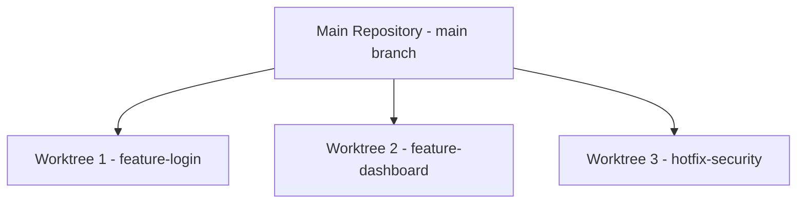

# Git Worktree

## Introduction

Have you ever been in the middle of working on a feature when an urgent bug fix comes in? The typical workflow involves stashing your changes, switching branches, fixing the bug, and then switching back to your feature branch. This context-switching can be disruptive and error-prone.

Git Worktree solves this problem by allowing you to check out multiple branches simultaneously in separate directories. This powerful but often overlooked feature enables you to work on different tasks in parallel without the need to stash or commit unfinished work.

## Understanding Git Worktree

A Git worktree is an additional working tree connected to your repository. Your main repository is itself a worktree (often called the "main worktree"), and you can create additional linked worktrees that point to different branches.

### Key Concepts

- **Main Worktree**: Your original repository directory
- **Linked Worktree**: Additional working directories connected to the same repository
- **Shared Git History**: All worktrees share the same Git history and objects
- **Separate Working Directories**: Each worktree has its own working directory and index

## Basic Git Worktree Commands

### Listing Worktrees

To see all worktrees associated with your repository:

```bash
git worktree list
```

Output:
```
/path/to/main-worktree         (HEAD)
/path/to/feature-worktree      feature-branch
/path/to/bugfix-worktree       bugfix-branch
```

### Adding a Worktree

To create a new worktree:

```bash
git worktree add <path> <branch>
```

For example, to create a worktree for a new branch called "feature-x":

```bash
git worktree add ../feature-x feature-x
```

If the branch doesn't exist yet, you can create it with the `-b` flag:

```bash
git worktree add -b feature-x ../feature-x
```

Output:
```
Preparing worktree (new branch 'feature-x')
HEAD is now at e1d853a Add existing functionality
```

### Removing a Worktree

When you're done with a worktree, you can remove it:

```bash
git worktree remove <path>
```

Example:
```bash
git worktree remove ../feature-x
```

If you've already deleted the worktree directory manually, you can prune it from Git's records:

```bash
git worktree prune
```

## Practical Examples

Let's walk through some common scenarios where Git worktrees are particularly useful:

### Example 1: Working on Multiple Features Simultaneously



Assume you're working on the `main` branch and need to develop two features simultaneously:

```bash
# Create worktrees for each feature
git worktree add ../repo-feature-login -b feature-login
git worktree add ../repo-feature-dashboard -b feature-dashboard
```

Now you can freely work on both features without switching branches:

```bash
# Work on login feature
cd ../repo-feature-login
# Make changes, commit, etc.

# Work on dashboard feature
cd ../repo-feature-dashboard
# Make changes, commit, etc.
```

### Example 2: Handling an Urgent Bug Fix

Imagine you're deep into developing a feature when an urgent production bug comes in:

```bash
# Create a worktree for the hotfix from the production branch
git worktree add ../repo-hotfix hotfix -b hotfix-user-authentication origin/production

# Go to the hotfix worktree
cd ../repo-hotfix

# Fix the bug, test, and commit
git commit -am "Fix user authentication issue"

# Push the fix
git push origin hotfix-user-authentication

# Return to your feature work
cd ../original-repo
# Continue where you left off without any disruption
```

### Example 3: Running Tests in Different Environments

If you need to test your code against different configurations:

```bash
# Create worktrees for different test environments
git worktree add ../test-nodejs14 -b test-nodejs14
git worktree add ../test-nodejs16 -b test-nodejs16

# Configure each environment differently
cd ../test-nodejs14
# Set up Node.js 14 environment and run tests

cd ../test-nodejs16
# Set up Node.js 16 environment and run tests
```

## Best Practices

1. **Name directories clearly**: Choose descriptive paths for your worktrees that indicate their purpose.

2. **Clean up regularly**: Remove worktrees when you're done with them using `git worktree remove` or `git worktree prune`.

3. **Don't check out the same branch in multiple worktrees**: This can lead to confusion and potential conflicts.

4. **Use absolute paths when possible**: This avoids confusion when navigating between worktrees.

5. **Remember that worktrees share the same Git history**: Commits made in any worktree are immediately available to all other worktrees after pushing.

## Limitations

- You cannot check out the same branch in multiple worktrees simultaneously.
- Submodules might need special handling in worktrees.
- Some Git operations might be slightly more complex with multiple worktrees.

## Common Issues and Troubleshooting

### "Path is already a worktree"

```bash
fatal: '/path/to/dir' is already a worktree
```

Solution: Choose a different directory or remove the existing worktree.

### "Not a valid ref"

```bash
fatal: 'branch-name' is not a valid ref
```

Solution: Make sure the branch exists or use `-b` to create a new branch.

### Cleaning Up Stale Worktrees

If you've deleted worktree directories manually without using `git worktree remove`:

```bash
git worktree prune
```

## Summary

Git Worktree is a powerful feature that allows you to work on multiple branches simultaneously without the context-switching overhead of `git checkout`. It's particularly useful for:

- Handling urgent bug fixes without disrupting ongoing work
- Working on multiple features in parallel
- Testing code in different environments
- Code reviews of multiple pull requests

By creating separate working directories that share the same repository history, Git Worktree helps you maintain a smooth workflow even when juggling multiple tasks.

## Additional Resources

- [Official Git Documentation on Worktree](https://git-scm.com/docs/git-worktree)
- [Pro Git Book](https://git-scm.com/book/en/v2)

## Exercises

1. Create a new Git repository and add two worktrees for different feature branches.
2. Simulate a bug fix scenario where you need to fix an issue without disrupting your current work.
3. Set up a workflow where you use Git worktree to manage a release while continuing development.
4. Try creating a worktree from a specific commit rather than a branch.
5. Practice cleaning up and managing multiple worktrees.