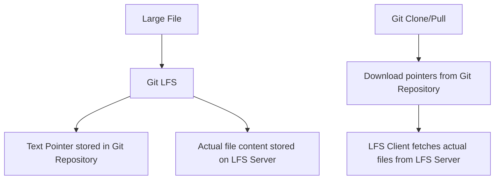

# Git LFS (Large File Storage)

## Introduction

When working with Git repositories, you might encounter situations where you need to track large files like images, audio files, datasets, or other binary files. Git wasn't originally designed to handle such files efficiently, which can lead to bloated repositories and slow performance.

Git Large File Storage (LFS) is an extension to Git that addresses this limitation by replacing large files with text pointers in the Git repository, while storing the actual file contents on a remote server. This approach significantly improves repository performance when working with large files.

## Why Use Git LFS?

Traditional Git stores the complete history of every file, including all versions of binary files. This can cause several problems:

1. **Repository bloat**: The `.git` directory grows excessively large
2. **Slow cloning and fetching**: Downloading the entire history of large files takes time
3. **Wasted bandwidth and storage**: Developers download all versions of all files, even if they only need the latest
4. **Performance degradation**: Git operations become slower as the repository grows

Git LFS solves these issues by handling large files differently from regular code files.

## How Git LFS Works



When you use Git LFS:

1. Large files are stored on a separate LFS server
2. Small pointer files (under 1KB) remain in your Git repository
3. Git LFS client intercepts Git commands to handle LFS objects appropriately
4. When you clone or pull, the LFS client downloads the actual files from the LFS server

## Getting Started with Git LFS

### Installation

First, you need to install Git LFS:

#### For macOS (using Homebrew):

```bash
brew install git-lfs
```

#### For Windows:

```bash
# Using Chocolatey
choco install git-lfs

# Or download and install from https://git-lfs.github.com/
```

#### For Linux (Ubuntu/Debian):

```bash
sudo apt-get install git-lfs
```

After installation, you need to set up Git LFS:

```bash
git lfs install
```

This command sets up the necessary Git hooks in your global Git configuration.

### Basic Usage

#### Step 1: Initialize a Git Repository

If you don't already have a repository, create one:

```bash
mkdir my-project
cd my-project
git init
```

#### Step 2: Track Files with Git LFS

Tell Git LFS which file types to manage:

```bash
# Track all .psd files
git lfs track "*.psd"

# Track all .zip files
git lfs track "*.zip"

# Track a specific file
git lfs track "large-file.data"
```

These commands create or modify a `.gitattributes` file, which you should commit:

```bash
git add .gitattributes
git commit -m "Configure Git LFS tracking"
```

The `.gitattributes` file will contain entries like:

```
*.psd filter=lfs diff=lfs merge=lfs -text
*.zip filter=lfs diff=lfs merge=lfs -text
large-file.data filter=lfs diff=lfs merge=lfs -text
```

#### Step 3: Add and Commit Files as Usual

Now you can add and commit large files as you normally would:

```bash
# Add a large PSD file
git add design.psd
git commit -m "Add design file"

# Push to remote repository
git push origin main
```

Behind the scenes, Git LFS:
1. Replaces the actual file with a pointer file in the Git repository
2. Stores the file content in the LFS cache
3. Uploads the file content to the LFS server when you push

## Managing LFS Files

### Viewing Tracked Files

To see which files are being tracked by Git LFS:

```bash
git lfs ls-files
```

Example output:

```
89ab2c1d12 * design.psd
76fe43b221 * images/background.png
```

### Fetching LFS Files

When you clone a repository with LFS files:

```bash
git clone https://github.com/username/repo.git
```

By default, Git LFS downloads all LFS objects. If you want to clone without downloading LFS content:

```bash
GIT_LFS_SKIP_SMUDGE=1 git clone https://github.com/username/repo.git
```

Later, you can fetch specific LFS files:

```bash
git lfs pull --include="*.psd" --exclude="*"
```

### LFS File Locking

Git LFS supports file locking to prevent conflicts on binary files that can't be merged:

```bash
# Lock a file to prevent others from editing it
git lfs lock design.psd

# Unlock when finished
git lfs unlock design.psd

# List all locked files
git lfs locks
```

## Real-World Examples

### Example 1: Managing Design Assets in a Web Project

Imagine you're working on a web project with both code and design assets:

```
my-website/
├── src/
│   ├── index.js
│   └── components/
├── public/
│   ├── images/
│   │   ├── hero.jpg     # 8MB image
│   │   └── gallery/     # Multiple high-res images
│   └── fonts/
└── design/
    ├── mockups.psd      # 200MB Photoshop file
    └── ui-kit.sketch    # 150MB Sketch file
```

Configure Git LFS to track the large binary files:

```bash
git lfs track "*.jpg"
git lfs track "*.png"
git lfs track "*.psd"
git lfs track "*.sketch"
git add .gitattributes
git commit -m "Configure Git LFS for design assets"
```

Now you can commit and collaborate on both code and large files efficiently.

### Example 2: Game Development with Assets

In game development, you often have code, textures, models, and sound files:

```
my-game/
├── src/
│   ├── main.cpp
│   └── engine/
├── assets/
│   ├── models/          # 3D models
│   ├── textures/        # High-resolution textures
│   └── audio/           # Music and sound effects
└── builds/              # Compiled game versions
```

Configure Git LFS:

```bash
git lfs track "assets/models/**"
git lfs track "assets/textures/**"
git lfs track "assets/audio/**"
git lfs track "builds/**"
git add .gitattributes
git commit -m "Set up Git LFS for game assets"
```

This setup keeps your repository efficient while still tracking all necessary assets.

## Best Practices

1. **Track selectively**: Only use Git LFS for files that truly need it (typically binary files over 5MB)
2. **Commit `.gitattributes` first**: Always commit this file before adding any LFS-tracked files
3. **Use patterns wisely**: Be specific with tracking patterns to avoid unnecessary LFS usage
4. **Consider bandwidth limitations**: Be aware that LFS might use more bandwidth during pushes and pulls
5. **Set up file locking**: Use locking for binary files that can't be merged
6. **Check hosting limits**: Be aware of storage and bandwidth limits on your Git hosting provider

## Migrating Existing Repositories to Git LFS

If you already have large files in your repository, you can migrate them to Git LFS:

```bash
# Install git-lfs-migrate tool
git lfs install

# Find large files in your repository
git lfs migrate info --above=10MB

# Migrate files to LFS
git lfs migrate import --include="*.psd,*.zip" --above=10MB
```

Warning: This rewrites history, so coordinate with your team before performing migration.

## Troubleshooting Common Issues

### Issue: "Encountered X file(s) that should have been pointers, but weren't"

This typically happens when someone commits a large file without Git LFS configured.

Solution:
```bash
git lfs fetch --all
git lfs checkout
```

### Issue: "batch request: not found"

This usually means the LFS server is not properly configured.

Solution: Check your remote URLs and LFS endpoint configuration:
```bash
git lfs env
```

### Issue: "Error downloading object"

This might happen due to network issues or server problems.

Solution: Retry with:
```bash
git lfs pull --include="path/to/file"
```

## Summary

Git LFS is a powerful extension that enables efficient management of large files in Git repositories. By storing pointers in the repository and actual file contents on a separate server, Git LFS maintains Git's performance while supporting collaboration on projects with large assets.

Key benefits:
- Smaller repository size
- Faster cloning and fetching
- Efficient handling of binary files
- Better performance for all Git operations

When to use Git LFS:
- Projects with large binary assets (images, audio, video)
- Repositories with frequently changing large files
- Teams working with design files, datasets, or other large content

## Additional Resources

For more information about Git LFS, check out:

- [Official Git LFS Documentation](https://git-lfs.github.com/)
- [GitHub's Guide to Git LFS](https://docs.github.com/en/repositories/working-with-files/managing-large-files)
- [GitLab LFS Administration](https://docs.gitlab.com/ee/administration/lfs/)

## Exercises

1. Initialize Git LFS in a new repository and configure it to track PNG and PSD files.
2. Add several large files to your repository and examine the `.git` directory size compared to the actual files.
3. Clone your repository on another machine and observe how Git LFS handles the large files.
4. Try locking and unlocking a file, then have a team member attempt to modify it.
5. Convert an existing repository with large files to use Git LFS.