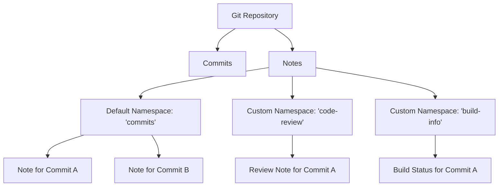

# Git Notes

## Introduction

Git notes are a powerful but often overlooked feature in Git that allows you to add or edit metadata for any commit without altering the commit itself or the repository history. Think of Git notes as Post-it notes that you can attach to commits - they provide additional information without modifying the original content.

Unlike amending a commit (which changes the commit hash) or adding a new commit with comments (which changes the history), Git notes add information to a commit in a way that doesn't affect the commit's identity or the repository's integrity.

## Understanding Git Notes

### What Are Git Notes?

Git notes are metadata that:

- Can be added to any commit
- Don't change the commit hash
- Are stored separately from commits
- Can be shared (or not shared) with others
- Can be edited or removed without affecting the commit

### The Notes Namespace

Git notes are organized using namespaces. By default, Git uses the "commits" namespace, but you can create and manage multiple namespaces for different types of metadata.



## Basic Git Notes Commands

### Adding a Note to a Commit

To add a note to the most recent commit:

```bash
git notes add -m "This commit fixes the login button styling issue"
```

To add a note to a specific commit:

```bash
git notes add -m "Important security patch" 9c1533b
```

The output won't show any confirmation, but the note has been added.

### Viewing Notes

To see the notes attached to commits when viewing the log:

```bash
git log --show-notes
```

Example output:

```
commit 9c1533b6a6d97a74bd0998553a6e98eb9964a29e
Author: Jane Developer <jane@example.com>
Date:   Mon Oct 21 14:53:12 2024 -0500

    Fix button alignment in navbar

Notes:
    Important security patch
```

To view notes for a specific commit:

```bash
git notes show 9c1533b
```

Output:
```
Important security patch
```

### Editing Notes

To edit an existing note:

```bash
git notes edit 9c1533b
```

This will open your default text editor where you can modify the note content.

### Removing Notes

To remove a note from a commit:

```bash
git notes remove 9c1533b
```

## Advanced Git Notes Usage

### Using Custom Namespaces

You can create and manage notes in different namespaces:

```bash
# Add a note in the "code-review" namespace
git notes --ref=code-review add -m "Reviewed by: Alex - Approved" 9c1533b

# View notes in the "code-review" namespace
git notes --ref=code-review show 9c1533b
```

This helps organize different types of metadata (like code reviews, build information, or deployment details).

### Listing All Notes

To list all the notes in a repository:

```bash
git notes list
```

Example output:
```
9c1533b6a6d97a74bd0998553a6e98eb9964a29e
a72f3bc9d437c98122f432a8a1c016c45e1127e0
```

### Working with Multiple Namespaces

To list all available note namespaces:

```bash
git notes --ref
```

Output might look like:
```
refs/notes/commits
refs/notes/code-review
refs/notes/build-info
```

### Merging Notes from Others

If teammates have added notes, you can pull and merge their notes:

```bash
# Fetch notes from origin
git fetch origin refs/notes/*:refs/notes/*

# Merge notes, keeping both in case of conflicts
git notes merge --strategy=cat_sort_uniq
```

## Practical Use Cases for Git Notes

### Code Review Information

Store review feedback without polluting commit messages:

```bash
git notes --ref=code-review add -m "Reviewer: Sarah Johnson
- Approved with minor suggestions
- Consider refactoring the authentication logic
- Good test coverage" 3f7a921
```

### Build and Deployment Metadata

Track build or deployment information:

```bash
git notes --ref=build-info add -m "Build #4721
- Passed all CI tests
- Deployed to staging on 2024-10-22
- Performance metrics: 97/100" 8c6d45f
```

### Documentation References

Link commits to documentation or requirements:

```bash
git notes add -m "Implements requirement REQ-127 from the specification document v2.3" 6a9b2c3
```

### Issue Tracker Integration

Connect commits to issue tracker entries:

```bash
git notes add -m "Fixes issues: PROJ-235, PROJ-241
QA verified on 2024-10-23" a72f3bc
```

## Sharing Notes with Others

By default, Git notes are not automatically pushed to remote repositories. You need to explicitly push them:

```bash
# Push all notes to the remote repository
git push origin refs/notes/*

# Push only a specific namespace
git push origin refs/notes/code-review
```

To configure Git to automatically push notes:

```bash
git config --add remote.origin.push refs/notes/*
```

## Notes vs. Commit Messages

Understanding when to use notes versus commit messages:

| Information Type | Commit Message | Git Notes |
|-----------------|----------------|-----------|
| What changed | ✅ | ❌ |
| Why it changed | ✅ | ❌ |
| Implementation details | ✅ | ❌ |
| Review feedback | ❌ | ✅ |
| Build information | ❌ | ✅ |
| Post-commit discoveries | ❌ | ✅ |
| Documentation links | ❌ | ✅ |

## Potential Pitfalls and Solutions

### Note Conflicts

If multiple team members add different notes to the same commit:

```bash
# Use manual conflict resolution
git notes merge --strategy=manual

# Or keep both notes separated by a newline
git notes merge --strategy=cat_sort_uniq
```

### Notes Visibility

Notes may not be immediately visible to other team members:

```bash
# Make sure to explicitly fetch notes
git fetch origin refs/notes/*:refs/notes/*

# Configure git to always fetch notes
git config --add remote.origin.fetch refs/notes/*:refs/notes/*
```

## Summary

Git notes provide a flexible way to attach metadata to commits without altering commit history. They're particularly valuable for:

- Adding information discovered after a commit is made
- Storing metadata that doesn't belong in commit messages
- Tracking build, deployment, or review information
- Creating connections between commits and external resources

By using different namespaces, you can organize various types of metadata and share only what's relevant with your team. Git notes complement commit messages by providing a space for information that emerges after the commit is created.

## Additional Resources

- Git official documentation on notes: `git help notes`
- Practice adding notes to your previous projects
- Try using Git notes in a team setting for code reviews

## Exercises

1. Add notes to your last five commits describing what you've learned since making them.
2. Create a custom namespace for "lessons-learned" and add notes about what you would do differently.
3. Set up a workflow in your team to use Git notes for code review feedback.
4. Configure your Git to automatically push and fetch notes.