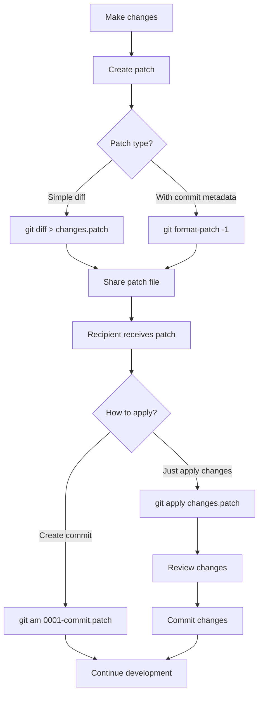

# Git Patch

## Introduction

Git patches are a powerful way to share specific changes between repositories without pushing to a remote repository or having direct access to it. Think of a patch as a portable set of changes that can be applied to any compatible Git repository.

Patches are particularly useful when:
- Contributing to open-source projects when you don't have direct commit access
- Sharing changes with team members without a common remote repository
- Applying selective changes rather than entire commits
- Reviewing changes before integrating them into a codebase

In this tutorial, we'll explore how to create, apply, and manage Git patches effectively.

## What is a Git Patch?

A Git patch is a text file containing a set of changes made to files in a repository. It includes information about:

- The modified files
- The exact changes made to each file (additions, deletions, and modifications)
- Commit metadata (author, date, commit message)

Here's what a simple Git patch looks like:

```
From 7e774a29f18a253b60c16327687d06c8a7a741a7 Mon Sep 17 00:00:00 2001
From: Developer Name <developer@example.com>
Date: Thu, 10 Feb 2022 15:30:22 -0500
Subject: [PATCH] Add new feature for user authentication

- Added login validation
- Improved error handling
---
 src/auth.js | 25 +++++++++++++++++++++++++
 1 file changed, 25 insertions(+)
 create mode 100644 src/auth.js

diff --git a/src/auth.js b/src/auth.js
new file mode 100644
index 0000000..8a23c89
--- /dev/null
+++ b/src/auth.js
@@ -0,0 +1,25 @@
+function validateUser(username, password) {
+  if (!username || !password) {
+    return {
+      valid: false,
+      error: 'Username and password are required'
+    };
+  }
+  
+  // More validation logic here
+  
+  return {
+    valid: true,
+    user: {
+      username,
+      role: 'user'
+    }
+  };
+}
+
+module.exports = {
+  validateUser
+};
+
-- 
2.34.1
```

## Creating Patches

### The `git diff` Command

The simplest way to create a patch is using the `git diff` command. This generates a patch file containing the differences between two states of your repository.

#### Creating a Patch for Uncommitted Changes

To create a patch for all your unstaged changes:

```bash
git diff > my_changes.patch
```

To include staged changes as well:

```bash
git diff --staged > staged_changes.patch
```

To generate a patch with both staged and unstaged changes:

```bash
git diff HEAD > all_changes.patch
```

#### Creating a Patch for Specific Commits

To create a patch for a specific commit:

```bash
git show <commit-hash> > commit.patch
```

For multiple commits, you can use the range syntax:

```bash
git format-patch -<number-of-commits>
```

For example, to create patches for the last 3 commits:

```bash
git format-patch -3
```

This will create separate patch files for each commit, named like `0001-commit-message.patch`, `0002-commit-message.patch`, etc.

To create a single patch file for multiple commits:

```bash
git format-patch -<number-of-commits> --stdout > multiple_commits.patch
```

### The `git format-patch` Command

The `git format-patch` command creates more comprehensive patch files than `git diff`. These include commit metadata, making them suitable for email-based workflows (like those used in the Linux kernel development).

```bash
git format-patch origin/main
```

This creates patch files for all commits between your current branch and the `origin/main` branch.

## Applying Patches

### Using `git apply`

To apply a patch created with `git diff`:

```bash
git apply my_changes.patch
```

This applies the changes to your working directory without committing them, giving you a chance to review before committing.

#### Checking if a Patch Can Be Applied

To check if a patch can be applied without actually applying it:

```bash
git apply --check my_changes.patch
```

If this command produces no output, the patch can be applied cleanly.

#### Applying with Advanced Options

Apply a patch with line number offsets (useful if the code has changed slightly):

```bash
git apply --reject --whitespace=fix my_changes.patch
```

This attempts to apply the patch and creates `.rej` files for any hunks that didn't apply cleanly.

### Using `git am`

The `git am` command applies patches created with `git format-patch` and automatically creates commits:

```bash
git am 0001-commit-message.patch
```

To apply multiple patch files:

```bash
git am *.patch
```

## Real-World Examples

### Example 1: Contributing to an Open-Source Project

Let's say you want to contribute to an open-source project but don't have direct commit access:

1. Clone the repository:
   ```bash
   git clone https://github.com/example/project.git
   cd project
   ```

2. Create a new branch for your changes:
   ```bash
   git checkout -b fix-login-bug
   ```

3. Make your changes and commit them:
   ```bash
   # Edit files
   git add .
   git commit -m "Fix login validation bug"
   ```

4. Create a patch:
   ```bash
   git format-patch main --stdout > fix-login-bug.patch
   ```

5. Send the patch file to the project maintainer via email or attach it to an issue in the project's issue tracker.

### Example 2: Sharing Changes Without a Common Repository

Suppose you're working with a colleague who doesn't have access to your repository:

1. Make your changes and commit them:
   ```bash
   git add .
   git commit -m "Implement new search feature"
   ```

2. Create a patch for your latest commit:
   ```bash
   git format-patch -1
   ```

3. Send the resulting `0001-Implement-new-search-feature.patch` file to your colleague.

4. Your colleague can apply the patch:
   ```bash
   git am 0001-Implement-new-search-feature.patch
   ```

### Example 3: Selectively Applying Changes

Imagine you have multiple changes in your working directory, but only want to share specific changes:

1. Use `git add -p` to interactively stage only the changes you want to include:
   ```bash
   git add -p
   ```

2. Create a patch for the staged changes:
   ```bash
   git diff --staged > selected_changes.patch
   ```

## Advanced Techniques

### Creating Patches for Specific Files

To create a patch for changes to specific files:

```bash
git diff -- path/to/file1 path/to/file2 > specific_files.patch
```

### Editing Patches

Since patches are text files, you can edit them with any text editor before applying. This is useful for:

- Modifying commit messages
- Removing specific changes
- Adjusting file paths

### Managing Patch Series

For complex changes, you might want to create a series of patches that build on each other:

```bash
git format-patch -n main --cover-letter
```

This creates a series of patch files with a cover letter (`0000-cover-letter.patch`) explaining the overall changes.

## Common Issues and Solutions

### Patch Doesn't Apply Cleanly

If `git apply` fails with "patch does not apply":

1. Try applying with `--reject` to see what parts failed:
   ```bash
   git apply --reject my_changes.patch
   ```

2. Check the `.rej` files to see what couldn't be applied.

3. Consider using the `--3way` option with `git am`:
   ```bash
   git am --3way my_changes.patch
   ```

### Handling Binary Files in Patches

By default, patches don't work well with binary files. To include binary files:

```bash
git diff --binary > binary_changes.patch
```

## Flow Diagram: Git Patch Workflow



## Summary

Git patches are a powerful tool in your Git toolkit, offering a flexible way to share and apply changes without requiring direct repository access. They're particularly valuable in open-source contribution workflows, collaborating with teams using different repositories, and when you need fine-grained control over which changes to apply.

Key points to remember:
- Use `git diff` for simple patches without commit metadata
- Use `git format-patch` for patches that include commit information
- Apply patches with `git apply` to just modify files or `git am` to create commits
- Patches are text files that can be edited before applying

## Practice Exercises

1. Create a new Git repository, add a file, commit it, and create a patch for this commit.
2. Create a patch that contains changes to multiple files, but not all files in your repository.
3. Apply a patch using `git apply` and then using `git am`. Note the differences.
4. Create a series of patches for multiple commits and practice applying them in order.
5. Create a patch, edit it manually to modify some of the changes, and then apply the edited patch.

## Additional Resources

- [Git Documentation: git-diff](https://git-scm.com/docs/git-diff)
- [Git Documentation: git-format-patch](https://git-scm.com/docs/git-format-patch)
- [Git Documentation: git-apply](https://git-scm.com/docs/git-apply)
- [Git Documentation: git-am](https://git-scm.com/docs/git-am)
- [Pro Git Book: Maintaining a Project](https://git-scm.com/book/en/v2/Distributed-Git-Maintaining-a-Project)