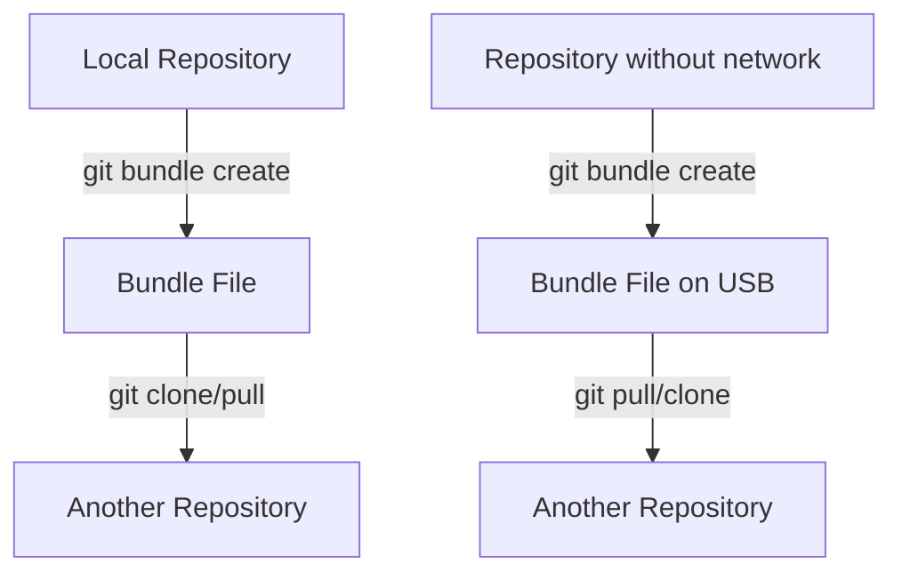

# Git Bundle

## Introduction

Git bundle is a powerful yet often overlooked feature that allows you to package a repository or a subset of its history into a single file. Think of it as creating a portable, self-contained version of your Git repository that can be transferred across systems without requiring a network connection or a remote repository.

This feature is particularly useful when:
- Working in environments with limited or no internet access
- Transferring changes between air-gapped systems (systems with no network connectivity)
- Creating backups of your repository
- Moving code between completely separate repositories

In this tutorial, we'll dive into how Git bundle works, when to use it, and practical examples to help you master this advanced Git feature.

## Understanding Git Bundle

At its core, Git bundle creates a binary file that contains Git objects and references. This file can then be used as a valid Git remote repository. It's similar to cloning or fetching from a remote repository, but instead of connecting to a server, you're working with a file.

### How Git Bundle Fits in the Git Ecosystem



## Basic Git Bundle Commands

### Creating a Bundle

To create a bundle that includes all branches and commits:

```bash
git bundle create repo.bundle --all
```

This command packages your entire repository into a file named `repo.bundle`.

### Verifying a Bundle

Before using a bundle, it's good practice to verify its integrity:

```bash
git bundle verify repo.bundle
```

Output:
```
repo.bundle is okay
```

### Cloning from a Bundle

You can create a new repository from a bundle using the `clone` command:

```bash
git clone repo.bundle new-repo
cd new-repo
```

Output:
```
Cloning into 'new-repo'...
Receiving objects: 100% (1234/1234), 2.3 MiB | 8.42 MiB/s, done.
Resolving deltas: 100% (567/567), done.
```

### Pulling from a Bundle

You can also use a bundle to update an existing repository:

```bash
# In an existing repository
git pull repo.bundle master
```

Output:
```
From repo.bundle
 * branch            master     -> FETCH_HEAD
Updating a1b2c3d..e4f5g6h
Fast-forward
 file.txt | 10 ++++++++--
 1 file changed, 8 insertions(+), 2 deletions(-)
```

## Advanced Bundle Usage

### Creating Partial Bundles

Often, you don't need to bundle the entire repository. You can specify commits or ranges:

```bash
# Bundle only the last 10 commits of the master branch
git bundle create recent-changes.bundle master~10..master
```

### Creating Incremental Bundles

For large repositories, you might want to create incremental bundles containing only new changes:

```bash
# Create a bundle with commits after a specific commit
git bundle create incremental.bundle abc123..HEAD
```

### Bundle Prerequisites

When creating a bundle that doesn't include all history, you need to specify prerequisites:

```bash
# The receiver must have commit abc123 for this bundle to work
git bundle create new-changes.bundle abc123..HEAD
```

## Practical Examples

### Example 1: Transferring Code to an Offline System

Imagine you're working on a project but need to transfer your changes to a computer without internet access.

Step 1: On your connected machine, create a bundle:
```bash
git bundle create my-changes.bundle master~5..master
```

Step 2: Transfer the bundle file (e.g., via USB drive).

Step 3: On the offline machine:
```bash
# If the repository already exists
git pull /path/to/my-changes.bundle master

# Or if you need to clone
git clone /path/to/my-changes.bundle new-project
```

### Example 2: Creating a Repository Backup

Git bundle can be an efficient way to back up your repository:

```bash
# Create a complete backup
git bundle create repo-backup-$(date +%Y%m%d).bundle --all

# Store the backup file in a secure location
```

### Example 3: Collaborative Work Without a Shared Remote

When collaborating with someone without using a shared remote repository:

Person A:
```bash
# Create a bundle of their work
git bundle create my-feature.bundle master..feature-branch
```

Person B:
```bash
# Import the changes
git pull my-feature.bundle
```

## Best Practices

1. **Always verify bundles** before using them:
   ```bash
   git bundle verify my-bundle.bundle
   ```

2. **Include a README** with your bundle explaining what it contains:
   ```bash
   echo "This bundle contains changes from commit abc123 to def456" > bundle-info.txt
   ```

3. **Use descriptive filenames** for your bundles, ideally including the date or version:
   ```bash
   git bundle create project-v1.2-20230615.bundle master
   ```

4. **For incremental bundles**, make sure to document the base commit:
   ```bash
   # In a script or documentation
   BASE_COMMIT=abc123
   git bundle create incremental-$(date +%Y%m%d).bundle $BASE_COMMIT..HEAD
   ```

## Common Issues and Troubleshooting

### "Missing prerequisite commits"

If you see an error like:
```
error: Repository lacks these prerequisite commits: abc123def...
```

This means the repository where you're trying to use the bundle doesn't have the base commits needed. Solutions:
- Use a more complete bundle that includes the missing commits
- Fetch the missing commits separately

### Large Bundle Files

For large repositories, bundle files can become unwieldy. Consider:
- Creating partial bundles with only needed branches
- Using shallow bundles (though these have limitations)
- Compressing the bundle file:
  ```bash
  git bundle create repo.bundle --all && gzip repo.bundle
  # Later: gunzip repo.bundle.gz
  ```

## Summary

Git bundle is a versatile tool that extends Git's functionality beyond networked environments. It allows you to:
- Transfer repository data without needing a remote server
- Work collaboratively in offline or restricted network environments
- Create portable, single-file backups of your repositories
- Move changes between unrelated repositories

While not needed for everyday Git workflows, mastering Git bundle gives you more flexibility when dealing with unique collaboration scenarios or restricted environments.

## Additional Resources

- [Git Documentation on bundle](https://git-scm.com/docs/git-bundle)
- Try the exercises below to practice using Git bundle

## Exercises

1. Create a bundle of your current repository and clone it to a different location.
2. Create an incremental bundle containing only your last 5 commits.
3. Set up a workflow with a teammate where you exchange changes using bundles instead of pushing to a shared remote.
4. Create a script that automatically bundles your repository at the end of each day as a backup.