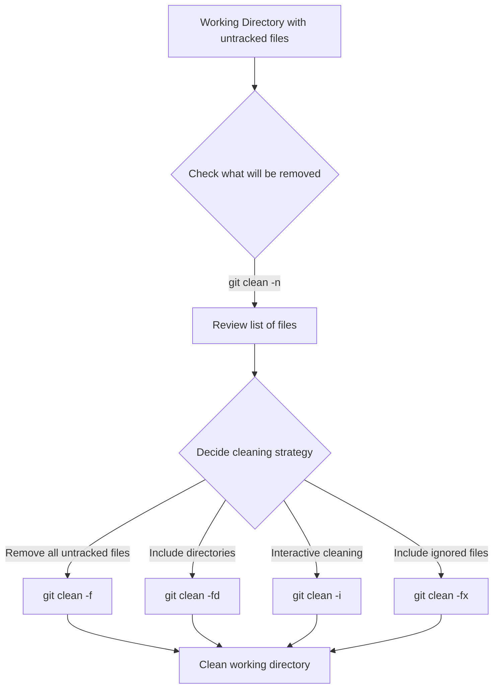

## Introduction to Git Clean

When working with Git, your repository can quickly become cluttered with untracked files—files that exist in your working directory but aren't being tracked by Git. These might include:

- Build artifacts and compiled binaries
- Log files
- Temporary files created by your IDE
- Files created during testing

The `git clean` command provides a way to remove these untracked files from your working directory, giving you a fresh start with only the tracked files that belong in your repository.

## Understanding Git Clean

`git clean` removes untracked files from your working tree. This is different from `git reset` or `git checkout`, which operate on tracked files. Think of `git clean` as the Git equivalent of deleting all those extra files that have accumulated in your project folder but aren't part of your actual project.

:::caution
`git clean` permanently deletes files from your system. Unlike files removed with `git rm`, these files aren't staged for removal—they're immediately deleted from your file system and cannot be recovered through Git.
:::

## Basic Usage

The basic syntax for `git clean` is:

```bash
git clean [options]
```

However, Git includes safeguards to prevent you from accidentally deleting files. By default, running `git clean` without options will show an error:

```bash
$ git clean
fatal: clean.requireForce defaults to true and neither -i, -n, nor -f given; refusing to clean
```

This is Git's way of asking, "Are you sure you want to delete these files?"

## Common Options

### Dry Run with `-n` or `--dry-run`

Before actually removing files, it's good practice to see what would be deleted:

```bash
$ git clean -n
Would remove untracked-file.txt
Would remove temp/
```

This shows what files would be removed without actually deleting anything.

### Force with `-f` or `--force`

To actually delete the files, use the force option:

```bash
$ git clean -f
Removing untracked-file.txt
```

### Including Directories with `-d`

By default, `git clean` doesn't remove untracked directories. To include directories:

```bash
$ git clean -fd
Removing untracked-file.txt
Removing temp/
```

### Interactive Mode with `-i`

For more control, use interactive mode:

```bash
$ git clean -i
Would remove the following items:
  untracked-file.txt temp/
*** Commands ***
    1: clean                2: filter by pattern    3: select by numbers
    4: ask each             5: quit                 6: help
What now>
```

This lets you choose exactly what to clean.

### Including Ignored Files with `-x`

By default, `git clean` respects your `.gitignore` file. To remove ignored files too:

```bash
$ git clean -fx
Removing untracked-file.txt
Removing node_modules/
Removing build/
```

## Real-World Examples

### Cleaning Up After a Build

After building your project, you might want to remove all build artifacts:

```bash
# First, check what would be removed
$ git clean -dn

# If everything looks good, remove the files
$ git clean -df
```

### Starting Fresh

When you want to start with a completely clean working directory:

```bash
# Remove all untracked files, including ignored ones
$ git clean -fdx
```

### Cleaning Specific File Types

To remove only certain types of files, combine with `git clean` with patterns:

```bash
# Remove all untracked .log files
$ git clean -f "*.log"
```

## Common Workflows



## Git Clean vs Other Git Commands

Understanding how `git clean` differs from other Git commands is important:

| Command | Purpose | Affects |
|---------|---------|---------|
| `git clean` | Remove untracked files | Untracked files only |
| `git reset` | Reset tracked files to a specific commit | Tracked files only |
| `git checkout -- .` | Discard changes in working directory | Modified tracked files |
| `git stash` | Temporarily store modified tracked files | Modified tracked files |

## Safety Tips

- **Always** use `git clean -n` first to see what will be deleted
- Consider using `git clean -i` (interactive mode) when unsure
- Create a backup or commit important changes before cleaning
- Be extra careful with the `-x` option as it can remove important ignored files like configuration files

## Example: Cleaning Up a Node.js Project

Let's walk through a practical example for a Node.js project:

```bash
# Check what will be removed
$ git clean -dn
Would remove node_modules/
Would remove dist/
Would remove temp.log

# We want to keep node_modules, so let's use interactive mode
$ git clean -di
Would remove the following items:
  dist/         temp.log
*** Commands ***
    1: clean                2: filter by pattern    3: select by numbers
    4: ask each             5: quit                 6: help
What now> 3
    1: dist/                2: temp.log
Select items to clean> 2
Removing temp.log
```

## Integrating With Git Aliases

You can create Git aliases to make cleaning operations faster:

```bash
# Add these to your .gitconfig
[alias]
    # Safe clean - shows what would be removed
    clean-check = clean -dn
    
    # Standard clean - removes untracked files and directories
    clean-all = clean -fd
    
    # Deep clean - removes everything, including ignored files
    clean-deep = clean -fdx
```

Then you can use:

```bash
git clean-check   # Preview what would be removed
git clean-all     # Standard cleaning
git clean-deep    # Remove everything, including ignored files
```

## Summary

The `git clean` command is a powerful tool for maintaining a tidy working directory by removing untracked files. Key points to remember:

- Always use `-n` (dry run) first to see what will be deleted
- Use `-f` to actually delete files, `-d` to include directories, and `-x` to include ignored files
- Interactive mode (`-i`) provides more control over the cleaning process
- `git clean` permanently deletes files, so use with caution

## Exercises

1. Create a new file in your repository but don't track it. Then use `git clean -n` to see if Git identifies it.
2. Create multiple untracked files and directories, then use interactive mode to selectively clean them.
3. Set up a Git alias for your preferred cleaning method.
4. Practice using pattern-based cleaning to remove specific file types.

## Additional Resources

- [Official Git Documentation on git-clean](https://git-scm.com/docs/git-clean)
- [Pro Git Book](https://git-scm.com/book/en/v2)

Happy coding and keep your repositories clean!