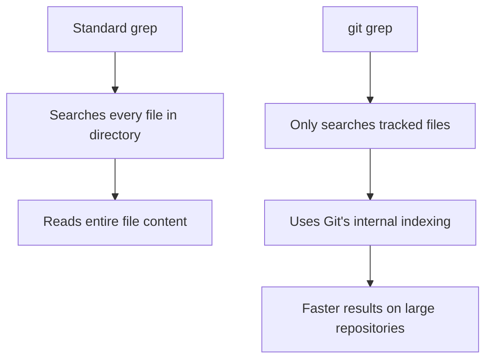

# Git Grep

## Introduction

Have you ever needed to search for a specific piece of code or text across your entire Git repository? While tools like `find` and standard `grep` are available, Git provides its own built-in search functionality through the `git grep` command. This powerful tool is optimized for searching through Git repositories and offers several advantages over standard search utilities.

In this tutorial, we'll explore how to use `git grep` to efficiently search through your codebase, understand its syntax, and leverage its advanced features to enhance your development workflow.

## What is Git Grep?

`git grep` is a specialized search command in Git that allows you to search for patterns across files in your repository. Unlike regular `grep`, it's designed specifically for Git repositories and offers better performance and Git-specific features.

The basic syntax is:

```bash
git grep [options] <pattern> [<path>...]
```

Where:
- `pattern` is the search term you're looking for
- `path` (optional) specifies which files or directories to search in

## Basic Usage

Let's start with some simple examples to get familiar with `git grep`.

### Example 1: Simple Text Search

To search for all occurrences of the word "function" in your repository:

```bash
git grep "function"
```

Output:
```
app.js:function initializeApp() {
app.js:function handleUserInput(input) {
utils.js:function formatDate(date) {
utils.js:function validateEmail(email) {
```

This shows each file where the pattern was found along with the matching line.

### Example 2: Limiting Search to Specific Files

To search only in JavaScript files:

```bash
git grep "function" -- "*.js"
```

This will produce similar output but only for files with the `.js` extension.

### Example 3: Case-Insensitive Search

To perform a case-insensitive search:

```bash
git grep -i "function"
```

This will match "function", "Function", "FUNCTION", etc.

## Advanced Features

Now let's explore some of the more powerful features of `git grep`.

### Showing Line Numbers

To include line numbers in the output:

```bash
git grep -n "function"
```

Output:
```
app.js:10:function initializeApp() {
app.js:25:function handleUserInput(input) {
utils.js:5:function formatDate(date) {
utils.js:15:function validateEmail(email) {
```

### Counting Matches

To count the number of matches in each file instead of showing the lines:

```bash
git grep -c "function"
```

Output:
```
app.js:2
utils.js:2
```

### Searching in a Specific Commit

To search in a specific commit rather than in the working directory:

```bash
git grep "function" 6e28d9b
```

This searches for "function" in commit with hash 6e28d9b.

### Using Regular Expressions

Git grep supports regular expressions for more powerful pattern matching:

```bash
git grep -E "function (get|set)[A-Z][a-zA-Z]*\("
```

This would find functions with names starting with "get" or "set" followed by a capitalized word.

### Showing Context

To display lines before and after the match:

```bash
git grep -A 2 -B 2 "TODO"
```

Output:
```
app.js-const config = {
app.js-  maxRetries: 3,
app.js:  // TODO: Make this configurable via settings
app.js-  timeout: 1000,
app.js-  endpoint: '/api'
```

This shows 2 lines before (`-B 2`) and 2 lines after (`-A 2`) each match.

## Practical Applications

Let's look at some real-world scenarios where `git grep` can be extremely useful.

### Finding Function Definitions

When working in a large codebase, you might need to locate where a specific function is defined:

```bash
git grep -n "function calculateTotalPrice" --or --function "calculateTotalPrice"
```

### Searching for Deprecated Code

If your team is phasing out certain APIs or functions, you can find all instances that need to be updated:

```bash
git grep -n "deprecated" --and --function "oldAPI"
```

### Locating Configuration Settings

Need to find where a specific configuration option is set?

```bash
git grep -n "DATABASE_CONNECTION"
```

### Finding All TODOs in the Codebase

Gathering all TODO comments before a release:

```bash
git grep -n "TODO" --or "FIXME"
```

## Understanding Search Performance

One of the advantages of `git grep` over standard `grep` is its performance when searching large repositories. Let's visualize how `git grep` works compared to regular `grep`:



Git grep is particularly efficient because:

1. It only searches through tracked files (ignoring `.git`, `.gitignore`d files, etc.)
2. It can leverage Git's indexing for faster searches
3. It can be restricted to specific parts of the repository history

## Advanced Options

Here's a table of some of the most useful options for `git grep`:

| Option                | Description                                              |
|-----------------------|----------------------------------------------------------|
| `-i`, `--ignore-case` | Case insensitive search                                  |
| `-n`, `--line-number` | Show line numbers                                        |
| `-l`, `--files-with-matches` | Show only filenames, not matching lines           |
| `-c`, `--count`       | Show the number of matches per file                      |
| `-w`, `--word-regexp` | Match the pattern only at word boundaries                |
| `-E`, `--extended-regexp` | Use extended regular expressions                     |
| `-F`, `--fixed-strings` | Interpret pattern as a fixed string, not a regex       |
| `-A NUM`              | Show NUM lines after each match                          |
| `-B NUM`              | Show NUM lines before each match                         |
| `-C NUM`              | Show NUM lines before and after each match               |
| `--and`, `--or`, `--not` | Combine multiple patterns with logical operators      |

## Git Grep vs Regular Grep

Let's compare git grep with standard grep:

| Feature              | Git Grep                             | Regular Grep                       |
|----------------------|--------------------------------------|-----------------------------------|
| Search scope         | Only Git-tracked files               | All files in directory            |
| Speed on large repos | Faster                               | Slower                            |
| Git integration      | Can search specific commits/branches | No Git integration                |
| Regular expressions  | Supported (with -E)                  | Supported                         |
| Binary files         | Ignores by default                   | Searches unless specified         |

## Combining with Other Git Commands

Git grep becomes even more powerful when combined with other Git commands. Here's an example of using it with `git log`:

```bash
git log -p --grep="fix critical bug"
```

This finds all commits with "fix critical bug" in the commit message and shows the changes.

Another useful combination is with `git diff`:

```bash
git grep -l "TODO" | xargs git diff origin/main
```

This finds all files containing "TODO" and shows how they've changed compared to the main branch.

## Summary

`git grep` is a powerful tool in the Git ecosystem that allows developers to efficiently search through their codebase. Its advantages over standard search tools make it invaluable for large projects. Here's what we've covered:

- Basic syntax and usage of `git grep`
- Advanced search options and pattern matching
- Performance benefits compared to standard grep
- Real-world applications and examples
- Combining with other Git commands

By mastering `git grep`, you'll be able to navigate and search through large codebases with ease, significantly improving your productivity as a developer.

## Exercises

1. Search for all TODO comments in your repository and count them per file.
2. Find all functions that start with "handle" in your JavaScript files.
3. Search for a specific error message across your codebase.
4. Use git grep to find all occurrences of a deprecated function and its callers.
5. Compare the performance of `git grep` vs regular `grep` on a large repository.

## Additional Resources

- [Official Git Documentation for git-grep](https://git-scm.com/docs/git-grep)
- [Pro Git Book - Searching](https://git-scm.com/book/en/v2/Git-Tools-Searching)
- [Git Grep Examples](https://www.atlassian.com/git/tutorials/git-grep)

Happy searching!