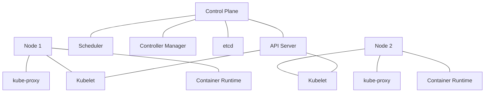

# Kubernetes Introduction

## What is Kubernetes?

<div style={{
    "width": "20%",
    "margin": "0 auto",
    "text-align": "center"
}}>
    
</div>

Kubernetes (often abbreviated as K8s) is an open-source container orchestration platform designed to automate the deployment, scaling, and management of containerized applications. Originally developed by Google and now maintained by the Cloud Native Computing Foundation (CNCF), Kubernetes has become the industry standard for container orchestration.

Think of Kubernetes as an operating system for your cluster - it abstracts away the underlying infrastructure and provides a consistent platform for running distributed applications.

## Why Kubernetes?

Before diving deeper, let's understand why Kubernetes has become so essential in modern application development:

- **Container Orchestration**: Manually managing hundreds or thousands of containers is impractical. Kubernetes automates this process.
- **High Availability**: Kubernetes ensures your applications remain available even if containers or nodes fail.
- **Scalability**: Easily scale your applications up or down based on demand.
- **Resource Efficiency**: Kubernetes optimizes resource utilization across your cluster.
- **Portability**: Run your applications consistently across on-premises, hybrid, or public cloud infrastructure.
- **Service Discovery**: Built-in mechanisms for services to find and communicate with each other.
- **Rolling Updates**: Deploy updates to your applications with zero downtime.
- **Self-healing**: Automatically replaces and reschedules containers when nodes fail.

## Kubernetes Architecture

Understanding Kubernetes architecture is crucial before working with it:



### Control Plane Components

- **API Server**: The front-end to the Kubernetes control plane, handling REST operations and updating the corresponding objects in etcd.
- **Scheduler**: Assigns newly created pods to nodes based on resource availability.
- **Controller Manager**: Runs controller processes that regulate the state of the cluster.
- **etcd**: A consistent and highly-available key-value store used as Kubernetes' backing store for all cluster data.

### Node Components

- **Kubelet**: An agent that runs on each node to ensure containers are running in a Pod.
- **Container Runtime**: The software responsible for running containers (like Docker, containerd, or CRI-O).
- **kube-proxy**: Maintains network rules on nodes and performs connection forwarding.

## Core Kubernetes Concepts

Let's explore the fundamental building blocks of Kubernetes:

### Pods

A Pod is the smallest deployable unit in Kubernetes, representing a single instance of a running process in your cluster. Pods contain one or more containers that share storage, network, and specifications on how to run.

Here's a simple Pod definition:

```yaml
apiVersion: v1
kind: Pod
metadata:
  name: nginx-pod
  labels:
    app: nginx
spec:
  containers:
  - name: nginx
    image: nginx:latest
    ports:
    - containerPort: 80
```

To create this Pod:

```bash
kubectl apply -f nginx-pod.yaml
```

Output:
```
pod/nginx-pod created
```

To see your running pod:

```bash
kubectl get pods
```

Output:
```
NAME        READY   STATUS    RESTARTS   AGE
nginx-pod   1/1     Running   0          45s
```

### Deployments

While you can create Pods directly, it's better to use higher-level controllers like Deployments. A Deployment manages ReplicaSets, which in turn manage Pods, providing declarative updates and rollback capabilities.

```yaml
apiVersion: apps/v1
kind: Deployment
metadata:
  name: nginx-deployment
  labels:
    app: nginx
spec:
  replicas: 3
  selector:
    matchLabels:
      app: nginx
  template:
    metadata:
      labels:
        app: nginx
    spec:
      containers:
      - name: nginx
        image: nginx:1.14.2
        ports:
        - containerPort: 80
```

Creating and checking the deployment:

```bash
kubectl apply -f nginx-deployment.yaml
kubectl get deployments
```

Output:
```
NAME               READY   UP-TO-DATE   AVAILABLE   AGE
nginx-deployment   3/3     3            3           10s
```

### Services

Pods are ephemeral - they can be created, destroyed, and moved around. Services provide a stable networking endpoint to access a logical set of Pods.

```yaml
apiVersion: v1
kind: Service
metadata:
  name: nginx-service
spec:
  selector:
    app: nginx
  ports:
  - port: 80
    targetPort: 80
  type: ClusterIP
```

Create the service:

```bash
kubectl apply -f nginx-service.yaml
kubectl get services
```

Output:
```
NAME            TYPE        CLUSTER-IP      EXTERNAL-IP   PORT(S)   AGE
kubernetes      ClusterIP   10.96.0.1       <none>        443/TCP   24h
nginx-service   ClusterIP   10.104.228.45   <none>        80/TCP    12s
```

### ConfigMaps and Secrets

ConfigMaps and Secrets allow you to decouple configuration from your application code.

**ConfigMap example:**

```yaml
apiVersion: v1
kind: ConfigMap
metadata:
  name: app-config
data:
  app.properties: |
    environment=dev
    log_level=info
  ui.properties: |
    color.background=white
    color.foreground=black
```

**Secret example:**

```yaml
apiVersion: v1
kind: Secret
metadata:
  name: app-secret
type: Opaque
data:
  db-password: cGFzc3dvcmQxMjM=  # base64 encoded "password123"
  api-key: dGhpc2lzYXNlY3JldGtleQ==  # base64 encoded "thisisasecretkey"
```

## Setting Up Your First Kubernetes Cluster

Let's walk through setting up a local Kubernetes environment for development purposes.

### Using Minikube

Minikube is a tool that lets you run Kubernetes locally:

1. Install Minikube:

```bash
# For macOS with Homebrew
brew install minikube

# For Windows with Chocolatey
choco install minikube

# For Linux
curl -LO https://storage.googleapis.com/minikube/releases/latest/minikube-linux-amd64
sudo install minikube-linux-amd64 /usr/local/bin/minikube
```

2. Start your cluster:

```bash
minikube start
```

Output:
```
😄  minikube v1.25.2 on Darwin 12.1
✨  Using the docker driver based on existing profile
👍  Starting control plane node minikube in cluster minikube
🚜  Pulling base image ...
🔄  Restarting existing docker container for "minikube" ...
🐳  Preparing Kubernetes v1.23.3 on Docker 20.10.12 ...
🔎  Verifying Kubernetes components...
    ▪ Using image gcr.io/k8s-minikube/storage-provisioner:v5
🌟  Enabled addons: storage-provisioner, default-storageclass
🏄  Done! kubectl is now configured to use "minikube" cluster and "default" namespace by default
```

3. Verify your setup:

```bash
kubectl cluster-info
```

Output:
```
Kubernetes control plane is running at https://127.0.0.1:55000
CoreDNS is running at https://127.0.0.1:55000/api/v1/namespaces/kube-system/services/kube-dns:dns/proxy

To further debug and diagnose cluster problems, use 'kubectl cluster-info dump'.
```

### Deploying Your First Application

Let's deploy a simple web application to your local Kubernetes cluster:

1. Create a deployment manifest `hello-app.yaml`:

```yaml
apiVersion: apps/v1
kind: Deployment
metadata:
  name: hello-world
spec:
  replicas: 2
  selector:
    matchLabels:
      app: hello-world
  template:
    metadata:
      labels:
        app: hello-world
    spec:
      containers:
      - name: hello-world
        image: k8s.gcr.io/echoserver:1.4
        ports:
        - containerPort: 8080
---
apiVersion: v1
kind: Service
metadata:
  name: hello-world
spec:
  selector:
    app: hello-world
  ports:
  - port: 80
    targetPort: 8080
  type: NodePort
```

2. Apply the configuration:

```bash
kubectl apply -f hello-app.yaml
```

3. Access your application:

```bash
minikube service hello-world
```

This command will open your browser to access the service.

## Kubernetes YAML Files Explained

All Kubernetes resources are defined using YAML files. A typical Kubernetes YAML file has four main sections:

1. **apiVersion**: Which version of the Kubernetes API you're using to create this object
2. **kind**: What kind of object you want to create
3. **metadata**: Data that helps uniquely identify the object, including a name, UID, and optional namespace
4. **spec**: The precise format depends on the Kubernetes object you're creating

Let's break down a Deployment YAML:

```yaml
apiVersion: apps/v1         # Which API version to use
kind: Deployment            # What kind of resource to create
metadata:                   # Resource identification
  name: nginx-deployment    # Name of the deployment
  labels:                   # Labels for organization
    app: nginx              
spec:                       # Specification section
  replicas: 3               # How many pod replicas to maintain
  selector:                 # Which pods this deployment manages
    matchLabels:            
      app: nginx            
  template:                 # Pod template specification
    metadata:               
      labels:               # Pod labels
        app: nginx          
    spec:                   # Pod specification
      containers:           # Containers in the pod
      - name: nginx         # Container name
        image: nginx:1.14.2 # Container image
        ports:              # Ports to expose
        - containerPort: 80 # Container port
```

## Managing Kubernetes with kubectl

`kubectl` is the command-line tool for interacting with Kubernetes clusters. Here are essential commands:

1. **Creating resources**:
```bash
kubectl create -f [filename]       # Create from a file
kubectl apply -f [filename]        # Create or update from a file
```

2. **Viewing resources**:
```bash
kubectl get pods                   # List all pods
kubectl get deployments            # List all deployments
kubectl get services               # List all services
kubectl get all                    # List all resources
kubectl describe pod [pod-name]    # Show detailed information
```

3. **Debugging**:
```bash
kubectl logs [pod-name]            # View container logs
kubectl exec -it [pod-name] -- /bin/bash  # Get a shell inside the container
kubectl port-forward [pod-name] 8080:80   # Forward local port to pod
```

4. **Scaling**:
```bash
kubectl scale deployment [name] --replicas=5  # Scale to 5 replicas
```

5. **Updating**:
```bash
kubectl rollout status deployment [name]  # Check rollout status
kubectl rollout history deployment [name] # View rollout history
kubectl rollout undo deployment [name]    # Rollback to previous version
```

## Real-World Use Case: Deploying a Multi-tier Web Application

Let's put everything together by deploying a sample application with a frontend, backend, and database:

```yaml
# database-deployment.yaml
apiVersion: apps/v1
kind: Deployment
metadata:
  name: postgres
spec:
  replicas: 1
  selector:
    matchLabels:
      app: postgres
  template:
    metadata:
      labels:
        app: postgres
    spec:
      containers:
      - name: postgres
        image: postgres:12
        env:
        - name: POSTGRES_USER
          value: "admin"
        - name: POSTGRES_PASSWORD
          value: "password"  # Use secrets in real applications!
        - name: POSTGRES_DB
          value: "myapp"
        ports:
        - containerPort: 5432
---
apiVersion: v1
kind: Service
metadata:
  name: postgres
spec:
  selector:
    app: postgres
  ports:
  - port: 5432
    targetPort: 5432
  type: ClusterIP
```

```yaml
# backend-deployment.yaml
apiVersion: apps/v1
kind: Deployment
metadata:
  name: backend
spec:
  replicas: 2
  selector:
    matchLabels:
      app: backend
  template:
    metadata:
      labels:
        app: backend
    spec:
      containers:
      - name: backend
        image: yourbackendimage:latest
        env:
        - name: DB_HOST
          value: "postgres"
        - name: DB_PORT
          value: "5432"
        - name: DB_USER
          value: "admin"
        - name: DB_PASSWORD
          value: "password"  # Use secrets in real applications!
        ports:
        - containerPort: 8080
---
apiVersion: v1
kind: Service
metadata:
  name: backend
spec:
  selector:
    app: backend
  ports:
  - port: 8080
    targetPort: 8080
  type: ClusterIP
```

```yaml
# frontend-deployment.yaml
apiVersion: apps/v1
kind: Deployment
metadata:
  name: frontend
spec:
  replicas: 3
  selector:
    matchLabels:
      app: frontend
  template:
    metadata:
      labels:
        app: frontend
    spec:
      containers:
      - name: frontend
        image: yourfrontendimage:latest
        env:
        - name: BACKEND_URL
          value: "http://backend:8080"
        ports:
        - containerPort: 80
---
apiVersion: v1
kind: Service
metadata:
  name: frontend
spec:
  selector:
    app: frontend
  ports:
  - port: 80
    targetPort: 80
  type: LoadBalancer
```

Deploy all components:

```bash
kubectl apply -f database-deployment.yaml
kubectl apply -f backend-deployment.yaml
kubectl apply -f frontend-deployment.yaml
```

## Best Practices for Kubernetes

As you continue your Kubernetes journey, keep these best practices in mind:

1. **Use namespaces** to organize your resources and provide isolation between teams or projects.
2. **Implement resource requests and limits** to ensure applications have adequate resources and prevent resource starvation.
3. **Use labels and annotations** to organize and identify your resources effectively.
4. **Store secrets securely** using the Secret resource and consider external secret management solutions.
5. **Implement health checks** (liveness and readiness probes) for your applications.
6. **Use persistent storage** for stateful applications.
7. **Implement proper networking policies** to control traffic flow between pods.
8. **Keep your Kubernetes version up to date** to benefit from security patches and new features.
9. **Backup your etcd data** regularly to prevent data loss.
10. **Monitor your cluster** with tools like Prometheus and Grafana.

## Summary

In this introduction to Kubernetes, we've covered:

- What Kubernetes is and why it's useful
- The architecture of Kubernetes and its core components
- Essential Kubernetes concepts like Pods, Deployments, and Services
- How to set up a local Kubernetes environment with Minikube
- Working with YAML configuration files
- Essential kubectl commands for managing your cluster
- A real-world deployment example of a multi-tier application
- Best practices for running applications on Kubernetes

## Additional Resources

To continue your Kubernetes journey:

- **Official Documentation**: [kubernetes.io/docs](https://kubernetes.io/docs)
- **Interactive Tutorial**: [Kubernetes Basics](https://kubernetes.io/docs/tutorials/kubernetes-basics/)
- **Community**: Join the [Kubernetes Slack](https://kubernetes.slack.com/)
- **Certification**: Consider the [Certified Kubernetes Administrator (CKA)](https://www.cncf.io/certification/cka/) exam

## Practice Exercises

1. Deploy a stateless application to your Minikube cluster.
2. Scale a deployment up and down and observe the changes.
3. Create a ConfigMap and mount it as a volume in a Pod.
4. Implement a rolling update strategy for a deployment.
5. Create a StatefulSet for a database application.

By mastering these fundamentals, you'll be well on your way to becoming proficient with Kubernetes and deploying scalable, resilient applications in any environment.