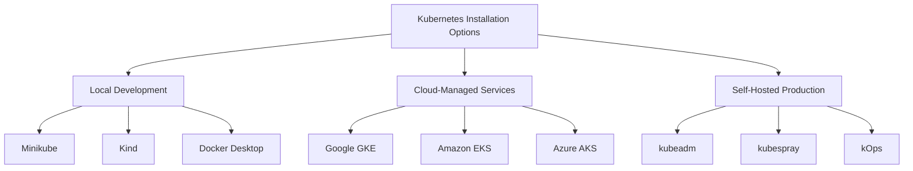

# Kubernetes Installation

## Introduction

Kubernetes (often abbreviated as K8s) is an open-source platform designed to automate deploying, scaling, and operating application containers. Before you can leverage the power of Kubernetes to orchestrate your containerized applications, you need to install and set up a Kubernetes environment.

This guide walks you through the different methods of installing Kubernetes, from local development environments to production-ready clusters. Whether you're a developer looking to test applications locally or an administrator setting up a cluster for production use, this guide will help you get started.

## Prerequisites

Before installing Kubernetes, ensure you have:

- Basic understanding of containers (especially Docker)
- A computer with at least:
  - 2 CPUs
  - 2GB of free memory
  - 20GB of free disk space
- Internet connection for downloading necessary components
- Administrative/root access to your machine

## Installation Options

There are several ways to install Kubernetes, each suited for different purposes:



Let's explore each option in detail.

## Local Development Environments

### Minikube

Minikube is a tool that runs a single-node Kubernetes cluster inside a Virtual Machine (VM) on your laptop.

#### Installation Steps:

1. **Install a Hypervisor**:
   - For macOS: VirtualBox, HyperKit, or VMware Fusion
   - For Windows: VirtualBox, Hyper-V
   - For Linux: VirtualBox or KVM

2. **Install Minikube**:

   For macOS (using Homebrew):

   ```bash
   brew install minikube
   ```

   For Windows (using Chocolatey):

   ```bash
   choco install minikube
   ```

   For Linux:

   ```bash
   curl -LO https://storage.googleapis.com/minikube/releases/latest/minikube-linux-amd64
   sudo install minikube-linux-amd64 /usr/local/bin/minikube
   ```

3. **Start Minikube**:

   ```bash
   minikube start
   ```

   Output:
   ```
   😄  minikube v1.26.0 on Darwin 12.4
   ✨  Using the hyperkit driver based on existing profile
   👍  Starting control plane node minikube in cluster minikube
   🏄  Done! kubectl is now configured to use "minikube" cluster and "default" namespace by default
   ```

4. **Verify Installation**:

   ```bash
   minikube status
   ```

   Output:
   ```
   minikube
   type: Control Plane
   host: Running
   kubelet: Running
   apiserver: Running
   kubeconfig: Configured
   ```

### Kind (Kubernetes IN Docker)

Kind creates Kubernetes clusters using Docker containers as "nodes."

#### Installation Steps:

1. **Install Docker** (if not already installed):
   Follow the [official Docker installation guide](https://docs.docker.com/get-docker/).

2. **Install Kind**:

   For macOS (using Homebrew):

   ```bash
   brew install kind
   ```

   For Windows (using Chocolatey):

   ```bash
   choco install kind
   ```

   For Linux:

   ```bash
   curl -Lo ./kind https://kind.sigs.k8s.io/dl/v0.14.0/kind-linux-amd64
   chmod +x ./kind
   sudo mv ./kind /usr/local/bin/kind
   ```

3. **Create a Cluster**:

   ```bash
   kind create cluster
   ```

   Output:
   ```
   Creating cluster "kind" ...
   ✓ Ensuring node image (kindest/node:v1.24.0) 🖼
   ✓ Preparing nodes 📦
   ✓ Writing configuration 📜
   ✓ Starting control-plane 🕹️
   ✓ Installing CNI 🔌
   ✓ Installing StorageClass 💾
   Set kubectl context to "kind-kind"
   You can now use your cluster with:

   kubectl cluster-info --context kind-kind
   ```

4. **Verify Installation**:

   ```bash
   kind get clusters
   ```

   Output:
   ```
   kind
   ```

### Docker Desktop

If you're already using Docker Desktop for Windows or Mac, it comes with Kubernetes support built-in.

#### Enabling Kubernetes in Docker Desktop:

1. Open Docker Desktop.
2. Go to Settings (gear icon).
3. Select "Kubernetes" from the left sidebar.
4. Check "Enable Kubernetes".
5. Click "Apply & Restart".
6. Wait for the installation to complete.

Verify by running:

```bash
kubectl version
```

Output:
```
Client Version: version.Info{Major:"1", Minor:"24", GitVersion:"v1.24.0", ...}
Server Version: version.Info{Major:"1", Minor:"24", GitVersion:"v1.24.0", ...}
```

## Cloud-Managed Kubernetes Services

For production environments or larger teams, cloud-managed Kubernetes services offer a more robust solution.

### Google Kubernetes Engine (GKE)

1. **Set up a Google Cloud account** and create a project.
2. **Install the Google Cloud SDK**:

   For macOS (using Homebrew):
   ```bash
   brew install --cask google-cloud-sdk
   ```

   For Windows/Linux: Download from [Google Cloud SDK page](https://cloud.google.com/sdk/docs/install).

3. **Initialize the SDK**:
   ```bash
   gcloud init
   ```

4. **Create a GKE cluster**:
   ```bash
   gcloud container clusters create my-cluster --num-nodes=3
   ```

   Output:
   ```
   Creating cluster my-cluster in us-central1-a... Done.
   Created [https://container.googleapis.com/v1/projects/my-project/zones/us-central1-a/clusters/my-cluster].
   kubeconfig entry generated for my-cluster.
   ```

5. **Connect to the cluster**:
   ```bash
   gcloud container clusters get-credentials my-cluster
   ```

### Amazon Elastic Kubernetes Service (EKS)

1. **Set up an AWS account**.
2. **Install the AWS CLI**:

   For macOS (using Homebrew):
   ```bash
   brew install awscli
   ```

   For Windows/Linux: Download from [AWS CLI page](https://aws.amazon.com/cli/).

3. **Configure AWS CLI**:
   ```bash
   aws configure
   ```

4. **Install eksctl**:

   For macOS:
   ```bash
   brew tap weaveworks/tap
   brew install weaveworks/tap/eksctl
   ```

   For Windows (using Chocolatey):
   ```bash
   choco install eksctl
   ```

   For Linux:
   ```bash
   curl --silent --location "https://github.com/weaveworks/eksctl/releases/latest/download/eksctl_$(uname -s)_amd64.tar.gz" | tar xz -C /tmp
   sudo mv /tmp/eksctl /usr/local/bin
   ```

5. **Create an EKS cluster**:
   ```bash
   eksctl create cluster --name my-cluster --nodes=3 --node-type=t3.medium
   ```

### Azure Kubernetes Service (AKS)

1. **Set up an Azure account**.
2. **Install the Azure CLI**:

   For macOS (using Homebrew):
   ```bash
   brew install azure-cli
   ```

   For Windows/Linux: Follow [Microsoft's installation guide](https://docs.microsoft.com/en-us/cli/azure/install-azure-cli).

3. **Login to Azure**:
   ```bash
   az login
   ```

4. **Create a resource group**:
   ```bash
   az group create --name myResourceGroup --location eastus
   ```

5. **Create an AKS cluster**:
   ```bash
   az aks create --resource-group myResourceGroup --name myAKSCluster --node-count 3 --enable-addons monitoring --generate-ssh-keys
   ```

6. **Get credentials**:
   ```bash
   az aks get-credentials --resource-group myResourceGroup --name myAKSCluster
   ```

## Self-Hosted Production Installation

For full control over your Kubernetes environment, you can set up a cluster manually using tools like kubeadm.

### Installing with kubeadm

#### Prerequisites:

- Multiple machines (VMs or physical) for master and worker nodes
- Root access to all machines
- Network connectivity between all machines
- Each machine must have:
  - 2+ CPUs
  - 2+ GB RAM
  - Unique hostname, MAC address, and product_uuid

#### Installation Steps:

1. **Install Docker on all nodes**:

   ```bash
   sudo apt-get update
   sudo apt-get install -y docker.io
   sudo systemctl enable docker
   sudo systemctl start docker
   ```

2. **Install kubeadm, kubelet, and kubectl on all nodes**:

   ```bash
   sudo apt-get update && sudo apt-get install -y apt-transport-https curl
   curl -s https://packages.cloud.google.com/apt/doc/apt-key.gpg | sudo apt-key add -
   cat <<EOF | sudo tee /etc/apt/sources.list.d/kubernetes.list
   deb https://apt.kubernetes.io/ kubernetes-xenial main
   EOF
   sudo apt-get update
   sudo apt-get install -y kubelet kubeadm kubectl
   sudo apt-mark hold kubelet kubeadm kubectl
   ```

3. **Initialize the master node**:

   ```bash
   sudo kubeadm init --pod-network-cidr=10.244.0.0/16
   ```

   After initialization, you'll see output similar to:
   
   ```
   Your Kubernetes control-plane has initialized successfully!

   To start using your cluster, you need to run the following as a regular user:

     mkdir -p $HOME/.kube
     sudo cp -i /etc/kubernetes/admin.conf $HOME/.kube/config
     sudo chown $(id -u):$(id -g) $HOME/.kube/config

   You should now deploy a pod network to the cluster.
   Run "kubectl apply -f [podnetwork].yaml" with one of the options listed at:
     https://kubernetes.io/docs/concepts/cluster-administration/addons/

   Then you can join any number of worker nodes by running the following on each as root:

   kubeadm join 192.168.1.100:6443 --token abc123.xyz456 \
       --discovery-token-ca-cert-hash sha256:1234567890abcdef1234567890abcdef1234567890abcdef1234567890abcdef
   ```

4. **Set up kubectl on the master node**:

   ```bash
   mkdir -p $HOME/.kube
   sudo cp -i /etc/kubernetes/admin.conf $HOME/.kube/config
   sudo chown $(id -u):$(id -g) $HOME/.kube/config
   ```

5. **Install a pod network add-on** (e.g., Flannel):

   ```bash
   kubectl apply -f https://raw.githubusercontent.com/flannel-io/flannel/master/Documentation/kube-flannel.yml
   ```

6. **Join worker nodes to the cluster**:
   
   On each worker node, run the join command from the kubeadm init output:

   ```bash
   sudo kubeadm join 192.168.1.100:6443 --token abc123.xyz456 \
       --discovery-token-ca-cert-hash sha256:1234567890abcdef1234567890abcdef1234567890abcdef1234567890abcdef
   ```

7. **Verify your cluster**:

   On the master node:
   ```bash
   kubectl get nodes
   ```

   Output:
   ```
   NAME        STATUS   ROLES                  AGE   VERSION
   master      Ready    control-plane,master   5m    v1.24.0
   worker1     Ready    <none>                 2m    v1.24.0
   worker2     Ready    <none>                 2m    v1.24.0
   ```

## Installing kubectl

kubectl is the command-line tool for interacting with Kubernetes clusters. You'll need it installed on your local machine to manage remote clusters.

### For macOS:

```bash
brew install kubectl
```

Or using curl:

```bash
curl -LO "https://dl.k8s.io/release/$(curl -L -s https://dl.k8s.io/release/stable.txt)/bin/darwin/amd64/kubectl"
chmod +x ./kubectl
sudo mv ./kubectl /usr/local/bin/kubectl
```

### For Windows:

Using Chocolatey:

```bash
choco install kubernetes-cli
```

Or download the exe from the [Kubernetes release page](https://kubernetes.io/docs/tasks/tools/install-kubectl-windows/).

### For Linux:

```bash
curl -LO "https://dl.k8s.io/release/$(curl -L -s https://dl.k8s.io/release/stable.txt)/bin/linux/amd64/kubectl"
chmod +x ./kubectl
sudo mv ./kubectl /usr/local/bin/kubectl
```

### Verify kubectl installation:

```bash
kubectl version --client
```

Output:
```
Client Version: version.Info{Major:"1", Minor:"24", GitVersion:"v1.24.0", ...}
```

## Basic Verification and Usage

After installing Kubernetes, verify your setup with these commands:

```bash
# Check cluster info
kubectl cluster-info

# List all nodes
kubectl get nodes

# List all pods in all namespaces
kubectl get pods --all-namespaces

# Create a test deployment
kubectl create deployment nginx --image=nginx

# Expose the deployment as a service
kubectl expose deployment nginx --port=80 --type=LoadBalancer

# Check that the service is running
kubectl get services
```

## Troubleshooting Common Installation Issues

### Issue: Node Not Ready

If a node shows "NotReady" status:

```bash
# Check node description for errors
kubectl describe node <node-name>

# Check kubelet logs
sudo journalctl -u kubelet
```

Common solutions:
- Restart kubelet: `sudo systemctl restart kubelet`
- Check network connectivity between nodes
- Verify that pod network add-on is correctly installed

### Issue: Pods Stuck in Pending

```bash
# Get more details about the pod
kubectl describe pod <pod-name>
```

Common solutions:
- Check if there are enough resources available
- Verify that node selectors or taints aren't preventing scheduling
- Check for network issues

### Issue: Unable to Connect to API Server

```bash
# Check API server logs
sudo journalctl -u kube-apiserver

# Verify kube-apiserver is running
sudo systemctl status kube-apiserver
```

Common solutions:
- Check that the API server certificate is valid
- Verify firewall rules allow traffic to the API server
- Check that the kubelet is authorized to connect to the API server

## Best Practices

1. **Choose the right installation method for your needs**:
   - For learning: Minikube or Kind
   - For development teams: Docker Desktop or managed cloud service
   - For production: Managed cloud service or kubeadm with proper planning

2. **Security considerations**:
   - Use RBAC (Role-Based Access Control) for authorization
   - Enable network policies to control pod-to-pod communication
   - Regularly update Kubernetes and all components

3. **Resource planning**:
   - Plan for enough memory and CPU
   - Consider storage requirements (persistent volumes)
   - Plan network architecture (pod network CIDR, service CIDR)

4. **High availability**:
   - For production: Use multiple master nodes
   - Distribute worker nodes across availability zones
   - Use load balancers for API server access

## Summary

This guide covered various methods to install Kubernetes:
- Local development options like Minikube, Kind, and Docker Desktop
- Cloud-managed services like GKE, EKS, and AKS
- Self-hosted installation using kubeadm

The method you choose depends on your specific needs, from simple local development to production-ready clusters. After installation, you learned how to verify your setup and troubleshoot common issues.

## Additional Resources

- [Official Kubernetes Documentation](https://kubernetes.io/docs/home/)
- [Kubernetes the Hard Way](https://github.com/kelseyhightower/kubernetes-the-hard-way) - A guide for learning Kubernetes components in detail
- [kubectl Cheat Sheet](https://kubernetes.io/docs/reference/kubectl/cheatsheet/)

## Exercises

1. **Beginner**: Install Minikube on your local machine and create a simple nginx deployment.

2. **Intermediate**: Set up a Kind cluster with one control plane node and two worker nodes (hint: you'll need to create a custom cluster configuration file).

3. **Advanced**: Use kubeadm to set up a Kubernetes cluster with one master and two worker nodes on VMs or physical machines. Implement a highly available setup with multiple control plane nodes.

4. **Challenge**: Install a complete application stack (e.g., a web server with a database) on your Kubernetes cluster using manifests and verify it's working correctly.