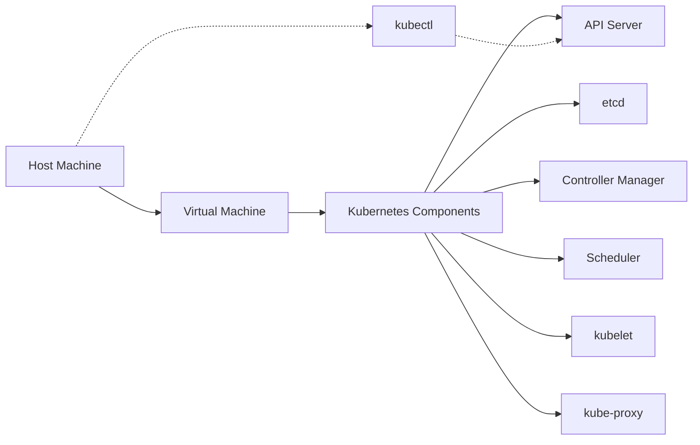

# Kubernetes Minikube

## Introduction

Minikube is a lightweight Kubernetes implementation that creates a virtual machine on your local system and deploys a simple, single-node Kubernetes cluster. It's the perfect tool for developers who want to learn Kubernetes or develop applications locally without needing access to a full-scale Kubernetes cluster.

In this tutorial, we'll explore how to set up Minikube, understand its key components, and use it to deploy and manage applications locally. By the end, you'll have a functional local Kubernetes environment for testing and development.

## Why Minikube?

Before diving into installation and usage, let's understand why Minikube is valuable:

- **Local Development**: Test Kubernetes configurations and deployments without accessing a production cluster
- **Learning Platform**: Perfect environment for learning Kubernetes concepts
- **Low Resource Requirements**: Runs on a single machine with minimal overhead
- **Cross-Platform Support**: Works on Windows, macOS, and Linux
- **Feature-Rich**: Supports most Kubernetes features needed for development

## Prerequisites

Before installing Minikube, ensure you have:

1. **A Hypervisor**: VirtualBox, HyperKit, KVM2, VMware, or Docker
2. **kubectl**: The Kubernetes command-line tool
3. **At least 2GB of free memory**
4. **At least 20GB of free disk space**

## Installation

Let's install Minikube on different operating systems:

### macOS

```bash
# Using Homebrew
brew install minikube

# Alternatively, direct installation
curl -LO https://storage.googleapis.com/minikube/releases/latest/minikube-darwin-amd64
sudo install minikube-darwin-amd64 /usr/local/bin/minikube
```

### Linux

```bash
# Direct installation
curl -LO https://storage.googleapis.com/minikube/releases/latest/minikube-linux-amd64
sudo install minikube-linux-amd64 /usr/local/bin/minikube
```

### Windows

```powershell
# Using Chocolatey
choco install minikube

# Alternatively, direct download and installation
New-Item -Path 'c:\' -Name 'minikube' -ItemType Directory -Force
Invoke-WebRequest -OutFile 'c:\minikube\minikube.exe' -Uri 'https://github.com/kubernetes/minikube/releases/latest/download/minikube-windows-amd64.exe'
Add-MemberPath 'c:\minikube'
```

### Verifying Installation

To verify your installation, run:

```bash
minikube version
```

You should see output similar to:

```
minikube version: v1.32.0
commit: 8220a6eb95f0a4d75f7f2d7b14cef975f050512d
```

## Starting Minikube

Now that we have Minikube installed, let's start a local Kubernetes cluster:

```bash
minikube start
```

This command:
1. Downloads the Minikube ISO if needed
2. Creates a virtual machine using your preferred hypervisor
3. Configures a Kubernetes cluster within the VM
4. Sets up kubectl to communicate with this cluster

Typical output:

```
😄  minikube v1.32.0 on Darwin 13.4
✨  Using the docker driver based on existing profile
👍  Starting control plane node minikube in cluster minikube
🚜  Pulling base image ...
🔄  Restarting existing docker container for "minikube" ...
🐳  Preparing Kubernetes v1.28.3 on Docker 24.0.7 ...
🔎  Verifying Kubernetes components...
    ▪ Using image gcr.io/k8s-minikube/storage-provisioner:v5
🌟  Enabled addons: default-storageclass, storage-provisioner
🏄  Done! kubectl is now configured to use "minikube" cluster and "default" namespace by default
```

### Specifying Resources and Driver

You can customize your Minikube cluster by specifying the resources and driver:

```bash
minikube start --cpus 4 --memory 8192 --driver=virtualbox
```

This starts Minikube with 4 CPUs, 8GB of RAM, using the VirtualBox driver.

## Interacting with Your Minikube Cluster

Minikube sets up kubectl to communicate with the cluster automatically. Let's verify our cluster status:

```bash
kubectl get nodes
```

Output:

```
NAME       STATUS   ROLES           AGE     VERSION
minikube   Ready    control-plane   2m42s   v1.28.3
```

Let's check all the pods running in the Kubernetes system:

```bash
kubectl get pods -A
```

Output:

```
NAMESPACE     NAME                               READY   STATUS    RESTARTS   AGE
kube-system   coredns-5dd5756b68-8jzpr           1/1     Running   0          2m30s
kube-system   etcd-minikube                      1/1     Running   0          2m42s
kube-system   kube-apiserver-minikube            1/1     Running   0          2m43s
kube-system   kube-controller-manager-minikube   1/1     Running   0          2m42s
kube-system   kube-proxy-w7c4n                   1/1     Running   0          2m30s
kube-system   kube-scheduler-minikube            1/1     Running   0          2m42s
kube-system   storage-provisioner                1/1     Running   0          2m41s
```

## Understanding the Minikube Architecture

Let's understand how Minikube is structured:



Minikube creates a virtual environment that includes all the core Kubernetes components in a single node. Your local kubectl interacts with the Kubernetes API server running inside the VM.

## Deploying Your First Application

Let's deploy a simple web application to our Minikube cluster:

### 1. Create a Deployment

```bash
kubectl create deployment hello-minikube --image=k8s.gcr.io/echoserver:1.10
```

This creates a deployment named `hello-minikube` using a simple echo server image.

### 2. Expose the Service

```bash
kubectl expose deployment hello-minikube --type=NodePort --port=8080
```

This exposes the deployment as a service, making it accessible from outside the cluster.

### 3. Check the Service

```bash
kubectl get services hello-minikube
```

Output:

```
NAME             TYPE       CLUSTER-IP      EXTERNAL-IP   PORT(S)          AGE
hello-minikube   NodePort   10.96.184.178   <none>        8080:30951/TCP   10s
```

### 4. Access the Service

There are two ways to access the service:

Using the minikube service command:

```bash
minikube service hello-minikube
```

This automatically opens your browser to the service URL.

Alternatively, you can get the URL directly:

```bash
minikube service hello-minikube --url
```

Output:

```
http://192.168.49.2:30951
```

Now you can access this URL in your browser or using curl:

```bash
curl $(minikube service hello-minikube --url)
```

## Working with the Kubernetes Dashboard

Minikube includes the Kubernetes Dashboard, which provides a web-based UI for managing your cluster:

```bash
minikube dashboard
```

This command will automatically open the dashboard in your default browser:

```
🔌  Enabling dashboard ...
    ▪ Using image docker.io/kubernetesui/dashboard:v2.7.0
    ▪ Using image docker.io/kubernetesui/metrics-scraper:v1.0.8
💡  Some dashboard features require the metrics-server addon. To enable all features please run:

	minikube addons enable metrics-server	

🤔  Verifying dashboard health ...
🚀  Launching proxy ...
🤔  Verifying proxy health ...
🎉  Opening http://127.0.0.1:50395/api/v1/namespaces/kubernetes-dashboard/services/http:kubernetes-dashboard:/proxy/ in your default browser...
```

The dashboard allows you to:
- View cluster resources
- Create and modify Kubernetes resources
- View logs from containers
- Troubleshoot applications

## Minikube Addons

Minikube comes with several addons that extend its functionality:

```bash
# List available addons
minikube addons list
```

Output:

```
|-----------------------------|----------|--------------|--------------------------------|
|         ADDON NAME          | PROFILE  |    STATUS    |           MAINTAINER           |
|-----------------------------|----------|--------------|--------------------------------|
| ambassador                  | minikube | disabled     | 3rd party (Ambassador)         |
| auto-pause                  | minikube | disabled     | Google                         |
| cloud-spanner               | minikube | disabled     | Google                         |
| csi-hostpath-driver         | minikube | disabled     | Kubernetes                     |
| dashboard                   | minikube | enabled ✅   | Kubernetes                     |
| default-storageclass        | minikube | enabled ✅   | Kubernetes                     |
| efk                         | minikube | disabled     | 3rd party (Elastic)            |
| freshpod                    | minikube | disabled     | Google                         |
| gcp-auth                    | minikube | disabled     | Google                         |
...
```

Enable an addon with:

```bash
minikube addons enable metrics-server
```

Disable an addon with:

```bash
minikube addons disable dashboard
```

## Managing Docker Images in Minikube

One challenge with Minikube is that it runs in its own virtual environment, so Docker images on your host aren't automatically available inside Minikube.

### Using Minikube's Docker Daemon

You can configure your terminal to use Minikube's Docker daemon:

```bash
eval $(minikube docker-env)
```

After running this command, any Docker commands you run in that terminal will interact with Minikube's Docker daemon instead of your host's. This allows you to build images directly inside the Minikube environment:

```bash
docker build -t my-app:v1 .
kubectl run my-app --image=my-app:v1 --image-pull-policy=Never
```

The `--image-pull-policy=Never` flag tells Kubernetes to use the local image without trying to pull it from a registry.

To revert to your host's Docker daemon:

```bash
eval $(minikube docker-env -u)
```

## Multi-Node Clusters with Minikube

Though Minikube is primarily designed for single-node clusters, newer versions support creating multi-node clusters:

```bash
minikube start --nodes 3
```

This creates a cluster with 3 nodes: one control-plane and two worker nodes. You can verify with:

```bash
kubectl get nodes
```

Output:

```
NAME           STATUS   ROLES           AGE     VERSION
minikube       Ready    control-plane   5m12s   v1.28.3
minikube-m02   Ready    <none>          4m42s   v1.28.3
minikube-m03   Ready    <none>          4m10s   v1.28.3
```

## Practical Example: Deploying a Stateful Application

Let's deploy a stateful application (MySQL) to our Minikube cluster:

### 1. Create a Secret for MySQL Password

```bash
kubectl create secret generic mysql-pass --from-literal=password=YOUR_PASSWORD
```

### 2. Create a PersistentVolumeClaim

Save this as `mysql-pvc.yaml`:

```yaml
apiVersion: v1
kind: PersistentVolumeClaim
metadata:
  name: mysql-pv-claim
  labels:
    app: mysql
spec:
  accessModes:
    - ReadWriteOnce
  resources:
    requests:
      storage: 1Gi
```

Apply it:

```bash
kubectl apply -f mysql-pvc.yaml
```

### 3. Deploy MySQL

Save this as `mysql-deployment.yaml`:

```yaml
apiVersion: apps/v1
kind: Deployment
metadata:
  name: mysql
  labels:
    app: mysql
spec:
  selector:
    matchLabels:
      app: mysql
  strategy:
    type: Recreate
  template:
    metadata:
      labels:
        app: mysql
    spec:
      containers:
      - image: mysql:5.7
        name: mysql
        env:
        - name: MYSQL_ROOT_PASSWORD
          valueFrom:
            secretKeyRef:
              name: mysql-pass
              key: password
        ports:
        - containerPort: 3306
          name: mysql
        volumeMounts:
        - name: mysql-persistent-storage
          mountPath: /var/lib/mysql
      volumes:
      - name: mysql-persistent-storage
        persistentVolumeClaim:
          claimName: mysql-pv-claim
---
apiVersion: v1
kind: Service
metadata:
  name: mysql
  labels:
    app: mysql
spec:
  ports:
  - port: 3306
  selector:
    app: mysql
```

Apply it:

```bash
kubectl apply -f mysql-deployment.yaml
```

### 4. Verify the Deployment

```bash
kubectl get pods
```

Output:

```
NAME                     READY   STATUS    RESTARTS   AGE
mysql-76f7f7c5f4-pxk2x   1/1     Running   0          2m
```

Check the PVC:

```bash
kubectl get pvc
```

Output:

```
NAME             STATUS   VOLUME                                     CAPACITY   ACCESS MODES   STORAGECLASS   AGE
mysql-pv-claim   Bound    pvc-3e5763c6-8d4e-4589-b4bd-6a83e2c6a3a0   1Gi        RWO            standard       4m
```

## Troubleshooting Minikube

Here are some common issues and their solutions:

### 1. Minikube Won't Start

```bash
minikube delete
minikube start --alsologtostderr -v=4
```

The `-v=4` flag increases verbosity to help identify issues.

### 2. Resource Constraints

If Minikube fails due to resource constraints, try starting with lower resource limits:

```bash
minikube start --memory=2048mb --cpus=2
```

### 3. Accessing Minikube VM

For troubleshooting, you can SSH into the Minikube VM:

```bash
minikube ssh
```

Once inside, you can check system resources:

```bash
top
df -h
```

### 4. Viewing Logs

View logs for debugging:

```bash
minikube logs
```

## Common Minikube Commands

Here's a reference of common Minikube commands:

```bash
# Start/Stop Minikube
minikube start
minikube stop

# Delete Minikube cluster
minikube delete

# Get Minikube status
minikube status

# Access Minikube dashboard
minikube dashboard

# Get IP address
minikube ip

# SSH into Minikube VM
minikube ssh

# Get service URL
minikube service [service-name] --url

# Start with specific Kubernetes version
minikube start --kubernetes-version=v1.24.0

# Update Minikube
minikube update-check
```

## Summary

In this tutorial, we've covered:

1. **Installation and Setup**: How to install and start Minikube on different operating systems
2. **Cluster Management**: Starting, stopping, and interacting with your cluster
3. **Deployments**: Creating and accessing deployments and services
4. **Dashboard**: Using the Kubernetes dashboard for visual management
5. **Addons**: Extending Minikube's functionality with addons
6. **Docker Integration**: Working with Docker images in Minikube
7. **Multi-Node Support**: Creating multi-node clusters for more realistic testing
8. **Stateful Applications**: Deploying applications with persistent storage
9. **Troubleshooting**: Common issues and their solutions

Minikube provides a perfect environment for learning Kubernetes and developing applications locally. As you grow more comfortable with Kubernetes concepts, you can experiment with more complex deployments and configurations in your local environment before deploying to a production cluster.

## Additional Resources

- [Official Minikube Documentation](https://minikube.sigs.k8s.io/docs/)
- [Kubernetes Documentation](https://kubernetes.io/docs/home/)
- [Kubectl Cheat Sheet](https://kubernetes.io/docs/reference/kubectl/cheatsheet/)

## Exercises

1. Deploy a multi-container application (like a web app with a database) on Minikube.
2. Create a Deployment with multiple replicas and observe how they're scheduled.
3. Implement a rolling update strategy for an application.
4. Use ConfigMaps and Secrets to configure your applications.
5. Implement resource limits and requests for your deployments.
6. Enable and experiment with different Minikube addons.
7. Create a simple CI/CD pipeline that builds and deploys to your Minikube cluster.