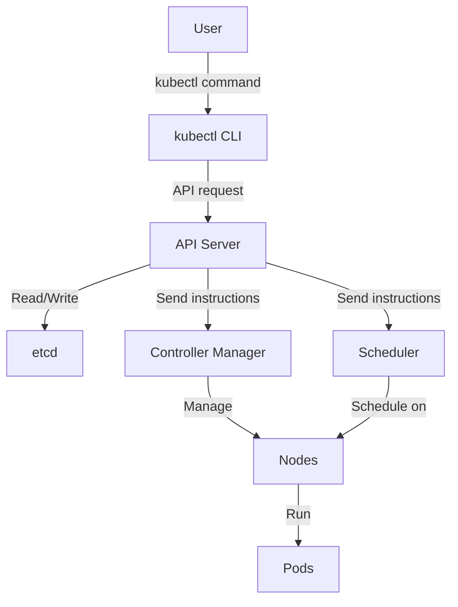

# Kubernetes kubectl

## Introduction

`kubectl` (pronounced "kube-control", "kube-C-T-L", or "kube-cuttle") is the command-line interface tool for Kubernetes. It allows you to run commands against Kubernetes clusters to deploy applications, inspect and manage cluster resources, and view logs. If you're working with Kubernetes, `kubectl` is your primary tool for interacting with the cluster.

Think of `kubectl` as your remote control for Kubernetes - it's how you communicate your intentions to the cluster and how you observe what's happening inside it. Whether you're deploying an application, scaling it up or down, or troubleshooting issues, `kubectl` is the tool you'll use most frequently.

## Prerequisites

Before diving into kubectl, you should:

- Have a basic understanding of containers and Kubernetes concepts
- Have a Kubernetes cluster running (local or remote)
- Have kubectl installed on your machine

## Installing kubectl

You can install kubectl on various operating systems:

### Linux

```bash
curl -LO "https://dl.k8s.io/release/$(curl -L -s https://dl.k8s.io/release/stable.txt)/bin/linux/amd64/kubectl"
chmod +x kubectl
sudo mv kubectl /usr/local/bin/
```

### macOS

Using Homebrew:

```bash
brew install kubectl
```

Or using curl:

```bash
curl -LO "https://dl.k8s.io/release/$(curl -L -s https://dl.k8s.io/release/stable.txt)/bin/darwin/amd64/kubectl"
chmod +x kubectl
sudo mv kubectl /usr/local/bin/
```

### Windows

Using Chocolatey:

```powershell
choco install kubernetes-cli
```

Or using curl:

```powershell
curl -LO "https://dl.k8s.io/release/v1.28.0/bin/windows/amd64/kubectl.exe"
```

Then add the binary to your PATH.

## Verifying Installation

After installation, verify that kubectl is correctly installed:

```bash
kubectl version --client
```

This should display the kubectl version:

```
Client Version: version.Info{Major:"1", Minor:"28", GitVersion:"v1.28.0", GitCommit:"855e7c48de7388eb330da0f8d9d2394ee818fb8d", GitTreeState:"clean", BuildDate:"2023-08-15T17:25:45Z", GoVersion:"go1.20.7", Compiler:"gc", Platform:"darwin/amd64"}
```

## Configuring kubectl

Before using kubectl, you need to configure it to communicate with your Kubernetes cluster. The configuration is stored in a file called `kubeconfig`, typically located at `~/.kube/config`.

### Setting Up Cluster Access

Most managed Kubernetes providers provide a command to configure kubectl:

- For Google Kubernetes Engine (GKE):
  ```bash
  gcloud container clusters get-credentials CLUSTER_NAME --region=REGION
  ```

- For Amazon EKS:
  ```bash
  aws eks update-kubeconfig --name CLUSTER_NAME --region REGION
  ```

- For Azure AKS:
  ```bash
  az aks get-credentials --resource-group RESOURCE_GROUP --name CLUSTER_NAME
  ```

For local development clusters like Minikube:

```bash
minikube start
```

## The Basic kubectl Syntax

The basic syntax for kubectl commands is:

```
kubectl [command] [TYPE] [NAME] [flags]
```

Where:
- `[command]` is the operation you want to perform (create, get, apply, delete)
- `[TYPE]` is the resource type (pods, deployments, services)
- `[NAME]` is the name of the resource (optional in some cases)
- `[flags]` are additional options specific to the command

## Common kubectl Commands

### Viewing Resources

#### Get information about resources:

```bash
# List all pods in the current namespace
kubectl get pods

# List all pods in all namespaces
kubectl get pods --all-namespaces

# Get detailed information about a specific pod
kubectl describe pod my-pod
```

Example output for `kubectl get pods`:

```
NAME                                  READY   STATUS    RESTARTS   AGE
nginx-deployment-66b6c48dd5-7xzsf     1/1     Running   0          4h
nginx-deployment-66b6c48dd5-vf9dj     1/1     Running   0          4h
```

#### Viewing logs:

```bash
# View logs for a pod
kubectl logs my-pod

# Follow logs (like tail -f)
kubectl logs -f my-pod

# View logs for a specific container in a multi-container pod
kubectl logs my-pod -c my-container
```

Example output for `kubectl logs`:

```
10.244.0.1 - - [15/Aug/2023:13:00:25 +0000] "GET / HTTP/1.1" 200 612 "-" "Mozilla/5.0 (Macintosh; Intel Mac OS X 10_15_7) AppleWebKit/537.36"
10.244.0.5 - - [15/Aug/2023:13:01:10 +0000] "GET / HTTP/1.1" 200 612 "-" "curl/7.68.0"
```

### Creating and Updating Resources

#### Creating resources:

```bash
# Create resources from a file
kubectl create -f my-manifest.yaml

# Create a deployment
kubectl create deployment nginx --image=nginx:latest

# Create a service
kubectl create service clusterip my-service --tcp=80:80
```

#### Applying changes:

```bash
# Apply a configuration file (create if not exists, update if exists)
kubectl apply -f my-manifest.yaml

# Apply multiple files
kubectl apply -f ./configs/
```

### Deleting Resources

```bash
# Delete a pod
kubectl delete pod my-pod

# Delete a deployment
kubectl delete deployment my-deployment

# Delete all resources defined in a file
kubectl delete -f my-manifest.yaml
```

### Interacting with Pods

```bash
# Execute a command in a pod
kubectl exec my-pod -- ls /app

# Start an interactive shell in a pod
kubectl exec -it my-pod -- /bin/bash

# Copy files to/from a pod
kubectl cp my-pod:/path/to/file ./local-file
kubectl cp ./local-file my-pod:/path/to/file
```

Example output for interactive shell:

```
root@my-pod:/# ls
bin  boot  dev  etc  home  lib  lib64  media  mnt  opt  proc  root  run  sbin  srv  sys  tmp  usr  var
```

## Working with Namespaces

Namespaces are a way to divide cluster resources between multiple users or teams.

```bash
# Create a namespace
kubectl create namespace my-namespace

# List all namespaces
kubectl get namespaces

# Set a default namespace for subsequent commands
kubectl config set-context --current --namespace=my-namespace

# Run a command in a specific namespace
kubectl get pods --namespace=my-namespace
```

## Explaining Resources with kubectl explain

The `kubectl explain` command is very useful for learning about Kubernetes resources:

```bash
# Get documentation about pods
kubectl explain pods

# Get documentation about pod spec
kubectl explain pods.spec

# Get documentation about pod containers
kubectl explain pods.spec.containers
```

Example output for `kubectl explain pods`:

```
KIND:     Pod
VERSION:  v1

DESCRIPTION:
     Pod is a collection of containers that can run on a host. This resource is
     created by clients and scheduled onto hosts.

FIELDS:
   apiVersion	<string>
     APIVersion defines the versioned schema of this representation of an
     object. Servers should convert recognized schemas to the latest internal
     value, and may reject unrecognized values. More info:
     https://git.k8s.io/community/contributors/devel/sig-architecture/api-conventions.md#resources

   kind	<string>
     Kind is a string value representing the REST resource this object
     represents. Servers may infer this from the endpoint the client submits
     requests to. Cannot be updated. In CamelCase. More info:
     https://git.k8s.io/community/contributors/devel/sig-architecture/api-conventions.md#types-kinds

   metadata	<Object>
     Standard object's metadata. More info:
     https://git.k8s.io/community/contributors/devel/sig-architecture/api-conventions.md#metadata

   spec	<Object>
     Specification of the desired behavior of the pod. More info:
     https://git.k8s.io/community/contributors/devel/sig-architecture/api-conventions.md#spec-and-status

   status	<Object>
     Most recently observed status of the pod. This data may not be up to date.
     Populated by the system. Read-only. More info:
     https://git.k8s.io/community/contributors/devel/sig-architecture/api-conventions.md#spec-and-status
```

## kubectl Output Formats

kubectl can output in different formats:

```bash
# Output in JSON format
kubectl get pods -o json

# Output in YAML format
kubectl get pods -o yaml

# Custom columns
kubectl get pods -o custom-columns=NAME:.metadata.name,STATUS:.status.phase

# Output just the pod names
kubectl get pods -o name
```

## Real-world Examples

### Deploying a Web Application

Let's deploy a simple web application:

```bash
# Create a deployment
kubectl create deployment web --image=nginx:latest

# Expose the deployment as a service
kubectl expose deployment web --port=80 --type=LoadBalancer

# Scale the deployment
kubectl scale deployment web --replicas=3

# Check the deployment status
kubectl get deployment web

# Check the pods
kubectl get pods -l app=web

# Check the service
kubectl get service web
```

Example output after running these commands:

```
NAME                 READY   UP-TO-DATE   AVAILABLE   AGE
deployment.apps/web  3/3     3            3           45s

NAME                      READY   STATUS    RESTARTS   AGE
pod/web-85d8b8b746-4z7vn  1/1     Running   0          45s
pod/web-85d8b8b746-5zv9x  1/1     Running   0          25s
pod/web-85d8b8b746-lsjkq  1/1     Running   0          25s

NAME             TYPE           CLUSTER-IP      EXTERNAL-IP      PORT(S)        AGE
service/web      LoadBalancer   10.100.67.143   35.224.233.123   80:32615/TCP   30s
```

### Rolling Update

Let's update our application to a new version:

```bash
# Update the image
kubectl set image deployment/web nginx=nginx:1.19

# Watch the rollout status
kubectl rollout status deployment/web

# If there's an issue, roll back
kubectl rollout undo deployment/web
```

### Debugging a Pod

If a pod is having issues:

```bash
# Check pod status
kubectl describe pod my-pod

# Check logs
kubectl logs my-pod

# Check previous container logs if it crashed
kubectl logs my-pod --previous

# Execute commands inside the pod
kubectl exec -it my-pod -- /bin/bash
```

## Useful kubectl Tricks

### Using kubectl aliases

You can create aliases for commonly used commands:

```bash
# Add to your ~/.bashrc or ~/.zshrc
alias k='kubectl'
alias kg='kubectl get'
alias kd='kubectl describe'
alias kgp='kubectl get pods'
alias kgd='kubectl get deployments'
```

### kubectl autocompletion

Enable autocompletion for kubectl:

```bash
# Bash
echo 'source <(kubectl completion bash)' >>~/.bashrc

# Zsh
echo 'source <(kubectl completion zsh)' >>~/.zshrc
```

### kubectl context and namespace

Work with multiple clusters:

```bash
# List contexts (clusters)
kubectl config get-contexts

# Switch context
kubectl config use-context my-cluster

# Set namespace for current context
kubectl config set-context --current --namespace=my-namespace
```

## Visualizing kubectl Operations

Here's a diagram showing how kubectl interacts with a Kubernetes cluster:



## Summary

In this guide, we've explored `kubectl`, the powerful command-line tool for interacting with Kubernetes clusters. We've covered:

- Installation and setup of kubectl
- Basic syntax and common commands
- Working with pods, deployments, and services
- Namespace management
- Output formatting options
- Real-world examples of deploying and managing applications
- Debugging techniques
- Productivity tips for working with kubectl

`kubectl` is your primary interface to Kubernetes, and mastering it is essential for effective Kubernetes management. As you become more comfortable with the basic commands, you'll discover more advanced functionality that will help you manage complex applications and troubleshoot issues efficiently.

## Practice Exercises

1. Set up a local Kubernetes cluster using Minikube or Kind
2. Deploy the NGINX web server and expose it as a service
3. Scale the deployment to 3 replicas
4. Check the logs of one of the pods
5. Update the NGINX version to a different tag
6. Roll back the update
7. Create a new namespace and deploy an application to it

## Additional Resources

- [Official Kubernetes Documentation on kubectl](https://kubernetes.io/docs/reference/kubectl/)
- [kubectl Cheat Sheet](https://kubernetes.io/docs/reference/kubectl/cheatsheet/)
- [kubectl Command Reference](https://kubernetes.io/docs/reference/generated/kubectl/kubectl-commands)
- [Kubernetes API Reference](https://kubernetes.io/docs/reference/generated/kubernetes-api/v1.28/)