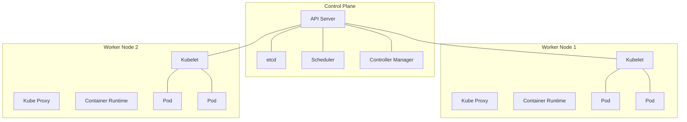
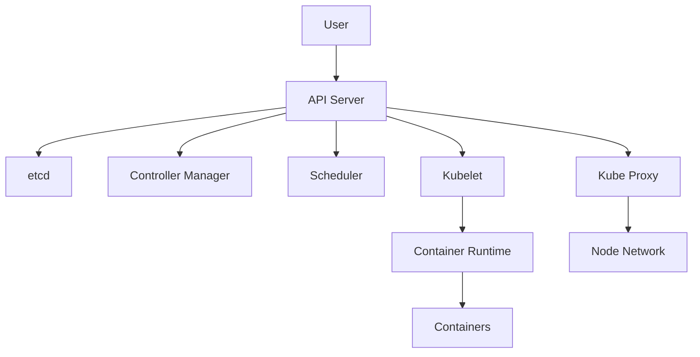

# Kubernetes Architecture

## Introduction

Kubernetes (often abbreviated as K8s) is an open-source container orchestration platform designed to automate the deployment, scaling, and management of containerized applications. Understanding its architecture is fundamental to working effectively with Kubernetes.

In this guide, we'll break down the Kubernetes architecture into its core components, explain how they interact, and provide practical examples to illustrate how these components work together in real-world scenarios.

## Kubernetes Architecture Overview

At a high level, Kubernetes follows a master-worker architecture pattern:

- **Control Plane** (formerly known as the master): Manages the Kubernetes cluster
- **Worker Nodes**: Run your applications

Let's visualize this basic architecture:



## Control Plane Components

The Control Plane is the brain of Kubernetes. It makes global decisions about the cluster and responds to cluster events. Let's explore each component:

### API Server

The API Server is the front end of the Kubernetes control plane, exposing the Kubernetes API. All communications within the cluster go through the API Server.

```bash
# Example of interacting with the API Server using kubectl
kubectl get pods
```

Output:
```
NAME                     READY   STATUS    RESTARTS   AGE
nginx-6799fc88d8-rc8zb   1/1     Running   0          10m
```

### etcd

etcd is a distributed key-value store that acts as Kubernetes' primary datastore, holding all cluster data. It's like the "source of truth" for your cluster.

### Scheduler

The Scheduler watches for newly created pods with no assigned node and selects a node for them to run on based on resource requirements, constraints, and other factors.

Example of scheduling in action:

```yaml
apiVersion: v1
kind: Pod
metadata:
  name: nginx
spec:
  containers:
  - name: nginx
    image: nginx:1.14.2
    resources:
      requests:
        memory: "64Mi"
        cpu: "250m"
      limits:
        memory: "128Mi"
        cpu: "500m"
  nodeSelector:
    disktype: ssd
```

In this example, the Scheduler will place this pod on a node with the label `disktype: ssd` and sufficient resources.

### Controller Manager

The Controller Manager runs controller processes that regulate the state of the cluster. Some examples include:

- **Node Controller**: Notices and responds when nodes go down
- **Replication Controller**: Maintains the correct number of pods
- **Endpoints Controller**: Populates the Endpoints object (joins Services & Pods)
- **Service Account & Token Controllers**: Create default accounts and API access tokens

Example of a controller in action:

```yaml
apiVersion: apps/v1
kind: Deployment
metadata:
  name: nginx-deployment
spec:
  replicas: 3
  selector:
    matchLabels:
      app: nginx
  template:
    metadata:
      labels:
        app: nginx
    spec:
      containers:
      - name: nginx
        image: nginx:1.14.2
        ports:
        - containerPort: 80
```

Here, the Deployment controller ensures that exactly 3 replicas of the nginx pod are running at all times.

## Worker Node Components

Worker nodes are the machines that run your applications. Each node includes several components:

### Kubelet

The Kubelet is an agent that runs on each node, ensuring containers are running in a Pod. It takes a set of PodSpecs and ensures the described containers are running and healthy.

### Kube Proxy

Kube Proxy is a network proxy that runs on each node, implementing part of the Kubernetes Service concept. It maintains network rules that allow communication to your Pods from inside or outside the cluster.

Example of a Service utilizing Kube Proxy:

```yaml
apiVersion: v1
kind: Service
metadata:
  name: nginx-service
spec:
  selector:
    app: nginx
  ports:
  - port: 80
    targetPort: 80
  type: LoadBalancer
```

This Service definition creates a load balancer that directs traffic to pods with the label `app: nginx`.

### Container Runtime

The Container Runtime is the software responsible for running containers. Kubernetes supports several container runtimes including Docker, containerd, CRI-O, and others.

## Additional Components

### DNS

Kubernetes has a built-in DNS server for service discovery:

```yaml
apiVersion: v1
kind: Pod
metadata:
  name: test-pod
spec:
  containers:
  - name: test-container
    image: busybox
    command: ['sh', '-c', 'wget -O- nginx-service']
```

This pod can reach the `nginx-service` using its name because of Kubernetes DNS.

### Web UI (Dashboard)

The Dashboard is a web-based Kubernetes user interface that allows you to manage and troubleshoot your cluster and applications.

## Kubernetes Objects

Kubernetes objects are persistent entities that represent the state of your cluster. Here are some key objects:

### Pods

A Pod is the smallest deployable unit in Kubernetes, representing a single instance of an application.

```yaml
apiVersion: v1
kind: Pod
metadata:
  name: simple-web-app
spec:
  containers:
  - name: web-app
    image: nginx:1.14.2
    ports:
    - containerPort: 80
```

### Deployments

Deployments provide declarative updates for Pods and ReplicaSets.

```yaml
apiVersion: apps/v1
kind: Deployment
metadata:
  name: web-deployment
spec:
  replicas: 3
  selector:
    matchLabels:
      app: web
  template:
    metadata:
      labels:
        app: web
    spec:
      containers:
      - name: web
        image: nginx:1.14.2
```

### Services

Services expose an application running on a set of Pods as a network service.

```yaml
apiVersion: v1
kind: Service
metadata:
  name: web-service
spec:
  selector:
    app: web
  ports:
  - port: 80
    targetPort: 80
  type: ClusterIP
```

## Real-World Example: Deploying a Multi-Tier Application

Let's see how these components work together by deploying a simple two-tier application (web frontend + database).

### Step 1: Create a Secret for Database Password

```yaml
apiVersion: v1
kind: Secret
metadata:
  name: mysql-secret
type: Opaque
data:
  mysql-password: cGFzc3dvcmQ= # "password" encoded in base64
```

### Step 2: Deploy the Database

```yaml
apiVersion: apps/v1
kind: Deployment
metadata:
  name: mysql-deployment
spec:
  replicas: 1
  selector:
    matchLabels:
      app: mysql
  template:
    metadata:
      labels:
        app: mysql
    spec:
      containers:
      - name: mysql
        image: mysql:5.7
        ports:
        - containerPort: 3306
        env:
        - name: MYSQL_ROOT_PASSWORD
          valueFrom:
            secretKeyRef:
              name: mysql-secret
              key: mysql-password
        volumeMounts:
        - name: mysql-data
          mountPath: /var/lib/mysql
      volumes:
      - name: mysql-data
        emptyDir: {}
---
apiVersion: v1
kind: Service
metadata:
  name: mysql-service
spec:
  selector:
    app: mysql
  ports:
  - port: 3306
  type: ClusterIP
```

### Step 3: Deploy the Web Frontend

```yaml
apiVersion: apps/v1
kind: Deployment
metadata:
  name: web-frontend
spec:
  replicas: 3
  selector:
    matchLabels:
      app: web-frontend
  template:
    metadata:
      labels:
        app: web-frontend
    spec:
      containers:
      - name: web-app
        image: my-web-app:1.0
        ports:
        - containerPort: 80
        env:
        - name: DB_HOST
          value: mysql-service
        - name: DB_PASSWORD
          valueFrom:
            secretKeyRef:
              name: mysql-secret
              key: mysql-password
---
apiVersion: v1
kind: Service
metadata:
  name: web-frontend-service
spec:
  selector:
    app: web-frontend
  ports:
  - port: 80
    targetPort: 80
  type: LoadBalancer
```

### How It All Works Together

Let's trace how the Kubernetes architecture handles this deployment:

1. You submit the YAML files using `kubectl apply -f <filename>`.
2. The API Server receives and validates these requests.
3. The validated objects are stored in etcd.
4. The Deployment Controller notices the new deployments and creates ReplicaSets.
5. The ReplicaSet Controller creates Pod objects.
6. The Scheduler assigns each Pod to a Node.
7. The Kubelet on each assigned Node creates the containers for its Pods.
8. Kube Proxy sets up networking rules for the Services.

When a user accesses the application:
1. Traffic comes in through the LoadBalancer.
2. Kube Proxy routes the traffic to one of the web frontend Pods.
3. The web frontend connects to the MySQL database using the internal service name "mysql-service".

## Communication Patterns

Understanding the communication flows in Kubernetes is crucial:



## Summary

Kubernetes architecture consists of two main parts:
- The Control Plane manages the cluster state through components like the API Server, etcd, Scheduler, and Controller Manager.
- Worker Nodes run your containerized applications using Kubelet, Kube Proxy, and a container runtime.

This architecture enables Kubernetes to provide features like:
- Self-healing
- Horizontal scaling
- Service discovery and load balancing
- Automated rollouts and rollbacks
- Secret and configuration management

Understanding how these components interact is fundamental to effectively deploying, managing, and troubleshooting applications in Kubernetes.

## Additional Resources

- [Official Kubernetes Documentation](https://kubernetes.io/docs/concepts/overview/components/)
- [Kubernetes the Hard Way](https://github.com/kelseyhightower/kubernetes-the-hard-way) - A tutorial for manually setting up Kubernetes to understand each component deeply
- Interactive learning environments like [Katacoda](https://www.katacoda.com/courses/kubernetes)

## Exercises

1. Set up a local Kubernetes cluster using minikube or kind.
2. Deploy the example two-tier application and observe how the components interact.
3. Deliberately "crash" a Pod and observe how Kubernetes self-heals.
4. Use `kubectl get events` to observe the scheduling and deployment process.
5. Try scaling a deployment up and down and observe how the Controller Manager handles it.