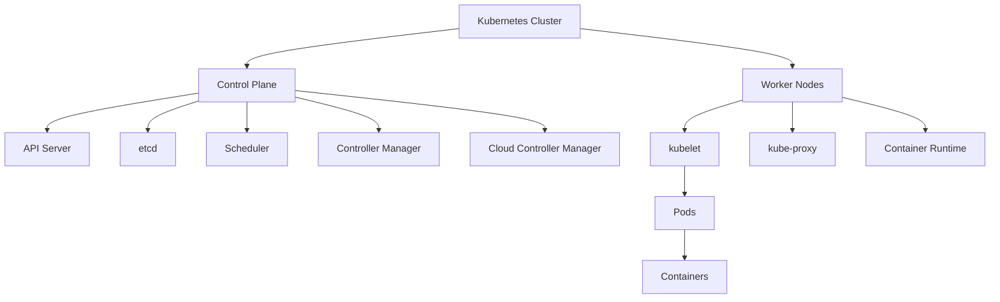

# Kubernetes Components

## Introduction

Kubernetes is a powerful container orchestration platform that automates the deployment, scaling, and management of containerized applications. At its core, Kubernetes is built from several distinct components that work together to create a resilient and scalable system.

In this guide, we'll explore the key components that make up a Kubernetes cluster. Understanding these components is essential for anyone looking to work with Kubernetes effectively, whether you're deploying applications or managing the infrastructure.

## Cluster Architecture Overview

Before diving into specific components, let's understand the high-level architecture of a Kubernetes cluster.



A Kubernetes cluster is divided into two main parts:

1. **Control Plane**: The brain of the cluster that manages and controls the entire system
2. **Worker Nodes**: The machines that run your containerized applications

Let's explore each component in detail.

## Control Plane Components

The control plane is responsible for global decisions about the cluster (such as scheduling) and detecting and responding to cluster events.

### API Server (kube-apiserver)

The API server is the front end of the Kubernetes control plane, exposing the Kubernetes API. It's the central management entity that receives all REST requests for modifications to the cluster.

**Key features:**
- Validates and configures data for API objects
- Services REST operations
- Provides the frontend to the cluster's shared state

**Example interaction with the API server:**

```bash
# Get information about all pods in the cluster
kubectl get pods --all-namespaces

# Output
NAMESPACE     NAME                                   READY   STATUS    RESTARTS   AGE
kube-system   coredns-66bff467f8-7wdvz               1/1     Running   0          24h
kube-system   etcd-master                            1/1     Running   0          24h
kube-system   kube-apiserver-master                  1/1     Running   0          24h
kube-system   kube-controller-manager-master         1/1     Running   0          24h
kube-system   kube-proxy-jx4vq                       1/1     Running   0          24h
kube-system   kube-scheduler-master                  1/1     Running   0          24h
```

### etcd

etcd is a consistent and highly-available key-value store used as Kubernetes' backing store for all cluster data.

**Key features:**
- Stores configuration data
- Represents the state of the cluster at any given point in time
- Implements locks to prevent conflicts in a distributed system

**Example etcd operation:**

```bash
# Accessing etcd directly (not typically needed in day-to-day operations)
ETCDCTL_API=3 etcdctl get / --prefix --keys-only

# Output might include
/registry/apiregistration.k8s.io/apiservices/v1.
/registry/apiregistration.k8s.io/apiservices/v1.apps
/registry/apiregistration.k8s.io/apiservices/v1.authentication.k8s.io
# ... many more keys
```

### Scheduler (kube-scheduler)

The scheduler watches for newly created Pods with no assigned node and selects a node for them to run on.

**Scheduling factors include:**
- Resource requirements
- Hardware/software/policy constraints
- Affinity/anti-affinity specifications
- Data locality
- Inter-workload interference

**Example of scheduler decision-making:**

```yaml
apiVersion: v1
kind: Pod
metadata:
  name: nginx
spec:
  containers:
  - name: nginx
    image: nginx:1.19
    resources:
      requests:
        memory: "64Mi"
        cpu: "250m"
      limits:
        memory: "128Mi"
        cpu: "500m"
  nodeSelector:
    disktype: ssd
```

In this example, the scheduler will only place this Pod on nodes with the label `disktype=ssd` and sufficient available CPU and memory resources.

### Controller Manager (kube-controller-manager)

The controller manager runs controller processes. Logically, each controller is a separate process, but they're compiled into a single binary and run in a single process to reduce complexity.

**Some controllers include:**
- Node controller: Notices and responds when nodes go down
- Job controller: Watches for Job objects and creates Pods to run tasks to completion
- Endpoints controller: Populates the Endpoints object (joins Services & Pods)
- Service Account & Token controllers: Create default accounts and API access tokens

### Cloud Controller Manager (cloud-controller-manager)

The cloud controller manager lets you link your cluster into your cloud provider's API. This component only runs controllers that are specific to your cloud provider.

**Cloud-specific controllers include:**
- Node controller: Checking the cloud provider to determine if a node has been deleted
- Route controller: Setting up routes in the cloud infrastructure
- Service controller: Creating, updating and deleting cloud provider load balancers

## Node Components

Node components run on every node, maintaining running pods and providing the Kubernetes runtime environment.

### kubelet

The kubelet is an agent that runs on each node in the cluster. It ensures that containers are running in a Pod.

**Key responsibilities:**
- Takes a set of PodSpecs provided through various mechanisms
- Ensures that the containers described in those PodSpecs are running and healthy
- Does not manage containers not created by Kubernetes

**Example of kubelet checking Pod health:**

```bash
# View kubelet logs
journalctl -u kubelet

# Sample output
Jul 07 15:42:36 worker-node kubelet[23371]: I0707 15:42:36.123456 23371 kubelet.go:1795] SyncLoop (PLEG): "nginx-pod_default(uid)", event: &pleg.PodLifecycleEvent{ID:"nginx-pod_default(uid)", Type:"ContainerStarted", Data:"container-id"}
```

### kube-proxy

kube-proxy is a network proxy that runs on each node in your cluster, implementing part of the Kubernetes Service concept.

**Key features:**
- Maintains network rules on nodes
- Enables network communication to your Pods from inside or outside of your cluster
- Uses the operating system packet filtering layer or forwards the traffic itself

**Example of how kube-proxy works:**

When you create a Service with `type: LoadBalancer`, kube-proxy sets up the appropriate rules so that traffic is directed to the correct backends:

```yaml
apiVersion: v1
kind: Service
metadata:
  name: my-app
spec:
  selector:
    app: my-app
  ports:
  - port: 80
    targetPort: 8080
  type: LoadBalancer
```

Behind the scenes, kube-proxy might create iptables or IPVS rules to route traffic from the service IP to the pod IPs.

### Container Runtime

The container runtime is the software responsible for running containers. Kubernetes supports several container runtimes: Docker, containerd, CRI-O, and any implementation of the Kubernetes CRI (Container Runtime Interface).

**Common container runtimes:**
- containerd
- CRI-O
- Docker Engine (via cri-dockerd)

**Example checking the container runtime:**

```bash
# Check which container runtime is being used
kubectl get nodes -o wide

# Sample output
NAME          STATUS   ROLES    AGE   VERSION   INTERNAL-IP    EXTERNAL-IP   OS-IMAGE             KERNEL-VERSION     CONTAINER-RUNTIME
master        Ready    master   24h   v1.23.0   192.168.1.10   <none>        Ubuntu 20.04.3 LTS   5.4.0-88-generic   containerd://1.5.2
worker-1      Ready    <none>   24h   v1.23.0   192.168.1.11   <none>        Ubuntu 20.04.3 LTS   5.4.0-88-generic   containerd://1.5.2
```

## Addon Components

Addons use Kubernetes resources to implement cluster features. Since these provide cluster-level features, addon resources belong in the `kube-system` namespace.

### DNS

Cluster DNS is a DNS server that serves DNS records for Kubernetes services.

**Key features:**
- Containers started by Kubernetes automatically include this DNS server in their DNS searches
- Provides service discovery within the cluster

**Example DNS usage:**

If you have a service named `my-service` in the `my-namespace` namespace, pods in the same namespace can access it simply as `my-service`, while pods in other namespaces need to use the fully qualified domain name (FQDN) `my-service.my-namespace.svc.cluster.local`.

```bash
# From a pod in the same namespace
curl my-service

# From a pod in a different namespace
curl my-service.my-namespace.svc.cluster.local
```

### Dashboard

Dashboard is a general-purpose, web-based UI for Kubernetes clusters. It allows users to manage and troubleshoot applications running in the cluster, as well as the cluster itself.

### Container Resource Monitoring

Container Resource Monitoring records generic time-series metrics about containers in a central database and provides a UI for browsing that data.

Common solutions include:
- Prometheus and Grafana
- Datadog
- Dynatrace

### Cluster-level Logging

A cluster-level logging mechanism is responsible for saving container logs to a central log store with search/browsing interface.

Popular options include:
- Elasticsearch and Kibana (ELK stack)
- Loki with Grafana
- Fluentd with various backends

## Practical Application: Deploying a Simple Application

Let's see how these components work together by deploying a simple web application:

```yaml
# deployment.yaml
apiVersion: apps/v1
kind: Deployment
metadata:
  name: simple-webapp
spec:
  replicas: 3
  selector:
    matchLabels:
      app: webapp
  template:
    metadata:
      labels:
        app: webapp
    spec:
      containers:
      - name: webapp
        image: nginx:1.19
        ports:
        - containerPort: 80
---
# service.yaml
apiVersion: v1
kind: Service
metadata:
  name: webapp-service
spec:
  selector:
    app: webapp
  ports:
  - port: 80
    targetPort: 80
  type: LoadBalancer
```

When you apply these resources:

1. **API Server** receives the request and validates it
2. **etcd** stores the desired state
3. **Controller Manager** notices the Deployment doesn't exist yet and creates it
4. **Scheduler** assigns the Pods to nodes
5. **kubelet** on each selected node creates the Pod
6. **Container Runtime** pulls and runs the containers
7. **kube-proxy** sets up networking rules for the Service
8. **DNS Addon** registers the service name
9. **Metrics Server** begins collecting performance data

```bash
# Apply the configuration
kubectl apply -f deployment.yaml -f service.yaml

# Check deployment status
kubectl get deployments
NAME            READY   UP-TO-DATE   AVAILABLE   AGE
simple-webapp   3/3     3            3           45s

# Check service
kubectl get services
NAME             TYPE           CLUSTER-IP      EXTERNAL-IP    PORT(S)        AGE
kubernetes       ClusterIP      10.96.0.1       <none>         443/TCP        24h
webapp-service   LoadBalancer   10.107.15.192   192.168.1.50   80:30007/TCP   42s
```

## Summary

In this guide, we've explored the core components that make up a Kubernetes cluster:

- **Control Plane Components**: API Server, etcd, Scheduler, Controller Manager, and Cloud Controller Manager
- **Node Components**: kubelet, kube-proxy, and Container Runtime
- **Addon Components**: DNS, Dashboard, Monitoring, and Logging

Understanding these components and how they interact is fundamental to working with Kubernetes effectively. Each component has a specific role in maintaining the desired state of your applications and ensuring they run reliably.

## Additional Resources

To deepen your understanding of Kubernetes components:

1. Practice with minikube or kind to set up a local Kubernetes cluster
2. Explore the Kubernetes official documentation
3. Try the Kubernetes interactive tutorials at Kubernetes.io

## Exercises

1. Set up a local Kubernetes cluster using minikube and identify where each of the components runs.
2. Deploy the sample application from this guide and observe how the different components interact.
3. Deliberately cause a pod to fail and observe how Kubernetes components work to restore the desired state.
4. Use `kubectl get componentstatuses` to check the health of control plane components.
5. Research and implement a basic monitoring solution for your Kubernetes cluster to observe resource usage.

By mastering these components, you'll be well on your way to becoming proficient with Kubernetes and ready to tackle more advanced topics!