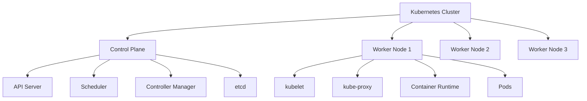

# Kubernetes Terminology

## Introduction

Kubernetes (often abbreviated as K8s) is a powerful container orchestration platform that has revolutionized how applications are deployed and managed in cloud environments. However, for newcomers, the extensive terminology used in the Kubernetes ecosystem can be overwhelming. This guide aims to demystify the essential Kubernetes terms, providing clear explanations and practical examples to help you build a solid foundation for your Kubernetes journey.

## Core Concepts

### Containers and Pods

#### Containers

Containers are lightweight, standalone, executable software packages that include everything needed to run an application: code, runtime, system tools, libraries, and settings.

```bash
# Example of running a container using Docker
docker run nginx
```

#### Pods

A Pod is the smallest deployable unit in Kubernetes, representing a single instance of a running process in your cluster. Pods can contain one or more containers that share storage, network, and specifications on how to run.

```yaml
# Simple Pod definition
apiVersion: v1
kind: Pod
metadata:
  name: nginx-pod
spec:
  containers:
  - name: nginx
    image: nginx:1.19
    ports:
    - containerPort: 80
```

When you apply this YAML file:

```bash
kubectl apply -f nginx-pod.yaml
```

You can then verify the pod is running:

```bash
kubectl get pods
# Expected output:
# NAME        READY   STATUS    RESTARTS   AGE
# nginx-pod   1/1     Running   0          10s
```

### Nodes and Clusters

#### Node

A Node is a worker machine in Kubernetes, either a physical computer or a virtual machine, where containers are deployed.

#### Cluster

A Cluster is a set of Nodes that run containerized applications. Kubernetes clusters allow containers to run across multiple machines and environments.



### Control Plane Components

#### API Server

The API server is the front end of the Kubernetes control plane, exposing the Kubernetes API that all components communicate through.

#### etcd

etcd is a consistent and highly-available key-value store used as Kubernetes' backing store for all cluster data.

#### Scheduler

The scheduler watches for newly created Pods with no assigned Node and selects a Node for them to run on.

#### Controller Manager

The controller manager runs controller processes that regulate the state of the system, such as node controller, job controller, and more.

### Workload Resources

#### Deployment

A Deployment provides declarative updates for Pods and ReplicaSets, allowing you to describe an application's life cycle.

```yaml
# Example Deployment
apiVersion: apps/v1
kind: Deployment
metadata:
  name: nginx-deployment
spec:
  replicas: 3
  selector:
    matchLabels:
      app: nginx
  template:
    metadata:
      labels:
        app: nginx
    spec:
      containers:
      - name: nginx
        image: nginx:1.19
        ports:
        - containerPort: 80
```

When you apply this deployment:

```bash
kubectl apply -f nginx-deployment.yaml
```

You can check the created resources:

```bash
kubectl get deployments
# Expected output:
# NAME               READY   UP-TO-DATE   AVAILABLE   AGE
# nginx-deployment   3/3     3            3           10s

kubectl get pods
# Expected output:
# NAME                                READY   STATUS    RESTARTS   AGE
# nginx-deployment-7df78b67f9-8m2vz   1/1     Running   0          10s
# nginx-deployment-7df78b67f9-d2rkt   1/1     Running   0          10s
# nginx-deployment-7df78b67f9-xv7hk   1/1     Running   0          10s
```

#### ReplicaSet

A ReplicaSet ensures that a specified number of Pod replicas are running at any given time. Though you rarely create ReplicaSets directly, as Deployments manage them for you.

#### StatefulSet

StatefulSets are used for applications that require stable, unique network identifiers, stable persistent storage, and ordered deployment and scaling.

```yaml
# Simple StatefulSet example
apiVersion: apps/v1
kind: StatefulSet
metadata:
  name: web
spec:
  serviceName: "nginx"
  replicas: 2
  selector:
    matchLabels:
      app: nginx
  template:
    metadata:
      labels:
        app: nginx
    spec:
      containers:
      - name: nginx
        image: nginx:1.19
        ports:
        - containerPort: 80
          name: web
        volumeMounts:
        - name: www
          mountPath: /usr/share/nginx/html
  volumeClaimTemplates:
  - metadata:
      name: www
    spec:
      accessModes: [ "ReadWriteOnce" ]
      resources:
        requests:
          storage: 1Gi
```

#### DaemonSet

A DaemonSet ensures that all (or some) Nodes run a copy of a Pod, typically used for node monitoring or logging.

#### Job and CronJob

A Job creates one or more Pods and ensures a specified number of them successfully terminate. CronJobs create Jobs on a repeating schedule.

```yaml
# CronJob example
apiVersion: batch/v1
kind: CronJob
metadata:
  name: hello
spec:
  schedule: "*/1 * * * *"
  jobTemplate:
    spec:
      template:
        spec:
          containers:
          - name: hello
            image: busybox
            args:
            - /bin/sh
            - -c
            - date; echo Hello from Kubernetes
          restartPolicy: OnFailure
```

### Services and Networking

#### Service

A Service is an abstraction that defines a logical set of Pods and a policy to access them. Services enable communication between different parts of an application.

```yaml
# Service example
apiVersion: v1
kind: Service
metadata:
  name: nginx-service
spec:
  selector:
    app: nginx
  ports:
  - port: 80
    targetPort: 80
  type: ClusterIP
```

After applying:

```bash
kubectl apply -f nginx-service.yaml
kubectl get services
# Expected output:
# NAME            TYPE        CLUSTER-IP       EXTERNAL-IP   PORT(S)   AGE
# kubernetes      ClusterIP   10.96.0.1        <none>        443/TCP   1d
# nginx-service   ClusterIP   10.110.234.123   <none>        80/TCP    10s
```

#### Service Types

- **ClusterIP**: Exposes the Service on an internal IP (default)
- **NodePort**: Exposes the Service on each Node's IP at a static port
- **LoadBalancer**: Exposes the Service externally using a cloud provider's load balancer
- **ExternalName**: Maps the Service to a DNS name

#### Ingress

An Ingress is an API object that manages external access to services in a cluster, typically HTTP, providing routing rules.

```yaml
# Ingress example
apiVersion: networking.k8s.io/v1
kind: Ingress
metadata:
  name: minimal-ingress
spec:
  rules:
  - host: example.com
    http:
      paths:
      - path: /
        pathType: Prefix
        backend:
          service:
            name: nginx-service
            port:
              number: 80
```

### Configuration and Storage

#### ConfigMap

A ConfigMap allows you to decouple configuration from pod specifications, storing non-confidential data in key-value pairs.

```yaml
# ConfigMap example
apiVersion: v1
kind: ConfigMap
metadata:
  name: app-config
data:
  app.properties: |
    color=blue
    textmode=true
  ui.properties: |
    color.good=green
    color.bad=red
```

Using the ConfigMap in a Pod:

```yaml
apiVersion: v1
kind: Pod
metadata:
  name: config-test-pod
spec:
  containers:
  - name: test-container
    image: busybox
    command: [ "/bin/sh", "-c", "cat /config/app.properties" ]
    volumeMounts:
    - name: config-volume
      mountPath: /config
  volumes:
  - name: config-volume
    configMap:
      name: app-config
  restartPolicy: Never
```

#### Secret

A Secret is similar to a ConfigMap but designed to hold confidential data like passwords or API keys.

```yaml
# Creating a Secret
apiVersion: v1
kind: Secret
metadata:
  name: db-credentials
type: Opaque
data:
  username: YWRtaW4=  # base64 encoded "admin"
  password: cGFzc3dvcmQ=  # base64 encoded "password"
```

#### PersistentVolume and PersistentVolumeClaim

PersistentVolumes (PVs) are storage resources provisioned by administrators. PersistentVolumeClaims (PVCs) are requests for storage by users.

```yaml
# PersistentVolume example
apiVersion: v1
kind: PersistentVolume
metadata:
  name: pv-storage
spec:
  capacity:
    storage: 10Gi
  accessModes:
    - ReadWriteOnce
  hostPath:
    path: "/mnt/data"
```

```yaml
# PersistentVolumeClaim example
apiVersion: v1
kind: PersistentVolumeClaim
metadata:
  name: pvc-claim
spec:
  accessModes:
    - ReadWriteOnce
  resources:
    requests:
      storage: 3Gi
```

Using the PVC in a Pod:

```yaml
apiVersion: v1
kind: Pod
metadata:
  name: pvc-pod
spec:
  containers:
  - name: test-container
    image: nginx
    volumeMounts:
    - mountPath: "/usr/share/nginx/html"
      name: pv-storage
  volumes:
  - name: pv-storage
    persistentVolumeClaim:
      claimName: pvc-claim
```

### RBAC and Security

#### Role and RoleBinding

Role-Based Access Control (RBAC) allows you to control who can do what in your cluster. Roles define permissions, and RoleBindings grant those permissions to users.

```yaml
# Role example
apiVersion: rbac.authorization.k8s.io/v1
kind: Role
metadata:
  namespace: default
  name: pod-reader
rules:
- apiGroups: [""]
  resources: ["pods"]
  verbs: ["get", "watch", "list"]
```

```yaml
# RoleBinding example
apiVersion: rbac.authorization.k8s.io/v1
kind: RoleBinding
metadata:
  name: read-pods
  namespace: default
subjects:
- kind: User
  name: jane
  apiGroup: rbac.authorization.k8s.io
roleRef:
  kind: Role
  name: pod-reader
  apiGroup: rbac.authorization.k8s.io
```

#### ServiceAccount

A ServiceAccount provides an identity for processes that run in a Pod.

```yaml
# ServiceAccount example
apiVersion: v1
kind: ServiceAccount
metadata:
  name: app-service-account
```

Using the ServiceAccount in a Pod:

```yaml
apiVersion: v1
kind: Pod
metadata:
  name: sa-pod
spec:
  serviceAccountName: app-service-account
  containers:
  - name: nginx
    image: nginx:1.19
```

## Kubernetes Ecosystem

### Helm

Helm is a package manager for Kubernetes that allows you to define, install, and upgrade even the most complex Kubernetes applications.

```bash
# Installing a chart with Helm
helm install my-release bitnami/nginx
```

### Operators

Operators are software extensions to Kubernetes that make use of custom resources to manage applications and their components.

## Practical Examples

### Deploying a Multi-Tier Web Application

This example demonstrates how to deploy a web application with a frontend, backend, and database using Kubernetes resources.

```yaml
# Database Deployment
apiVersion: apps/v1
kind: Deployment
metadata:
  name: postgres
spec:
  selector:
    matchLabels:
      app: postgres
  template:
    metadata:
      labels:
        app: postgres
    spec:
      containers:
      - name: postgres
        image: postgres:13
        env:
        - name: POSTGRES_PASSWORD
          valueFrom:
            secretKeyRef:
              name: db-secret
              key: password
        ports:
        - containerPort: 5432
---
# Database Service
apiVersion: v1
kind: Service
metadata:
  name: postgres
spec:
  selector:
    app: postgres
  ports:
  - port: 5432
---
# Backend Deployment
apiVersion: apps/v1
kind: Deployment
metadata:
  name: backend
spec:
  replicas: 3
  selector:
    matchLabels:
      app: backend
  template:
    metadata:
      labels:
        app: backend
    spec:
      containers:
      - name: backend
        image: myapp/backend:v1
        env:
        - name: DB_HOST
          value: postgres
        ports:
        - containerPort: 8080
---
# Backend Service
apiVersion: v1
kind: Service
metadata:
  name: backend
spec:
  selector:
    app: backend
  ports:
  - port: 80
    targetPort: 8080
---
# Frontend Deployment
apiVersion: apps/v1
kind: Deployment
metadata:
  name: frontend
spec:
  replicas: 3
  selector:
    matchLabels:
      app: frontend
  template:
    metadata:
      labels:
        app: frontend
    spec:
      containers:
      - name: frontend
        image: myapp/frontend:v1
        env:
        - name: BACKEND_URL
          value: http://backend
        ports:
        - containerPort: 80
---
# Frontend Service
apiVersion: v1
kind: Service
metadata:
  name: frontend
spec:
  selector:
    app: frontend
  ports:
  - port: 80
  type: LoadBalancer
```

### Implementing Auto-Scaling

This example shows how to implement horizontal pod autoscaling based on CPU utilization.

```yaml
# Deployment with resource requests
apiVersion: apps/v1
kind: Deployment
metadata:
  name: php-apache
spec:
  selector:
    matchLabels:
      run: php-apache
  replicas: 1
  template:
    metadata:
      labels:
        run: php-apache
    spec:
      containers:
      - name: php-apache
        image: k8s.gcr.io/hpa-example
        ports:
        - containerPort: 80
        resources:
          limits:
            cpu: 500m
          requests:
            cpu: 200m
---
# Service
apiVersion: v1
kind: Service
metadata:
  name: php-apache
spec:
  ports:
  - port: 80
  selector:
    run: php-apache
---
# HorizontalPodAutoscaler
apiVersion: autoscaling/v2
kind: HorizontalPodAutoscaler
metadata:
  name: php-apache
spec:
  scaleTargetRef:
    apiVersion: apps/v1
    kind: Deployment
    name: php-apache
  minReplicas: 1
  maxReplicas: 10
  metrics:
  - type: Resource
    resource:
      name: cpu
      target:
        type: Utilization
        averageUtilization: 50
```

To test this autoscaler, you can generate load with:

```bash
kubectl run -i --tty load-generator --rm --image=busybox --restart=Never -- /bin/sh -c "while sleep 0.01; do wget -q -O- http://php-apache; done"
```

## Summary

Kubernetes provides a robust ecosystem of terminology and resources for container orchestration. This guide covered the essential concepts:

1. **Core Concepts**: Containers, Pods, Nodes, and Clusters
2. **Control Plane Components**: API Server, etcd, Scheduler, and Controller Manager
3. **Workload Resources**: Deployments, ReplicaSets, StatefulSets, DaemonSets, and Jobs
4. **Services and Networking**: Services, Ingress, and Network Policies
5. **Configuration and Storage**: ConfigMaps, Secrets, and Persistent Volumes
6. **RBAC and Security**: Roles, RoleBindings, and ServiceAccounts

Understanding these terms is crucial for effectively working with Kubernetes and building scalable, resilient applications.

## Additional Resources

- Practice by setting up a local Kubernetes cluster using Minikube or Kind
- Try the interactive tutorials on the Kubernetes website
- Experiment with sample applications to reinforce your understanding
- Use `kubectl explain` to learn more about resource definitions

```bash
# Example of using kubectl explain
kubectl explain deployment
kubectl explain deployment.spec
kubectl explain deployment.spec.template
```

By mastering these Kubernetes terms and concepts, you'll be well-equipped to design, deploy, and manage containerized applications in a Kubernetes environment.