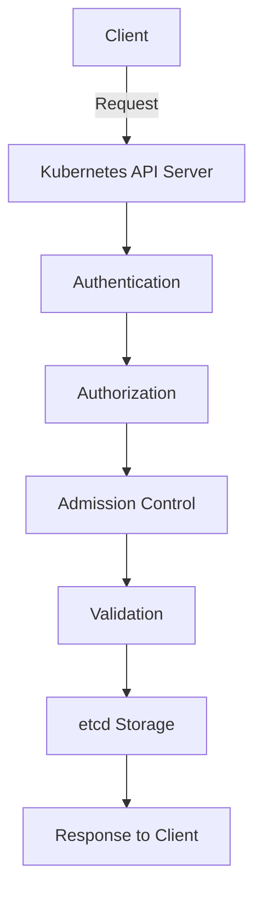

# Kubernetes API

## Introduction

The Kubernetes API is the core of Kubernetes and serves as the foundation for all operations within a Kubernetes cluster. It's a RESTful API that allows you to create, read, update, and delete Kubernetes resources (like pods, services, and deployments) programmatically. When you use tools like `kubectl` or a dashboard, you're actually interacting with the Kubernetes API behind the scenes.

In this guide, we'll explore how the Kubernetes API works, how to interact with it, and see some practical examples that will help you understand its importance in the Kubernetes ecosystem.

## Understanding the Kubernetes API

### What is the Kubernetes API?

The Kubernetes API is an HTTP-based interface that provides endpoints for:

- Creating resources (pods, deployments, services, etc.)
- Reading the state of resources
- Updating resources
- Deleting resources
- Watching for changes to resources

All operations in a Kubernetes cluster, whether performed through the command line, a GUI, or programmatically, ultimately go through this API.

### API Structure

The Kubernetes API is organized into:

1. **API Groups**: Collections of related resources (e.g., `apps`, `batch`, `networking.k8s.io`)
2. **Versions**: Each API group has multiple versions (e.g., `v1`, `v1beta1`)
3. **Resources**: The actual objects you can create and manage (pods, services, etc.)

An API path generally follows this structure:
`/apis/{GROUP}/{VERSION}/namespaces/{NAMESPACE}/{RESOURCE}`

For core resources (like pods and services), the path is slightly different:
`/api/v1/namespaces/{NAMESPACE}/{RESOURCE}`

### Key Components of the API



1. **API Server**: The component that serves the API
2. **Authentication**: Verifies who's making the request
3. **Authorization**: Checks if the authenticated user has permission
4. **Admission Controllers**: Optional plugins that can modify or validate requests
5. **Resource Validation**: Ensures requests are well-formed
6. **etcd**: The database where all cluster state is stored

## Interacting with the Kubernetes API

There are several ways to interact with the Kubernetes API:

### 1. Using kubectl

The most common way to interact with the Kubernetes API is through the `kubectl` command-line tool.

#### Example: Creating a Pod using kubectl

```bash
kubectl create -f pod.yaml
```

Where `pod.yaml` contains:

```yaml
apiVersion: v1
kind: Pod
metadata:
  name: nginx-pod
  namespace: default
spec:
  containers:
  - name: nginx
    image: nginx:latest
    ports:
    - containerPort: 80
```

#### Example: Getting information about Pods

```bash
kubectl get pods
```

Output:
```
NAME        READY   STATUS    RESTARTS   AGE
nginx-pod   1/1     Running   0          45s
```

### 2. Direct HTTP Requests

You can also interact with the API directly using HTTP requests:

#### Example: Getting a Pod with curl

First, set up proxy access to the API:

```bash
kubectl proxy
```

Then, in another terminal:

```bash
curl http://localhost:8001/api/v1/namespaces/default/pods/nginx-pod
```

Output (truncated for brevity):
```json
{
  "kind": "Pod",
  "apiVersion": "v1",
  "metadata": {
    "name": "nginx-pod",
    "namespace": "default",
    "uid": "1a2b3c4d-5e6f-7g8h-9i0j-1k2l3m4n5o6p",
    "creationTimestamp": "2023-01-01T12:00:00Z"
  },
  "spec": {
    "containers": [
      {
        "name": "nginx",
        "image": "nginx:latest",
        "ports": [
          {
            "containerPort": 80
          }
        ]
      }
    ]
  },
  "status": {
    "phase": "Running",
    "conditions": [
      {
        "type": "Ready",
        "status": "True"
      }
    ]
  }
}
```

### 3. Client Libraries

For programmatic access, Kubernetes provides client libraries in various languages.

#### Example: Using the official Go client

```go
package main

import (
	"context"
	"fmt"
	"os"
	"path/filepath"

	metav1 "k8s.io/apimachinery/pkg/apis/meta/v1"
	"k8s.io/client-go/kubernetes"
	"k8s.io/client-go/tools/clientcmd"
)

func main() {
	// Use the current context in kubeconfig
	kubeconfig := filepath.Join(os.Getenv("HOME"), ".kube", "config")
	config, err := clientcmd.BuildConfigFromFlags("", kubeconfig)
	if err != nil {
		panic(err.Error())
	}

	// Create the clientset
	clientset, err := kubernetes.NewForConfig(config)
	if err != nil {
		panic(err.Error())
	}

	// Get pods in the default namespace
	pods, err := clientset.CoreV1().Pods("default").List(context.TODO(), metav1.ListOptions{})
	if err != nil {
		panic(err.Error())
	}
	
	fmt.Printf("There are %d pods in the default namespace
", len(pods.Items))
	
	for _, pod := range pods.Items {
		fmt.Printf("Pod name: %s
", pod.Name)
	}
}
```

#### Example: Using the Python client

```python
from kubernetes import client, config

# Load kube config
config.load_kube_config()

# Create a client
v1 = client.CoreV1Api()

# List pods in the default namespace
print("Listing pods in default namespace:")
pods = v1.list_namespaced_pod(namespace="default")

for pod in pods.items:
    print(f"Pod name: {pod.metadata.name}")
```

## Understanding API Resources and Versions

### API Resources

Kubernetes resources are the objects you create and manage in your cluster. Common resources include:

- **Pods**: The smallest deployable units
- **Services**: Provides network access to a set of pods
- **Deployments**: Manages pod replicas and updates
- **ConfigMaps**: Configuration data for applications
- **Secrets**: Sensitive configuration data
- **Namespaces**: Logical partitions within a cluster

### API Versions

Kubernetes uses API versions to indicate the stability and support level:

- **Alpha (v1alpha1)**: May be buggy, disabled by default, support may be dropped
- **Beta (v1beta1)**: Well-tested, enabled by default, details may change
- **Stable (v1)**: Will be supported for many versions

You can see available API resources with:

```bash
kubectl api-resources
```

Output (partial):
```
NAME                   SHORTNAMES   APIVERSION            NAMESPACED   KIND
bindings                           v1                    true         Binding
configmaps             cm          v1                    true         ConfigMap
endpoints              ep          v1                    true         Endpoints
pods                   po          v1                    true         Pod
services               svc         v1                    true         Service
deployments            deploy      apps/v1               true         Deployment
daemonsets             ds          apps/v1               true         DaemonSet
```

## Practical Applications

### Example 1: Watching for Changes

One powerful feature of the Kubernetes API is the ability to "watch" resources for changes:

```bash
kubectl get pods --watch
```

This command doesn't exit after listing pods but continues running and updates you when pods change state.

In code, you can do this with:

```python
from kubernetes import client, config, watch

config.load_kube_config()
v1 = client.CoreV1Api()
w = watch.Watch()

for event in w.stream(v1.list_namespaced_pod, namespace="default"):
    print(f"Event: {event['type']}, Pod: {event['object'].metadata.name}")
```

### Example 2: Creating Custom Resources with the API

Kubernetes allows you to extend the API with Custom Resource Definitions (CRDs):

First, define a CRD:

```yaml
apiVersion: apiextensions.k8s.io/v1
kind: CustomResourceDefinition
metadata:
  name: websites.example.com
spec:
  group: example.com
  versions:
    - name: v1
      served: true
      storage: true
      schema:
        openAPIV3Schema:
          type: object
          properties:
            spec:
              type: object
              properties:
                url:
                  type: string
                replicas:
                  type: integer
  scope: Namespaced
  names:
    plural: websites
    singular: website
    kind: Website
    shortNames:
    - ws
```

Apply it:

```bash
kubectl apply -f website-crd.yaml
```

Now you can create instances of your custom resource:

```yaml
apiVersion: example.com/v1
kind: Website
metadata:
  name: my-website
spec:
  url: "https://example.com"
  replicas: 3
```

Save as `my-website.yaml` and apply:

```bash
kubectl apply -f my-website.yaml
```

This demonstrates how the API can be extended for custom use cases.

### Example 3: Using API for Rolling Updates

The API enables sophisticated operations like rolling updates:

```bash
kubectl set image deployment/nginx-deployment nginx=nginx:1.16.1 --record
```

Behind the scenes, this:
1. Creates new pods with the updated image
2. Waits for them to be ready
3. Gradually terminates old pods
4. All orchestrated through the API

## API Security

Security for the Kubernetes API involves several layers:

1. **TLS**: Communication with the API is encrypted using TLS
2. **Authentication**: Determining who is making the request
   - X.509 certificates
   - Bearer tokens
   - OpenID Connect
   - Webhook authentication
3. **Authorization**: Determining if the authenticated user can perform the requested operation
   - Role-Based Access Control (RBAC)
   - Attribute-Based Access Control (ABAC)
   - Node authorization
   - Webhook authorization

### RBAC Example

Here's a simple RBAC configuration that allows reading pods:

```yaml
kind: Role
apiVersion: rbac.authorization.k8s.io/v1
metadata:
  namespace: default
  name: pod-reader
rules:
- apiGroups: [""]
  resources: ["pods"]
  verbs: ["get", "watch", "list"]
---
kind: RoleBinding
apiVersion: rbac.authorization.k8s.io/v1
metadata:
  name: read-pods
  namespace: default
subjects:
- kind: User
  name: jane
  apiGroup: rbac.authorization.k8s.io
roleRef:
  kind: Role
  name: pod-reader
  apiGroup: rbac.authorization.k8s.io
```

Apply with:

```bash
kubectl apply -f rbac-example.yaml
```

## Summary

The Kubernetes API is the foundation of everything you do with Kubernetes. It provides a consistent interface for creating, reading, updating, and deleting resources in a Kubernetes cluster. Key points to remember:

- The API follows REST principles with resources organized into groups and versions
- Multiple ways to interact with the API exist: kubectl, direct HTTP, client libraries
- The API can be extended with Custom Resource Definitions
- Security is implemented through TLS, authentication, and authorization

Understanding the Kubernetes API gives you a deeper knowledge of how Kubernetes works and enables you to build more advanced applications and automation.

## Exercises

1. Use `kubectl` to list all available API resources in your cluster
2. Create a simple Pod using a YAML file
3. Try using `kubectl proxy` and then access the API directly with curl
4. Implement a simple Go or Python program that lists pods using the client libraries
5. Create a Custom Resource Definition and an instance of that resource

## Additional Resources

- [Kubernetes API Overview](https://kubernetes.io/docs/concepts/overview/kubernetes-api/)
- [Kubernetes API Reference](https://kubernetes.io/docs/reference/generated/kubernetes-api/v1.28/)
- [Extending the Kubernetes API](https://kubernetes.io/docs/concepts/extend-kubernetes/api-extension/custom-resources/)
- [Client Libraries](https://kubernetes.io/docs/reference/using-api/client-libraries/)
- [RBAC Documentation](https://kubernetes.io/docs/reference/access-authn-authz/rbac/)