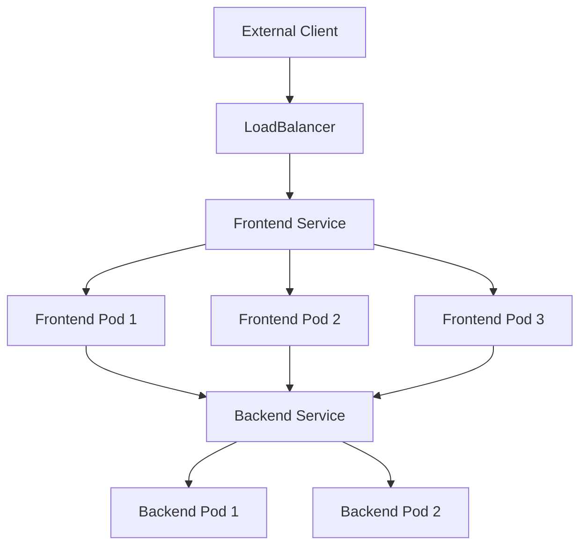

# Kubernetes Objects

## Introduction

In Kubernetes, **objects** are persistent entities that represent the state of your cluster. These objects describe:

- What containerized applications are running (and on which nodes)
- The resources available to those applications
- The policies around how those applications behave (restart policies, upgrades, fault-tolerance)

Each Kubernetes object is a "record of intent" - once you create an object, Kubernetes constantly works to ensure that object exists. By creating an object, you're effectively telling the Kubernetes system what you want your cluster's workload to look like.

## Understanding Kubernetes Objects

### Object Spec and Status

Every Kubernetes object includes two nested object fields that govern the object's configuration:

- **Spec**: Provided by you, describes your desired state for the object
- **Status**: Supplied and updated by Kubernetes, describes the actual state of the object

Kubernetes continuously works to make the actual state match your desired state.

### Required Fields

When creating a Kubernetes object, you must provide:

1. `apiVersion` - Which version of the Kubernetes API to use
2. `kind` - What kind of object you want to create
3. `metadata` - Data that helps uniquely identify the object (name, UID, namespace)
4. `spec` - The desired state for the object

## Common Kubernetes Objects

### Pods

A **Pod** is the smallest and simplest Kubernetes object. It represents a single instance of a running process in your cluster.

```yaml
apiVersion: v1
kind: Pod
metadata:
  name: nginx-pod
  labels:
    app: nginx
spec:
  containers:
  - name: nginx
    image: nginx:1.14.2
    ports:
    - containerPort: 80
```

To create this pod:

```bash
kubectl apply -f nginx-pod.yaml
```

Output:
```
pod/nginx-pod created
```

To view the pod:

```bash
kubectl get pods
```

Output:
```
NAME        READY   STATUS    RESTARTS   AGE
nginx-pod   1/1     Running   0          30s
```

### Deployments

A **Deployment** manages a replicated application, ensuring a specified number of pod replicas are running.

```yaml
apiVersion: apps/v1
kind: Deployment
metadata:
  name: nginx-deployment
  labels:
    app: nginx
spec:
  replicas: 3
  selector:
    matchLabels:
      app: nginx
  template:
    metadata:
      labels:
        app: nginx
    spec:
      containers:
      - name: nginx
        image: nginx:1.14.2
        ports:
        - containerPort: 80
```

This deployment ensures three replicas of the nginx pod are always running.

### Services

A **Service** defines a logical set of Pods and a policy to access them. It enables network connectivity to your applications.

```yaml
apiVersion: v1
kind: Service
metadata:
  name: nginx-service
spec:
  selector:
    app: nginx
  ports:
  - port: 80
    targetPort: 80
  type: ClusterIP
```

This service makes your nginx pods accessible within the cluster.

### ConfigMaps and Secrets

**ConfigMaps** store configuration data as key-value pairs, allowing you to decouple configuration from application code.

```yaml
apiVersion: v1
kind: ConfigMap
metadata:
  name: app-config
data:
  database_url: "mongodb://localhost:27017"
  cache_size: "100"
```

**Secrets** store sensitive information like passwords and tokens.

```yaml
apiVersion: v1
kind: Secret
metadata:
  name: app-secrets
type: Opaque
data:
  api_key: BASE64_ENCODED_API_KEY
  password: BASE64_ENCODED_PASSWORD
```

### StatefulSets

**StatefulSets** manage stateful applications, providing guarantees about the ordering and uniqueness of pods.

```yaml
apiVersion: apps/v1
kind: StatefulSet
metadata:
  name: web
spec:
  serviceName: "nginx"
  replicas: 3
  selector:
    matchLabels:
      app: nginx
  template:
    metadata:
      labels:
        app: nginx
    spec:
      containers:
      - name: nginx
        image: nginx:1.14.2
        ports:
        - containerPort: 80
          name: web
```

### DaemonSets

**DaemonSets** ensure all (or some) nodes run a copy of a pod - useful for node monitoring or logging.

```yaml
apiVersion: apps/v1
kind: DaemonSet
metadata:
  name: fluentd-elasticsearch
spec:
  selector:
    matchLabels:
      name: fluentd-elasticsearch
  template:
    metadata:
      labels:
        name: fluentd-elasticsearch
    spec:
      containers:
      - name: fluentd-elasticsearch
        image: quay.io/fluentd_elasticsearch/fluentd:v2.5.2
```

## Object Management Techniques

### Imperative Commands

The simplest way to create objects is through imperative commands:

```bash
kubectl create deployment nginx --image=nginx
```

Pros: Quick and easy for simple use cases
Cons: No audit trail, not suitable for production

### Imperative Object Configuration

You can create objects by specifying the operation (create, replace, delete) and file:

```bash
kubectl create -f nginx.yaml
kubectl replace -f nginx.yaml
kubectl delete -f nginx.yaml
```

Pros: Configuration is stored in files
Cons: Requires understanding of object schema

### Declarative Object Configuration

The recommended approach for production:

```bash
kubectl apply -f configs/
```

Pros: 
- Changes made directly to live objects are retained
- Better support for operating on directories and automatically detecting operation types
- Keeps a live record of applied configurations

## Working with Objects in Practice

### Real-world Example: Building a Microservices Application

Let's create a simple microservices application with a frontend and backend service:

1. **Backend Deployment and Service**:

```yaml
apiVersion: apps/v1
kind: Deployment
metadata:
  name: backend-deployment
spec:
  replicas: 2
  selector:
    matchLabels:
      app: backend
  template:
    metadata:
      labels:
        app: backend
    spec:
      containers:
      - name: backend
        image: myapp/backend:1.0
        ports:
        - containerPort: 8080
---
apiVersion: v1
kind: Service
metadata:
  name: backend-service
spec:
  selector:
    app: backend
  ports:
  - port: 80
    targetPort: 8080
```

2. **Frontend Deployment and Service**:

```yaml
apiVersion: apps/v1
kind: Deployment
metadata:
  name: frontend-deployment
spec:
  replicas: 3
  selector:
    matchLabels:
      app: frontend
  template:
    metadata:
      labels:
        app: frontend
    spec:
      containers:
      - name: frontend
        image: myapp/frontend:1.0
        ports:
        - containerPort: 80
        env:
        - name: BACKEND_URL
          value: "http://backend-service"
---
apiVersion: v1
kind: Service
metadata:
  name: frontend-service
spec:
  selector:
    app: frontend
  ports:
  - port: 80
    targetPort: 80
  type: LoadBalancer
```

With these manifests, you have:
- Two backend pods with an internal service
- Three frontend pods that communicate with the backend service
- A load balancer for external access to the frontend

### Visualizing Object Relationships



## Understanding Object Labels and Selectors

Labels are key-value pairs attached to objects that allow for organizing and selecting subsets of objects:

```yaml
metadata:
  labels:
    environment: production
    app: nginx
    tier: frontend
```

Selectors help you find and operate on objects with specific labels:

```yaml
selector:
  matchLabels:
    app: nginx
    tier: frontend
```

## Summary

Kubernetes objects are the building blocks for defining your application infrastructure. The most common objects include:

- **Pods**: The smallest deployable units
- **Deployments**: For managing application deployments and updates
- **Services**: For networking and service discovery
- **ConfigMaps and Secrets**: For configuration management
- **StatefulSets**: For stateful applications
- **DaemonSets**: For running pods on every node

Understanding Kubernetes objects is essential for effectively deploying, scaling, and managing applications in a Kubernetes cluster.

## Practice Exercises

1. Create a simple Pod running an nginx container.
2. Create a Deployment with 3 replicas of a web application.
3. Expose your deployment using a Service of type LoadBalancer.
4. Create a ConfigMap and mount it as a volume in a Pod.
5. Update a Deployment to use a newer image version.

## Additional Resources

- [Kubernetes Documentation on Objects](https://kubernetes.io/docs/concepts/overview/working-with-objects/)
- [Kubectl Commands Reference](https://kubernetes.io/docs/reference/kubectl/cheatsheet/)
- [Kubernetes API Reference](https://kubernetes.io/docs/reference/generated/kubernetes-api/v1.24/)