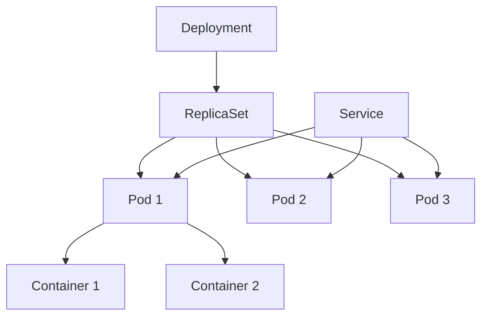

# Kubernetes Resources

## Introduction

Kubernetes is a powerful container orchestration platform that manages containerized applications across a cluster of machines. At its core, Kubernetes operates by managing various **resources** - objects that represent different parts of your application's state and configuration.

Understanding Kubernetes resources is essential for effectively deploying, managing, and scaling applications in a Kubernetes environment. In this guide, we'll explore the most important Kubernetes resources that you'll encounter when working with the platform.

## Core Kubernetes Resources

### Pods

A Pod is the smallest and most basic unit in the Kubernetes object model. It represents a single instance of a running process in your cluster.

#### Key Characteristics of Pods:

- Pods encapsulate one or more containers
- Containers within a pod share network namespace (IP address and port space)
- Containers in the same pod can communicate via localhost
- Pods are ephemeral by nature - they don't survive failures or rescheduling

#### Example Pod Definition:

```yaml
apiVersion: v1
kind: Pod
metadata:
  name: nginx-pod
  labels:
    app: nginx
spec:
  containers:
  - name: nginx
    image: nginx:1.17.10
    ports:
    - containerPort: 80
```

To create this pod:

```bash
kubectl apply -f nginx-pod.yaml
```

Output:
```
pod/nginx-pod created
```

To view the pod:

```bash
kubectl get pods
```

Output:
```
NAME        READY   STATUS    RESTARTS   AGE
nginx-pod   1/1     Running   0          45s
```

### ReplicaSets

ReplicaSets ensure that a specified number of pod replicas are running at any given time. They are used to guarantee the availability of a specified number of identical pods.

#### Key Characteristics of ReplicaSets:

- Maintains a stable set of replica pods
- Ensures specified number of pods are running
- Identified by a selector attribute
- Usually not created directly but through Deployments

```yaml
apiVersion: apps/v1
kind: ReplicaSet
metadata:
  name: nginx-replicaset
spec:
  replicas: 3
  selector:
    matchLabels:
      app: nginx
  template:
    metadata:
      labels:
        app: nginx
    spec:
      containers:
      - name: nginx
        image: nginx:1.17.10
        ports:
        - containerPort: 80
```

### Deployments

Deployments are a higher-level resource that manage ReplicaSets and provide declarative updates to applications. They're the recommended way to deploy applications in Kubernetes.

#### Key Characteristics of Deployments:

- Enable declarative updates for Pods and ReplicaSets
- Support rolling updates and rollbacks
- Maintain application history
- Auto-heal when pods crash

```yaml
apiVersion: apps/v1
kind: Deployment
metadata:
  name: nginx-deployment
spec:
  replicas: 3
  selector:
    matchLabels:
      app: nginx
  template:
    metadata:
      labels:
        app: nginx
    spec:
      containers:
      - name: nginx
        image: nginx:1.17.10
        ports:
        - containerPort: 80
```

To create and view this deployment:

```bash
kubectl apply -f nginx-deployment.yaml
kubectl get deployments
```

Output:
```
NAME               READY   UP-TO-DATE   AVAILABLE   AGE
nginx-deployment   3/3     3            3           45s
```

### Services

Services define a logical set of Pods and a policy to access them. They enable network access to a set of Pods, providing stable networking for applications.

#### Key Characteristics of Services:

- Provide stable IP addresses and DNS names
- Enable load balancing across multiple pods
- Allow internal and external traffic routing
- Support different types (ClusterIP, NodePort, LoadBalancer)

```yaml
apiVersion: v1
kind: Service
metadata:
  name: nginx-service
spec:
  selector:
    app: nginx
  ports:
  - port: 80
    targetPort: 80
  type: ClusterIP
```

To create and view this service:

```bash
kubectl apply -f nginx-service.yaml
kubectl get services
```

Output:
```
NAME            TYPE        CLUSTER-IP       EXTERNAL-IP   PORT(S)   AGE
kubernetes      ClusterIP   10.96.0.1        <none>        443/TCP   24h
nginx-service   ClusterIP   10.107.141.245   <none>        80/TCP    45s
```

## Resource Relationships

Kubernetes resources work together in a hierarchical relationship to manage applications:



## Configuration Resources

### ConfigMaps and Secrets

ConfigMaps and Secrets are resources used to separate configuration from application code.

#### ConfigMaps

ConfigMaps store non-confidential configuration data as key-value pairs.

```yaml
apiVersion: v1
kind: ConfigMap
metadata:
  name: app-config
data:
  app-mode: production
  log-level: info
  max-connections: "100"
```

#### Secrets

Secrets store sensitive information like passwords, tokens, and keys.

```yaml
apiVersion: v1
kind: Secret
metadata:
  name: app-secrets
type: Opaque
data:
  db-password: cGFzc3dvcmQxMjM=  # Base64 encoded "password123"
  api-token: dG9rZW4xMjM0NTY=     # Base64 encoded "token123456"
```

### Using ConfigMaps and Secrets in Pods

```yaml
apiVersion: v1
kind: Pod
metadata:
  name: app-pod
spec:
  containers:
  - name: app-container
    image: myapp:1.0
    env:
    - name: APP_MODE
      valueFrom:
        configMapKeyRef:
          name: app-config
          key: app-mode
    - name: DB_PASSWORD
      valueFrom:
        secretKeyRef:
          name: app-secrets
          key: db-password
    volumeMounts:
    - name: config-volume
      mountPath: /etc/config
  volumes:
  - name: config-volume
    configMap:
      name: app-config
```

## Storage Resources

### PersistentVolumes and PersistentVolumeClaims

These resources manage storage in Kubernetes.

#### PersistentVolume (PV)

PersistentVolumes represent storage resources in the cluster that have been provisioned by an administrator.

```yaml
apiVersion: v1
kind: PersistentVolume
metadata:
  name: data-pv
spec:
  capacity:
    storage: 10Gi
  accessModes:
    - ReadWriteOnce
  persistentVolumeReclaimPolicy: Retain
  storageClassName: standard
  hostPath:
    path: /data
```

#### PersistentVolumeClaim (PVC)

PersistentVolumeClaims request specific size and access modes for storage.

```yaml
apiVersion: v1
kind: PersistentVolumeClaim
metadata:
  name: data-pvc
spec:
  accessModes:
    - ReadWriteOnce
  resources:
    requests:
      storage: 5Gi
  storageClassName: standard
```

#### Using PVCs in Pods

```yaml
apiVersion: v1
kind: Pod
metadata:
  name: database-pod
spec:
  containers:
  - name: db
    image: postgres:13
    volumeMounts:
    - name: data-volume
      mountPath: /var/lib/postgresql/data
  volumes:
  - name: data-volume
    persistentVolumeClaim:
      claimName: data-pvc
```

## Network Resources

### Ingress

Ingress manages external access to services within a cluster, typically HTTP.

```yaml
apiVersion: networking.k8s.io/v1
kind: Ingress
metadata:
  name: app-ingress
spec:
  rules:
  - host: myapp.example.com
    http:
      paths:
      - path: /
        pathType: Prefix
        backend:
          service:
            name: app-service
            port:
              number: 80
```

## Real-World Example: Deploying a Web Application

Let's walk through deploying a complete web application with a frontend, backend, and database:

### 1. Database Deployment

```yaml
apiVersion: apps/v1
kind: Deployment
metadata:
  name: postgres
spec:
  replicas: 1
  selector:
    matchLabels:
      app: postgres
  template:
    metadata:
      labels:
        app: postgres
    spec:
      containers:
      - name: postgres
        image: postgres:13
        env:
        - name: POSTGRES_PASSWORD
          valueFrom:
            secretKeyRef:
              name: db-secrets
              key: password
        ports:
        - containerPort: 5432
        volumeMounts:
        - name: postgres-data
          mountPath: /var/lib/postgresql/data
      volumes:
      - name: postgres-data
        persistentVolumeClaim:
          claimName: postgres-pvc
---
apiVersion: v1
kind: Service
metadata:
  name: postgres
spec:
  selector:
    app: postgres
  ports:
  - port: 5432
    targetPort: 5432
  type: ClusterIP
```

### 2. Backend API Deployment

```yaml
apiVersion: apps/v1
kind: Deployment
metadata:
  name: backend-api
spec:
  replicas: 3
  selector:
    matchLabels:
      app: backend-api
  template:
    metadata:
      labels:
        app: backend-api
    spec:
      containers:
      - name: api
        image: myapp/backend:1.0
        env:
        - name: DB_HOST
          value: postgres
        - name: DB_PASSWORD
          valueFrom:
            secretKeyRef:
              name: db-secrets
              key: password
        ports:
        - containerPort: 8080
---
apiVersion: v1
kind: Service
metadata:
  name: backend-api
spec:
  selector:
    app: backend-api
  ports:
  - port: 80
    targetPort: 8080
  type: ClusterIP
```

### 3. Frontend Deployment

```yaml
apiVersion: apps/v1
kind: Deployment
metadata:
  name: frontend
spec:
  replicas: 2
  selector:
    matchLabels:
      app: frontend
  template:
    metadata:
      labels:
        app: frontend
    spec:
      containers:
      - name: frontend
        image: myapp/frontend:1.0
        env:
        - name: API_URL
          value: http://backend-api
        ports:
        - containerPort: 80
---
apiVersion: v1
kind: Service
metadata:
  name: frontend
spec:
  selector:
    app: frontend
  ports:
  - port: 80
    targetPort: 80
  type: NodePort
```

### 4. Ingress for External Access

```yaml
apiVersion: networking.k8s.io/v1
kind: Ingress
metadata:
  name: myapp-ingress
spec:
  rules:
  - host: myapp.example.com
    http:
      paths:
      - path: /api
        pathType: Prefix
        backend:
          service:
            name: backend-api
            port:
              number: 80
      - path: /
        pathType: Prefix
        backend:
          service:
            name: frontend
            port:
              number: 80
```

## Resource Management and Limits

Kubernetes allows you to specify resource requests and limits for containers:

```yaml
apiVersion: v1
kind: Pod
metadata:
  name: resource-demo
spec:
  containers:
  - name: app
    image: myapp:1.0
    resources:
      requests:
        memory: "128Mi"
        cpu: "100m"
      limits:
        memory: "256Mi"
        cpu: "500m"
```

This configuration:
- Requests 128MB of memory and 0.1 CPU cores
- Limits the container to 256MB of memory and 0.5 CPU cores

## Namespaces

Namespaces provide a way to divide cluster resources between multiple users or teams:

```yaml
apiVersion: v1
kind: Namespace
metadata:
  name: team-alpha
```

To deploy resources in a specific namespace:

```bash
kubectl apply -f deployment.yaml -n team-alpha
```

## Summary

In this guide, we've explored the fundamental resources in Kubernetes:

1. **Core Resources**: Pods, ReplicaSets, Deployments, and Services form the backbone of application deployment
2. **Configuration Resources**: ConfigMaps and Secrets manage application configuration
3. **Storage Resources**: PersistentVolumes and PersistentVolumeClaims handle application data
4. **Network Resources**: Ingress controllers manage external access to services

Understanding these resources and how they interact is crucial for effectively deploying and managing applications in Kubernetes.

## Exercises

1. Create a simple deployment for a web application with 3 replicas.
2. Set up a service that exposes your deployment.
3. Create a ConfigMap with application settings and use it in your deployment.
4. Implement resource requests and limits for your containers.
5. Organize your resources using namespaces.

## Additional Resources

- [Kubernetes Official Documentation](https://kubernetes.io/docs/)
- [Kubernetes API Reference](https://kubernetes.io/docs/reference/generated/kubernetes-api/v1.26/)
- [kubectl Cheat Sheet](https://kubernetes.io/docs/reference/kubectl/cheatsheet/)