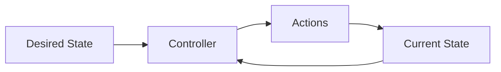
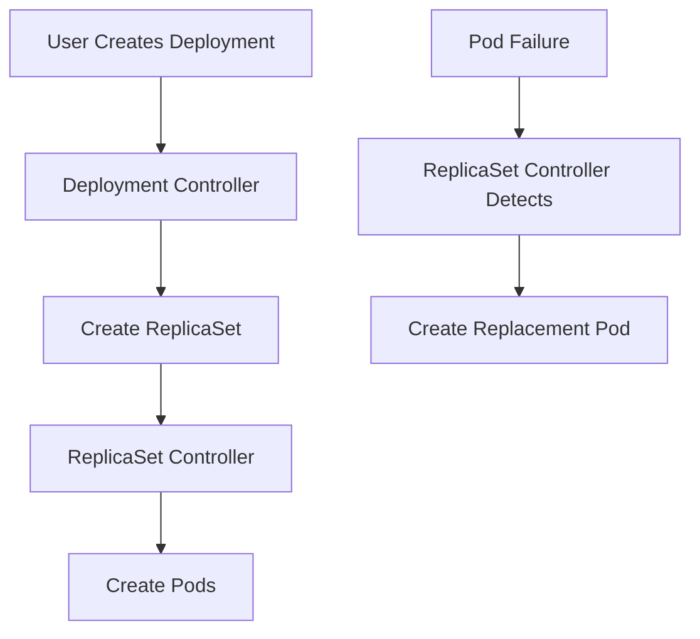

# Kubernetes Controllers

## Introduction

Kubernetes controllers are background processes that monitor the state of your cluster and make changes to move the current state towards the desired state. Think of controllers as the "brain" of Kubernetes that constantly works to ensure your applications are running as specified.

In Kubernetes, everything is designed around a control loop pattern. This pattern continuously compares the desired state (what you want) with the current state (what you have) and takes actions to reconcile any differences.

## Key Concepts

Before diving into specific controllers, let's understand some foundational concepts:

### Control Loop Pattern

The control loop pattern is fundamental to how Kubernetes works:



This cycle repeats continuously as controllers work to maintain system stability.

### Controller-Manager

The `kube-controller-manager` is a component that runs controller processes. It includes:

- Node Controller: Monitors node health
- Replication Controller: Ensures the correct number of pods
- Endpoints Controller: Populates the Endpoints object
- Service Account & Token Controllers: Create accounts and API tokens

## Common Controllers

Let's explore the most common controllers you'll work with in Kubernetes:

### ReplicaSet

ReplicaSets ensure that a specified number of pod replicas are running at any given time.

#### How ReplicaSets Work

1. You define a desired state (number of replicas)
2. The ReplicaSet controller continuously monitors running pods
3. If pods are missing, it creates new ones
4. If there are too many pods, it terminates excess ones

#### Example ReplicaSet Definition

```yaml
apiVersion: apps/v1
kind: ReplicaSet
metadata:
  name: frontend
  labels:
    app: guestbook
    tier: frontend
spec:
  replicas: 3
  selector:
    matchLabels:
      tier: frontend
  template:
    metadata:
      labels:
        tier: frontend
    spec:
      containers:
      - name: php-redis
        image: gcr.io/google_samples/gb-frontend:v3
```

When you apply this configuration:

```bash
kubectl apply -f replicaset.yaml
```

The ReplicaSet controller will create 3 pods matching the template, and continuously ensure 3 pods are running.

### Deployment

Deployments are a higher-level concept that manage ReplicaSets and provide declarative updates to applications.

#### Key Features of Deployments

- **Rolling Updates**: Update pods gradually without downtime
- **Rollback**: Revert to previous versions if issues occur
- **Scaling**: Easily scale applications up or down
- **Pause/Resume**: Pause and resume updates during deployment

#### Example Deployment Definition

```yaml
apiVersion: apps/v1
kind: Deployment
metadata:
  name: nginx-deployment
  labels:
    app: nginx
spec:
  replicas: 3
  selector:
    matchLabels:
      app: nginx
  template:
    metadata:
      labels:
        app: nginx
    spec:
      containers:
      - name: nginx
        image: nginx:1.14.2
        ports:
        - containerPort: 80
```

#### Common Deployment Commands

Create and check a deployment:

```bash
# Create the deployment
kubectl apply -f deployment.yaml

# Check deployment status
kubectl get deployments
kubectl describe deployment nginx-deployment

# Check the rollout status
kubectl rollout status deployment/nginx-deployment
```

Update a deployment (change image):

```bash
# Update the deployment with a new image
kubectl set image deployment/nginx-deployment nginx=nginx:1.16.1

# Or edit the deployment directly
kubectl edit deployment/nginx-deployment
```

Rollback a deployment:

```bash
# View rollout history
kubectl rollout history deployment/nginx-deployment

# Rollback to previous version
kubectl rollout undo deployment/nginx-deployment

# Rollback to a specific version
kubectl rollout undo deployment/nginx-deployment --to-revision=2
```

### DaemonSet

DaemonSets ensure that a copy of a pod runs on all (or some) nodes in the cluster.

#### Use Cases for DaemonSets

- Running cluster storage daemons (e.g., `ceph`)
- Running logs collection daemons (e.g., `fluentd`, `logstash`)
- Running node monitoring daemons (e.g., `Prometheus Node Exporter`)

#### Example DaemonSet Definition

```yaml
apiVersion: apps/v1
kind: DaemonSet
metadata:
  name: fluentd-elasticsearch
  namespace: kube-system
  labels:
    k8s-app: fluentd-logging
spec:
  selector:
    matchLabels:
      name: fluentd-elasticsearch
  template:
    metadata:
      labels:
        name: fluentd-elasticsearch
    spec:
      tolerations:
      - key: node-role.kubernetes.io/master
        effect: NoSchedule
      containers:
      - name: fluentd-elasticsearch
        image: quay.io/fluentd_elasticsearch/fluentd:v2.5.2
        resources:
          limits:
            memory: 200Mi
          requests:
            cpu: 100m
            memory: 200Mi
        volumeMounts:
        - name: varlog
          mountPath: /var/log
        - name: varlibdockercontainers
          mountPath: /var/lib/docker/containers
          readOnly: true
      volumes:
      - name: varlog
        hostPath:
          path: /var/log
      - name: varlibdockercontainers
        hostPath:
          path: /var/lib/docker/containers
```

This DaemonSet runs a `fluentd` logging agent on every node in the cluster.

### StatefulSet

StatefulSets are used for applications that require stable, unique network identifiers, stable persistent storage, and ordered deployment and scaling.

#### Key Features of StatefulSets

- **Stable, unique network identifiers**: Each pod gets a persistent hostname
- **Stable, persistent storage**: Storage volumes survive pod rescheduling
- **Ordered deployment and scaling**: Pods are created and terminated in order

#### Example StatefulSet Definition

```yaml
apiVersion: apps/v1
kind: StatefulSet
metadata:
  name: web
spec:
  serviceName: "nginx"
  replicas: 3
  selector:
    matchLabels:
      app: nginx
  template:
    metadata:
      labels:
        app: nginx
    spec:
      containers:
      - name: nginx
        image: nginx:1.14.2
        ports:
        - containerPort: 80
          name: web
        volumeMounts:
        - name: www
          mountPath: /usr/share/nginx/html
  volumeClaimTemplates:
  - metadata:
      name: www
    spec:
      accessModes: [ "ReadWriteOnce" ]
      resources:
        requests:
          storage: 1Gi
```

With this StatefulSet, pods will be named `web-0`, `web-1`, `web-2`, and each will have its own persistent volume.

### Job

Jobs create one or more pods and ensure they successfully terminate. Jobs are useful for batch processes, like data migrations or backups.

#### Example Job Definition

```yaml
apiVersion: batch/v1
kind: Job
metadata:
  name: pi
spec:
  template:
    spec:
      containers:
      - name: pi
        image: perl
        command: ["perl",  "-Mbignum=bpi", "-wle", "print bpi(2000)"]
      restartPolicy: Never
  backoffLimit: 4
```

This Job calculates π to 2000 places and then terminates.

### CronJob

CronJobs create Jobs on a schedule, similar to cron jobs in Linux/Unix systems.

#### Example CronJob Definition

```yaml
apiVersion: batch/v1
kind: CronJob
metadata:
  name: hello
spec:
  schedule: "*/1 * * * *"  # Run every minute
  jobTemplate:
    spec:
      template:
        spec:
          containers:
          - name: hello
            image: busybox
            command:
            - /bin/sh
            - -c
            - date; echo Hello from the Kubernetes cluster
          restartPolicy: OnFailure
```

## Custom Resource Definitions and Custom Controllers

Kubernetes allows extending its API with Custom Resource Definitions (CRDs) and implementing custom controllers to manage these resources.

This extension mechanism enables the creation of operators - custom controllers that encode domain-specific knowledge for specific applications.

### Example: Creating a simple CRD

```yaml
apiVersion: apiextensions.k8s.io/v1
kind: CustomResourceDefinition
metadata:
  name: websites.example.com
spec:
  group: example.com
  versions:
    - name: v1
      served: true
      storage: true
      schema:
        openAPIV3Schema:
          type: object
          properties:
            spec:
              type: object
              properties:
                domain:
                  type: string
                content:
                  type: string
  scope: Namespaced
  names:
    plural: websites
    singular: website
    kind: Website
    shortNames:
    - wbs
```

A custom controller would then watch for `Website` resources and take appropriate actions.

## Controller Flow in Action

Let's understand the flow of controllers with a practical example:

1. You create a Deployment resource asking for 3 replicas of an nginx container
2. The Deployment controller creates a ReplicaSet with a desired state of 3 replicas
3. The ReplicaSet controller notices it needs to create 3 pods
4. The ReplicaSet controller creates 3 pods
5. If a pod fails, the ReplicaSet controller creates a replacement pod



## Troubleshooting Controller Issues

When working with controllers, you might encounter issues. Here's how to debug common problems:

### Checking Controller Status

```bash
# Check all controllers in the kube-system namespace
kubectl get pods -n kube-system | grep controller

# View controller-manager logs
kubectl logs -n kube-system kube-controller-manager-[node-name]
```

### Common Issues and Solutions

1. **Pods not being created**: Check the ReplicaSet events
   ```bash
   kubectl describe rs [replicaset-name]
   ```

2. **Deployments stuck**: Check the rollout status and events
   ```bash
   kubectl rollout status deployment/[deployment-name]
   kubectl describe deployment [deployment-name]
   ```

3. **StatefulSet issues**: Verify persistent volume claims
   ```bash
   kubectl get pvc
   kubectl describe pvc [pvc-name]
   ```

## Best Practices for Working with Controllers

1. **Use Deployments for stateless applications**: Deployments provide rolling updates and rollbacks.

2. **Use StatefulSets for stateful applications**: When you need stable network identities and persistent storage.

3. **Label your resources properly**: Controllers use labels and selectors extensively.

4. **Set resource limits**: Prevent controllers from creating pods that can't be scheduled due to resource constraints.

5. **Use liveness and readiness probes**: Help controllers make informed decisions about pod health.

6. **Use horizontal pod autoscaling with controllers**: Automatically scale the number of pods based on CPU/memory usage.

7. **Implement proper update strategies**: Choose the appropriate strategy (RollingUpdate vs Recreate) for your application needs.

## Summary

Kubernetes controllers are the beating heart of the Kubernetes control plane, continuously working to ensure your cluster maintains the desired state.

We've covered:
- The control loop pattern that drives Kubernetes
- Common controllers: ReplicaSets, Deployments, DaemonSets, StatefulSets, Jobs, and CronJobs
- How to define and interact with these controllers
- Troubleshooting controller issues
- Best practices for working with controllers

By understanding how controllers work, you can more effectively deploy and manage applications in Kubernetes.

## Additional Resources

- [Kubernetes Controllers Documentation](https://kubernetes.io/docs/concepts/architecture/controller/)
- [Kubernetes Patterns: Controllers](https://kubernetes.io/docs/concepts/architecture/controller/)
- [Writing Controllers](https://github.com/kubernetes/community/blob/master/contributors/devel/sig-api-machinery/controllers.md)

## Exercises

1. Create a Deployment with 3 replicas, then scale it to 5 replicas using the `kubectl scale` command.

2. Create a Job that runs a pod to output the current date, then check the logs of the pod.

3. Create a CronJob that runs every 5 minutes to output system information.

4. Create a DaemonSet that runs a monitoring agent on each node.

5. Create a StatefulSet for a simple database application with persistent storage.