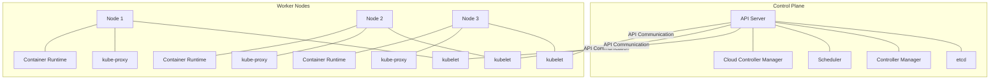

# Kubernetes Cluster

## Introduction

A Kubernetes cluster is the foundation of Kubernetes architecture - a set of machines (physical or virtual) that work together to run containerized applications. These machines form a unified system that handles the deployment, scaling, and management of application containers.

Think of a Kubernetes cluster as an orchestra where each musician (node) plays their part under the direction of a conductor (control plane) to create beautiful music (running your applications reliably).

## Cluster Architecture

A Kubernetes cluster consists of two main components:

1. **Control Plane** (formerly known as Master): The brain of the cluster
2. **Nodes**: The workers that run your applications

Let's visualize this architecture:



### Control Plane Components

The Control Plane is responsible for global decisions about the cluster (scheduling, responding to cluster events, etc.) and detecting/responding to cluster events.

Let's examine each component:

#### API Server

The API server (`kube-apiserver`) is the front-end of the control plane, exposing the Kubernetes API. It processes RESTful requests and updates the corresponding objects in `etcd`.

```bash
# Example: Accessing the API server to get nodes
kubectl get nodes
```

Output:
```
NAME       STATUS   ROLES    AGE   VERSION
node-1     Ready    <none>   10d   v1.26.1
node-2     Ready    <none>   10d   v1.26.1
node-3     Ready    <none>   10d   v1.26.1
```

#### etcd

`etcd` is a consistent and highly-available key-value store used as Kubernetes' backing store for all cluster data. It stores the entire state of the cluster.

#### Controller Manager

The Controller Manager (`kube-controller-manager`) runs controller processes that regulate the state of the system. These controllers include:

- Node Controller: Notices and responds when nodes go down
- Replication Controller: Maintains the correct number of pods
- Endpoints Controller: Populates the Endpoints object
- Service Account & Token Controllers: Create default accounts and API access tokens

#### Scheduler

The Scheduler (`kube-scheduler`) watches for newly created pods with no assigned node and selects a node for them to run on based on resource requirements, constraints, and other factors.

### Worker Node Components

Nodes are the machines where your applications run. Each node contains:

#### kubelet

The `kubelet` is an agent that runs on each node, ensuring containers are running in a pod. It takes a set of PodSpecs and ensures the containers described are running and healthy.

#### kube-proxy

The `kube-proxy` maintains network rules on nodes, allowing network communication to your pods from inside or outside the cluster.

#### Container Runtime

The container runtime (like Docker, containerd, or CRI-O) is responsible for running containers.

## Setting Up a Kubernetes Cluster

There are several ways to set up a Kubernetes cluster, depending on your needs:

### Local Development Cluster

For learning and development, tools like Minikube or kind (Kubernetes IN Docker) are perfect:

```bash
# Installing and starting Minikube
minikube start --driver=docker

# Verify the cluster is running
kubectl get nodes
```

Output:
```
NAME       STATUS   ROLES    AGE   VERSION
minikube   Ready    master   45s   v1.26.1
```

### Production Clusters

For production environments, you might use:

1. **Managed Kubernetes Services**:
   - Amazon EKS (Elastic Kubernetes Service)
   - Google GKE (Google Kubernetes Engine)
   - Microsoft AKS (Azure Kubernetes Service)

2. **Self-managed Kubernetes**:
   - Using `kubeadm` to bootstrap a cluster
   - Installing from scratch

Here's a simplified example of using `kubeadm` to initialize a cluster:

```bash
# On the control plane node
sudo kubeadm init --pod-network-cidr=10.244.0.0/16

# The output will provide a command to join worker nodes
```

## Interacting with a Kubernetes Cluster

The primary tool for interacting with a Kubernetes cluster is `kubectl`, the Kubernetes command-line tool.

### Basic kubectl Commands

```bash
# Get cluster information
kubectl cluster-info

# List all nodes
kubectl get nodes

# List all pods in all namespaces
kubectl get pods --all-namespaces

# Create resources from a YAML file
kubectl apply -f my-deployment.yaml

# Delete resources
kubectl delete deployment my-deployment
```

## Deploying an Application to the Cluster

Let's deploy a simple web application to our Kubernetes cluster:

1. Create a deployment YAML file named `web-app.yaml`:

```yaml
apiVersion: apps/v1
kind: Deployment
metadata:
  name: web-app
spec:
  replicas: 3
  selector:
    matchLabels:
      app: web
  template:
    metadata:
      labels:
        app: web
    spec:
      containers:
      - name: web-app
        image: nginx:latest
        ports:
        - containerPort: 80
---
apiVersion: v1
kind: Service
metadata:
  name: web-app-service
spec:
  selector:
    app: web
  ports:
  - port: 80
    targetPort: 80
  type: LoadBalancer
```

2. Apply the configuration:

```bash
kubectl apply -f web-app.yaml
```

3. Check the deployment status:

```bash
kubectl get deployments
```

Output:
```
NAME      READY   UP-TO-DATE   AVAILABLE   AGE
web-app   3/3     3            3           45s
```

4. Check the created pods:

```bash
kubectl get pods
```

Output:
```
NAME                      READY   STATUS    RESTARTS   AGE
web-app-5d4bbc7865-2xjpf  1/1     Running   0          50s
web-app-5d4bbc7865-9lknm  1/1     Running   0          50s
web-app-5d4bbc7865-tqd6k  1/1     Running   0          50s
```

5. Access the service:

```bash
kubectl get services
```

Output:
```
NAME              TYPE           CLUSTER-IP      EXTERNAL-IP   PORT(S)        AGE
kubernetes        ClusterIP      10.96.0.1       <none>        443/TCP        10d
web-app-service   LoadBalancer   10.96.45.123    <pending>     80:31234/TCP   55s
```

For Minikube, you can access the service with:

```bash
minikube service web-app-service
```

## Namespaces

Kubernetes supports multiple virtual clusters backed by the same physical cluster. These virtual clusters are called namespaces.

```bash
# List all namespaces
kubectl get namespaces

# Create a namespace
kubectl create namespace development

# Deploy resources to a specific namespace
kubectl apply -f web-app.yaml -n development
```

## Cluster Scaling

Kubernetes clusters can be scaled in two ways:

1. **Scaling the number of pods** (application scaling):

```bash
# Scale deployment to 5 replicas
kubectl scale deployment web-app --replicas=5
```

2. **Scaling the number of nodes** (cluster scaling):

For managed Kubernetes services, this is often as simple as adjusting a setting in the cloud provider console. For self-managed clusters, you would add or remove physical or virtual machines.

## Cluster Health and Monitoring

Monitoring your cluster is crucial for maintaining healthy applications:

```bash
# Get cluster events
kubectl get events

# Get detailed information about a specific node
kubectl describe node node-1

# Get logs from a pod
kubectl logs web-app-5d4bbc7865-2xjpf
```

For comprehensive monitoring, tools like Prometheus and Grafana are commonly used with Kubernetes.

## Summary

A Kubernetes cluster provides the foundation for running containerized applications at scale. It consists of a control plane that manages the cluster and worker nodes that run your applications.

Key concepts we've covered:

- Cluster architecture (control plane and nodes)
- Components of the control plane and worker nodes
- Setting up a Kubernetes cluster
- Interacting with the cluster using kubectl
- Deploying applications to the cluster
- Scaling applications and the cluster
- Monitoring cluster health

## Exercises for Practice

1. Install Minikube on your local machine and start a cluster.
2. Deploy a simple application of your choice to the cluster.
3. Scale the deployment up and down and observe the changes.
4. Create a new namespace and deploy the same application in that namespace.
5. Deliberately crash one of your pods and observe how Kubernetes handles it.

## Additional Resources

- [Kubernetes Documentation](https://kubernetes.io/docs/home/)
- [Kubernetes Concepts](https://kubernetes.io/docs/concepts/)
- [kubectl Cheat Sheet](https://kubernetes.io/docs/reference/kubectl/cheatsheet/)
- Interactive learning platforms:
  - [Katacoda Kubernetes Playground](https://www.katacoda.com/courses/kubernetes/playground)
  - [Play with Kubernetes](https://labs.play-with-k8s.com/)