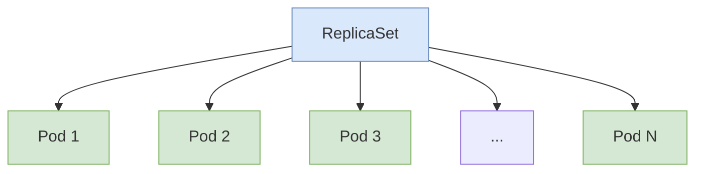
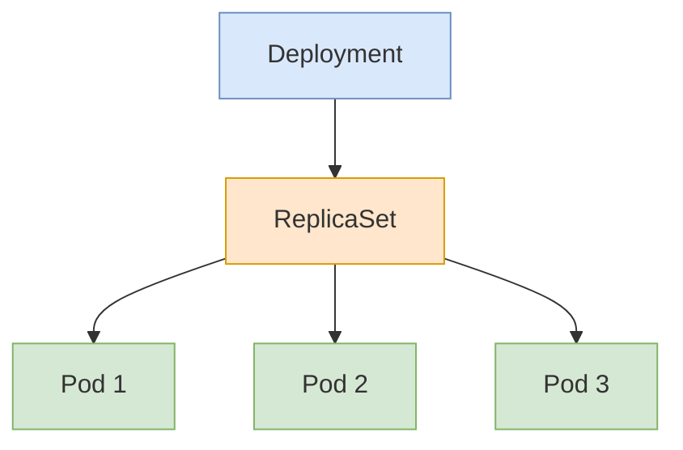

# Kubernetes ReplicaSets

## Introduction

ReplicaSets are a fundamental Kubernetes resource that ensures a specified number of pod replicas are running at any given time. They're an essential building block for creating highly available and scalable applications in Kubernetes.

In this guide, we'll explore what ReplicaSets are, how they work, and how you can use them effectively in your Kubernetes deployments.

## What is a ReplicaSet?

A ReplicaSet's purpose is to maintain a stable set of replica Pods running at any given time. As such, it is often used to guarantee the availability of a specified number of identical Pods.


Just kidding! Let's use a diagram instead:



A ReplicaSet ensures that a specified number of pod replicas are running at any given time. It:

- Monitors the state of each pod using a selector
- Ensures that the number of pods matches the desired state
- Creates or deletes pods as necessary

## How ReplicaSets Work

ReplicaSets work through a declarative approach. You define the desired state, and the Kubernetes control plane works continuously to ensure that the actual state matches the desired state.

### Key Components

1. **Label Selector**: Determines which pods are part of the ReplicaSet
2. **Replica Count**: Specifies how many identical pods should be maintained
3. **Pod Template**: Defines the specification for new pods when scaling is needed

When a pod that is part of a ReplicaSet fails, is deleted, or is terminated, the ReplicaSet controller notices the missing pod and creates a replacement to maintain the desired count.

## Creating a ReplicaSet

Let's look at how to create a ReplicaSet using a YAML manifest:

```yaml
apiVersion: apps/v1
kind: ReplicaSet
metadata:
  name: nginx-replicaset
  labels:
    app: nginx
    tier: frontend
spec:
  # Number of replicas desired
  replicas: 3
  selector:
    matchLabels:
      tier: frontend
  template:
    metadata:
      labels:
        tier: frontend
    spec:
      containers:
      - name: nginx
        image: nginx:1.19
        ports:
        - containerPort: 80
```

This YAML defines a ReplicaSet that:
- Is named `nginx-replicaset`
- Maintains 3 replica pods
- Selects pods with the label `tier: frontend`
- Creates pods using the nginx:1.19 image

### Creating the ReplicaSet

To create this ReplicaSet, save the YAML to a file (e.g., `nginx-replicaset.yaml`) and run:

```bash
kubectl apply -f nginx-replicaset.yaml
```

### Checking the ReplicaSet

```bash
kubectl get replicasets
```

Output:
```
NAME               DESIRED   CURRENT   READY   AGE
nginx-replicaset   3         3         3       45s
```

## Managing ReplicaSets

### Scaling a ReplicaSet

You can scale a ReplicaSet up or down by updating the `replicas` field:

```bash
kubectl scale replicaset nginx-replicaset --replicas=5
```

You can also update the YAML file and apply it again:

```yaml
# Updated part of the YAML file
spec:
  replicas: 5
```

```bash
kubectl apply -f nginx-replicaset.yaml
```

### Deleting a ReplicaSet

To delete a ReplicaSet along with its pods:

```bash
kubectl delete replicaset nginx-replicaset
```

To delete only the ReplicaSet and leave the pods running:

```bash
kubectl delete replicaset nginx-replicaset --cascade=false
```

## ReplicaSets vs Deployments

While ReplicaSets are powerful, they have limitations:

1. They don't support rolling updates
2. They don't support rollbacks
3. They don't provide version control for pod templates

For most use cases, you'll want to use **Deployments** instead, which manage ReplicaSets behind the scenes and provide additional features.



## Practical Examples

### High-Availability Web Server

In this example, we'll create a ReplicaSet to maintain multiple instances of a web server for high availability:

```yaml
apiVersion: apps/v1
kind: ReplicaSet
metadata:
  name: web-frontend
spec:
  replicas: 3
  selector:
    matchLabels:
      app: web
  template:
    metadata:
      labels:
        app: web
    spec:
      containers:
      - name: nginx
        image: nginx:latest
        resources:
          limits:
            memory: "128Mi"
            cpu: "100m"
        ports:
        - containerPort: 80
```

### Backend API Service

This example shows a ReplicaSet for a backend API service:

```yaml
apiVersion: apps/v1
kind: ReplicaSet
metadata:
  name: api-backend
spec:
  replicas: 2
  selector:
    matchLabels:
      app: api
  template:
    metadata:
      labels:
        app: api
    spec:
      containers:
      - name: api-service
        image: my-api-service:v1
        env:
        - name: DB_HOST
          value: "database.default.svc.cluster.local"
        - name: API_KEY
          valueFrom:
            secretKeyRef:
              name: api-secrets
              key: api-key
        resources:
          limits:
            memory: "256Mi"
            cpu: "200m"
        ports:
        - containerPort: 8080
```

## How ReplicaSets Handle Pod Failures

When a pod managed by a ReplicaSet fails:

1. The ReplicaSet controller notices the pod's termination
2. It automatically creates a replacement pod based on the pod template
3. The new pod starts up and takes over the workload

This automatic recovery happens without any manual intervention, making your applications more resilient.

## ReplicaSet Selectors

ReplicaSets use selectors to identify which pods they should manage. There are two types of selectors:

### Equality-based Selectors

These use `=`, `==`, or `!=` operators:

```yaml
selector:
  matchLabels:
    app: frontend
    environment: production
```

### Set-based Selectors

These use `in`, `notin`, and `exists` operators:

```yaml
selector:
  matchExpressions:
    - {key: app, operator: In, values: [frontend, webapp]}
    - {key: tier, operator: NotIn, values: [backend]}
    - {key: environment, operator: Exists}
```

## Best Practices

1. **Use Deployments instead of ReplicaSets directly** - Deployments provide more features for managing application lifecycle
2. **Set resource limits** - Always specify CPU and memory limits for your pods
3. **Use meaningful labels** - Create a consistent labeling strategy for easy identification and organization
4. **Don't modify pods directly** - Let the ReplicaSet controller manage the pods
5. **Monitor ReplicaSet status** - Regularly check that your ReplicaSets have the expected number of ready pods

## Summary

ReplicaSets are a powerful Kubernetes resource that ensure a specified number of pod replicas are running at any given time. They:

- Maintain desired pod count
- Automatically replace failed pods
- Use selectors to identify which pods to manage
- Provide high availability for your applications

While ReplicaSets are important to understand, in most cases, you'll interact with Deployments instead, which manage ReplicaSets behind the scenes and provide additional features like rolling updates.

## Additional Resources

- [Kubernetes Official Documentation on ReplicaSets](https://kubernetes.io/docs/concepts/workloads/controllers/replicaset/)
- [Kubernetes API Reference for ReplicaSets](https://kubernetes.io/docs/reference/generated/kubernetes-api/v1.23/#replicaset-v1-apps)

## Exercises

1. Create a ReplicaSet with 3 replicas of a simple application of your choice
2. Scale the ReplicaSet up to 5 replicas and observe what happens
3. Delete one of the pods manually and observe how the ReplicaSet responds
4. Try changing a label on one of the pods and see what the ReplicaSet does
5. Convert your ReplicaSet to a Deployment and perform a rolling update