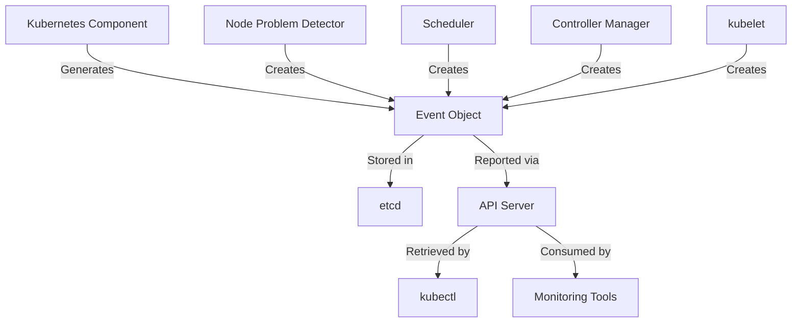

# Kubernetes Events

## Introduction

Kubernetes Events are a crucial component of the Kubernetes ecosystem that provide insights into what's happening inside a cluster. Think of them as the cluster's activity log or audit trail. Events record important occurrences within the cluster, such as pod scheduling decisions, image pulls, or resource constraints, making them invaluable for monitoring and troubleshooting.

In this guide, we'll explore Kubernetes Events in depth, understand their structure, learn how to access them, and see how they can help us maintain healthy clusters.

## What are Kubernetes Events?

Events in Kubernetes are objects that provide information about what's happening inside your cluster. They are automatically generated when changes occur to resources or when specific actions take place. Events are:

- **Namespaced resources**: They belong to the same namespace as the object they're reporting about
- **Time-limited**: By default, events are retained for only one hour
- **Resource-specific**: Most events are associated with a specific Kubernetes resource

## Event Structure

Kubernetes Events have a specific structure that includes several important fields:

| Field | Description |
|-------|-------------|
| Type | Normal or Warning |
| Reason | Short, machine-understandable string |
| Message | Human-readable description |
| Source | Component that created the event |
| Count | How many times this event has occurred |
| FirstTimestamp | When this event was first recorded |
| LastTimestamp | The time at which the most recent occurrence of this event was recorded |
| InvolvedObject | Reference to the resource this event is about |

## How to View Kubernetes Events

There are several ways to view events in your Kubernetes cluster:

### Using kubectl

The most common way to view events is using the `kubectl get events` command:

```bash
kubectl get events
```

Example output:

```
LAST SEEN   TYPE     REASON              OBJECT                        MESSAGE
2m          Normal   Scheduled           pod/nginx-65899c769f-xkfgg    Successfully assigned default/nginx-65899c769f-xkfgg to node1
1m          Normal   Pulling             pod/nginx-65899c769f-xkfgg    Pulling image "nginx:1.19"
30s         Normal   Pulled              pod/nginx-65899c769f-xkfgg    Successfully pulled image "nginx:1.19"
25s         Normal   Created             pod/nginx-65899c769f-xkfgg    Created container nginx
20s         Normal   Started             pod/nginx-65899c769f-xkfgg    Started container nginx
```

### Watch Events in Real-time

To watch events as they occur:

```bash
kubectl get events --watch
```

### Filter Events

You can filter events by namespace:

```bash
kubectl get events --namespace kube-system
```

Or format the output to focus on specific fields:

```bash
kubectl get events --sort-by='.metadata.creationTimestamp'
```

### Describe a Resource

When you describe a resource, Kubernetes shows related events:

```bash
kubectl describe pod nginx-65899c769f-xkfgg
```

The end of the output will include recent events related to that pod:

```
Events:
  Type    Reason     Age   From               Message
  ----    ------     ----  ----               -------
  Normal  Scheduled  3m    default-scheduler  Successfully assigned default/nginx-65899c769f-xkfgg to node1
  Normal  Pulling    2m    kubelet            Pulling image "nginx:1.19"
  Normal  Pulled     1m    kubelet            Successfully pulled image "nginx:1.19"
  Normal  Created    1m    kubelet            Created container nginx
  Normal  Started    1m    kubelet            Started container nginx
```

## Common Types of Events

Kubernetes generates events for various scenarios. Here are some common event types you'll encounter:

### Pod Lifecycle Events

- **Scheduled**: When a pod is scheduled to a node
- **Pulling/Pulled**: Image pull status
- **Created/Started**: Container lifecycle events
- **Killing**: When a container is being terminated
- **Unhealthy**: Failed health checks

### Resource Constraint Events

- **FailedScheduling**: When a pod can't be scheduled
- **OutOfDisk**: When a node runs out of disk space
- **MemoryPressure/DiskPressure**: Resource constraint warnings

### Deployment Events

- **ScalingReplicaSet**: When deployments scale up or down
- **SuccessfulCreate**: When new pods are created

## Event Severity Levels

Kubernetes events have two severity levels:

1. **Normal**: Regular operational events that don't require attention
2. **Warning**: Issues that might require investigation

Focusing on Warning events is often a good starting point for troubleshooting.

## Practical Example: Troubleshooting with Events

Let's walk through a practical example of how events can help troubleshoot issues:

### Scenario: Pod Won't Start

Let's say you've deployed an application, but the pod isn't running. Here's how you'd investigate:

1. First, check the pod status:

```bash
kubectl get pods
```

Output:

```
NAME                     READY   STATUS             RESTARTS   AGE
myapp-6fb56c9d8c-wt5mh   0/1     ImagePullBackOff   0          2m
```

2. Now, check the events related to this pod:

```bash
kubectl describe pod myapp-6fb56c9d8c-wt5mh
```

Events section:

```
Events:
  Type     Reason     Age    From               Message
  ----     ------     ----   ----               -------
  Normal   Scheduled  2m     default-scheduler  Successfully assigned default/myapp-6fb56c9d8c-wt5mh to node1
  Normal   Pulling    2m     kubelet            Pulling image "myregistry.com/myapp:latest"
  Warning  Failed     1m     kubelet            Failed to pull image "myregistry.com/myapp:latest": rpc error: code = Unknown desc = Error response from daemon: unauthorized: authentication required
  Warning  Failed     1m     kubelet            Error: ErrImagePull
  Warning  Failed     30s    kubelet            Error: ImagePullBackOff
  Normal   BackOff    30s    kubelet            Back-off pulling image "myregistry.com/myapp:latest"
```

3. From these events, we can see the problem: authentication is required to pull the image.

4. The solution would be to create a Kubernetes Secret with registry credentials and reference it in the pod spec:

```yaml
apiVersion: v1
kind: Secret
metadata:
  name: registry-credentials
  namespace: default
type: kubernetes.io/dockerconfigjson
data:
  .dockerconfigjson: <base64-encoded-docker-config>
---
apiVersion: v1
kind: Pod
metadata:
  name: myapp
spec:
  containers:
  - name: myapp
    image: myregistry.com/myapp:latest
  imagePullSecrets:
  - name: registry-credentials
```

## Visualizing Event Flow

Let's use a diagram to visualize how events flow in a Kubernetes cluster:



## Working with Events Programmatically

You can also work with events programmatically using the Kubernetes API or client libraries.

### Using the API

```bash
kubectl proxy
curl http://localhost:8001/api/v1/namespaces/default/events
```

### Using a Simple Go Client

```go
package main

import (
    "context"
    "fmt"
    metav1 "k8s.io/apimachinery/pkg/apis/meta/v1"
    "k8s.io/client-go/kubernetes"
    "k8s.io/client-go/tools/clientcmd"
)

func main() {
    // Use kubeconfig from default location
    config, err := clientcmd.BuildConfigFromFlags("", "~/.kube/config")
    if err != nil {
        panic(err.Error())
    }
    
    // Create the clientset
    clientset, err := kubernetes.NewForConfig(config)
    if err != nil {
        panic(err.Error())
    }
    
    // Get events from default namespace
    events, err := clientset.CoreV1().Events("default").List(context.TODO(), metav1.ListOptions{})
    if err != nil {
        panic(err.Error())
    }
    
    fmt.Printf("Found %d events
", len(events.Items))
    
    for _, event := range events.Items {
        fmt.Printf("Event: %s, Reason: %s, Message: %s
", 
            event.InvolvedObject.Name,
            event.Reason,
            event.Message)
    }
}
```

## Best Practices for Working with Events

To make the most out of Kubernetes Events:

1. **Set up monitoring**: Configure alerts for Warning events
2. **Implement event archiving**: Since events expire after an hour, consider tools like event-exporter to archive them
3. **Use namespaces effectively**: Organize your resources into namespaces to make event filtering more manageable
4. **Create custom events**: For complex applications, consider emitting custom events

## Event Limitations and Solutions

While events are useful, they have some limitations:

1. **Short retention period**: Events are only stored for one hour by default
2. **Limited scope**: Events are namespace-scoped, making cluster-wide analysis difficult
3. **No built-in alerts**: Events don't trigger notifications on their own

Solutions:

1. Use tools like **Prometheus** and **Alertmanager** for monitoring
2. Implement **event-exporter** or **kube-eventer** to archive events for longer periods
3. Consider **Kubernetes Event Driven Autoscaling (KEDA)** for advanced event-based scaling

## A Full Example: Monitoring Critical Events

Here's a complete example of setting up basic event monitoring using a ConfigMap and a simple Python script:

1. Create a ConfigMap with important event patterns:

```yaml
apiVersion: v1
kind: ConfigMap
metadata:
  name: critical-event-patterns
  namespace: monitoring
data:
  patterns: |
    Failed
    Error
    FailedScheduling
    Unhealthy
    NodeNotReady
    ImagePullBackOff
```

2. Create a simple event monitor deployment:

```yaml
apiVersion: apps/v1
kind: Deployment
metadata:
  name: event-monitor
  namespace: monitoring
spec:
  replicas: 1
  selector:
    matchLabels:
      app: event-monitor
  template:
    metadata:
      labels:
        app: event-monitor
    spec:
      serviceAccountName: event-monitor-sa
      containers:
      - name: event-monitor
        image: python:3.9-alpine
        command: ["python", "/app/monitor.py"]
        volumeMounts:
        - name: config-volume
          mountPath: /etc/config
        - name: app-volume
          mountPath: /app
      volumes:
      - name: config-volume
        configMap:
          name: critical-event-patterns
      - name: app-volume
        configMap:
          name: event-monitor-script
```

3. Create a ServiceAccount with proper permissions:

```yaml
apiVersion: v1
kind: ServiceAccount
metadata:
  name: event-monitor-sa
  namespace: monitoring
---
apiVersion: rbac.authorization.k8s.io/v1
kind: ClusterRole
metadata:
  name: event-reader
rules:
- apiGroups: [""]
  resources: ["events"]
  verbs: ["get", "watch", "list"]
---
apiVersion: rbac.authorization.k8s.io/v1
kind: ClusterRoleBinding
metadata:
  name: event-monitor-binding
roleRef:
  apiGroup: rbac.authorization.k8s.io
  kind: ClusterRole
  name: event-reader
subjects:
- kind: ServiceAccount
  name: event-monitor-sa
  namespace: monitoring
```

4. Create a ConfigMap with the Python script:

```yaml
apiVersion: v1
kind: ConfigMap
metadata:
  name: event-monitor-script
  namespace: monitoring
data:
  monitor.py: |
    import kubernetes
    import time
    import re
    
    def load_patterns():
        with open('/etc/config/patterns', 'r') as f:
            return [line.strip() for line in f.readlines() if line.strip()]
    
    def main():
        kubernetes.config.load_incluster_config()
        v1 = kubernetes.client.CoreV1Api()
        
        patterns = load_patterns()
        pattern_regex = re.compile('|'.join(patterns))
        
        resource_version = ''
        
        while True:
            try:
                stream = kubernetes.watch.Watch().stream(
                    v1.list_event_for_all_namespaces,
                    resource_version=resource_version,
                    timeout_seconds=60
                )
                
                for event in stream:
                    obj = event['object']
                    resource_version = obj.metadata.resource_version
                    
                    if obj.type == 'Warning' or pattern_regex.search(obj.reason) or pattern_regex.search(obj.message):
                        print(f"ALERT: {obj.involved_object.kind}/{obj.involved_object.name}: {obj.reason} - {obj.message}")
                        # In a real system, you would send this to a notification system
            
            except kubernetes.client.exceptions.ApiException as e:
                if e.status != 410:
                    print(f"Exception when watching events: {e}")
                resource_version = ''
            
            except Exception as e:
                print(f"Unexpected error: {e}")
            
            time.sleep(5)
    
    if __name__ == '__main__':
        main()
```

## Summary

Kubernetes Events provide invaluable insights into cluster operations and are essential for effective monitoring and troubleshooting. In this guide, we've covered:

- What Kubernetes Events are and their structure
- How to view and filter events using kubectl
- Common event types and their meanings
- Using events for practical troubleshooting
- Programmatic access to events
- Best practices and solutions for event limitations
- A complete example of setting up basic event monitoring

By mastering Kubernetes Events, you'll be able to understand what's happening in your cluster, quickly troubleshoot issues, and maintain a healthy Kubernetes environment.

## Additional Resources

- [Kubernetes Documentation: Events](https://kubernetes.io/docs/reference/kubernetes-api/cluster-resources/event-v1/)
- [Kubectl Cheat Sheet](https://kubernetes.io/docs/reference/kubectl/cheatsheet/)
- [Kubernetes Client Libraries](https://kubernetes.io/docs/reference/using-api/client-libraries/)

## Exercises

1. Set up a local Kubernetes cluster using Minikube and practice viewing events.
2. Create a deployment with an invalid image name and use events to troubleshoot the issue.
3. Write a script that watches for specific events and sends notifications.
4. Implement an event archiving solution using Elasticsearch or similar tooling.
5. Create a custom event using the Kubernetes API to signal application-specific states.