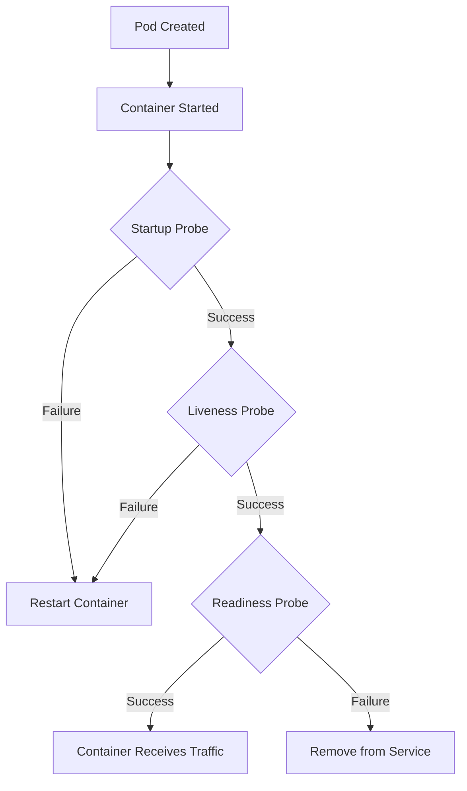

# Kubernetes Probes

## Introduction

Imagine you're responsible for a fleet of delivery trucks. How do you know if each truck is functioning properly? You might check if the engine starts (liveness), if it's ready to take packages (readiness), and occasionally perform a full inspection (startup). Kubernetes probes work in a similar way for your containers.

Kubernetes probes are health-checking mechanisms that allow Kubernetes to monitor the health and availability of your containerized applications. They help ensure that your applications are running correctly and can handle traffic, making your system more reliable and resilient to failures.

## Why Probes Matter

Without probes, Kubernetes has limited insight into the actual health of your applications. A container might be running but completely unable to serve requests due to:

- An application deadlock
- Running out of resources
- Configuration errors
- Database connection failures
- And more...

Probes give Kubernetes the ability to detect these issues and take corrective action automatically.

## Types of Kubernetes Probes

Kubernetes offers three types of probes:

1. **Liveness Probe**: Determines if a container is running properly
2. **Readiness Probe**: Determines if a container is ready to receive traffic
3. **Startup Probe**: Determines if an application within a container has started successfully

Let's explore each one in detail.

## Liveness Probes

A liveness probe answers a simple question: "Is this container alive and healthy?"

If a liveness probe fails, Kubernetes will restart the container, assuming it has entered a broken state that can only be fixed by restarting.

### When to Use Liveness Probes

- For applications that might crash but won't exit
- When recovering from a broken state requires a restart
- To handle applications with memory leaks or deadlocks

### Example Liveness Probe Configuration

```yaml
apiVersion: v1
kind: Pod
metadata:
  name: my-application
spec:
  containers:
  - name: app-container
    image: my-app:1.0
    livenessProbe:
      httpGet:
        path: /healthz
        port: 8080
      initialDelaySeconds: 15
      periodSeconds: 10
      timeoutSeconds: 5
      failureThreshold: 3
```

In this example:
- The probe makes an HTTP GET request to `/healthz` on port 8080
- It waits 15 seconds before the first check
- It checks every 10 seconds thereafter
- Each check must complete within 5 seconds
- It will try 3 times before considering the container unhealthy and restarting it

## Readiness Probes

A readiness probe answers the question: "Is this container ready to receive traffic?"

If a readiness probe fails, the container is removed from service load balancers, meaning it won't receive any new traffic, but it will not be restarted.

### When to Use Readiness Probes

- When your application takes time to load large data at startup
- When dependent services need to be available first
- When you need to implement graceful shutdown
- To prevent traffic during maintenance or config reloads

### Example Readiness Probe Configuration

```yaml
apiVersion: v1
kind: Pod
metadata:
  name: my-application
spec:
  containers:
  - name: app-container
    image: my-app:1.0
    readinessProbe:
      tcpSocket:
        port: 8080
      initialDelaySeconds: 5
      periodSeconds: 10
```

In this example:
- The probe checks if TCP port 8080 is accepting connections
- It waits 5 seconds before the first check
- It checks every 10 seconds thereafter

## Startup Probes

A startup probe answers the question: "Has the application inside the container finished starting up?"

This probe is particularly useful for applications with slow startup times or legacy applications. While a startup probe is running, liveness and readiness probes are disabled.

### When to Use Startup Probes

- For applications with unpredictable or long startup times
- For legacy applications that require additional startup time
- To provide a longer time for initialization without affecting runtime liveness checks

### Example Startup Probe Configuration

```yaml
apiVersion: v1
kind: Pod
metadata:
  name: my-application
spec:
  containers:
  - name: app-container
    image: my-app:1.0
    startupProbe:
      exec:
        command:
        - cat
        - /tmp/startup-complete
      failureThreshold: 30
      periodSeconds: 10
```

In this example:
- The probe checks if the file `/tmp/startup-complete` exists
- It will retry up to 30 times with 10 seconds between each try
- This gives the application up to 5 minutes (30 × 10 = 300 seconds) to complete its startup

## Probe Mechanisms

Kubernetes supports several ways to implement probes:

1. **HTTP GET**: Performs an HTTP GET request to a specified path and port. Success is indicated by a response code between 200 and 399.

2. **TCP Socket**: Attempts to establish a TCP connection to a specified port. Success is indicated if the connection can be established.

3. **Exec**: Executes a command inside the container. Success is indicated by an exit code of 0.

### HTTP GET Example

```yaml
livenessProbe:
  httpGet:
    path: /api/health
    port: 8080
    httpHeaders:
    - name: Custom-Header
      value: check
```

### TCP Socket Example

```yaml
readinessProbe:
  tcpSocket:
    port: 3306
```

### Exec Command Example

```yaml
livenessProbe:
  exec:
    command:
    - sh
    - -c
    - "ps aux | grep my-process | grep -v grep"
```

## Probe Configuration Parameters

You can fine-tune how probes work using these common parameters:

| Parameter | Description | Default |
|-----------|-------------|---------|
| `initialDelaySeconds` | Time to wait before first probe after container starts | 0 |
| `periodSeconds` | How often to perform the probe | 10 |
| `timeoutSeconds` | Time after which the probe times out | 1 |
| `successThreshold` | Minimum consecutive successes to be considered successful | 1 |
| `failureThreshold` | Number of retries before giving up | 3 |

## Visualizing Probe Workflow



## Best Practices for Kubernetes Probes

1. **Use Specific Health Endpoints**:
   Create dedicated health check endpoints that verify critical components.

   ```javascript
   // Example Express.js health endpoint
   app.get('/healthz', (req, res) => {
     // Check database connection
     if (dbConnected) {
       res.status(200).send('OK');
     } else {
       res.status(500).send('Database connection failed');
     }
   });
   ```

2. **Set Appropriate Thresholds**:
   Configure timeouts and thresholds based on your application's behavior.

3. **Include Dependencies in Health Checks**:
   Check critical dependencies like databases or caches.

4. **Keep Probes Lightweight**:
   Health checks should be fast and use minimal resources.

5. **Use All Three Probe Types**:
   Each serves a different purpose in the application lifecycle.

6. **Set Proper Initial Delays**:
   Allow enough time for your application to initialize.

## Real-World Example: Web Application with Database

Let's look at a complete example of a web application that depends on a database:

```yaml
apiVersion: apps/v1
kind: Deployment
metadata:
  name: web-application
spec:
  replicas: 3
  selector:
    matchLabels:
      app: web-app
  template:
    metadata:
      labels:
        app: web-app
    spec:
      containers:
      - name: web-app
        image: web-app:1.0
        ports:
        - containerPort: 8080
        startupProbe:
          httpGet:
            path: /startup
            port: 8080
          failureThreshold: 30
          periodSeconds: 10
        livenessProbe:
          httpGet:
            path: /healthz
            port: 8080
          initialDelaySeconds: 60
          periodSeconds: 15
        readinessProbe:
          httpGet:
            path: /ready
            port: 8080
          initialDelaySeconds: 5
          periodSeconds: 5
```

In this example:

1. The **startup probe** allows the application up to 5 minutes to initialize.
2. The **liveness probe** checks if the application is still responsive.
3. The **readiness probe** verifies that the application is ready to serve requests.

Your application would implement these endpoints to perform appropriate checks:

- `/startup`: Basic check that application has loaded
- `/healthz`: Deep health check including memory usage and critical functions
- `/ready`: Checks database connectivity and cache availability

## Implementing Health Check Endpoints

Here's a simple example of how you might implement these endpoints in a Node.js application:

```javascript
const express = require('express');
const app = express();
const db = require('./database');

// Startup probe - simple check that server is running
app.get('/startup', (req, res) => {
  res.status(200).send('Application started');
});

// Liveness probe - check if application is working correctly
app.get('/healthz', (req, res) => {
  // Check if application is deadlocked or has errors
  const memoryUsage = process.memoryUsage().heapUsed / 1024 / 1024;
  
  if (memoryUsage > 1500) {
    // Memory leak detected
    res.status(500).send('Memory usage too high');
  } else {
    res.status(200).send('OK');
  }
});

// Readiness probe - check if application can serve requests
app.get('/ready', async (req, res) => {
  try {
    // Check database connection
    await db.ping();
    // Check other dependencies
    const cacheAvailable = await checkCache();
    
    if (cacheAvailable) {
      res.status(200).send('Ready to serve traffic');
    } else {
      res.status(503).send('Cache not available');
    }
  } catch (error) {
    res.status(503).send('Database connection failed');
  }
});

app.listen(8080);
```

## Troubleshooting Probes

If your probes aren't working as expected, check these common issues:

1. **Incorrect Path or Port**: Verify the path and port match your application's configuration.

2. **Timeout Too Short**: Some operations might take longer than expected.

3. **Dependency Failures**: If your probe depends on external services, it might fail when they're unavailable.

4. **Resource Constraints**: Under high load, probes might time out if the container doesn't have enough resources.

You can debug probe issues by checking the pod events:

```bash
kubectl describe pod <pod-name>
```

Look for events like:

```
Warning  Unhealthy  10s   kubelet  Readiness probe failed: Get "http://10.1.2.3:8080/ready": context deadline exceeded
```

## Summary

Kubernetes probes are essential tools for building reliable, self-healing applications in Kubernetes:

- **Liveness probes** detect and fix broken containers by restarting them
- **Readiness probes** ensure traffic only goes to containers that can handle it
- **Startup probes** give applications the time they need to initialize

By implementing appropriate probes with sensible configuration, you can dramatically improve the reliability and user experience of your Kubernetes applications.

## Additional Resources

- [Kubernetes Official Documentation on Probes](https://kubernetes.io/docs/tasks/configure-pod-container/configure-liveness-readiness-startup-probes/)
- [Kubernetes Patterns: Container Health Probe Pattern](https://www.oreilly.com/library/view/kubernetes-patterns/9781492050278/)

## Exercises

1. Create a simple web application with a `/health` endpoint that checks memory usage and returns appropriate status codes.

2. Deploy an application to Kubernetes with all three types of probes configured.

3. Simulate a failure in your application and observe how Kubernetes responds based on your probe configuration.

4. Create a readiness probe that checks for the availability of an external service before allowing traffic.

5. Experiment with different probe parameters to find the optimal configuration for a slow-starting application.