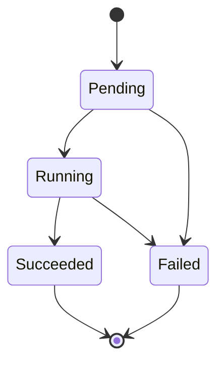
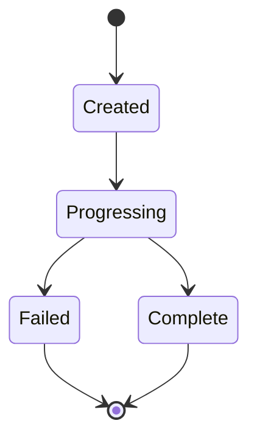
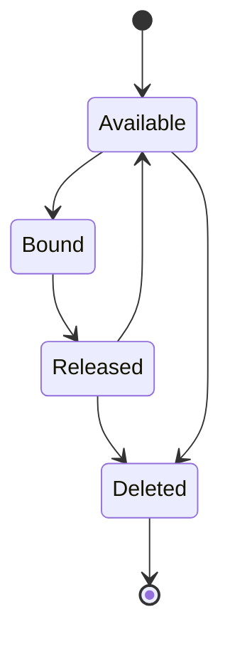

# Kubernetes Lifecycle

## Introduction

Understanding the lifecycle of Kubernetes objects is fundamental to working effectively with Kubernetes. The lifecycle encompasses how resources are created, managed, scaled, updated, and eventually terminated within a Kubernetes cluster. This knowledge helps you troubleshoot issues, optimize deployments, and build resilient applications.

In this guide, we'll explore the various stages that Kubernetes objects go through and how you can interact with them at each stage of their existence.

## The Basic Kubernetes Object Lifecycle

At its core, every Kubernetes object follows a similar pattern throughout its lifecycle:

1. **Creation** - Object is defined and submitted to the Kubernetes API
2. **Validation** - API server validates the object specification
3. **Scheduling** (for applicable resources) - Resources are allocated
4. **Running/Active** - Object performs its designated function
5. **Termination** - Object is deleted or replaced

Let's break down each of these phases in more detail.

## Pod Lifecycle Phases

Pods, the smallest deployable units in Kubernetes, have a well-defined lifecycle with distinct phases. Let's explore each phase:



### 1. Pending

When a Pod is first created, it enters the **Pending** phase. During this phase:

- The API server has accepted the Pod
- The Pod has been saved to etcd
- The Pod has not yet been scheduled to a node
- Container images may be downloading

This phase can last from seconds to minutes depending on resource availability, image size, and network conditions.

### 2. Running

The Pod reaches the **Running** phase when:

- The Pod has been bound to a node
- All containers have been created
- At least one container is running or in the process of starting/restarting

Let's look at how to check Pod status:

```bash
kubectl get pod nginx-pod -o wide
```

Output:
```
NAME        READY   STATUS    RESTARTS   AGE   IP           NODE       
nginx-pod   1/1     Running   0          1m    10.244.2.3   worker-1  
```

### 3. Succeeded

A Pod enters the **Succeeded** phase when:

- All containers in the Pod have terminated successfully
- None of the containers will be restarted

This is common for one-time jobs or batch processes.

### 4. Failed

A Pod reaches the **Failed** phase when:

- At least one container has terminated with failure
- The container exited with a non-zero status code

### 5. Unknown

Sometimes a Pod may show an **Unknown** status, which means:

- The state of the Pod couldn't be determined
- Communication with the node hosting the Pod has failed

## Container States Within Pods

Containers within Pods have their own lifecycle states:

### 1. Waiting

The container is waiting to start, possibly due to:
- Image pulling
- Secret creation
- Dependencies not ready

### 2. Running

The container is executing normally without issues.

### 3. Terminated

The container has completed execution or failed:
- Either successfully exited with status code 0
- Or failed with a non-zero exit code

You can inspect detailed container states with:

```bash
kubectl describe pod nginx-pod
```

Output excerpt:
```

Containers:
  nginx:
    Container ID: docker://7c6a0354g8e1...
    State:
      Running:
        Started: Mon, 10 Jan 2022 12:30:55 +0000
    Ready: True

```

## Deployment Lifecycle

Deployments, which manage ReplicaSets and Pods, have their own lifecycle:



### 1. Creation

When a Deployment is created:

```bash
kubectl create -f nginx-deployment.yaml
```

The Deployment controller creates a ReplicaSet, which then creates Pods.

### 2. Rolling Updates

When updating a Deployment, Kubernetes follows a controlled process:

```bash
kubectl set image deployment/nginx-deployment nginx=nginx:1.19
```

Here's what happens:

1. A new ReplicaSet is created
2. The new ReplicaSet is gradually scaled up
3. The old ReplicaSet is gradually scaled down
4. Once the new ReplicaSet reaches the desired state, the old one is kept but scaled to 0

You can observe this process:

```bash
kubectl rollout status deployment/nginx-deployment
```

Output:
```
Waiting for deployment "nginx-deployment" rollout to finish: 2 out of 3 new replicas have been updated...
deployment "nginx-deployment" successfully rolled out
```

### 3. Rollbacks

If an update fails or causes issues, you can rollback:

```bash
kubectl rollout undo deployment/nginx-deployment
```

Kubernetes will:
1. Scale up the previous ReplicaSet
2. Scale down the problematic ReplicaSet

## Service Lifecycle

Services provide stable networking for dynamic Pods:

### 1. Creation

When a Service is created:

```bash
kubectl create -f nginx-service.yaml
```

Kubernetes:
1. Assigns a ClusterIP (for internal services)
2. Updates kube-proxy on all nodes
3. Creates required network rules

### 2. Endpoint Updates

As Pods come and go, Service endpoints update automatically:

```bash
kubectl get endpoints nginx-service
```

Output:
```
NAME           ENDPOINTS                                   AGE
nginx-service  10.244.1.4:80,10.244.2.5:80,10.244.3.3:80   1h
```

### 3. Termination

When a Service is deleted:

```bash
kubectl delete service nginx-service
```

Kubernetes:
1. Removes associated network rules
2. Releases the assigned ClusterIP
3. Updates kube-proxy on all nodes

## PersistentVolume Lifecycle

PersistentVolumes (PVs) and PersistentVolumeClaims (PVCs) follow a more complex lifecycle:



### 1. Provisioning

PVs can be provisioned:
- **Static**: Admin creates PVs in advance
- **Dynamic**: Created on-demand when PVCs request them

### 2. Binding

When a PVC claims a PV:

```yaml
apiVersion: v1
kind: PersistentVolumeClaim
metadata:
  name: data-claim
spec:
  accessModes:
    - ReadWriteOnce
  resources:
    requests:
      storage: 10Gi
```

Kubernetes binds the PVC to a suitable PV.

### 3. Using

Pods can use the PVC:

```yaml
apiVersion: v1
kind: Pod
metadata:
  name: database-pod
spec:
  containers:
  - name: postgres
    image: postgres:13
    volumeMounts:
    - mountPath: "/var/lib/postgresql/data"
      name: data-volume
  volumes:
  - name: data-volume
    persistentVolumeClaim:
      claimName: data-claim
```

### 4. Reclaiming

When a PVC is deleted, the PV enters a reclaim phase based on its policy:
- **Retain**: PV remains with its data, but becomes unavailable
- **Delete**: PV and its associated storage are deleted
- **Recycle**: Data is removed, and PV becomes available again

## ConfigMap and Secret Lifecycle

ConfigMaps and Secrets are created, consumed, and updated in a cycle:

### 1. Creation

Create a ConfigMap:

```bash
kubectl create configmap app-config --from-literal=APP_COLOR=blue --from-literal=APP_MODE=prod
```

### 2. Consumption

Pods consume them as:
- Environment variables
- Volume mounts

```yaml
apiVersion: v1
kind: Pod
metadata:
  name: webapp
spec:
  containers:
  - name: webapp
    image: nginx
    env:
    - name: APP_COLOR
      valueFrom:
        configMapKeyRef:
          name: app-config
          key: APP_COLOR
    volumeMounts:
    - name: config-volume
      mountPath: /etc/config
  volumes:
  - name: config-volume
    configMap:
      name: app-config
```

### 3. Updates

When ConfigMaps are updated, the behavior depends on how they're consumed:
- **Environment variables**: Require Pod restart
- **Volume mounts**: Update automatically (with some delay)

## Practical Example: Full Application Lifecycle

Let's walk through a complete example of deploying a simple web application:

### 1. Create a ConfigMap for Application Configuration

```bash
kubectl create configmap webapp-config --from-literal=APP_COLOR=blue --from-literal=APP_ENV=production
```

### 2. Create a Secret for Database Credentials

```bash
kubectl create secret generic db-creds --from-literal=username=admin --from-literal=password=secretpassword
```

### 3. Deploy the Database

```yaml
apiVersion: apps/v1
kind: Deployment
metadata:
  name: mysql
spec:
  selector:
    matchLabels:
      app: mysql
  strategy:
    type: Recreate
  template:
    metadata:
      labels:
        app: mysql
    spec:
      containers:
      - name: mysql
        image: mysql:5.7
        env:
        - name: MYSQL_ROOT_PASSWORD
          valueFrom:
            secretKeyRef:
              name: db-creds
              key: password
        ports:
        - containerPort: 3306
          name: mysql
        volumeMounts:
        - name: mysql-data
          mountPath: /var/lib/mysql
      volumes:
      - name: mysql-data
        persistentVolumeClaim:
          claimName: mysql-pvc
---
apiVersion: v1
kind: PersistentVolumeClaim
metadata:
  name: mysql-pvc
spec:
  accessModes:
    - ReadWriteOnce
  resources:
    requests:
      storage: 1Gi
---
apiVersion: v1
kind: Service
metadata:
  name: mysql
spec:
  ports:
  - port: 3306
  selector:
    app: mysql
```

### 4. Deploy the Web Application

```yaml
apiVersion: apps/v1
kind: Deployment
metadata:
  name: webapp
spec:
  replicas: 3
  selector:
    matchLabels:
      app: webapp
  template:
    metadata:
      labels:
        app: webapp
    spec:
      containers:
      - name: webapp
        image: mywebapp:1.0
        ports:
        - containerPort: 8080
        env:
        - name: APP_COLOR
          valueFrom:
            configMapKeyRef:
              name: webapp-config
              key: APP_COLOR
        - name: DB_PASSWORD
          valueFrom:
            secretKeyRef:
              name: db-creds
              key: password
        readinessProbe:
          httpGet:
            path: /health
            port: 8080
          initialDelaySeconds: 5
          periodSeconds: 5
---
apiVersion: v1
kind: Service
metadata:
  name: webapp-service
spec:
  type: LoadBalancer
  ports:
  - port: 80
    targetPort: 8080
  selector:
    app: webapp
```

### 5. Observe the Deployment

```bash
kubectl get all
```

Output:
```
NAME                           READY   STATUS    RESTARTS   AGE
pod/mysql-6f5b47d44b-qvxpx     1/1     Running   0          2m
pod/webapp-689d8d9c7c-f4xp9    1/1     Running   0          1m
pod/webapp-689d8d9c7c-g8svb    1/1     Running   0          1m
pod/webapp-689d8d9c7c-mz7wf    1/1     Running   0          1m

NAME                    TYPE           CLUSTER-IP       EXTERNAL-IP    PORT(S)        AGE
service/kubernetes      ClusterIP      10.96.0.1        <none>         443/TCP        1d
service/mysql           ClusterIP      10.102.190.128   <none>         3306/TCP       2m
service/webapp-service  LoadBalancer   10.106.103.209   34.123.45.67   80:30523/TCP   1m

NAME                      READY   UP-TO-DATE   AVAILABLE   AGE
deployment.apps/mysql     1/1     1            1           2m
deployment.apps/webapp    3/3     3            3           1m

NAME                                 DESIRED   CURRENT   READY   AGE
replicaset.apps/mysql-6f5b47d44b     1         1         1       2m
replicaset.apps/webapp-689d8d9c7c    3         3         3       1m
```

### 6. Update the Application

```bash
kubectl set image deployment/webapp webapp=mywebapp:1.1
```

Watch the rolling update:

```bash
kubectl rollout status deployment/webapp
```

### 7. Scale Based on Demand

```bash
kubectl scale deployment webapp --replicas=5
```

### 8. Clean Up When Finished

```bash
kubectl delete -f webapp.yaml
kubectl delete -f mysql.yaml
kubectl delete configmap webapp-config
kubectl delete secret db-creds
```

## Kubernetes Component Lifecycle

Beyond just resources, Kubernetes components themselves have lifecycles:

### Control Plane Components

- **kube-apiserver**: The front-end for the Kubernetes control plane
- **etcd**: Consistent and highly-available key-value store
- **kube-scheduler**: Assigns Pods to Nodes
- **kube-controller-manager**: Runs controller processes

### Node Components

- **kubelet**: Ensures containers are running in a Pod
- **kube-proxy**: Maintains network rules
- **Container runtime**: Software responsible for running containers

Each component is managed differently depending on the installation method (kubeadm, managed service, etc.).

## Advanced Lifecycle Concepts

### Hooks

Kubernetes provides lifecycle hooks to run code at specific points:

#### Pod Lifecycle Hooks:
- **PostStart**: Executes immediately after a container is created
- **PreStop**: Executes just before a container is terminated

```yaml
apiVersion: v1
kind: Pod
metadata:
  name: lifecycle-demo
spec:
  containers:
  - name: lifecycle-demo-container
    image: nginx
    lifecycle:
      postStart:
        exec:
          command: ["/bin/sh", "-c", "echo Hello from the postStart handler > /usr/share/message"]
      preStop:
        exec:
          command: ["/bin/sh","-c","nginx -s quit; while killall -0 nginx; do sleep 1; done"]
```

### Finalizers

Finalizers protect resources from being deleted until specific conditions are met:

```yaml
metadata:
  finalizers:
  - kubernetes.io/pv-protection
```

When you try to delete a resource with finalizers, it enters a "Terminating" state but isn't removed until the finalizers are cleared.

## Troubleshooting Lifecycle Issues

### Common Issues and Resolutions

#### Pods Stuck in Pending State

**Possible causes**:
- Insufficient cluster resources
- PVC binding issues
- Node selector constraints not met

**Check with**:
```bash
kubectl describe pod stuck-pod
```

#### Failed Deployments

**Possible causes**:
- Image pull errors
- Application startup failures
- Resource constraint issues

**Check with**:
```bash
kubectl rollout status deployment/my-deployment
kubectl describe deployment my-deployment
```

#### Termination Delays

**Possible causes**:
- Long-running processes not responding to SIGTERM
- Finalizers preventing deletion

**Check with**:
```bash
kubectl describe pod terminating-pod
```

## Summary

The Kubernetes lifecycle involves multiple interconnected processes:

1. **Object Creation**: Resources are defined, validated, and created
2. **Resource Management**: Pods are scheduled and monitored
3. **Updates and Scaling**: Changes propagate through controlled processes
4. **Termination**: Resources are removed with proper cleanup

Understanding these lifecycle phases helps you:
- Deploy applications effectively
- Troubleshoot issues when they arise
- Optimize resource usage
- Implement resilient, self-healing architectures

## Exercises

1. Deploy a simple web application with 3 replicas and observe all lifecycle phases.
2. Perform a rolling update on your deployment and monitor the process.
3. Implement Pod lifecycle hooks for graceful startup and shutdown.
4. Create a deployment that uses ConfigMaps and Secrets, then update them and observe the behavior.
5. Intentionally cause a deployment to fail and practice troubleshooting and rollback procedures.

## Additional Resources

- [Kubernetes Documentation: Pod Lifecycle](https://kubernetes.io/docs/concepts/workloads/pods/pod-lifecycle/)
- [Kubernetes Documentation: Deployments](https://kubernetes.io/docs/concepts/workloads/controllers/deployment/)
- [Kubernetes Documentation: Container Lifecycle Hooks](https://kubernetes.io/docs/concepts/containers/container-lifecycle-hooks/)
- Official Kubernetes GitHub repository
- Kubernetes community forums and Slack channels