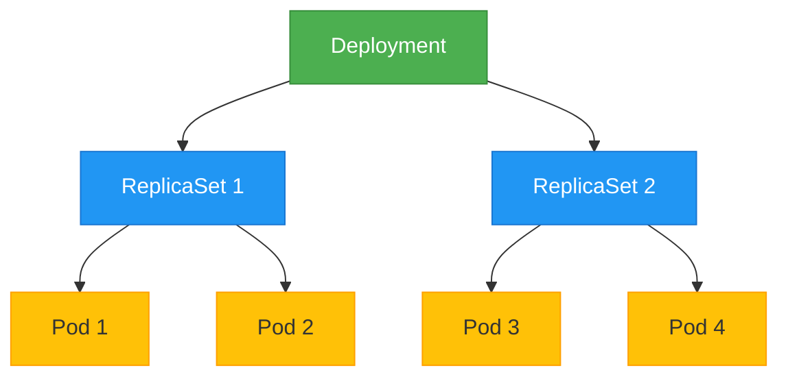

# Kubernetes Deployments

## Introduction

Deployments are one of the most important resources in Kubernetes. They provide a declarative way to manage application updates and rollbacks while ensuring high availability. If you're new to Kubernetes, understanding Deployments is essential as they form the backbone of application management in a Kubernetes cluster.

In this guide, we'll explore what Deployments are, how they work, and how to use them effectively in your Kubernetes environment.

## What is a Kubernetes Deployment?

A Deployment is a Kubernetes resource that provides declarative updates for Pods and ReplicaSets. It allows you to:

- Deploy a ReplicaSet (a group of identical Pods)
- Update Pods to a new version
- Roll back to a previous version
- Scale your application up or down
- Pause and resume the deployment process

Deployments work at a higher level than Pods and ReplicaSets, automating the management of these resources based on the desired state you specify.



## Creating a Deployment

Let's start by creating a simple Deployment. A Deployment is defined in a YAML file:

```yaml
apiVersion: apps/v1
kind: Deployment
metadata:
  name: nginx-deployment
  labels:
    app: nginx
spec:
  replicas: 3
  selector:
    matchLabels:
      app: nginx
  template:
    metadata:
      labels:
        app: nginx
    spec:
      containers:
      - name: nginx
        image: nginx:1.14.2
        ports:
        - containerPort: 80
```

Let's break down this YAML file:

- `apiVersion`, `kind`, and `metadata`: Standard Kubernetes resource definition fields.
- `spec.replicas`: Specifies the desired number of pods (3 in this case).
- `spec.selector`: Defines how the Deployment finds which Pods to manage.
- `spec.template`: Defines the Pod template used to create the Pods.

You can save this to a file called `nginx-deployment.yaml` and create the Deployment using:

```bash
kubectl apply -f nginx-deployment.yaml
```

The output will be:

```
deployment.apps/nginx-deployment created
```

## Checking Deployment Status

After creating a Deployment, you can check its status:

```bash
kubectl get deployments
```

Output:

```
NAME               READY   UP-TO-DATE   AVAILABLE   AGE
nginx-deployment   3/3     3            3           45s
```

The fields in the output tell you:
- `READY`: The ratio of current/desired replicas
- `UP-TO-DATE`: The number of replicas updated to the latest specification
- `AVAILABLE`: The number of replicas available to users
- `AGE`: The time since the Deployment was created

To see the ReplicaSets created by the Deployment:

```bash
kubectl get rs
```

Output:

```
NAME                          DESIRED   CURRENT   READY   AGE
nginx-deployment-75675f5897   3         3         3       1m
```

And to see the Pods:

```bash
kubectl get pods
```

Output:

```
NAME                                READY   STATUS    RESTARTS   AGE
nginx-deployment-75675f5897-7ci7o   1/1     Running   0          1m
nginx-deployment-75675f5897-kzszj   1/1     Running   0          1m
nginx-deployment-75675f5897-qqcnn   1/1     Running   0          1m
```

## Updating a Deployment

One of the most powerful features of Deployments is the ability to update your application with zero downtime. Let's update our nginx Deployment to use a newer version of the nginx image:

```yaml
apiVersion: apps/v1
kind: Deployment
metadata:
  name: nginx-deployment
  labels:
    app: nginx
spec:
  replicas: 3
  selector:
    matchLabels:
      app: nginx
  template:
    metadata:
      labels:
        app: nginx
    spec:
      containers:
      - name: nginx
        image: nginx:1.16.1  # Updated from 1.14.2
        ports:
        - containerPort: 80
```

Apply the updated configuration:

```bash
kubectl apply -f nginx-deployment.yaml
```

Output:

```
deployment.apps/nginx-deployment configured
```

When you update a Deployment, Kubernetes performs a rolling update:

1. It creates a new ReplicaSet with the updated configuration
2. Gradually scales up the new ReplicaSet
3. Gradually scales down the old ReplicaSet
4. Ensures that at any point, enough Pods are available to serve user traffic

You can watch the rollout status:

```bash
kubectl rollout status deployment/nginx-deployment
```

Output:

```
Waiting for rollout to finish: 1 out of 3 new replicas have been updated...
Waiting for rollout to finish: 2 out of 3 new replicas have been updated...
Waiting for rollout to finish: 2 out of 3 new replicas have been updated...
Waiting for rollout to finish: 1 old replicas are pending termination...
deployment "nginx-deployment" successfully rolled out
```

## Deployment Strategies

Kubernetes Deployments support two strategies:

1. **RollingUpdate (default)**: Gradually replaces old Pods with new ones, ensuring zero downtime.
2. **Recreate**: Terminates all existing Pods before creating new ones, which causes downtime but ensures all Pods run the same version simultaneously.

You can specify the strategy in your Deployment YAML:

```yaml
spec:
  strategy:
    type: RollingUpdate
    rollingUpdate:
      maxSurge: 25%
      maxUnavailable: 25%
```

- `maxSurge`: Maximum number of Pods that can be created over the desired number of Pods
- `maxUnavailable`: Maximum number of Pods that can be unavailable during the update

## Rolling Back a Deployment

If you discover that an update has a problem, you can roll back to a previous version:

```bash
kubectl rollout undo deployment/nginx-deployment
```

Output:

```
deployment.apps/nginx-deployment rolled back
```

You can also roll back to a specific revision:

```bash
# First check the revision history
kubectl rollout history deployment/nginx-deployment

# Then roll back to a specific revision
kubectl rollout undo deployment/nginx-deployment --to-revision=2
```

## Scaling a Deployment

You can scale a Deployment up or down by changing the number of replicas:

```bash
kubectl scale deployment/nginx-deployment --replicas=5
```

Output:

```
deployment.apps/nginx-deployment scaled
```

This command will immediately start creating or terminating Pods to reach the desired number of replicas.

## Pausing and Resuming a Deployment

If you want to make multiple updates to a Deployment without triggering a rollout after each change, you can pause and resume the Deployment:

```bash
# Pause the deployment
kubectl rollout pause deployment/nginx-deployment

# Make changes
kubectl set image deployment/nginx-deployment nginx=nginx:1.17.1

# Resume the deployment
kubectl rollout resume deployment/nginx-deployment
```

## Real-World Example: Deploying a Web Application

Let's create a more realistic example of deploying a web application with a database. We'll deploy a simple Node.js application that connects to MongoDB:

```yaml
apiVersion: apps/v1
kind: Deployment
metadata:
  name: nodejs-app
spec:
  replicas: 3
  selector:
    matchLabels:
      app: nodejs-app
  template:
    metadata:
      labels:
        app: nodejs-app
    spec:
      containers:
      - name: nodejs
        image: my-nodejs-app:1.0
        ports:
        - containerPort: 3000
        env:
        - name: MONGO_URL
          value: mongodb://mongo-service:27017/myapp
        resources:
          limits:
            cpu: "500m"
            memory: "512Mi"
          requests:
            cpu: "200m"
            memory: "256Mi"
---
apiVersion: apps/v1
kind: Deployment
metadata:
  name: mongo
spec:
  replicas: 1
  selector:
    matchLabels:
      app: mongo
  template:
    metadata:
      labels:
        app: mongo
    spec:
      containers:
      - name: mongo
        image: mongo:4.4
        ports:
        - containerPort: 27017
        volumeMounts:
        - name: mongo-data
          mountPath: /data/db
      volumes:
      - name: mongo-data
        persistentVolumeClaim:
          claimName: mongo-pvc
---
apiVersion: v1
kind: Service
metadata:
  name: nodejs-app-service
spec:
  selector:
    app: nodejs-app
  ports:
  - port: 80
    targetPort: 3000
  type: LoadBalancer
---
apiVersion: v1
kind: Service
metadata:
  name: mongo-service
spec:
  selector:
    app: mongo
  ports:
  - port: 27017
    targetPort: 27017
  type: ClusterIP
```

This example includes:
- A Node.js application Deployment with 3 replicas
- A MongoDB Deployment with 1 replica (databases typically don't need multiple replicas in the same way)
- Services to expose both the application and database
- Resource limits and requests for the application
- Environment variables to configure the application
- Volume mounts for database persistence

## Best Practices for Deployments

1. **Always specify resource requests and limits** to ensure your application has the resources it needs and doesn't consume too many resources.

2. **Use probes to improve reliability**:
   ```yaml
   livenessProbe:
     httpGet:
       path: /health
       port: 3000
     initialDelaySeconds: 30
     periodSeconds: 10
   readinessProbe:
     httpGet:
       path: /ready
       port: 3000
     initialDelaySeconds: 5
     periodSeconds: 5
   ```

3. **Set up proper labels and selectors** to organize your resources and enable service discovery.

4. **Use namespaces** to isolate different environments or applications:
   ```bash
   kubectl create namespace production
   kubectl apply -f deployment.yaml -n production
   ```

5. **Implement proper update strategy** based on your application requirements.

6. **Store sensitive data in Secrets**, not directly in the Deployment YAML:
   ```yaml
   env:
     - name: DATABASE_PASSWORD
       valueFrom:
         secretKeyRef:
           name: app-secrets
           key: db-password
   ```

7. **Use ConfigMaps for configuration** to keep your Deployment YAML clean and reusable:
   ```yaml
   envFrom:
     - configMapRef:
         name: app-config
   ```

## Summary

Kubernetes Deployments provide a powerful way to manage the lifecycle of your applications. They:

- Ensure high availability through replication
- Enable seamless updates through rolling deployments
- Support easy rollbacks when issues occur
- Allow flexible scaling based on demand
- Automate the management of Pods and ReplicaSets

Understanding how to create, update, and manage Deployments is a fundamental skill for working with Kubernetes. With the knowledge from this guide, you should be able to deploy and manage applications in a Kubernetes cluster with confidence.

## Further Resources and Exercises

### Resources

- [Official Kubernetes Documentation on Deployments](https://kubernetes.io/docs/concepts/workloads/controllers/deployment/)
- [Kubernetes Deployment Strategies](https://kubernetes.io/docs/concepts/workloads/controllers/deployment/#strategy)
- [kubectl Cheat Sheet](https://kubernetes.io/docs/reference/kubectl/cheatsheet/)

### Exercises

1. Create a Deployment for a web application of your choice.
2. Update the Deployment to use a different container image version.
3. Scale the Deployment up and down and observe the changes.
4. Perform a rollback to a previous version.
5. Implement readiness and liveness probes for your Deployment.
6. Create a Deployment with multiple containers in a Pod.
7. Set up a blue-green deployment pattern using two Deployments and a Service.