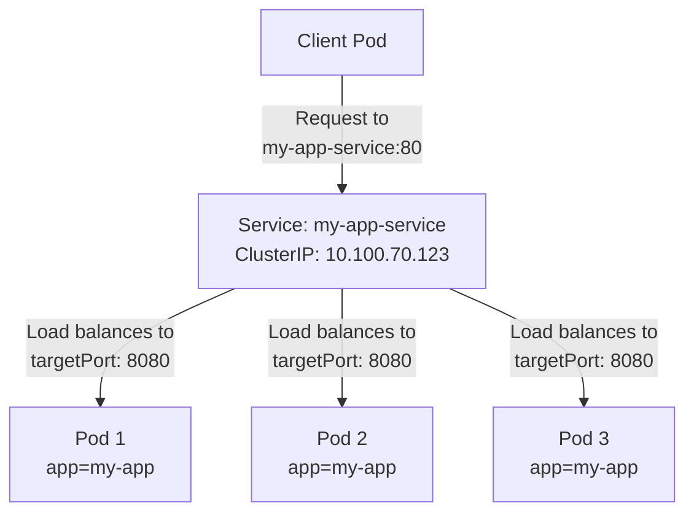
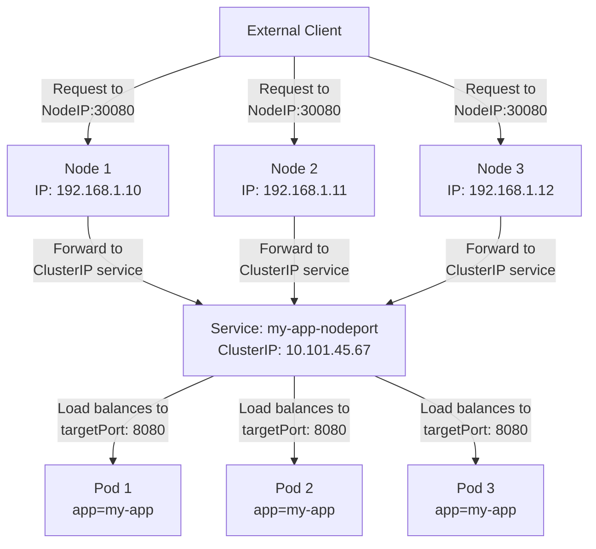
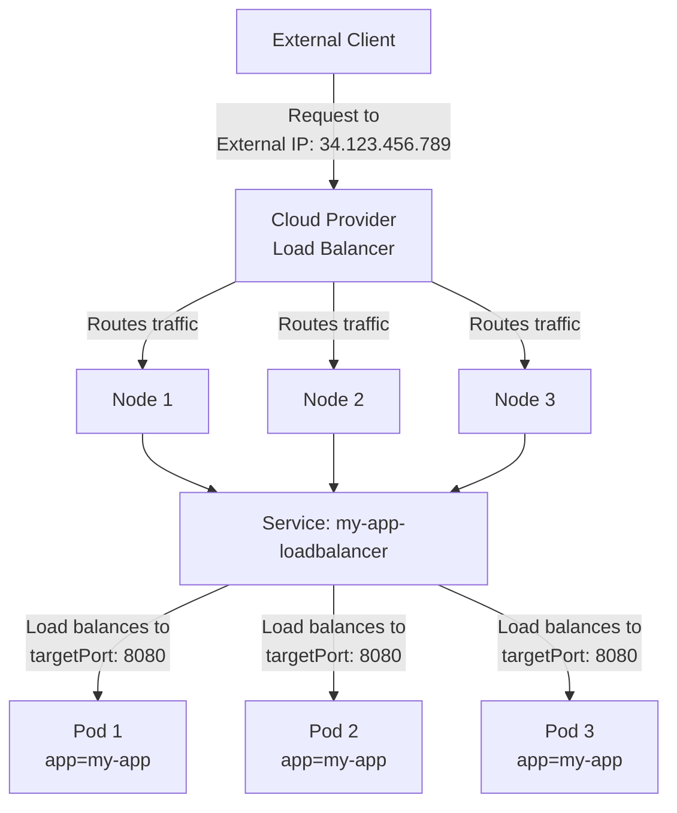
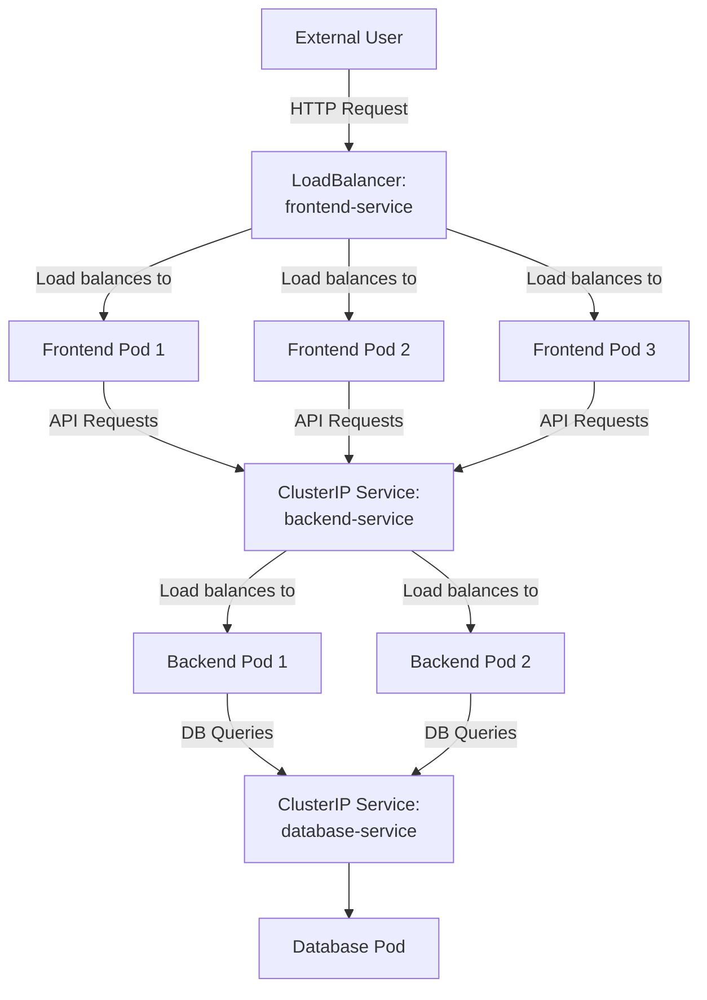

# Kubernetes Services

## Introduction

In Kubernetes, a **Service** is an abstraction that defines a logical set of Pods and a policy to access them. Services enable network connectivity to a set of Pods, allowing them to communicate with each other or with other applications outside the cluster.

Think of Services as the entry point to a group of containers that are running your application. Without Services, Pods might communicate directly with other Pods using their IP addresses, but this approach has several limitations:

- Pod IP addresses are not stable and change when Pods are recreated
- Scaling up or down changes the number of Pods and their addresses
- Container orchestration replaces unhealthy Pods, giving them new IPs

Services solve these problems by providing:

- A stable network endpoint (IP address and port)
- Load balancing across multiple Pod instances
- Service discovery via DNS
- External access to applications running in the cluster

Let's dive into how Services work and how to use them effectively in your Kubernetes deployments.

## Service Types

Kubernetes offers several types of Services to suit different access requirements:

1. **ClusterIP**: Exposes the Service on an internal IP in the cluster
2. **NodePort**: Exposes the Service on each Node's IP at a static port
3. **LoadBalancer**: Exposes the Service externally using a cloud provider's load balancer
4. **ExternalName**: Maps the Service to the contents of the `externalName` field
5. **Headless Services**: When you don't need load-balancing or a single Service IP

Let's explore each type in detail.

## ClusterIP Services

ClusterIP is the default Service type in Kubernetes. It gives the Service a stable internal IP address within the cluster, making the Service accessible only within the cluster.

### Example: Creating a ClusterIP Service

Here's a simple example of a ClusterIP Service that routes traffic to Pods with the label `app: my-app`:

```yaml
apiVersion: v1
kind: Service
metadata:
  name: my-app-service
spec:
  type: ClusterIP
  selector:
    app: my-app
  ports:
    - port: 80        # Port exposed by the service
      targetPort: 8080  # Port that the container accepts traffic on
```

To apply this configuration:

```bash
kubectl apply -f my-app-service.yaml
```

Output:
```
service/my-app-service created
```

You can view the created service:

```bash
kubectl get services
```

Output:
```
NAME             TYPE        CLUSTER-IP      EXTERNAL-IP   PORT(S)   AGE
kubernetes       ClusterIP   10.96.0.1       <none>        443/TCP   24h
my-app-service   ClusterIP   10.100.70.123   <none>        80/TCP    5s
```

### How it works

Here's a diagram of how a ClusterIP Service works:



Any Pod within the cluster can access this Service using the name `my-app-service` or its ClusterIP address.

## NodePort Services

A NodePort Service exposes the Service on a static port on each Node's IP address. This makes the Service accessible from outside the cluster by using `<NodeIP>:<NodePort>`.

### Example: Creating a NodePort Service

```yaml
apiVersion: v1
kind: Service
metadata:
  name: my-app-nodeport
spec:
  type: NodePort
  selector:
    app: my-app
  ports:
    - port: 80          # Port exposed internally in the cluster
      targetPort: 8080  # Port that the container accepts traffic on
      nodePort: 30080   # Port exposed on each node (default range: 30000-32767)
```

Apply this configuration:

```bash
kubectl apply -f my-app-nodeport.yaml
```

Output:
```
service/my-app-nodeport created
```

Verify the service:

```bash
kubectl get services
```

Output:
```
NAME              TYPE        CLUSTER-IP      EXTERNAL-IP   PORT(S)        AGE
kubernetes        ClusterIP   10.96.0.1       <none>        443/TCP        24h
my-app-service    ClusterIP   10.100.70.123   <none>        80/TCP         10m
my-app-nodeport   NodePort    10.101.45.67    <none>        80:30080/TCP   5s
```

### How it works

Here's a diagram of how a NodePort Service works:



## LoadBalancer Services

The LoadBalancer Service type builds upon NodePort by creating an external load balancer in the cloud provider where the Kubernetes cluster is running. This load balancer routes traffic to the Service's NodePort or directly to the backend Pods.

### Example: Creating a LoadBalancer Service

```yaml
apiVersion: v1
kind: Service
metadata:
  name: my-app-loadbalancer
spec:
  type: LoadBalancer
  selector:
    app: my-app
  ports:
    - port: 80          # Port exposed by the load balancer
      targetPort: 8080  # Port that the container accepts traffic on
```

Apply this configuration:

```bash
kubectl apply -f my-app-loadbalancer.yaml
```

Output:
```
service/my-app-loadbalancer created
```

Check the service (after the load balancer is provisioned):

```bash
kubectl get services
```

Output:
```
NAME                  TYPE           CLUSTER-IP      EXTERNAL-IP      PORT(S)        AGE
kubernetes            ClusterIP      10.96.0.1       <none>           443/TCP        24h
my-app-service        ClusterIP      10.100.70.123   <none>           80/TCP         20m
my-app-nodeport       NodePort       10.101.45.67    <none>           80:30080/TCP   10m
my-app-loadbalancer   LoadBalancer   10.102.90.12    34.123.456.789   80:32015/TCP   5m
```

### How it works



## ExternalName Services

ExternalName Services map a Service to a DNS name rather than to a selector. This is useful for services outside your Kubernetes cluster that you want to access using the Kubernetes service discovery mechanism.

### Example: Creating an ExternalName Service

```yaml
apiVersion: v1
kind: Service
metadata:
  name: external-database
spec:
  type: ExternalName
  externalName: database.example.com
```

Apply this configuration:

```bash
kubectl apply -f external-database.yaml
```

Output:
```
service/external-database created
```

Now applications in your cluster can access `database.example.com` by simply connecting to `external-database` as if it were a service in your cluster.

## Headless Services

Sometimes you don't need load balancing and a single Service IP. In this case, you can create a "headless" Service by explicitly setting `.spec.clusterIP` to `None`.

### Example: Creating a Headless Service

```yaml
apiVersion: v1
kind: Service
metadata:
  name: my-app-headless
spec:
  clusterIP: None
  selector:
    app: my-app
  ports:
    - port: 80
      targetPort: 8080
```

Apply this configuration:

```bash
kubectl apply -f my-app-headless.yaml
```

Output:
```
service/my-app-headless created
```

For headless Services, Kubernetes doesn't allocate a cluster IP. Instead, it creates DNS A records for each Pod selected by the Service. Applications can retrieve these DNS records to connect directly to the Pods.

## Service Discovery

Kubernetes provides built-in service discovery through DNS. When a Service is created, a DNS entry is automatically created for it, allowing Pods to find and communicate with each other using the Service name.

### DNS-based service discovery

For a Service named `my-app-service` in the namespace `default`:

- Within the same namespace: Pods can access the service at `my-app-service`
- From a different namespace: Pods can access the service at `my-app-service.default`
- The fully qualified domain name is `my-app-service.default.svc.cluster.local`

### Example: Accessing a Service from another Pod

```bash
# Start a temporary Pod to test service discovery
kubectl run temp-pod --rm -it --image=nicolaka/netshoot -- bash
```

From inside the Pod, you can access services by name:

```bash
# Access service via DNS name
curl my-app-service

# Access service via fully qualified domain name
curl my-app-service.default.svc.cluster.local
```

## Service Endpoints

Endpoints are the actual destinations where a Service sends traffic. Kubernetes automatically creates and manages Endpoint objects for Services that have selectors.

### Viewing Endpoints

```bash
kubectl get endpoints my-app-service
```

Output:
```
NAME            ENDPOINTS                                      AGE
my-app-service  10.244.1.5:8080,10.244.2.7:8080,10.244.3.2:8080   1h
```

Each endpoint corresponds to a Pod IP and the target port.

## Real-World Use Case: Microservices Communication

Let's consider a practical example of a microservices application with three components:

1. Frontend service
2. Backend API service
3. Database service

### Step 1: Create deployments for each component

```yaml
# frontend.yaml
apiVersion: apps/v1
kind: Deployment
metadata:
  name: frontend
spec:
  replicas: 3
  selector:
    matchLabels:
      app: frontend
  template:
    metadata:
      labels:
        app: frontend
    spec:
      containers:
      - name: frontend
        image: my-frontend:latest
        ports:
        - containerPort: 80
---
# backend.yaml
apiVersion: apps/v1
kind: Deployment
metadata:
  name: backend
spec:
  replicas: 2
  selector:
    matchLabels:
      app: backend
  template:
    metadata:
      labels:
        app: backend
    spec:
      containers:
      - name: backend
        image: my-backend:latest
        ports:
        - containerPort: 8080
---
# database.yaml
apiVersion: apps/v1
kind: Deployment
metadata:
  name: database
spec:
  replicas: 1
  selector:
    matchLabels:
      app: database
  template:
    metadata:
      labels:
        app: database
    spec:
      containers:
      - name: database
        image: postgres:13
        ports:
        - containerPort: 5432
        env:
        - name: POSTGRES_PASSWORD
          value: "password123"
```

### Step 2: Create services for each component

```yaml
# services.yaml
apiVersion: v1
kind: Service
metadata:
  name: frontend-service
spec:
  type: LoadBalancer
  selector:
    app: frontend
  ports:
  - port: 80
    targetPort: 80
---
apiVersion: v1
kind: Service
metadata:
  name: backend-service
spec:
  type: ClusterIP
  selector:
    app: backend
  ports:
  - port: 8080
    targetPort: 8080
---
apiVersion: v1
kind: Service
metadata:
  name: database-service
spec:
  type: ClusterIP
  selector:
    app: database
  ports:
  - port: 5432
    targetPort: 5432
```

### Step 3: Apply the configurations

```bash
kubectl apply -f frontend.yaml
kubectl apply -f backend.yaml
kubectl apply -f database.yaml
kubectl apply -f services.yaml
```

### System Architecture Diagram



In this architecture:

1. **Frontend Service** is exposed externally with a LoadBalancer for users to access
2. **Backend Service** is internal (ClusterIP) and only accessed by the Frontend
3. **Database Service** is internal (ClusterIP) and only accessed by the Backend

The frontend application would connect to the backend using the service name `backend-service` and the backend would connect to the database using `database-service`. This setup creates a stable network environment even when Pods are being created, deleted, or rescheduled.

## Service Networking Details

### Service IP Addresses

Services get IP addresses from a designated range called the service cluster IP range, which is configured at the Kubernetes API server with the `--service-cluster-ip-range` flag.

### kube-proxy Modes

kube-proxy is responsible for implementing the Service concept in Kubernetes. It can operate in different modes:

1. **User space mode**: The oldest mode, where kube-proxy watches the API server for new Services and creates a proxy for each one.
2. **iptables mode**: The default mode, where kube-proxy installs iptables rules to capture traffic to the service's ClusterIP and redirect it to one of the available backend Pods.
3. **IPVS mode**: A more efficient implementation for clusters with many Services, using Linux IPVS (IP Virtual Server) for load balancing.

### Service Network Traffic Flow

When you access a Service, the traffic follows this path:

1. A client Pod sends traffic to the Service's ClusterIP and port
2. Traffic is intercepted by kube-proxy's iptables rules
3. The rules redirect traffic to a randomly selected Pod's IP and port
4. If the selected Pod is not available, the connection fails and retries (likely hitting a different Pod)

## Practice Exercises

### Exercise 1: Creating a Multi-port Service

Create a Service that exposes multiple ports for a single backend application:

```yaml
apiVersion: v1
kind: Service
metadata:
  name: multi-port-service
spec:
  selector:
    app: my-app
  ports:
  - name: http
    port: 80
    targetPort: 8080
  - name: https
    port: 443
    targetPort: 8443
  - name: metrics
    port: 9090
    targetPort: 9090
```

### Exercise 2: Exposing External Services

Create a Service without selectors to manually manage endpoints:

```yaml
apiVersion: v1
kind: Service
metadata:
  name: external-service
spec:
  ports:
  - port: 80
```

Then create an Endpoints object to define where the traffic should go:

```yaml
apiVersion: v1
kind: Endpoints
metadata:
  name: external-service  # Must match the Service name
subsets:
  - addresses:
    - ip: 192.168.1.100  # External service IP
    ports:
    - port: 8080  # External service port
```

### Exercise 3: Testing Service Discovery

1. Deploy a sample application with multiple replicas
2. Create different types of Services for the application
3. Create a test Pod and connect to each Service to verify connectivity

## Summary

In Kubernetes, Services are a crucial abstraction that enables network communication to a logical group of Pods. They provide:

- **Stable network identities** for ephemeral Pods
- **Load balancing** to distribute traffic among multiple Pods
- **Service discovery** via DNS
- **External access** to applications running in the cluster

The different Service types (ClusterIP, NodePort, LoadBalancer, ExternalName, and Headless) offer flexibility in how you expose your applications, both internally and externally.

When designing your Kubernetes applications, carefully consider your networking requirements and choose the appropriate Service type for each component. Use ClusterIP for internal communication, NodePort or LoadBalancer for external access, and Headless Services when you need direct Pod access.

By mastering Kubernetes Services, you'll be able to create robust, scalable, and accessible applications in your Kubernetes clusters.

## Additional Resources

- [Kubernetes Official Documentation: Service](https://kubernetes.io/docs/concepts/services-networking/service/)
- [Kubernetes Network Plugins](https://kubernetes.io/docs/concepts/extend-kubernetes/compute-storage-net/network-plugins/)
- [Debugging Services](https://kubernetes.io/docs/tasks/debug-application-cluster/debug-service/)
- [Service Topology](https://kubernetes.io/docs/concepts/services-networking/service-topology/)