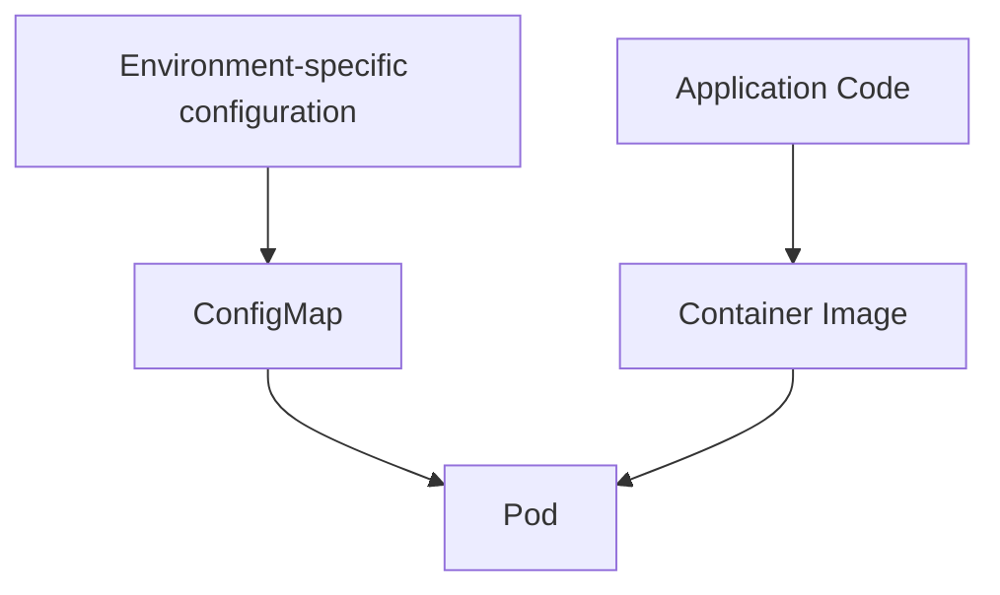

# Kubernetes ConfigMaps

## Introduction

When building applications following modern development practices, one key principle is to separate configuration from code. This separation allows applications to be deployed across different environments (development, staging, production) without modifying the application code itself.

Kubernetes provides a resource called **ConfigMap** to address this exact need. ConfigMaps allow you to decouple environment-specific configuration from your container images, making your applications more portable and easier to manage.

In this tutorial, we'll explore:
- What ConfigMaps are and why they're useful
- How to create ConfigMaps using different methods
- How to use ConfigMaps in your Pods
- Best practices and common use cases

## What is a ConfigMap?

A ConfigMap is a Kubernetes API object that stores non-confidential data in key-value pairs. Pods can consume ConfigMaps as environment variables, command-line arguments, or as configuration files in a volume.

Unlike Secrets, ConfigMaps are not designed for holding confidential data as they are stored unencrypted.



## Creating ConfigMaps

There are several ways to create ConfigMaps in Kubernetes. Let's explore each method:

### Method 1: Creating ConfigMaps from literal values

The simplest way to create a ConfigMap is using literal key-value pairs:

```bash
kubectl create configmap app-config --from-literal=APP_ENV=production --from-literal=APP_DEBUG=false
```

This creates a ConfigMap named `app-config` with two key-value pairs.

### Method 2: Creating ConfigMaps from files

You can also create ConfigMaps from configuration files:

First, let's create a properties file:

```bash
# Create a properties file
echo "app.environment=production" > app.properties
echo "app.debug=false" >> app.properties
```

Then create the ConfigMap from this file:

```bash
kubectl create configmap app-config --from-file=app.properties
```

The entire file becomes a key, and its contents become the value.

### Method 3: Creating ConfigMaps using YAML

You can also create ConfigMaps declaratively using YAML:

```yaml
apiVersion: v1
kind: ConfigMap
metadata:
  name: app-config
data:
  APP_ENV: production
  APP_DEBUG: "false"
  app.properties: |
    app.environment=production
    app.debug=false
```

Apply this YAML with:

```bash
kubectl apply -f configmap.yaml
```

### Viewing ConfigMaps

To check your ConfigMap:

```bash
kubectl get configmap app-config -o yaml
```

Output:
```yaml
apiVersion: v1
kind: ConfigMap
metadata:
  name: app-config
  namespace: default
data:
  APP_DEBUG: "false"
  APP_ENV: production
  app.properties: |
    app.environment=production
    app.debug=false
```

## Using ConfigMaps in Pods

Now that we've created ConfigMaps, let's see how to use them in your applications. There are three main ways to consume ConfigMaps:

### Method 1: Environment Variables

You can expose ConfigMap values as environment variables in a Pod:

```yaml
apiVersion: v1
kind: Pod
metadata:
  name: app-pod
spec:
  containers:
  - name: app-container
    image: nginx
    env:
    - name: ENVIRONMENT
      valueFrom:
        configMapKeyRef:
          name: app-config
          key: APP_ENV
    - name: DEBUG_MODE
      valueFrom:
        configMapKeyRef:
          name: app-config
          key: APP_DEBUG
```

You can also load all values from a ConfigMap as environment variables:

```yaml
apiVersion: v1
kind: Pod
metadata:
  name: app-pod
spec:
  containers:
  - name: app-container
    image: nginx
    envFrom:
    - configMapRef:
        name: app-config
```

### Method 2: ConfigMap as Volume

You can mount a ConfigMap as a volume, which creates files for each key:

```yaml
apiVersion: v1
kind: Pod
metadata:
  name: app-pod
spec:
  containers:
  - name: app-container
    image: nginx
    volumeMounts:
    - name: config-volume
      mountPath: /etc/config
  volumes:
  - name: config-volume
    configMap:
      name: app-config
```

With this configuration, each key-value pair in the ConfigMap will be created as a file in the `/etc/config` directory. For example, you would have:
- `/etc/config/APP_ENV` with content `production`
- `/etc/config/APP_DEBUG` with content `false`
- `/etc/config/app.properties` with the properties file content

### Method 3: Command Line Arguments

You can use ConfigMap values as command-line arguments:

```yaml
apiVersion: v1
kind: Pod
metadata:
  name: app-pod
spec:
  containers:
  - name: app-container
    image: nginx
    command: ["/bin/sh", "-c"]
    args: ["echo $(ENVIRONMENT) && nginx -g 'daemon off;'"]
    env:
    - name: ENVIRONMENT
      valueFrom:
        configMapKeyRef:
          name: app-config
          key: APP_ENV
```

## Real-World Example: Configuring a Web Application

Let's see a complete example where we configure a simple web application using ConfigMaps:

### Step 1: Create a ConfigMap with application settings

```yaml
apiVersion: v1
kind: ConfigMap
metadata:
  name: webapp-config
data:
  config.json: |
    {
      "apiUrl": "https://api.example.com",
      "logLevel": "info",
      "enableCache": "true",
      "maxConnections": "100"
    }
  db.properties: |
    db.host=mysql-service
    db.port=3306
    db.name=webapp
    db.user=webapp-user
```

### Step 2: Create a Deployment that uses the ConfigMap

```yaml
apiVersion: apps/v1
kind: Deployment
metadata:
  name: webapp
spec:
  replicas: 3
  selector:
    matchLabels:
      app: webapp
  template:
    metadata:
      labels:
        app: webapp
    spec:
      containers:
      - name: webapp
        image: nginx
        ports:
        - containerPort: 80
        volumeMounts:
        - name: config-volume
          mountPath: /app/config
        env:
        - name: LOG_LEVEL
          valueFrom:
            configMapKeyRef:
              name: webapp-config
              key: logLevel
        - name: ENABLE_CACHE
          valueFrom:
            configMapKeyRef:
              name: webapp-config
              key: enableCache
      volumes:
      - name: config-volume
        configMap:
          name: webapp-config
```

In this example:
1. We create a ConfigMap with JSON and properties configurations
2. We mount the entire ConfigMap as files in `/app/config`
3. We also extract specific values as environment variables

This makes our application configuration:
- Easy to update without rebuilding container images
- Environment-specific without code changes
- Version-controlled alongside the application

## ConfigMap Updates and Hot Reloading

When you update a ConfigMap, Kubernetes doesn't automatically update the Pods using it. There are a few ways to handle updates:

1. **For volume mounts**: Kubernetes will eventually sync the updated ConfigMap to the volume. The time can vary but is typically under a minute. The application must be designed to reload its configuration.

2. **For environment variables**: These don't update automatically. You need to restart the Pod to get the new values.

For production applications, you often need to implement a solution to detect and reload configuration changes. Some options include:

- Using a file watcher in your application
- Implementing a sidecar container to detect changes
- Using third-party tools like Kubernetes ConfigMap Reload

## Best Practices

Here are some best practices when working with ConfigMaps:

1. **Don't store sensitive data**: Use Secrets instead of ConfigMaps for credentials, tokens, or any sensitive information.

2. **Keep ConfigMaps small**: Avoid storing large files as they might impact etcd performance.

3. **Organize related configurations**: Group related configuration into a single ConfigMap rather than creating many small ones.

4. **Use meaningful names**: Name your ConfigMaps and their keys clearly to indicate their purpose.

5. **Consider immutability**: For critical configurations, consider creating new ConfigMaps with version suffixes rather than updating existing ones.

6. **Version control**: Store your ConfigMap YAML files in your source repository.

7. **Validate configuration**: Implement validation for configuration values in your application to fail fast if given invalid settings.

## Common Issues and Troubleshooting

### Issue 1: ConfigMap Not Found

If your Pod can't find a ConfigMap, check:
- Is the ConfigMap in the same namespace as the Pod?
- Is the ConfigMap name spelled correctly?
- Has the ConfigMap been created before the Pod?

### Issue 2: Configuration Not Updated

If updates to your ConfigMap aren't reflected:
- For environment variables: restart your Pods
- For mounted volumes: check if your application rereads configuration files
- Verify the update was successful with `kubectl get configmap <name> -o yaml`

## Summary

ConfigMaps are a powerful way to decouple configuration from your application code in Kubernetes. They allow you to:

- Store configuration data separately from application code
- Update configuration without rebuilding container images
- Use the same container image across different environments
- Mount configuration as files or expose them as environment variables

By leveraging ConfigMaps effectively, you can build more maintainable, portable, and environment-agnostic applications on Kubernetes.

## Exercises

1. Create a ConfigMap with database connection settings and mount it to a Pod.
2. Update a ConfigMap and observe how the changes propagate to mounted volumes.
3. Convert an application to use ConfigMaps instead of hardcoded configuration.
4. Create a ConfigMap from multiple files and access the values in a Pod.
5. Implement a simple application that reloads its configuration when the ConfigMap changes.

## Additional Resources

- [Kubernetes Documentation: ConfigMaps](https://kubernetes.io/docs/concepts/configuration/configmap/)
- [Kubernetes Patterns: Configuration](https://kubernetes.io/docs/concepts/configuration/)
- [12-Factor App: Configuration](https://12factor.net/config)