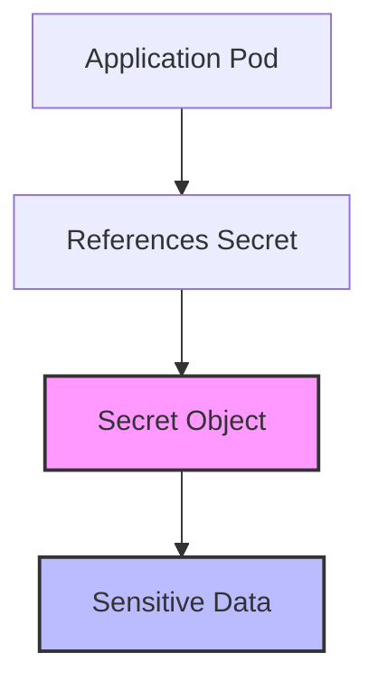

# Kubernetes Secrets

## Introduction

When deploying applications in Kubernetes, you often need to manage sensitive information such as passwords, OAuth tokens, SSH keys, and API keys. Storing this sensitive data in plain text within Pod specifications or container images poses significant security risks.

Kubernetes Secrets provide a solution to this problem by allowing you to store and manage sensitive information separately from your application code. Secrets are Kubernetes objects designed specifically for holding small amounts of confidential data, ensuring that sensitive information isn't exposed in your cluster configuration.

## What Are Kubernetes Secrets?

A Secret is a Kubernetes object that stores sensitive data in a way that's more secure than putting it in a Pod specification or container image. Secrets can be mounted as data volumes or exposed as environment variables to be used by a container in a Pod.



## Types of Secrets

Kubernetes supports several built-in types of Secrets:

- **Opaque**: The default type, arbitrary user-defined data
- **kubernetes.io/service-account-token**: Service account tokens
- **kubernetes.io/dockerconfigjson**: For storing Docker registry credentials
- **kubernetes.io/tls**: For storing TLS certificates
- **kubernetes.io/ssh-auth**: For storing SSH authentication credentials
- **kubernetes.io/basic-auth**: For storing basic authentication credentials

## Creating Secrets

### 1. Creating Secrets Using YAML Files

You can create a Secret by defining a YAML file and using `kubectl apply`:

```yaml
apiVersion: v1
kind: Secret
metadata:
  name: db-credentials
type: Opaque
data:
  username: YWRtaW4= # base64 encoded "admin"
  password: cGFzc3dvcmQxMjM= # base64 encoded "password123"
```

Important: The values in the `data` field must be base64-encoded. You can encode a string using:

```bash
echo -n 'admin' | base64
# Output: YWRtaW4=
```

To apply the Secret:

```bash
kubectl apply -f secret.yaml
```

### 2. Creating Secrets Using kubectl

You can create Secrets directly with the `kubectl create secret` command:

```bash
kubectl create secret generic db-credentials \
  --from-literal=username=admin \
  --from-literal=password=password123
```

### 3. Creating Secrets from Files

For secrets stored in files (like SSL certificates):

```bash
kubectl create secret generic tls-certs \
  --from-file=key.pem \
  --from-file=cert.pem
```

## Using Secrets

### 1. Using Secrets as Environment Variables

```yaml
apiVersion: v1
kind: Pod
metadata:
  name: secret-env-pod
spec:
  containers:
  - name: mycontainer
    image: redis
    env:
      - name: DATABASE_USER
        valueFrom:
          secretKeyRef:
            name: db-credentials
            key: username
      - name: DATABASE_PASSWORD
        valueFrom:
          secretKeyRef:
            name: db-credentials
            key: password
```

### 2. Using Secrets as Files in a Volume

```yaml
apiVersion: v1
kind: Pod
metadata:
  name: secret-vol-pod
spec:
  containers:
  - name: mycontainer
    image: redis
    volumeMounts:
    - name: secret-volume
      mountPath: "/etc/secrets"
      readOnly: true
  volumes:
  - name: secret-volume
    secret:
      secretName: db-credentials
```

With this configuration, you'll find files named `username` and `password` in the `/etc/secrets` directory of the container, containing the decoded secret values.

## Best Practices for Using Secrets

1. **Limit access to Secrets**: Use RBAC (Role-Based Access Control) to restrict who can view and modify Secrets.
2. **Don't commit Secrets to source control**: Keep your Secret YAML files out of Git repositories.
3. **Enable encryption at rest**: Configure etcd (Kubernetes' data store) to encrypt Secret data.
4. **Use minimal Secret access**: Only give Pods access to the Secrets they need.
5. **Consider using a dedicated secrets management solution**: For production environments, consider tools like HashiCorp Vault, AWS Secrets Manager, or Azure Key Vault.
6. **Regularly rotate Secret values**: Update your Secrets periodically to minimize the impact of potential breaches.

## Real-World Example: Deploying a Database with Secrets

Let's walk through a complete example of deploying a PostgreSQL database using Secrets for credentials:

### Step 1: Create the Secrets

```bash
kubectl create secret generic postgres-credentials \
  --from-literal=POSTGRES_USER=dbadmin \
  --from-literal=POSTGRES_PASSWORD=complex-password-here \
  --from-literal=POSTGRES_DB=myapp
```

### Step 2: Create a PostgreSQL Deployment

```yaml
apiVersion: apps/v1
kind: Deployment
metadata:
  name: postgres
spec:
  selector:
    matchLabels:
      app: postgres
  template:
    metadata:
      labels:
        app: postgres
    spec:
      containers:
      - name: postgres
        image: postgres:13
        ports:
        - containerPort: 5432
        envFrom:
        - secretRef:
            name: postgres-credentials
        volumeMounts:
        - name: postgres-storage
          mountPath: /var/lib/postgresql/data
      volumes:
      - name: postgres-storage
        persistentVolumeClaim:
          claimName: postgres-pvc
```

### Step 3: Create a Service to Expose PostgreSQL

```yaml
apiVersion: v1
kind: Service
metadata:
  name: postgres
spec:
  selector:
    app: postgres
  ports:
  - port: 5432
    targetPort: 5432
  type: ClusterIP
```

### Step 4: Deploy an Application That Uses the Database

```yaml
apiVersion: apps/v1
kind: Deployment
metadata:
  name: myapp
spec:
  selector:
    matchLabels:
      app: myapp
  template:
    metadata:
      labels:
        app: myapp
    spec:
      containers:
      - name: myapp
        image: myapp:latest
        env:
        - name: DB_HOST
          value: postgres
        - name: DB_PORT
          value: "5432"
        - name: DB_NAME
          valueFrom:
            secretKeyRef:
              name: postgres-credentials
              key: POSTGRES_DB
        - name: DB_USER
          valueFrom:
            secretKeyRef:
              name: postgres-credentials
              key: POSTGRES_USER
        - name: DB_PASSWORD
          valueFrom:
            secretKeyRef:
              name: postgres-credentials
              key: POSTGRES_PASSWORD
```

## Viewing and Managing Secrets

List all Secrets in a namespace:

```bash
kubectl get secrets
```

Output:
```
NAME                    TYPE                 DATA   AGE
db-credentials          Opaque               2      45m
postgres-credentials    Opaque               3      30m
default-token-abc123    kubernetes.io/token  3      1d
```

View details about a specific Secret:

```bash
kubectl describe secret db-credentials
```

Output:
```
Name:         db-credentials
Namespace:    default
Labels:       <none>
Annotations:  <none>

Type:  Opaque

Data
====
password:  11 bytes
username:  5 bytes
```

Note that `kubectl describe` doesn't show the Secret values, only the size of each value.

To decode a Secret:

```bash
kubectl get secret db-credentials -o jsonpath='{.data.username}' | base64 --decode
# Output: admin
```

To delete a Secret:

```bash
kubectl delete secret db-credentials
```

## Limitations and Considerations

1. **Secrets are stored in etcd**: By default, Secrets are stored unencrypted in etcd. Make sure to enable encryption at rest.

2. **Secret size limits**: Individual Secrets are limited to 1MB in size.

3. **Pod/Secret affinity**: A Pod can only use Secrets in the same namespace.

4. **Secret immutability**: Once created, the keys of a Secret cannot be changed; you must create a new Secret.

5. **No built-in rotation**: Kubernetes doesn't automatically rotate Secret values; you need to handle this manually or with external tools.

## Summary

Kubernetes Secrets provide a structured way to manage sensitive information within your cluster. By separating credentials and other sensitive data from your application code and configuration, you enhance security and simplify credential management.

In this guide, we've covered:
- What Kubernetes Secrets are and why they're important
- Different types of Secrets
- How to create Secrets using YAML, kubectl commands, and files
- How to use Secrets as environment variables and mounted volumes
- Best practices for Secret management
- A real-world example of using Secrets with a database deployment
- How to view and manage your Secrets

While Secrets offer significant improvements over hardcoded credentials, remember that for production-grade security, you should consider additional measures like encryption at rest, RBAC, and potentially integrating with dedicated secret management solutions.

## Additional Resources

1. Official Kubernetes documentation on Secrets
2. Learn about Secret encryption at rest
3. Explore external secret management tools like HashiCorp Vault, AWS Secrets Manager, or Azure Key Vault
4. Check out the Kubernetes Secrets Store CSI Driver for integrating external secret stores

## Exercises

1. Create a Secret with multiple key-value pairs and mount it as environment variables in a Pod.
2. Create a Secret from files (like TLS certificates) and mount them as a volume in a Pod.
3. Try using the `stringData` field in a Secret YAML to avoid manual base64 encoding.
4. Create a Pod that uses multiple Secrets for different purposes.
5. Set up a simple application that reads configuration from Secrets and displays (non-sensitive parts of) the configuration.