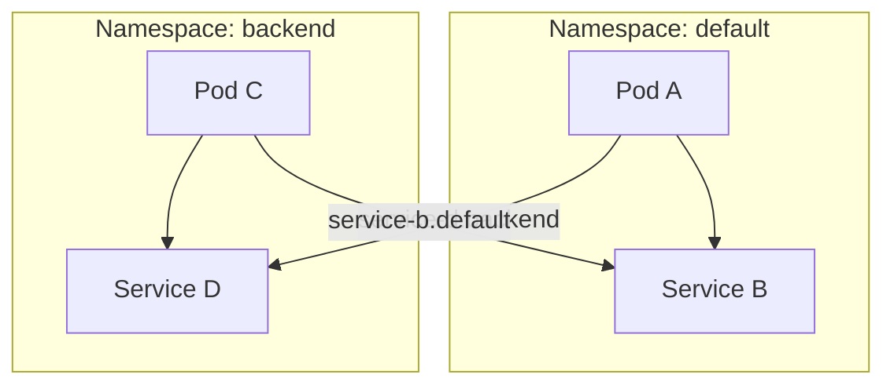

# Kubernetes Namespaces

## Introduction

In Kubernetes, **namespaces** provide a mechanism for isolating groups of resources within a single cluster. They are a fundamental way to organize and separate your applications, teams, and workloads from one another. Think of namespaces as virtual clusters inside your Kubernetes cluster - they help you manage different environments, applications, and teams with clear boundaries.

Namespaces are especially important as your Kubernetes deployment grows in size and complexity. They allow you to:

- Divide cluster resources among multiple users or teams
- Limit resource consumption per namespace
- Isolate resources to prevent naming conflicts
- Apply different access controls to different namespaces
- Organize related resources together

## Default Namespaces in Kubernetes

When you first set up a Kubernetes cluster, it comes with several pre-configured namespaces:

1. **default**: The namespace where all resources are placed if no namespace is specified
2. **kube-system**: Contains system components managed by Kubernetes
3. **kube-public**: Contains publicly accessible data, readable by all users
4. **kube-node-lease**: Holds node lease objects used for node heartbeat data

Let's see how to list these namespaces:

```bash
# List all namespaces in the cluster
kubectl get namespaces

# Output:
NAME              STATUS   AGE
default           Active   1d
kube-node-lease   Active   1d
kube-public       Active   1d
kube-system       Active   1d
```

## Creating a Namespace

Creating a namespace is straightforward with the `kubectl create namespace` command:

```bash
# Create a new namespace
kubectl create namespace my-app

# Output:
namespace/my-app created
```

Alternatively, you can create a namespace using a YAML file:

```yaml
# namespace.yaml
apiVersion: v1
kind: Namespace
metadata:
  name: development
```

Then apply it:

```bash
kubectl apply -f namespace.yaml

# Output:
namespace/development created
```

## Working with Resources in Namespaces

When you create resources, you can specify which namespace they belong to. Here's how to create a deployment in a specific namespace:

```bash
# Create a deployment in the 'my-app' namespace
kubectl create deployment nginx --image=nginx --namespace=my-app

# Output:
deployment.apps/nginx created
```

To retrieve resources from a specific namespace:

```bash
# List pods in the 'my-app' namespace
kubectl get pods --namespace=my-app

# Output:
NAME                     READY   STATUS    RESTARTS   AGE
nginx-6799fc88d8-5vfjs   1/1     Running   0          30s
```

You can also set your default namespace to avoid typing `--namespace` in every command:

```bash
# Set the default namespace for kubectl commands
kubectl config set-context --current --namespace=my-app

# Output:
Context "kubernetes-admin@kubernetes" modified.
```

## Namespace Isolation

Namespaces provide isolation at several levels:

1. **Resource names**: Resources of the same kind must have unique names within a namespace, but can share names across namespaces
2. **Resource quotas**: You can limit the amount of CPU, memory, and storage a namespace can use
3. **Network policies**: You can control network traffic between pods in different namespaces

Let's see how to set resource quotas for a namespace:

```yaml
# resource-quota.yaml
apiVersion: v1
kind: ResourceQuota
metadata:
  name: compute-quota
  namespace: development
spec:
  hard:
    pods: "10"
    requests.cpu: "4"
    requests.memory: 8Gi
    limits.cpu: "8"
    limits.memory: 16Gi
```

Apply it:

```bash
kubectl apply -f resource-quota.yaml

# Output:
resourcequota/compute-quota created
```

Check the quota:

```bash
kubectl get resourcequota --namespace=development

# Output:
NAME            AGE   REQUEST                                          LIMIT
compute-quota   30s   pods: 0/10, requests.cpu: 0/4, requests.memory: 0/8Gi   limits.cpu: 0/8, limits.memory: 0/16Gi
```

## Namespaces and DNS

Kubernetes creates DNS entries for services in the format: `<service-name>.<namespace-name>.svc.cluster.local`

This means:
- Within the same namespace, pods can refer to services just by their names: `my-service`
- To reach services in a different namespace, use: `my-service.other-namespace`

Let's visualize this with a diagram:



## Practical Example: Multi-Environment Setup

Let's walk through a practical example of using namespaces to separate development, staging, and production environments:

1. First, create the namespaces:

```bash
kubectl create namespace dev
kubectl create namespace staging
kubectl create namespace production
```

2. Deploy the same application to each namespace with environment-specific configurations:

```yaml
# dev-deployment.yaml
apiVersion: apps/v1
kind: Deployment
metadata:
  name: web-app
  namespace: dev
spec:
  replicas: 1
  selector:
    matchLabels:
      app: web-app
  template:
    metadata:
      labels:
        app: web-app
    spec:
      containers:
      - name: web-app
        image: my-web-app:latest
        env:
        - name: ENVIRONMENT
          value: "development"
```

```yaml
# staging-deployment.yaml
apiVersion: apps/v1
kind: Deployment
metadata:
  name: web-app
  namespace: staging
spec:
  replicas: 2
  selector:
    matchLabels:
      app: web-app
  template:
    metadata:
      labels:
        app: web-app
    spec:
      containers:
      - name: web-app
        image: my-web-app:stable
        env:
        - name: ENVIRONMENT
          value: "staging"
```

```yaml
# production-deployment.yaml
apiVersion: apps/v1
kind: Deployment
metadata:
  name: web-app
  namespace: production
spec:
  replicas: 5
  selector:
    matchLabels:
      app: web-app
  template:
    metadata:
      labels:
        app: web-app
    spec:
      containers:
      - name: web-app
        image: my-web-app:v1.2.3
        env:
        - name: ENVIRONMENT
          value: "production"
```

3. Apply these deployments:

```bash
kubectl apply -f dev-deployment.yaml
kubectl apply -f staging-deployment.yaml
kubectl apply -f production-deployment.yaml
```

4. Now you can manage each environment separately:

```bash
# Get pods in each environment
kubectl get pods -n dev
kubectl get pods -n staging
kubectl get pods -n production
```

## Namespace Limitations

It's important to understand what namespaces do not provide:

1. **No nested namespaces**: Namespaces cannot be nested inside one another
2. **Some resources are cluster-wide**: Certain resources like Nodes and PersistentVolumes are not namespaced
3. **No automatic security isolation**: Just using namespaces doesn't provide complete security isolation

To check if a resource is namespaced:

```bash
# Check if a resource type is namespaced
kubectl api-resources --namespaced=true | grep deployment
kubectl api-resources --namespaced=false | grep node

# Output example:
# Namespaced resources
deployments                       deploy       apps/v1                           true         Deployment

# Non-namespaced resources
nodes                             no           v1                                false        Node
```

## Best Practices for Using Namespaces

1. **Use descriptive names**: Choose meaningful namespace names that reflect their purpose
2. **Set resource quotas**: Limit resources to prevent one namespace from consuming all cluster resources
3. **Create namespace standards**: Establish naming conventions and what should go in each namespace
4. **Use labels alongside namespaces**: Labels provide additional ways to organize and select resources
5. **Set RBAC policies**: Use Role-Based Access Control to restrict who can access which namespaces
6. **Keep the number manageable**: Don't create too many namespaces as it can become difficult to manage

## Summary

Kubernetes namespaces provide a powerful way to organize and isolate resources within your cluster. They help teams work independently while sharing the same infrastructure, manage different environments, and provide a foundation for access control and resource limits.

Key points we've covered:
- Namespaces act as virtual clusters within your Kubernetes cluster
- Default namespaces include `default`, `kube-system`, `kube-public`, and `kube-node-lease`
- Creating and working with namespaces using `kubectl`
- Resource isolation and quotas per namespace
- DNS resolution works across namespaces using the format `<service>.<namespace>.svc.cluster.local`
- Practical application in multi-environment setups
- Limitations of namespaces and best practices

## Exercises

1. Create a namespace for a fictitious application and deploy a simple Nginx server in it.
2. Set up resource quotas for your namespace limiting it to 2 CPUs and 4GB of memory.
3. Create a second namespace and a service in each namespace. Try to call one service from a pod in the other namespace.
4. List all the non-namespaced resources in your Kubernetes cluster.
5. Set up a namespace for a development team with appropriate RBAC permissions.

## Additional Resources

- [Kubernetes Official Documentation on Namespaces](https://kubernetes.io/docs/concepts/overview/working-with-objects/namespaces/)
- [Kubernetes Namespace Resource Quotas](https://kubernetes.io/docs/concepts/policy/resource-quotas/)
- [Sharing a Kubernetes Cluster with Namespaces](https://kubernetes.io/docs/tasks/administer-cluster/namespaces/)