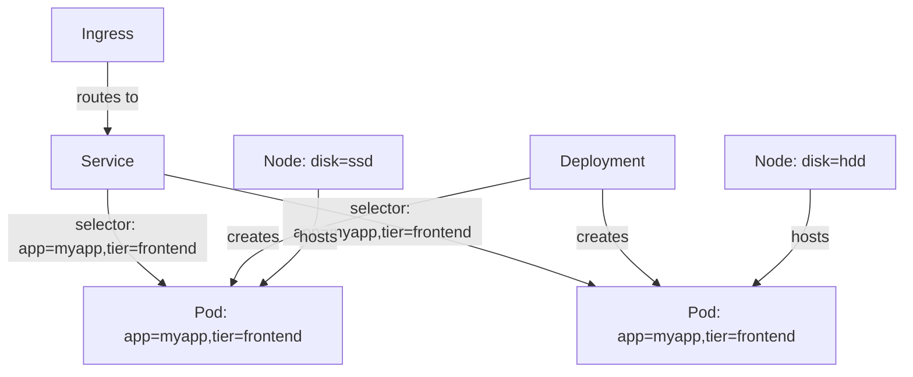

# Kubernetes Labels

## Introduction

Labels in Kubernetes are key-value pairs that are attached to objects such as pods, services, and deployments. They are used to organize and categorize Kubernetes objects in a meaningful and efficient way. Labels provide a flexible mechanism for identifying, grouping, and selecting resources based on your organizational needs.

Unlike names and UIDs, which uniquely identify objects, labels do not provide uniqueness. Many objects can share the same label(s), making them a powerful tool for organizing related resources.

## Basic Label Concepts

### What Are Labels?

Labels are simple key-value pairs attached to Kubernetes objects:

```yaml
metadata:
  labels:
    key1: value1
    key2: value2
```

Some examples of common labels include:
- `app: frontend`
- `environment: production`
- `tier: backend`
- `version: v1.2.3`

### Label Syntax Rules

Labels must follow these rules:

1. **Keys**:
   - Must be 63 characters or less
   - Can begin with an alphanumeric character or with certain prefixes followed by a slash
   - May contain alphanumerics, dots, dashes, and underscores
   - May include a domain prefix (e.g., `example.com/my-label`)

2. **Values**:
   - Must be 63 characters or less
   - Can be empty
   - Must start and end with an alphanumeric character
   - May contain alphanumerics, dots, dashes, and underscores

## Adding Labels to Kubernetes Resources

### Adding Labels During Creation

You can add labels when first creating a resource:

```yaml
apiVersion: v1
kind: Pod
metadata:
  name: my-pod
  labels:
    app: web
    environment: production
    tier: frontend
spec:
  containers:
  - name: nginx
    image: nginx:1.19
```

### Adding or Modifying Labels for Existing Resources

You can add or modify labels on existing resources using the `kubectl label` command:

```bash
# Adding a label to a pod
kubectl label pod my-pod version=v1.0.0

# Overwriting an existing label
kubectl label --overwrite pod my-pod environment=staging

# Adding labels to multiple pods at once
kubectl label pod my-pod1 my-pod2 my-pod3 tier=backend
```

### Removing Labels

To remove a label, append a `-` (minus) sign to the label key:

```bash
kubectl label pod my-pod environment-
```

## Label Selectors

The real power of labels comes from the ability to select and filter resources using label selectors.

### Types of Selectors

1. **Equality-based selectors**:
   - `=`, `==` (equals)
   - `!=` (not equals)

2. **Set-based selectors**:
   - `in`: Value must be in a set of defined values
   - `notin`: Value must not be in a set of defined values
   - `exists`: Key must exist (regardless of value)
   - `!`: Key must not exist

### Using Label Selectors with kubectl

Here are examples of using label selectors with `kubectl`:

```bash
# List all pods with environment=production
kubectl get pods -l environment=production

# List all pods with tier not equal to frontend
kubectl get pods -l tier!=frontend

# List pods with app label set to either frontend or backend
kubectl get pods -l 'app in (frontend,backend)'

# Multiple conditions (AND)
kubectl get pods -l 'environment=production,tier=frontend'

# Pods that have the 'version' label defined (any value)
kubectl get pods -l 'version'

# Pods that don't have the 'version' label
kubectl get pods -l '!version'
```

## Practical Applications

### Organizing Microservices

Let's consider a practical example with a microservice architecture that has multiple components:

```yaml
# Frontend Service
apiVersion: v1
kind: Pod
metadata:
  name: frontend-pod
  labels:
    app: myapp
    component: frontend
    environment: production
    version: v1.2.0
spec:
  containers:
  - name: frontend
    image: my-frontend:1.2.0
---
# API Service
apiVersion: v1
kind: Pod
metadata:
  name: api-pod
  labels:
    app: myapp
    component: api
    environment: production
    version: v1.1.5
spec:
  containers:
  - name: api
    image: my-api:1.1.5
---
# Database Service
apiVersion: v1
kind: Pod
metadata:
  name: db-pod
  labels:
    app: myapp
    component: database
    environment: production
    version: v1.0.2
spec:
  containers:
  - name: database
    image: postgres:13
```

With this labeling structure, you can easily:

1. Find all components of the application: `kubectl get pods -l app=myapp`
2. List only the frontend components: `kubectl get pods -l component=frontend`
3. Get all production resources: `kubectl get pods -l environment=production`
4. Find specific versions: `kubectl get pods -l version=v1.2.0`

### Deployments and Services Using Selectors

Labels and selectors are crucial for connecting Kubernetes resources. Here's how a Deployment and Service use label selectors:

```yaml
# Deployment that creates pods with specific labels
apiVersion: apps/v1
kind: Deployment
metadata:
  name: frontend-deployment
spec:
  replicas: 3
  selector:
    matchLabels:
      app: myapp
      component: frontend
  template:
    metadata:
      labels:
        app: myapp
        component: frontend
        environment: production
    spec:
      containers:
      - name: frontend
        image: my-frontend:1.2.0
---
# Service that selects pods with matching labels
apiVersion: v1
kind: Service
metadata:
  name: frontend-service
spec:
  selector:
    app: myapp
    component: frontend
  ports:
  - port: 80
    targetPort: 8080
  type: ClusterIP
```

In this example:
1. The Deployment creates pods with labels `app: myapp`, `component: frontend`, and `environment: production`
2. The Service routes traffic to any pods with labels `app: myapp` and `component: frontend`

This allows for flexible scaling and replacement of pods without breaking service connectivity.

### Rolling Updates with Labels

Labels are essential for performing rolling updates in Kubernetes:

```yaml
apiVersion: apps/v1
kind: Deployment
metadata:
  name: api-deployment
spec:
  replicas: 3
  selector:
    matchLabels:
      app: myapp
      component: api
  strategy:
    type: RollingUpdate
    rollingUpdate:
      maxSurge: 1
      maxUnavailable: 0
  template:
    metadata:
      labels:
        app: myapp
        component: api
        version: v1.2.0  # This will be updated
    spec:
      containers:
      - name: api
        image: my-api:1.2.0
```

When updating to a new version, Kubernetes uses the label selector to identify which pods to replace while maintaining service availability.

### Node Selection with Labels

Labels can be applied to nodes, and then used for pod scheduling:

```shell
# Label a node
kubectl label nodes worker-node-1 disk=ssd
```

```yaml
# Pod that requires SSD storage
apiVersion: v1
kind: Pod
metadata:
  name: database-pod
spec:
  nodeSelector:
    disk: ssd
  containers:
  - name: database
    image: postgres:13
```

This ensures the database pod only runs on nodes with SSDs.

## Visualizing Label Relationships

Here's a diagram showing how labels connect different Kubernetes resources:



## Best Practices for Using Labels

1. **Create a Labeling Strategy**: Develop a consistent labeling scheme across your organization
   
2. **Common Label Dimensions**:
   - `app`: Application name
   - `environment`: dev, test, staging, production
   - `tier/component`: frontend, backend, database
   - `version`: Release or version number
   - `team/owner`: Team responsible for the resource

3. **Avoid Too Many Labels**: While labels are flexible, too many labels can become unwieldy

4. **Document Your Labels**: Create documentation explaining your labeling conventions

5. **Don't Store Non-Identifying Information**: Labels are for identification and selection, not for storing arbitrary metadata

## Example: Complete Application with Labels

Here's a more complete example showing how labels tie together different components:

```yaml
# Frontend Deployment
apiVersion: apps/v1
kind: Deployment
metadata:
  name: frontend
  labels:
    app: online-store
    component: frontend
spec:
  replicas: 3
  selector:
    matchLabels:
      app: online-store
      component: frontend
  template:
    metadata:
      labels:
        app: online-store
        component: frontend
        environment: production
        version: v2.0.1
    spec:
      containers:
      - name: frontend
        image: online-store/frontend:2.0.1
---
# Frontend Service
apiVersion: v1
kind: Service
metadata:
  name: frontend-svc
  labels:
    app: online-store
    component: frontend
spec:
  selector:
    app: online-store
    component: frontend
  ports:
  - port: 80
    targetPort: 8080
  type: ClusterIP
---
# API Deployment
apiVersion: apps/v1
kind: Deployment
metadata:
  name: api
  labels:
    app: online-store
    component: api
spec:
  replicas: 2
  selector:
    matchLabels:
      app: online-store
      component: api
  template:
    metadata:
      labels:
        app: online-store
        component: api
        environment: production
        version: v1.5.2
    spec:
      containers:
      - name: api
        image: online-store/api:1.5.2
---
# API Service
apiVersion: v1
kind: Service
metadata:
  name: api-svc
  labels:
    app: online-store
    component: api
spec:
  selector:
    app: online-store
    component: api
  ports:
  - port: 80
    targetPort: 3000
  type: ClusterIP
```

## Summary

Kubernetes labels are a fundamental feature that enable you to organize, select, and manage your Kubernetes resources effectively. They provide a flexible way to categorize objects and form the basis for many Kubernetes features like selectors in Services, Deployments, and NetworkPolicies.

Key takeaways:
- Labels are key-value pairs attached to Kubernetes objects
- They don't provide uniqueness (unlike names and UIDs)
- Label selectors allow filtering and selecting objects based on their labels
- Services use label selectors to determine which pods to route traffic to
- Deployments use label selectors to manage pod lifecycles
- A well-planned labeling strategy is crucial for managing complex applications

## Practice Exercises

1. Create a pod with at least three different labels and verify they were applied correctly.

2. Create multiple pods with varying labels and practice using different types of selectors to filter them.

3. Create a deployment and service that use label selectors to connect them.

4. Design a labeling strategy for a microservice application with at least 4 different components.

5. Practice a rolling update by changing the version label in a deployment.

## Additional Resources

- [Kubernetes Official Documentation on Labels and Selectors](https://kubernetes.io/docs/concepts/overview/working-with-objects/labels/)
- [Kubernetes Deployments](https://kubernetes.io/docs/concepts/workloads/controllers/deployment/)
- [Kubernetes Services](https://kubernetes.io/docs/concepts/services-networking/service/)