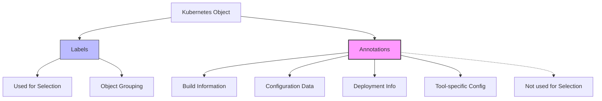

# Kubernetes Annotations

## Introduction

Annotations in Kubernetes are a powerful way to attach arbitrary non-identifying metadata to objects. Unlike labels, annotations are not used for selecting or grouping objects; instead, they allow you to store additional information that can be used by tools, libraries, or extensions to Kubernetes.

Think of annotations as "notes" you attach to your Kubernetes resources to provide extra context, configuration instructions, or to enable specific behaviors in tools that understand those annotations.

## Understanding Kubernetes Annotations

### What Are Annotations?

Annotations are key-value pairs that are attached to Kubernetes objects. They can store information such as:

- Build/release IDs, timestamps, or commit SHAs
- Client library or tool information
- Information for integrating with third-party systems
- Configuration directives for other tools and components

### Annotations vs Labels: Key Differences

| Feature | Annotations | Labels |
|---------|-------------|--------|
| Purpose | Store non-identifying metadata | Identify and select objects |
| Used for selection | No | Yes |
| Size limitations | Can store larger data | Limited to 63 characters |
| Usage | Configuration, tool integration | Grouping, filtering |

## Working with Annotations

### Annotation Format

Annotations are structured as key-value pairs in the metadata section of a Kubernetes resource:

```yaml
apiVersion: v1
kind: Pod
metadata:
  name: my-pod
  annotations:
    example.com/created-by: "john.doe"
    example.com/last-modified: "2023-04-01T12:00:00Z"
    example.com/description: "This is a sample pod for demonstration"
```

### Annotation Keys

Annotation keys should follow these conventions:

- Optional prefix (e.g., `example.com/`)
- The prefix should be a DNS subdomain
- The key name itself should be descriptive

### Adding and Modifying Annotations

You can add annotations when creating resources or modify them afterward:

#### Using YAML Definitions

```yaml
apiVersion: v1
kind: Pod
metadata:
  name: annotated-pod
  annotations:
    example.com/created-by: "deployment-script"
    example.com/version: "v1.2.3"
spec:
  containers:
  - name: nginx
    image: nginx:1.19
```

#### Using kubectl annotate

You can add or update annotations on existing resources:

```bash
# Add a new annotation
kubectl annotate pods my-pod example.com/environment=production

# Update an existing annotation
kubectl annotate pods my-pod example.com/environment=staging --overwrite

# Remove an annotation
kubectl annotate pods my-pod example.com/environment-
```

## Common Use Cases for Annotations

### 1. Build Information

Store information about where and when a resource was built:

```yaml
metadata:
  annotations:
    build.example.com/git-commit: "a1b2c3d4e5f6"
    build.example.com/pipeline-id: "jenkins-1234"
    build.example.com/build-date: "2023-04-01T12:00:00Z"
```

### 2. Deployment Tracking

Track information about deployments:

```yaml
metadata:
  annotations:
    deployment.example.com/deployed-by: "john.doe"
    deployment.example.com/deployed-at: "2023-04-01T15:30:00Z"
    deployment.example.com/release-version: "v1.2.3"
```

### 3. Ingress Controller Configuration

Annotations are heavily used with Ingress controllers to specify behavior:

```yaml
apiVersion: networking.k8s.io/v1
kind: Ingress
metadata:
  name: example-ingress
  annotations:
    nginx.ingress.kubernetes.io/rewrite-target: /
    nginx.ingress.kubernetes.io/ssl-redirect: "true"
    nginx.ingress.kubernetes.io/proxy-body-size: "10m"
spec:
  # Ingress spec here
```

### 4. Pod Security Policies

Configure security settings:

```yaml
metadata:
  annotations:
    security.example.com/scan-status: "approved"
    security.example.com/last-scanned: "2023-04-01T10:00:00Z"
```

## Real-World Examples

### Example 1: Configuring an AWS Load Balancer with Annotations

In this example, we use annotations to configure how AWS load balancers behave with Kubernetes Services:

```yaml
apiVersion: v1
kind: Service
metadata:
  name: web-service
  annotations:
    service.beta.kubernetes.io/aws-load-balancer-backend-protocol: "http"
    service.beta.kubernetes.io/aws-load-balancer-ssl-cert: "arn:aws:acm:region:account:certificate/cert-id"
    service.beta.kubernetes.io/aws-load-balancer-ssl-ports: "https"
spec:
  type: LoadBalancer
  ports:
  - port: 443
    targetPort: 8080
    name: https
  selector:
    app: web
```

### Example 2: Prometheus Monitoring Configuration

Configure Prometheus to scrape metrics from your application:

```yaml
apiVersion: v1
kind: Pod
metadata:
  name: app-pod
  annotations:
    prometheus.io/scrape: "true"
    prometheus.io/path: "/metrics"
    prometheus.io/port: "8080"
spec:
  containers:
  - name: app-container
    image: myapp:1.0
    ports:
    - containerPort: 8080
```

### Example 3: Using Annotations for Deployment Strategies

```yaml
apiVersion: apps/v1
kind: Deployment
metadata:
  name: web-deployment
  annotations:
    deployment.kubernetes.io/revision: "5"
    strategy.example.com/update-order: "start-first"
    strategy.example.com/canary-percentage: "20"
spec:
  replicas: 10
  # Deployment spec here
```

## Best Practices for Using Annotations

1. **Use a domain prefix**: Prefix your annotation keys with a domain you control to avoid conflicts
2. **Document your annotations**: Maintain documentation for custom annotations your team uses
3. **Don't overuse**: Store only necessary information in annotations
4. **Consider the size**: While annotations can store more data than labels, they shouldn't be used for very large data
5. **Structured data**: For complex data, consider using JSON strings as values

## Implementation Example: Step by Step

Let's walk through a complete example of creating a deployment with annotations and seeing how they can be used:

### Step 1: Create a Deployment YAML with Annotations

```yaml
apiVersion: apps/v1
kind: Deployment
metadata:
  name: annotated-deployment
  annotations:
    team.example.com/owner: "platform-team"
    app.example.com/description: "Web service for customer portal"
    app.example.com/version: "2.3.4"
    monitoring.example.com/alert-threshold: "90"
spec:
  replicas: 3
  selector:
    matchLabels:
      app: web-service
  template:
    metadata:
      labels:
        app: web-service
      annotations:
        prometheus.io/scrape: "true"
        prometheus.io/port: "8080"
    spec:
      containers:
      - name: web-app
        image: example/web-service:2.3.4
        ports:
        - containerPort: 8080
```

### Step 2: Apply the Configuration

```bash
kubectl apply -f annotated-deployment.yaml
```

### Step 3: View the Annotations

```bash
kubectl describe deployment annotated-deployment
```

Output:
```
Name:                   annotated-deployment
Namespace:              default
...
Annotations:            team.example.com/owner: platform-team
                        app.example.com/description: Web service for customer portal
                        app.example.com/version: 2.3.4
                        monitoring.example.com/alert-threshold: 90
...
```

### Step 4: Add a New Annotation Using kubectl

```bash
kubectl annotate deployment annotated-deployment deployment.example.com/last-updated="2023-04-02T09:00:00Z"
```

### Step 5: View the Updated Annotations

```bash
kubectl get deployment annotated-deployment -o jsonpath='{.metadata.annotations}'
```

Output (formatted for readability):
```json
{
  "team.example.com/owner": "platform-team",
  "app.example.com/description": "Web service for customer portal",
  "app.example.com/version": "2.3.4",
  "monitoring.example.com/alert-threshold": "90",
  "deployment.example.com/last-updated": "2023-04-02T09:00:00Z"
}
```

## Visualizing Annotations in Kubernetes

Here's a diagram showing how annotations relate to Kubernetes objects:



## Summary

Kubernetes annotations provide a flexible way to attach non-identifying metadata to Kubernetes objects. They serve as a mechanism for:

- Storing build, release, and deployment information
- Configuring behavior for tools and extensions
- Providing additional context for resources
- Enabling automation and integration with other systems

Unlike labels, annotations are not used for selecting or grouping objects, giving you more flexibility in what data you can store. They are widely used by operators, controllers, and tools to extend Kubernetes functionality without modifying its core code.

## Additional Resources

- [Kubernetes Documentation on Annotations](https://kubernetes.io/docs/concepts/overview/working-with-objects/annotations/)
- [Recommended Labels in Kubernetes](https://kubernetes.io/docs/concepts/overview/working-with-objects/common-labels/)

## Exercises

1. Create a deployment with at least three different types of annotations, then use `kubectl` to extract and view only the annotations.

2. Research and implement annotations for a specific Ingress controller (like NGINX or Traefik) to configure TLS, rate limiting, and path rewriting.

3. Create a custom annotation scheme for your organization that includes information about the team owner, cost center, and application tier. Apply these annotations to various resources.

4. Write a script that reads annotations from a Kubernetes resource and performs an action based on those annotations (like sending a notification or updating a database).