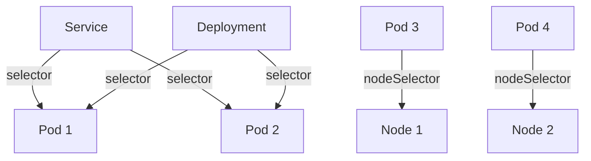

# Kubernetes Selectors

## Introduction

Selectors are a fundamental concept in Kubernetes that allow you to filter and organize resources based on their metadata. Think of selectors as a filtering mechanism that helps you identify and manage specific groups of resources in your cluster. They're particularly useful in a large-scale environment where you have dozens or hundreds of pods, services, and other resources.

In this guide, we'll explore what Kubernetes selectors are, how they work with labels, and how to use them effectively in your day-to-day operations.

## Understanding Labels and Selectors

### Labels: The Foundation

Before diving into selectors, we need to understand labels. **Labels** are key-value pairs attached to Kubernetes objects that provide identifying attributes:

```yaml
metadata:
  labels:
    environment: production
    app: nginx
    tier: frontend
```

These labels don't affect the functionality of the objects but serve as tags that can be used to organize and select subsets of objects.

### Selectors: The Query Language

**Selectors** are the mechanism used to identify resources based on their labels. There are two types of selectors in Kubernetes:

1. **Equality-based selectors**: Filter resources based on label keys and values
2. **Set-based selectors**: Allow filtering resources based on a set of values

Let's explore both types in detail.

## Types of Selectors

### Equality-Based Selectors

Equality-based selectors use simple equality or inequality to filter resources. They follow this pattern:

- `key=value`: Select resources with a label key equal to value
- `key!=value`: Select resources with a label key not equal to value

Here's how you might use equality-based selectors in a command:

```bash
# List all pods with environment=production label
kubectl get pods -l environment=production

# List all pods that don't have environment=testing
kubectl get pods -l environment!=testing
```

### Set-Based Selectors

Set-based selectors provide more flexible filtering options:

- `key in (value1,value2,...)`: Select resources with a label key equal to any of the specified values
- `key notin (value1,value2,...)`: Select resources with a label key not equal to any of the specified values
- `key`: Select resources that include a label with the specified key
- `!key`: Select resources that don't include a label with the specified key

Example usage:

```bash
# List pods with environment label set to either production or staging
kubectl get pods -l 'environment in (production,staging)'

# List pods with tier label, regardless of its value
kubectl get pods -l 'tier'

# List pods without the environment label
kubectl get pods -l '!environment'
```

## Using Selectors in Kubernetes Manifests

Selectors are commonly used in various Kubernetes resources. Let's look at some examples:

### Service Selectors

Services use selectors to determine which pods to route traffic to:

```yaml
apiVersion: v1
kind: Service
metadata:
  name: frontend-service
spec:
  selector:
    app: frontend
    tier: web
  ports:
  - port: 80
    targetPort: 8080
```

In this example, the service will route traffic to any pods with both labels `app=frontend` AND `tier=web`.

### Deployment Selectors

Deployments use selectors to identify which pods they manage:

```yaml
apiVersion: apps/v1
kind: Deployment
metadata:
  name: nginx-deployment
spec:
  replicas: 3
  selector:
    matchLabels:
      app: nginx
  template:
    metadata:
      labels:
        app: nginx
    spec:
      containers:
      - name: nginx
        image: nginx:1.19
```

The selector `matchLabels: app: nginx` tells the deployment to manage all pods with the label `app=nginx`.

### Advanced Selectors with matchExpressions

For more complex selection logic, you can use `matchExpressions`:

```yaml
apiVersion: apps/v1
kind: Deployment
metadata:
  name: complex-deployment
spec:
  replicas: 3
  selector:
    matchExpressions:
    - key: app
      operator: In
      values: [frontend, webapp]
    - key: tier
      operator: NotIn
      values: [cache, backend]
    - key: environment
      operator: Exists
  template:
    metadata:
      labels:
        app: frontend
        tier: web
        environment: production
    spec:
      containers:
      - name: web-app
        image: my-web-app:1.2.3
```

This selector will match pods that have:
- An `app` label with value either `frontend` OR `webapp`, AND
- A `tier` label NOT equal to `cache` OR `backend`, AND
- An `environment` label (regardless of its value)

## Practical Examples

Let's look at some practical scenarios where selectors are valuable:

### Example 1: Rolling Updates and Blue-Green Deployments

Selectors make it easy to implement advanced deployment strategies:

```yaml
# Blue deployment
apiVersion: apps/v1
kind: Deployment
metadata:
  name: app-blue
spec:
  replicas: 3
  selector:
    matchLabels:
      app: myapp
      version: blue
  template:
    metadata:
      labels:
        app: myapp
        version: blue
    spec:
      containers:
      - name: myapp
        image: myapp:1.0.0

---
# Green deployment
apiVersion: apps/v1
kind: Deployment
metadata:
  name: app-green
spec:
  replicas: 0  # Initially zero replicas
  selector:
    matchLabels:
      app: myapp
      version: green
  template:
    metadata:
      labels:
        app: myapp
        version: green
    spec:
      containers:
      - name: myapp
        image: myapp:1.1.0

---
# Service (initially pointing to blue)
apiVersion: v1
kind: Service
metadata:
  name: myapp-service
spec:
  selector:
    app: myapp
    version: blue
  ports:
  - port: 80
    targetPort: 8080
```

To perform a blue-green switch, you would:
1. Scale up the green deployment
2. Test the green deployment
3. Update the service selector to point to the green deployment:

```bash
kubectl patch service myapp-service -p '{"spec":{"selector":{"version":"green"}}}'
```

### Example 2: Organizing Resources Across Environments

Selectors allow you to organize and query resources based on environments:

```yaml
# Production namespace resources
apiVersion: v1
kind: Pod
metadata:
  name: api-pod
  labels:
    app: api
    environment: production
    region: us-west
spec:
  containers:
  - name: api-container
    image: api:1.0

---
# Staging namespace resources
apiVersion: v1
kind: Pod
metadata:
  name: api-pod
  namespace: staging
  labels:
    app: api
    environment: staging
    region: us-west
spec:
  containers:
  - name: api-container
    image: api:1.0
```

Now you can easily query resources across environments:

```bash
# Get all production resources
kubectl get all -l environment=production

# Get all API pods across all environments
kubectl get pods -A -l app=api

# Get all resources in the US-West region
kubectl get all -A -l region=us-west
```

## Node Selectors

Kubernetes also allows you to use node selectors to schedule pods on specific nodes:

```yaml
apiVersion: v1
kind: Pod
metadata:
  name: gpu-pod
spec:
  containers:
  - name: gpu-container
    image: gpu-app:1.0
  nodeSelector:
    hardware: gpu
```

This pod will only be scheduled on nodes that have the label `hardware=gpu`.

## Visualizing Selector Relationships

Here's a diagram showing how selectors establish relationships between different Kubernetes resources:



In this diagram, you can see how:
- A service targets multiple pods based on their labels
- A deployment manages the same set of pods
- Pods are scheduled on specific nodes using nodeSelectors

## Best Practices for Using Selectors

1. **Use consistent naming conventions**: Establish a labeling strategy across your organization
2. **Don't overuse labels**: Only add labels that serve a purpose for selection or organization
3. **Consider hierarchical labels**: For example, `app.kubernetes.io/name` and `app.kubernetes.io/component`
4. **Document your labeling schema**: Ensure team members understand your organization's approach
5. **Combine selectors with namespaces**: For the most effective resource organization

Here's an example of a well-labeled resource following Kubernetes recommended labels:

```yaml
apiVersion: apps/v1
kind: Deployment
metadata:
  name: my-app
  labels:
    app.kubernetes.io/name: my-app
    app.kubernetes.io/instance: my-app-prod
    app.kubernetes.io/version: "1.0.0"
    app.kubernetes.io/component: frontend
    app.kubernetes.io/part-of: e-commerce
    app.kubernetes.io/managed-by: helm
spec:
  replicas: 3
  selector:
    matchLabels:
      app.kubernetes.io/name: my-app
  template:
    metadata:
      labels:
        app.kubernetes.io/name: my-app
        app.kubernetes.io/instance: my-app-prod
        app.kubernetes.io/version: "1.0.0"
        app.kubernetes.io/component: frontend
        app.kubernetes.io/part-of: e-commerce
    spec:
      containers:
      - name: my-app
        image: my-app:1.0.0
```

## Common Issues and Troubleshooting

### Issue 1: Selector Mismatch

One common issue is when a service isn't directing traffic to pods because of a selector mismatch:

```bash
# Check service selectors
kubectl get service my-service -o yaml | grep -A5 selector

# Check pod labels
kubectl get pods --show-labels
```

### Issue 2: Deployment Not Managing Pods

If a deployment isn't managing the expected pods:

```bash
# Check deployment selector
kubectl get deployment my-deployment -o yaml | grep -A5 selector

# Check template labels
kubectl get deployment my-deployment -o yaml | grep -A10 template
```

Ensure that the deployment selector matches the pod template labels.

## Summary

Kubernetes selectors are a powerful mechanism for organizing and managing resources in your cluster. They work hand-in-hand with labels to provide a flexible way to query, group, and target resources.

Key points to remember:
- Labels are key-value pairs attached to resources
- Selectors filter resources based on their labels
- Equality-based selectors use simple equality operations
- Set-based selectors offer more advanced filtering
- Selectors are used in services, deployments, daemonsets, and other resources
- Well-designed label and selector strategies make cluster management easier

## Practice Exercises

1. Create a deployment with multiple labels and practice using different selectors to filter the resources
2. Implement a blue-green deployment using selectors
3. Set up a multi-tier application (frontend, backend, database) using appropriate labels and selectors
4. Practice using `kubectl` commands with different selector expressions

## Additional Resources

- [Kubernetes Documentation: Labels and Selectors](https://kubernetes.io/docs/concepts/overview/working-with-objects/labels/)
- [Kubernetes Recommended Labels](https://kubernetes.io/docs/concepts/overview/working-with-objects/common-labels/)
- [Kubernetes API Concepts: Label Selectors](https://kubernetes.io/docs/reference/kubernetes-api/common-definitions/label-selector/)