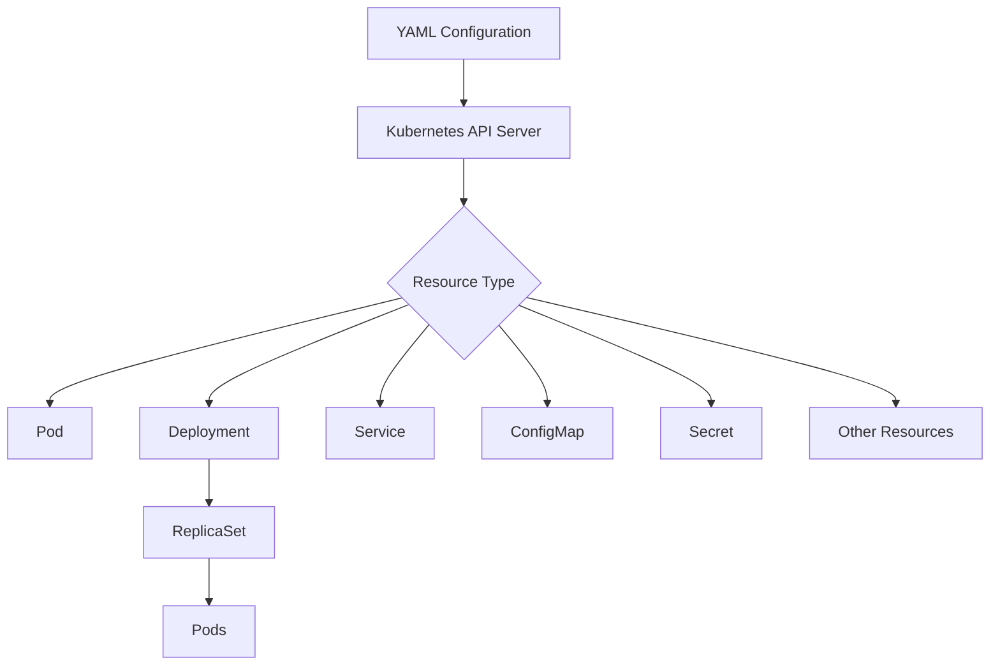

# Kubernetes YAML

## Introduction

YAML (YAML Ain't Markup Language) is a human-readable data serialization format that has become the standard way to define resources in Kubernetes. As you progress in your Kubernetes journey, you'll spend a significant amount of time writing and modifying YAML files to configure your applications, deployments, services, and other Kubernetes objects.

In this guide, we'll explore the fundamentals of Kubernetes YAML files - their structure, syntax, and practical applications. We'll also examine how these files translate into Kubernetes objects that manage your containerized applications.

## What is YAML and Why Does Kubernetes Use It?

YAML is a data serialization language designed to be human-friendly. Unlike JSON or XML, YAML relies on indentation rather than brackets or tags to indicate nesting. This makes YAML files more readable and often more concise.

Kubernetes uses YAML because:

1. **Declarative Configuration**: YAML allows you to declare the desired state of your system
2. **Human Readability**: It's easier to read and write than alternatives
3. **Validation**: Kubernetes can validate YAML against its schema
4. **Version Control**: YAML files can be easily stored and tracked in version control systems

## YAML Syntax Basics

Before diving into Kubernetes-specific YAML, let's understand the basic YAML syntax:

```yaml
# This is a comment

# Key-value pairs
name: John
age: 30

# Nested objects (using indentation)
person:
  name: Jane
  age: 25
  address:
    city: New York
    zipcode: 10001

# Lists/arrays
fruits:
  - apple
  - orange
  - banana

# Multiple documents in a single file separated by "---"
---
document: 1
---
document: 2
```

Key YAML syntax rules:
- Use spaces for indentation (2 spaces is common in Kubernetes)
- Never use tabs
- Key-value pairs are separated by a colon and space (`: `)
- List items begin with a dash and space (`- `)
- Comments start with `#`

## Kubernetes YAML Structure

All Kubernetes YAML files share a common structure with four required top-level fields:

```yaml
apiVersion: v1        # Which API version to use
kind: Pod             # What kind of object to create
metadata:             # Data about the object
  name: nginx-pod
  labels:
    app: nginx
spec:                 # Object specification
  containers:
  - name: nginx
    image: nginx:1.17.3
```

Let's break down these required fields:

1. **apiVersion**: Specifies which version of the Kubernetes API to use
2. **kind**: Defines what type of Kubernetes resource you want to create
3. **metadata**: Contains data that identifies the resource (name, labels, annotations, etc.)
4. **spec**: Defines the desired state of the resource (varies by resource type)

## Common Kubernetes Resource Types

Here are some common Kubernetes resource types you'll define in YAML:

### Pods

A Pod is the smallest deployable unit in Kubernetes, representing one or more containers that should run together.

```yaml
apiVersion: v1
kind: Pod
metadata:
  name: simple-pod
  labels:
    app: web
spec:
  containers:
  - name: nginx
    image: nginx:1.17.3
    ports:
    - containerPort: 80
```

### Deployments

Deployments manage a set of identical Pods, ensuring your desired number of Pods are running.

```yaml
apiVersion: apps/v1
kind: Deployment
metadata:
  name: nginx-deployment
  labels:
    app: nginx
spec:
  replicas: 3
  selector:
    matchLabels:
      app: nginx
  template:
    metadata:
      labels:
        app: nginx
    spec:
      containers:
      - name: nginx
        image: nginx:1.17.3
        ports:
        - containerPort: 80
```

### Services

Services provide network access to a set of Pods.

```yaml
apiVersion: v1
kind: Service
metadata:
  name: nginx-service
spec:
  selector:
    app: nginx
  ports:
  - port: 80
    targetPort: 80
  type: ClusterIP
```

## Working with Kubernetes YAML Files

### Creating Resources

To create resources from YAML files, use the `kubectl apply` command:

```bash
kubectl apply -f deployment.yaml
```

The output will be:

```
deployment.apps/nginx-deployment created
```

### Viewing Resources

To view the current state of resources:

```bash
kubectl get deployments
```

The output might look like:

```
NAME               READY   UP-TO-DATE   AVAILABLE   AGE
nginx-deployment   3/3     3            3           45s
```

### Updating Resources

To update resources, modify your YAML file and apply it again:

```bash
kubectl apply -f deployment.yaml
```

The output will show the update:

```
deployment.apps/nginx-deployment configured
```

### Deleting Resources

To delete resources defined in a YAML file:

```bash
kubectl delete -f deployment.yaml
```

The output will confirm deletion:

```
deployment.apps/nginx-deployment deleted
```

## Multi-resource YAML Files

You can define multiple resources in a single YAML file by separating them with `---`:

```yaml
apiVersion: apps/v1
kind: Deployment
metadata:
  name: nginx-deployment
spec:
  replicas: 3
  selector:
    matchLabels:
      app: nginx
  template:
    metadata:
      labels:
        app: nginx
    spec:
      containers:
      - name: nginx
        image: nginx:1.17.3
        ports:
        - containerPort: 80
---
apiVersion: v1
kind: Service
metadata:
  name: nginx-service
spec:
  selector:
    app: nginx
  ports:
  - port: 80
  type: ClusterIP
```

This approach helps organize related resources together.

## YAML Validation

Validate your Kubernetes YAML files before applying them:

```bash
kubectl apply --validate=true --dry-run=client -f deployment.yaml
```

Output if valid:
```
deployment.apps/nginx-deployment created (dry run)
```

## Using Variables with YAML Templates

While YAML itself doesn't support variables, several tools enable template-based approaches:

1. **Helm**: A package manager for Kubernetes
2. **Kustomize**: Kubernetes native configuration customization
3. **Environment Variables in kubectl**: Using process substitution

Here's a simple example with Kustomize:

Base deployment (`base/deployment.yaml`):
```yaml
apiVersion: apps/v1
kind: Deployment
metadata:
  name: nginx-deployment
spec:
  replicas: 2
  selector:
    matchLabels:
      app: nginx
  template:
    metadata:
      labels:
        app: nginx
    spec:
      containers:
      - name: nginx
        image: nginx:1.17.3
```

Kustomization file (`kustomization.yaml`):
```yaml
resources:
- base/deployment.yaml
patchesStrategicMerge:
- patches/increase-replicas.yaml
```

Patch (`patches/increase-replicas.yaml`):
```yaml
apiVersion: apps/v1
kind: Deployment
metadata:
  name: nginx-deployment
spec:
  replicas: 5
```

## Best Practices for Kubernetes YAML

1. **Use Version Control**: Store YAML files in git or another VCS
2. **Consistent Formatting**: Maintain consistent indentation (2 spaces)
3. **Resource Limits**: Always specify resource requests and limits
4. **Namespaces**: Use namespaces to organize resources
5. **Labels and Annotations**: Use descriptive labels for filtering
6. **Documentation**: Include comments explaining complex configurations
7. **Validation**: Regularly validate your YAML files

Example with best practices applied:

```yaml
apiVersion: apps/v1
kind: Deployment
metadata:
  name: web-app
  namespace: production
  labels:
    app: web
    tier: frontend
    environment: production
  annotations:
    description: "Frontend web application deployment"
spec:
  replicas: 3
  selector:
    matchLabels:
      app: web
  template:
    metadata:
      labels:
        app: web
    spec:
      containers:
      - name: web-app
        image: mycompany/webapp:1.2.3
        ports:
        - containerPort: 80
        resources:
          requests:
            memory: "128Mi"
            cpu: "100m"
          limits:
            memory: "256Mi"
            cpu: "500m"
        livenessProbe:
          httpGet:
            path: /healthz
            port: 80
          initialDelaySeconds: 3
          periodSeconds: 3
```

## Visualizing Kubernetes YAML Relationships



## Common Issues and Troubleshooting

1. **Indentation Errors**: YAML is sensitive to indentation
   ```yaml
   # Incorrect
   spec:
   containers:  # Should be indented
   - name: nginx
     image: nginx
   
   # Correct
   spec:
     containers:
     - name: nginx
       image: nginx
   ```

2. **Missing Required Fields**: Ensure all required fields are present
   ```yaml
   # Missing 'spec' field
   apiVersion: v1
   kind: Pod
   metadata:
     name: my-pod
   # Error will occur without 'spec'
   ```

3. **Invalid Field Values**: Values must match expected types
   ```yaml
   # Incorrect - replicas should be an integer
   spec:
     replicas: "3"
   
   # Correct
   spec:
     replicas: 3
   ```

4. **API Version Mismatches**: Use the correct apiVersion for your Kubernetes version
   ```yaml
   # This might not work on newer Kubernetes versions
   apiVersion: extensions/v1beta1
   kind: Deployment
   
   # Modern version
   apiVersion: apps/v1
   kind: Deployment
   ```

## Practical Example: Complete Application Deployment

Let's put everything together by creating a complete application stack with a web application, backend service, and database:

```yaml
# Frontend Deployment
apiVersion: apps/v1
kind: Deployment
metadata:
  name: frontend
  labels:
    app: myapp
    tier: frontend
spec:
  replicas: 2
  selector:
    matchLabels:
      app: myapp
      tier: frontend
  template:
    metadata:
      labels:
        app: myapp
        tier: frontend
    spec:
      containers:
      - name: frontend
        image: my-frontend:1.0
        ports:
        - containerPort: 80
        env:
        - name: BACKEND_URL
          value: http://backend-service:8080
---
# Frontend Service
apiVersion: v1
kind: Service
metadata:
  name: frontend-service
spec:
  selector:
    app: myapp
    tier: frontend
  ports:
  - port: 80
    targetPort: 80
  type: LoadBalancer
---
# Backend Deployment
apiVersion: apps/v1
kind: Deployment
metadata:
  name: backend
  labels:
    app: myapp
    tier: backend
spec:
  replicas: 3
  selector:
    matchLabels:
      app: myapp
      tier: backend
  template:
    metadata:
      labels:
        app: myapp
        tier: backend
    spec:
      containers:
      - name: backend
        image: my-backend:1.0
        ports:
        - containerPort: 8080
        env:
        - name: DB_HOST
          value: database-service
        - name: DB_PASSWORD
          valueFrom:
            secretKeyRef:
              name: db-secret
              key: password
---
# Backend Service
apiVersion: v1
kind: Service
metadata:
  name: backend-service
spec:
  selector:
    app: myapp
    tier: backend
  ports:
  - port: 8080
    targetPort: 8080
  type: ClusterIP
---
# Database Deployment
apiVersion: apps/v1
kind: Deployment
metadata:
  name: database
  labels:
    app: myapp
    tier: database
spec:
  replicas: 1
  selector:
    matchLabels:
      app: myapp
      tier: database
  template:
    metadata:
      labels:
        app: myapp
        tier: database
    spec:
      containers:
      - name: database
        image: postgres:12
        ports:
        - containerPort: 5432
        env:
        - name: POSTGRES_PASSWORD
          valueFrom:
            secretKeyRef:
              name: db-secret
              key: password
        volumeMounts:
        - name: db-data
          mountPath: /var/lib/postgresql/data
      volumes:
      - name: db-data
        persistentVolumeClaim:
          claimName: database-pvc
---
# Database Service
apiVersion: v1
kind: Service
metadata:
  name: database-service
spec:
  selector:
    app: myapp
    tier: database
  ports:
  - port: 5432
    targetPort: 5432
  type: ClusterIP
---
# Database PVC
apiVersion: v1
kind: PersistentVolumeClaim
metadata:
  name: database-pvc
spec:
  accessModes:
    - ReadWriteOnce
  resources:
    requests:
      storage: 1Gi
---
# Database Secret
apiVersion: v1
kind: Secret
metadata:
  name: db-secret
type: Opaque
data:
  password: cGFzc3dvcmQxMjM=  # base64 encoded "password123"
```

## Summary

YAML configuration files are the backbone of Kubernetes resource management. In this guide, we've covered:

- YAML basics and syntax
- Kubernetes YAML structure and required fields
- Common resource types (Pods, Deployments, Services)
- Working with YAML files using kubectl
- Multi-resource files and validation
- Template-based approaches
- Best practices and troubleshooting
- A complete application deployment example

By mastering Kubernetes YAML, you gain the ability to define, deploy, and manage complex applications in a declarative way. This approach allows for reproducible deployments, version control, and infrastructure as code practices.

## Further Resources and Exercises

### Resources
- [Kubernetes Documentation on YAML](https://kubernetes.io/docs/concepts/overview/working-with-objects/kubernetes-objects/)
- [YAML Specification](https://yaml.org/spec/1.2/spec.html)
- [Kubectl Cheat Sheet](https://kubernetes.io/docs/reference/kubectl/cheatsheet/)
- [Kustomize Documentation](https://kubectl.docs.kubernetes.io/guides/introduction/kustomize/)

### Exercises

1. **Basic Pod Creation**:
   Create a YAML file for a Pod running the NGINX image and apply it to your cluster.

2. **Deployment Practice**:
   Create a Deployment YAML with 3 replicas of a web application of your choice.

3. **Full Stack Application**:
   Try to create YAML for a three-tier application with frontend, backend, and database components.

4. **ConfigMap and Secrets**:
   Practice creating and using ConfigMaps and Secrets in your application YAML.

5. **Resource Limits**:
   Modify your Deployment YAML to include appropriate resource requests and limits.

Remember that mastery comes with practice. Start with simple configurations and gradually build up to more complex ones as you become comfortable with the syntax and concepts.