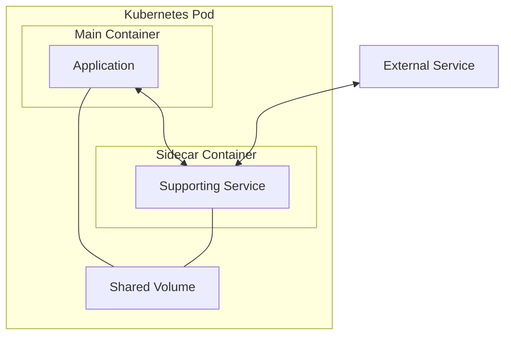

# Kubernetes Sidecar

## Introduction

The sidecar pattern is a powerful design concept in Kubernetes that allows you to extend and enhance the functionality of your main application container without modifying it. In this pattern, an additional container (the "sidecar") runs alongside your primary application container within the same Pod, sharing resources like network namespace and storage volumes.

Sidecars are perfect for separating concerns and keeping your application containers focused on their core business logic while delegating supplementary tasks to specialized containers. Think of a sidecar as a helpful companion that travels with your main application, providing supporting services without getting in the way.

## What is a Sidecar Pattern?

A sidecar container:

- Runs in the same Pod as the main application container
- Shares the same lifecycle as the Pod (created and destroyed together)
- Shares the same network namespace (can communicate via localhost)
- Can share volumes with the main container
- Performs supporting functions that don't need to be part of the main application

## Common Use Cases for Sidecars

Sidecars excel at several specific tasks:

1. **Logging and monitoring** - Collecting, processing, and forwarding logs
2. **Proxy/API gateway** - Managing network traffic to/from the main container
3. **Data synchronization** - Keeping data updated from external sources
4. **Security functions** - Adding authentication, encryption, or other security layers
5. **Configuration management** - Dynamically updating configuration files

## How Sidecars Work in Kubernetes

Let's visualize how sidecars operate within a Kubernetes Pod:



In this diagram:
- Both containers exist within the same Pod
- They can communicate directly via localhost
- They share access to the volume
- The sidecar often communicates with external services

## Creating a Basic Sidecar Configuration

Let's create a simple example of a web application with a logging sidecar:

```yaml
apiVersion: v1
kind: Pod
metadata:
  name: web-app-with-logger
  labels:
    app: web-app
spec:
  containers:
  - name: web-app
    image: nginx:latest
    ports:
    - containerPort: 80
    volumeMounts:
    - name: shared-logs
      mountPath: /var/log/nginx
  
  - name: log-collector
    image: busybox:latest
    command: ["/bin/sh", "-c", "tail -f /var/log/nginx/access.log"]
    volumeMounts:
    - name: shared-logs
      mountPath: /var/log/nginx
  
  volumes:
  - name: shared-logs
    emptyDir: {}
```

In this example:
1. We have a main `web-app` container running Nginx
2. A `log-collector` sidecar container that monitors the Nginx access logs
3. Both containers share a volume called `shared-logs`
4. The sidecar reads the logs produced by the main container

To apply this configuration:

```bash
kubectl apply -f sidecar-example.yaml
```

You can view the logs from the sidecar container:

```bash
kubectl logs web-app-with-logger -c log-collector
```

Output (example):
```
192.168.1.5 - - [10/Mar/2023:12:34:56 +0000] "GET / HTTP/1.1" 200 615 "-" "Mozilla/5.0 (Windows NT 10.0; Win64; x64)"
192.168.1.7 - - [10/Mar/2023:12:35:21 +0000] "GET /index.html HTTP/1.1" 200 615 "-" "Mozilla/5.0 (Macintosh; Intel Mac OS X 10_15_7)"
```

## Real-World Example: Sidecar for Metrics Collection

Let's explore a more practical example - using a Prometheus metrics exporter as a sidecar:

```yaml
apiVersion: v1
kind: Pod
metadata:
  name: app-with-metrics
  labels:
    app: my-application
spec:
  containers:
  - name: main-app
    image: my-application:latest
    ports:
    - containerPort: 8080
  
  - name: prometheus-exporter
    image: prom/prometheus-node-exporter:latest
    ports:
    - containerPort: 9100
      name: metrics
```

In this configuration:
1. The main application container runs on port 8080
2. The Prometheus exporter sidecar runs on port 9100
3. The sidecar collects system metrics from the Pod
4. External Prometheus servers can scrape metrics from the sidecar

## Example: Content Sync Sidecar

Another common use case is synchronizing content from external sources:

```yaml
apiVersion: v1
kind: Pod
metadata:
  name: web-with-content-sync
spec:
  containers:
  - name: web-server
    image: nginx:latest
    ports:
    - containerPort: 80
    volumeMounts:
    - name: content-dir
      mountPath: /usr/share/nginx/html
  
  - name: content-sync
    image: alpine:latest
    command: ["/bin/sh", "-c", "while true; do wget -O /content/index.html http://content-service/latest; sleep 300; done"]
    volumeMounts:
    - name: content-dir
      mountPath: /content
  
  volumes:
  - name: content-dir
    emptyDir: {}
```

This configuration:
1. Runs an Nginx web server as the main container
2. Uses a sidecar to periodically fetch updated content
3. Shares the content directory between containers
4. Updates the web content every 5 minutes

## Advanced Sidecar Pattern: Istio Service Mesh

In more advanced Kubernetes deployments, sidecars are used extensively in service meshes like Istio. Istio automatically injects a proxy sidecar (Envoy) into each Pod to handle network communication:

```yaml
apiVersion: v1
kind: Pod
metadata:
  name: my-app
  annotations:
    sidecar.istio.io/inject: "true"
spec:
  containers:
  - name: main-app
    image: my-application:latest
    ports:
    - containerPort: 8080
```

The `sidecar.istio.io/inject: "true"` annotation tells Istio to automatically inject the Envoy proxy sidecar when the Pod is created.

## Best Practices for Sidecar Containers

When implementing sidecars, keep these best practices in mind:

1. **Keep sidecars focused** - Each sidecar should have a single responsibility
2. **Minimize resource usage** - Sidecars should be lightweight
3. **Consider startup order** - Use the `initContainers` field if one container needs to start before another
4. **Health checks** - Monitor both main and sidecar containers
5. **Resource limits** - Set appropriate CPU and memory limits for all containers

Example with resource limits:

```yaml
apiVersion: v1
kind: Pod
metadata:
  name: app-with-sidecar
spec:
  containers:
  - name: main-app
    image: my-application:latest
    resources:
      limits:
        memory: "256Mi"
        cpu: "500m"
  
  - name: sidecar
    image: sidecar-image:latest
    resources:
      limits:
        memory: "128Mi"
        cpu: "250m"
```

## Handling Sidecar Lifecycle

Since containers in a Pod share the same lifecycle, you need to handle graceful shutdown properly. The Pod will not terminate until all containers have stopped.

For example, you might want to add a proper termination signal handler:

```yaml
apiVersion: v1
kind: Pod
metadata:
  name: app-with-sidecar
spec:
  containers:
  - name: main-app
    image: main-app:latest
    lifecycle:
      preStop:
        exec:
          command: ["/bin/sh", "-c", "sleep 5"]
  
  - name: sidecar
    image: sidecar:latest
    lifecycle:
      preStop:
        exec:
          command: ["/bin/sh", "-c", "echo 'Shutting down sidecar'; sleep 2"]
```

The `preStop` hooks ensure that both containers shut down gracefully.

## Debugging Sidecar Containers

When troubleshooting issues with sidecars, these commands are helpful:

```bash
# View logs from the main container
kubectl logs pod-name -c main-container

# View logs from the sidecar container
kubectl logs pod-name -c sidecar-container

# Execute commands in the sidecar
kubectl exec -it pod-name -c sidecar-container -- /bin/sh

# Check resource usage
kubectl top pod pod-name --containers
```

## Practical Exercise: Create a Logging Sidecar

Let's create a simple application with a custom logging sidecar that formats and forwards logs:

```yaml
apiVersion: v1
kind: Pod
metadata:
  name: app-with-log-processor
spec:
  containers:
  - name: main-app
    image: busybox:latest
    command: ["/bin/sh", "-c", "while true; do echo $(date) - Application event $RANDOM >> /logs/app.log; sleep 5; done"]
    volumeMounts:
    - name: log-volume
      mountPath: /logs
  
  - name: log-processor
    image: busybox:latest
    command: ["/bin/sh", "-c", "tail -f /logs/app.log | while read line; do echo \"PROCESSED: $line\" >> /logs/processed.log; done"]
    volumeMounts:
    - name: log-volume
      mountPath: /logs
  
  volumes:
  - name: log-volume
    emptyDir: {}
```

Apply this configuration and observe how the log processor transforms the logs:

```bash
kubectl apply -f log-processor-sidecar.yaml
kubectl logs app-with-log-processor -c main-app
kubectl logs app-with-log-processor -c log-processor
```

## Summary

Sidecar containers are a powerful pattern in Kubernetes that allow you to:

- Extend application functionality without modifying the main container
- Separate concerns and maintain single-responsibility containers
- Add capabilities like logging, monitoring, security, and synchronization
- Build modular, maintainable applications

By mastering the sidecar pattern, you'll be able to create more flexible, maintainable, and feature-rich applications in Kubernetes.

## Additional Resources

To learn more about Kubernetes sidecars, consider exploring:

- The official Kubernetes documentation on multi-container pods
- Ambassador and Envoy proxy patterns
- Service meshes like Istio and Linkerd
- Logging solutions like Fluentd and the ELK stack

## Challenge Exercise

Try to implement a sidecar container that:

1. Monitors the health of your main application
2. Sends an alert (write to a file) when the application becomes unresponsive
3. Attempts to restart the application (by sending a signal)

This will give you hands-on experience with more advanced sidecar patterns!