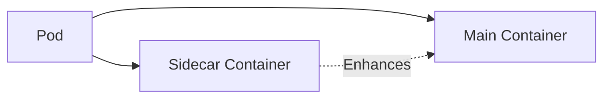
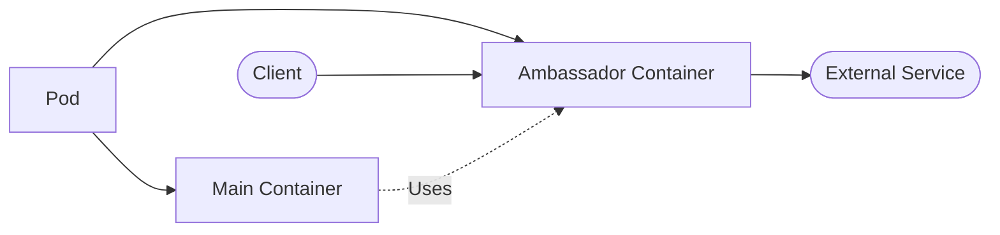
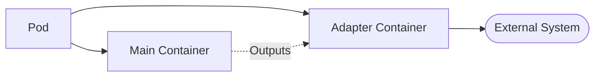

# Kubernetes Multi-Container Pods

## Introduction

In Kubernetes, the Pod is the smallest deployable unit that can be created and managed. While many users start with single-container pods, Kubernetes offers powerful capabilities for running multiple containers within a single pod. This approach, known as the **multi-container pod pattern**, provides elegant solutions for complex application architectures.

Multi-container pods are particularly useful when you need closely related processes that need to work together, share resources, and coordinate their activities. In this guide, we'll explore how to leverage multi-container pods effectively, understand the common patterns, and see real-world examples of their implementation.

## Understanding Multi-Container Pods

### What is a Multi-Container Pod?

A multi-container pod is a Kubernetes pod that contains more than one container. These containers:

- Share the same network namespace (meaning they can communicate via localhost)
- Share the same IPC namespace
- Share the same volume mounts
- Have the same lifecycle (they're created and destroyed together)

This creates a cohesive unit where containers can cooperate closely while maintaining separation of concerns.

## Multi-Container Pod Patterns

There are several established patterns for multi-container pods:

### 1. Sidecar Pattern

In this pattern, the sidecar container enhances or extends the functionality of the main container.



**Common Use Cases:**
- Log collection and forwarding
- Monitoring agents
- Proxy servers
- Configuration management

### 2. Ambassador Pattern 

The ambassador container proxies network connections to and from the main container.



**Common Use Cases:**
- Database proxies
- Service mesh implementations
- Connection pooling
- Service abstraction

### 3. Adapter Pattern

The adapter container transforms the main container's output to conform to a predefined interface.



**Common Use Cases:**
- Metrics standardization
- Log formatting
- Data transformation
- API translation

## Implementing Multi-Container Pods

Let's look at how to define a multi-container pod in YAML:

```yaml
apiVersion: v1
kind: Pod
metadata:
  name: multi-container-example
  labels:
    app: web
spec:
  containers:
  - name: web-app
    image: nginx:1.21
    ports:
    - containerPort: 80
    volumeMounts:
    - name: shared-data
      mountPath: /usr/share/nginx/html
      
  - name: content-sync
    image: alpine:3.14
    command: ["/bin/sh", "-c"]
    args:
      - while true; do
          echo "<h1>Updated content at $(date)</h1>" > /content/index.html;
          sleep 30;
        done
    volumeMounts:
    - name: shared-data
      mountPath: /content
      
  volumes:
  - name: shared-data
    emptyDir: {}
```

In this example:
- The `web-app` container runs Nginx to serve web content
- The `content-sync` container periodically updates the content
- Both containers share a volume called `shared-data`
- Changes made by the `content-sync` container are immediately visible to the `web-app` container

## Practical Examples

### Example 1: Log Collection with Sidecar

In this example, we'll implement a common pattern: using a sidecar container to collect and forward logs from the main application.

```yaml
apiVersion: v1
kind: Pod
metadata:
  name: web-with-log-collector
spec:
  containers:
  - name: web-application
    image: nginx:1.21
    ports:
    - containerPort: 80
    volumeMounts:
    - name: logs-volume
      mountPath: /var/log/nginx
      
  - name: log-collector
    image: fluent/fluentd:v1.12
    volumeMounts:
    - name: logs-volume
      mountPath: /fluentd/log
      readOnly: true
    - name: fluentd-config
      mountPath: /fluentd/etc
      
  volumes:
  - name: logs-volume
    emptyDir: {}
  - name: fluentd-config
    configMap:
      name: fluentd-config
```

In this setup:
- The Nginx container writes logs to a shared volume
- The Fluentd container reads those logs and forwards them to a centralized logging system
- Configuration for Fluentd is provided via a ConfigMap (not shown here)

### Example 2: Database Ambassador

Here's an example of using the ambassador pattern for database connection management:

```yaml
apiVersion: v1
kind: Pod
metadata:
  name: app-with-db-ambassador
spec:
  containers:
  - name: application
    image: myapp:1.0
    env:
    - name: DB_HOST
      value: "localhost"
    - name: DB_PORT
      value: "5432"
      
  - name: db-ambassador
    image: postgres-proxy:1.0
    ports:
    - containerPort: 5432
    env:
    - name: MASTER_HOST
      value: "postgres-master.database"
    - name: REPLICA_HOSTS
      value: "postgres-replica-1.database,postgres-replica-2.database"
```

Benefits of this approach:
- The main application connects simply to localhost
- The ambassador handles connection pooling, failover, and load balancing
- The application code remains simpler and more portable

### Example 3: Adapter for Legacy Systems

This example shows an adapter pattern for transforming output for a legacy monitoring system:

```yaml
apiVersion: v1
kind: Pod
metadata:
  name: app-with-metrics-adapter
spec:
  containers:
  - name: application
    image: myapp:1.0
    ports:
    - containerPort: 8080
      
  - name: metrics-adapter
    image: metrics-transformer:1.0
    ports:
    - containerPort: 9090
    env:
    - name: APP_ENDPOINT
      value: "http://localhost:8080/metrics"
    - name: OUTPUT_FORMAT
      value: "legacy_format"
```

In this case:
- The application produces metrics in its native format
- The adapter container polls these metrics, transforms them, and exposes them in a format compatible with legacy monitoring systems

## Communication Between Containers

Containers within a pod can communicate in several ways:

1. **Via localhost**: Since containers share the network namespace, they can communicate via localhost on different ports.

2. **Shared volumes**: As shown in our examples, containers can share data through mounted volumes.

3. **Process signals**: Containers can use process signals for simple coordination.

4. **Shared memory**: For advanced use cases, containers can communicate via shared memory.

Here's a simple example demonstrating communication via localhost:

```yaml
apiVersion: v1
kind: Pod
metadata:
  name: communication-example
spec:
  containers:
  - name: web-service
    image: nginx:1.21
    ports:
    - containerPort: 80
    
  - name: health-checker
    image: curlimages/curl:7.78.0
    command: ["/bin/sh", "-c"]
    args:
    - while true; do
        curl -s http://localhost:80 > /dev/null;
        if [ $? -eq 0 ]; then
          echo "Service is healthy at $(date)";
        else
          echo "Service is down at $(date)";
        fi;
        sleep 5;
      done
```

In this pod:
- The `web-service` container runs Nginx
- The `health-checker` container periodically checks if the web service is responding
- They communicate via localhost, with no need for external networking

## Best Practices for Multi-Container Pods

1. **Keep it focused**: Only group containers that genuinely need to work together closely.

2. **Single responsibility**: Each container should have a clear, single responsibility.

3. **Manage resources carefully**: Set appropriate resource limits for each container.

4. **Consider lifecycle implications**: Remember that all containers in a pod share the same lifecycle.

5. **Use init containers for setup**: For one-time initialization tasks, use init containers instead of long-running sidecars.

6. **Monitor all containers**: Ensure you have proper monitoring for all containers in your pods.

Example of applying resource limits:

```yaml
apiVersion: v1
kind: Pod
metadata:
  name: resource-example
spec:
  containers:
  - name: main-app
    image: myapp:1.0
    resources:
      limits:
        memory: "256Mi"
        cpu: "500m"
      requests:
        memory: "128Mi"
        cpu: "250m"
        
  - name: sidecar
    image: sidecar:1.0
    resources:
      limits:
        memory: "64Mi"
        cpu: "100m"
      requests:
        memory: "32Mi"
        cpu: "50m"
```

## Debugging Multi-Container Pods

When working with multi-container pods, debugging can become more complex. Here are some useful commands:

To view logs from a specific container:

```bash
kubectl logs pod-name -c container-name
```

To execute commands in a specific container:

```bash
kubectl exec -it pod-name -c container-name -- /bin/sh
```

To check resource usage of individual containers:

```bash
kubectl top pod pod-name --containers
```

## Common Challenges and Solutions

### Challenge: Container startup order

**Solution**: Use init containers for dependencies that must start in a specific order.

```yaml
apiVersion: v1
kind: Pod
metadata:
  name: init-container-example
spec:
  initContainers:
  - name: init-db
    image: busybox:1.28
    command: ['sh', '-c', 'until nslookup database; do echo waiting for database; sleep 2; done;']
  containers:
  - name: app
    image: myapp:1.0
  - name: sidecar
    image: sidecar:1.0
```

### Challenge: Shared volume permissions

**Solution**: Set appropriate security contexts for containers.

```yaml
apiVersion: v1
kind: Pod
metadata:
  name: security-context-example
spec:
  containers:
  - name: writer
    image: busybox:1.28
    command: ['sh', '-c', 'echo "Hello" > /data/file.txt && sleep 3600']
    volumeMounts:
    - name: shared-data
      mountPath: /data
    securityContext:
      runAsUser: 1000
      
  - name: reader
    image: busybox:1.28
    command: ['sh', '-c', 'cat /data/file.txt && sleep 3600']
    volumeMounts:
    - name: shared-data
      mountPath: /data
    securityContext:
      runAsUser: 2000
      fsGroup: 3000
      
  volumes:
  - name: shared-data
    emptyDir: {}
```

## Summary

Multi-container pods are a powerful feature in Kubernetes that enable complex application architectures while maintaining the benefits of container isolation. The three main patterns—sidecar, ambassador, and adapter—provide templates for solving common distributed application challenges.

By leveraging multi-container pods effectively, you can:
- Enhance your application without modifying its code
- Simplify complex networking requirements
- Create modular, maintainable application architectures
- Implement cross-cutting concerns like logging and monitoring cleanly

Remember that while multi-container pods are powerful, they should be used judiciously. Each container adds complexity and resource overhead, so only group containers that genuinely need to share a lifecycle and resources.

## Exercises

1. Create a multi-container pod with a web server and a sidecar that counts and logs the number of requests made to the web server.

2. Implement the ambassador pattern to create a pod with a Redis client application and a Redis ambassador that implements connection pooling.

3. Build a pod with a main application and an adapter container that transforms the application's metrics into Prometheus format.

## Additional Resources

- [Kubernetes Documentation on Pod Design Patterns](https://kubernetes.io/docs/concepts/workloads/pods/)
- [Design Patterns for Container-based Distributed Systems](https://static.googleusercontent.com/media/research.google.com/en//pubs/archive/45406.pdf)
- [The Distributed System ToolKit: Patterns for Composite Containers](https://kubernetes.io/blog/2015/06/the-distributed-system-toolkit-patterns/)