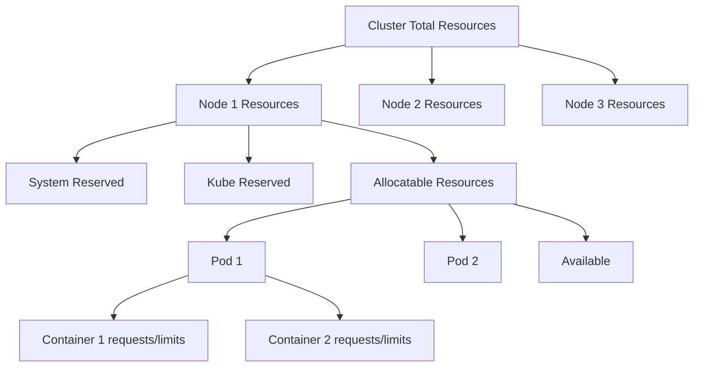
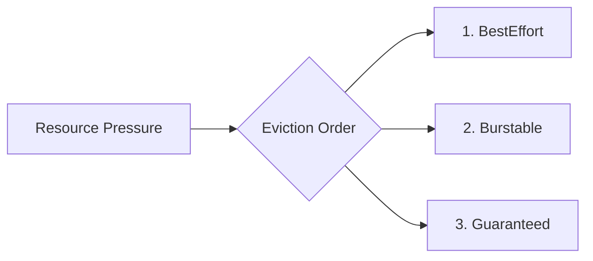

# Kubernetes Resource Management

## Introduction

Resource management is one of the most critical aspects of running applications on Kubernetes. When you deploy applications in a Kubernetes cluster, you're essentially sharing a pool of compute resources (CPU, memory, storage) among all your workloads. Without proper resource management, some applications might consume too many resources, leaving others resource-starved and potentially causing performance issues or outright failures.

In this guide, we'll explore how Kubernetes manages compute resources, how to configure resource requests and limits for your containers, and best practices to ensure your applications run efficiently and reliably.

## Understanding Kubernetes Resources

Kubernetes primarily manages two types of resources:

1. **CPU** - Measured in CPU units, where 1 CPU equals:
   - 1 vCPU/Core for cloud providers
   - 1 hyperthread on bare-metal Intel processors

2. **Memory** - Measured in bytes, typically expressed as:
   - Mebibytes (Mi): 1 Mi = 2^20 bytes = 1,048,576 bytes
   - Gibibytes (Gi): 1 Gi = 2^30 bytes = 1,073,741,824 bytes

Let's visualize how these resources are allocated in a Kubernetes cluster:



## Resource Requests and Limits

Kubernetes uses two key concepts to manage container resources:

### Resource Requests

A **resource request** specifies the minimum amount of resources that should be reserved for a container. When you specify a request for a container, the Kubernetes scheduler uses this information to decide which node to place the Pod on.

### Resource Limits

A **resource limit** defines the maximum amount of resources that a container can use. If a container attempts to use more than its limit:
- For **CPU**: The container will be throttled (not killed)
- For **Memory**: The container might be terminated (OOMKilled) if it tries to use more memory

## Configuring Resource Requests and Limits

Resource requests and limits are configured at the container level within a Pod specification:

```yaml
apiVersion: v1
kind: Pod
metadata:
  name: resource-demo
spec:
  containers:
  - name: resource-demo-container
    image: nginx
    resources:
      requests:
        memory: "64Mi"
        cpu: "250m"
      limits:
        memory: "128Mi"
        cpu: "500m"
```

In this example:
- The container requests 64 MiB of memory and 0.25 CPU cores
- The container is limited to 128 MiB of memory and 0.5 CPU cores

> **Note**: CPU resources are specified in "millicores". 1000m equals 1 full CPU core.

## How to Set Appropriate Values

Setting appropriate resource requests and limits requires a balance:

1. **Too low requests**: Your application might not get the resources it needs
2. **Too high requests**: Resources might be reserved but not used, wasting cluster capacity
3. **Too low limits**: Your application might get throttled or OOMKilled
4. **Too high limits**: You risk having "noisy neighbors" that can consume excessive resources

### Steps to determine appropriate values:

1. **Profile your application** to understand its resource usage patterns
2. **Start with a baseline** (e.g., set requests at 50% of expected usage)
3. **Monitor resource usage** and adjust accordingly
4. **Consider peak-to-average ratios** when setting limits

## Quality of Service (QoS) Classes

Kubernetes assigns each Pod to one of three QoS classes based on its resource configuration:

1. **Guaranteed**: When requests and limits are set and they are equal for all containers
2. **Burstable**: When requests are set but they don't meet the criteria for Guaranteed
3. **BestEffort**: When neither requests nor limits are set

These classes determine the priority of Pods during resource constraints:



Let's look at examples of Pods with different QoS classes:

### Guaranteed QoS Example

```yaml
apiVersion: v1
kind: Pod
metadata:
  name: guaranteed-pod
spec:
  containers:
  - name: guaranteed-container
    image: nginx
    resources:
      requests:
        memory: "256Mi"
        cpu: "500m"
      limits:
        memory: "256Mi"
        cpu: "500m"
```

### Burstable QoS Example

```yaml
apiVersion: v1
kind: Pod
metadata:
  name: burstable-pod
spec:
  containers:
  - name: burstable-container
    image: nginx
    resources:
      requests:
        memory: "128Mi"
        cpu: "250m"
      limits:
        memory: "256Mi"
        cpu: "500m"
```

### BestEffort QoS Example

```yaml
apiVersion: v1
kind: Pod
metadata:
  name: besteffort-pod
spec:
  containers:
  - name: besteffort-container
    image: nginx
    # No resources specified
```

## Practical Example: Resource Management for a Web Application

Let's create a more real-world example for a simple web application with an API backend and a database:

```yaml
apiVersion: apps/v1
kind: Deployment
metadata:
  name: web-frontend
spec:
  replicas: 3
  selector:
    matchLabels:
      app: web-frontend
  template:
    metadata:
      labels:
        app: web-frontend
    spec:
      containers:
      - name: nginx
        image: nginx:1.19
        resources:
          requests:
            memory: "64Mi"
            cpu: "100m"
          limits:
            memory: "128Mi"
            cpu: "200m"
        ports:
        - containerPort: 80
---
apiVersion: apps/v1
kind: Deployment
metadata:
  name: api-backend
spec:
  replicas: 2
  selector:
    matchLabels:
      app: api-backend
  template:
    metadata:
      labels:
        app: api-backend
    spec:
      containers:
      - name: api-server
        image: my-api-image:v1
        resources:
          requests:
            memory: "256Mi"
            cpu: "250m"
          limits:
            memory: "512Mi"
            cpu: "500m"
        ports:
        - containerPort: 8080
---
apiVersion: apps/v1
kind: StatefulSet
metadata:
  name: database
spec:
  serviceName: "database"
  replicas: 1
  selector:
    matchLabels:
      app: database
  template:
    metadata:
      labels:
        app: database
    spec:
      containers:
      - name: postgres
        image: postgres:13
        resources:
          requests:
            memory: "512Mi"
            cpu: "250m"
          limits:
            memory: "1Gi"
            cpu: "500m"
        ports:
        - containerPort: 5432
        env:
        - name: POSTGRES_PASSWORD
          valueFrom:
            secretKeyRef:
              name: db-credentials
              key: password
```

### Resource Requirements Analysis:

- **Web Frontend**: Lightweight, serving static content
  - Low CPU and memory needs (100m CPU, 64Mi memory)
  - Scales horizontally (3 replicas)

- **API Backend**: Medium workload with business logic
  - Moderate CPU and memory (250m CPU, 256Mi memory)
  - Some headroom for traffic spikes (limits at 2x requests)

- **Database**: Resource-intensive with data persistence
  - Higher memory requirements (512Mi requested, 1Gi limit)
  - CPU needs depend on query complexity

## Monitoring Resource Usage

To effectively manage resources, you need to monitor actual usage. The Kubernetes Metrics Server collects resource metrics from Kubelets and makes them available through the Metrics API.

You can check resource usage with:

```shell
kubectl top pods
```

Example output:

```
NAME                            CPU(cores)   MEMORY(bytes)
web-frontend-75d9546fd6-8z9vk   12m          78Mi
web-frontend-75d9546fd6-qjvtx   10m          76Mi
web-frontend-75d9546fd6-xvd4z   11m          75Mi
api-backend-85d7fd564c-n8p5g    120m         180Mi
api-backend-85d7fd564c-t7pkx    115m         175Mi
database-0                      210m         420Mi
```

Based on this output, you might decide:
- Frontend pods are well within their limits
- API backend has comfortable headroom
- Database usage is approaching the requested amount but still has buffer before hitting limits

## Resource Management Best Practices

1. **Always set resource requests** for production workloads
2. **Don't guess resource values** - measure and monitor
3. **Set memory limits** to prevent pods from consuming too much memory
4. **Be cautious with CPU limits** as they can cause throttling
5. **Aim for Guaranteed QoS** for critical applications
6. **Reserve resources** for system components and Kubernetes itself
7. **Use namespace resource quotas** to partition your cluster
8. **Set default resource requests/limits** using LimitRange
9. **Regularly review and adjust** resource configurations

## Namespace Resource Quotas

You can limit resources at the namespace level:

```yaml
apiVersion: v1
kind: ResourceQuota
metadata:
  name: team-quota
  namespace: team-space
spec:
  hard:
    requests.cpu: "4"
    requests.memory: 4Gi
    limits.cpu: "8"
    limits.memory: 8Gi
    pods: "20"
```

This quota ensures that all pods in the "team-space" namespace cannot collectively request more than 4 CPU cores and 4GiB of memory.

## Default Resource Limits with LimitRange

You can set default resource values for containers in a namespace:

```yaml
apiVersion: v1
kind: LimitRange
metadata:
  name: default-limits
  namespace: team-space
spec:
  limits:
  - default:
      cpu: "300m"
      memory: "256Mi"
    defaultRequest:
      cpu: "100m"
      memory: "128Mi"
    type: Container
```

With this LimitRange, any container created without specified resource requests/limits will get these default values.

## Common Mistakes to Avoid

1. **Not setting any resources** - leads to resource contention
2. **Setting requests = limits for CPU** - can lead to throttling
3. **Setting memory limits too low** - causes container restarts
4. **Overestimating resources** - wastes cluster capacity
5. **Using the same values for all applications** - different workloads have different needs

## Summary

Effective resource management is crucial for running reliable and efficient Kubernetes workloads. By properly configuring resource requests and limits, you ensure that:

- Your applications have the resources they need to run reliably
- The Kubernetes scheduler can make informed placement decisions
- Your cluster resources are used efficiently
- Critical applications are protected during resource constraints

Remember these key points:
- Requests are guaranteed minimums used for scheduling
- Limits are enforced maximums that control resource usage
- QoS classes determine eviction priority during resource pressure
- Always monitor and adjust resource configurations based on actual usage

## Additional Exercises

1. **Resource Profiling Exercise**:
   - Deploy a sample application without resource specifications
   - Monitor its resource usage for 24 hours with `kubectl top pods`
   - Based on the observations, set appropriate requests and limits

2. **QoS Classification Practice**:
   - Create three different pod specifications, each targeting a different QoS class
   - Verify the QoS class with `kubectl get pod <pod-name> -o yaml | grep qosClass`

3. **Resource Quota Challenge**:
   - Create a namespace with a specific resource quota
   - Try to deploy workloads that would exceed the quota
   - Modify the workloads to fit within the quota

## Additional Resources

- Kubernetes Documentation: [Managing Resources for Containers](https://kubernetes.io/docs/concepts/configuration/manage-resources-containers/)
- Kubernetes Best Practices: [Resource Management](https://kubernetes.io/docs/concepts/configuration/manage-resources-containers/#resource-management-for-pods-and-containers)
- [Kubernetes Patterns for Application Resource Management](https://kubernetes.io/blog/2018/11/07/kubernetes-patterns-capacity-management/)