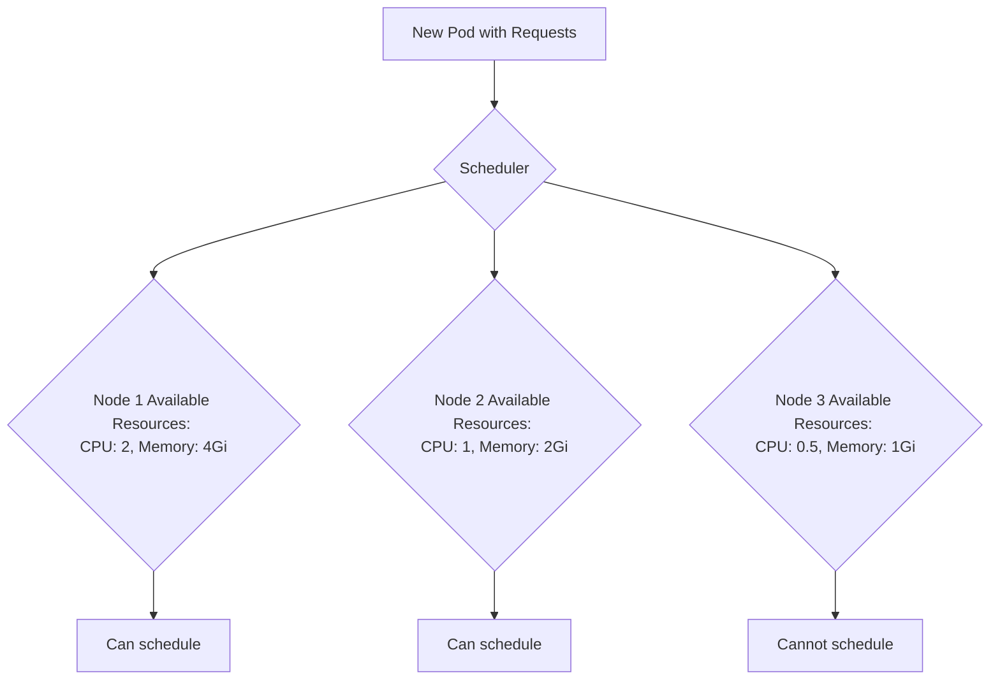

# Kubernetes Resources

## Introduction

When deploying applications on Kubernetes, one of the most important aspects of configuration is managing the resources your applications consume. Kubernetes resources refer to the CPU, memory, and other computing resources that are allocated to containers running in your cluster. Proper resource configuration ensures your applications run smoothly, prevents resource starvation, and helps optimize cluster utilization.

In this guide, we'll explore how Kubernetes handles resource allocation, the different resource types, and how to configure them for your workloads.

## Understanding Resource Types

Kubernetes primarily deals with two types of resources:

1. **CPU** - Processing power needed by your containers
2. **Memory** - RAM required by your applications

### CPU Resources

CPU resources are measured in **CPU units**. One CPU unit is equivalent to:

- 1 AWS vCPU
- 1 GCP Core
- 1 Azure vCore
- 1 Hyperthread on a bare-metal processor

CPU resources can be specified in:
- Millicores (m): 1000m = 1 CPU unit
- Decimal format: 0.5 = 500m CPU

### Memory Resources

Memory resources are measured in bytes, but you can use the following suffixes:

- `Ki` (Kibibytes) - 1024 bytes
- `Mi` (Mebibytes) - 1024 Ki
- `Gi` (Gibibytes) - 1024 Mi
- `Ti` (Tebibytes) - 1024 Gi

For example, `256Mi` represents 256 Mebibytes of memory.

## Resource Requests and Limits

Kubernetes uses two primary concepts to manage container resources:

1. **Requests**: The minimum amount of resources guaranteed to the container
2. **Limits**: The maximum amount of resources the container can use

Let's look at how these work in practice.

## Configuring Resource Requests and Limits

Resource requests and limits are configured at the container level within a Pod specification:

```yaml
apiVersion: v1
kind: Pod
metadata:
  name: frontend
spec:
  containers:
  - name: app
    image: nginx
    resources:
      requests:
        memory: "128Mi"
        cpu: "250m"
      limits:
        memory: "256Mi"
        cpu: "500m"
```

In this example:
- The container requests a minimum of 0.25 CPU and 128 MiB of memory
- The container is limited to 0.5 CPU and 256 MiB of memory

## How Resource Requests Affect Scheduling

The Kubernetes scheduler uses resource requests to decide which node to place a Pod on. It will only schedule a Pod on a node if:

1. The node has enough available CPU and memory to satisfy the Pod's requests
2. The Pod passes all other scheduling constraints

Let's see how this works with an example:



## How Resource Limits Work

Resource limits control how much CPU and memory a container can use:

1. **CPU Limits**: When a container tries to use more CPU than its limit, Kubernetes throttles the container (it doesn't terminate it)
2. **Memory Limits**: When a container tries to use more memory than its limit, the container might be terminated (OOMKilled)

## Best Practices for Resource Configuration

### 1. Always Set Resource Requests and Limits

```yaml
apiVersion: apps/v1
kind: Deployment
metadata:
  name: api-server
spec:
  replicas: 3
  selector:
    matchLabels:
      app: api
  template:
    metadata:
      labels:
        app: api
    spec:
      containers:
      - name: api-container
        image: api:1.0
        resources:
          requests:
            memory: "256Mi"
            cpu: "500m"
          limits:
            memory: "512Mi"
            cpu: "1000m"
```

### 2. Set Realistic Limits Based on Application Needs

Before setting resources, profile your application to understand its resource usage patterns. Set limits that are high enough to handle normal operation but not so high that a single Pod can consume all node resources.

### 3. Consider Resource Quotas for Namespaces

For multi-tenant clusters, use ResourceQuota objects to limit resource usage per namespace:

```yaml
apiVersion: v1
kind: ResourceQuota
metadata:
  name: team-quota
  namespace: team-a
spec:
  hard:
    requests.cpu: "4"
    requests.memory: 8Gi
    limits.cpu: "8"
    limits.memory: 16Gi
```

### 4. Use LimitRange for Default Values

LimitRange objects help enforce minimum and maximum resource usage per Pod or container in a namespace:

```yaml
apiVersion: v1
kind: LimitRange
metadata:
  name: default-limits
  namespace: default
spec:
  limits:
  - default:
      memory: "512Mi"
      cpu: "1"
    defaultRequest:
      memory: "256Mi"
      cpu: "0.5"
    type: Container
```

## Monitoring Resource Usage

To check how your Pods are using resources, use the `kubectl top` command:

```bash
kubectl top pods
```

Output:
```
NAME                     CPU(cores)   MEMORY(bytes)
nginx-6799fc88d8-nmhc6   12m          140Mi
redis-79d78fb9c5-nbtn9   1m           9Mi
```

For more detailed information about a specific Pod:

```bash
kubectl describe pod <pod-name>
```

## Practical Example: Scaling Based on Resource Usage

In this example, we'll configure a Horizontal Pod Autoscaler (HPA) to scale based on CPU usage:

```yaml
apiVersion: autoscaling/v2
kind: HorizontalPodAutoscaler
metadata:
  name: api-hpa
spec:
  scaleTargetRef:
    apiVersion: apps/v1
    kind: Deployment
    name: api-server
  minReplicas: 2
  maxReplicas: 10
  metrics:
  - type: Resource
    resource:
      name: cpu
      target:
        type: Utilization
        averageUtilization: 70
```

This HPA will:
1. Target the `api-server` Deployment
2. Maintain between 2 and 10 replicas
3. Scale up when average CPU utilization reaches 70%

## Troubleshooting Resource Issues

### Common Resource Problems

1. **Pod Pending**: Often due to insufficient resources
   
   Check with:
   ```bash
   kubectl describe pod <pod-name>
   ```
   
   Look for events like:
   ```
   0/3 nodes are available: 3 Insufficient cpu
   ```

2. **OOMKilled**: When a container exceeds its memory limit
   
   Check with:
   ```bash
   kubectl get pod <pod-name>
   ```
   
   Look for:
   ```
   NAME         READY   STATUS      RESTARTS      AGE
   memory-demo  0/1     OOMKilled   1 (30s ago)   40s
   ```

3. **CPU Throttling**: When a container is using its maximum CPU limit
   
   Check metrics to identify throttling:
   ```bash
   kubectl top pod <pod-name> --containers
   ```

## Resource Quality of Service (QoS) Classes

Kubernetes assigns QoS classes to Pods based on their resource configuration:

1. **Guaranteed**: 
   - Every container has requests equal to limits for CPU and memory
   - Highest priority, least likely to be evicted

2. **Burstable**: 
   - At least one container has requests less than limits
   - Medium priority

3. **BestEffort**: 
   - No requests or limits set
   - Lowest priority, first to be evicted

Example of a **Guaranteed** QoS Pod:

```yaml
apiVersion: v1
kind: Pod
metadata:
  name: guaranteed-pod
spec:
  containers:
  - name: guaranteed-container
    image: nginx
    resources:
      requests:
        memory: "256Mi"
        cpu: "500m"
      limits:
        memory: "256Mi"
        cpu: "500m"
```

## Summary

Proper resource configuration is essential for running stable and efficient Kubernetes workloads. By understanding and implementing resource requests and limits, you can:

1. Ensure your applications have the resources they need
2. Prevent resource contention between workloads
3. Optimize cluster utilization
4. Create predictable and reliable deployments

Remember these key points:
- Always specify both requests and limits
- Base your resource settings on actual application needs
- Understand the different QoS classes
- Use ResourceQuota and LimitRange for multi-tenant environments
- Monitor resource usage and adjust as needed

## Additional Resources

- Practice setting up resource configurations for different types of applications
- Try creating ResourceQuota and LimitRange objects
- Experiment with HPA configurations
- Set up monitoring tools to track resource usage over time
- Learn about Vertical Pod Autoscaler for automatic resource recommendation

## Exercises

1. Create a Pod with guaranteed QoS class
2. Configure a ResourceQuota for a namespace limiting total CPU and memory
3. Deploy an application and observe its resource usage with `kubectl top`
4. Configure an HPA for your application based on memory usage
5. Simulate an OOMKill by creating a Pod that exceeds its memory limit