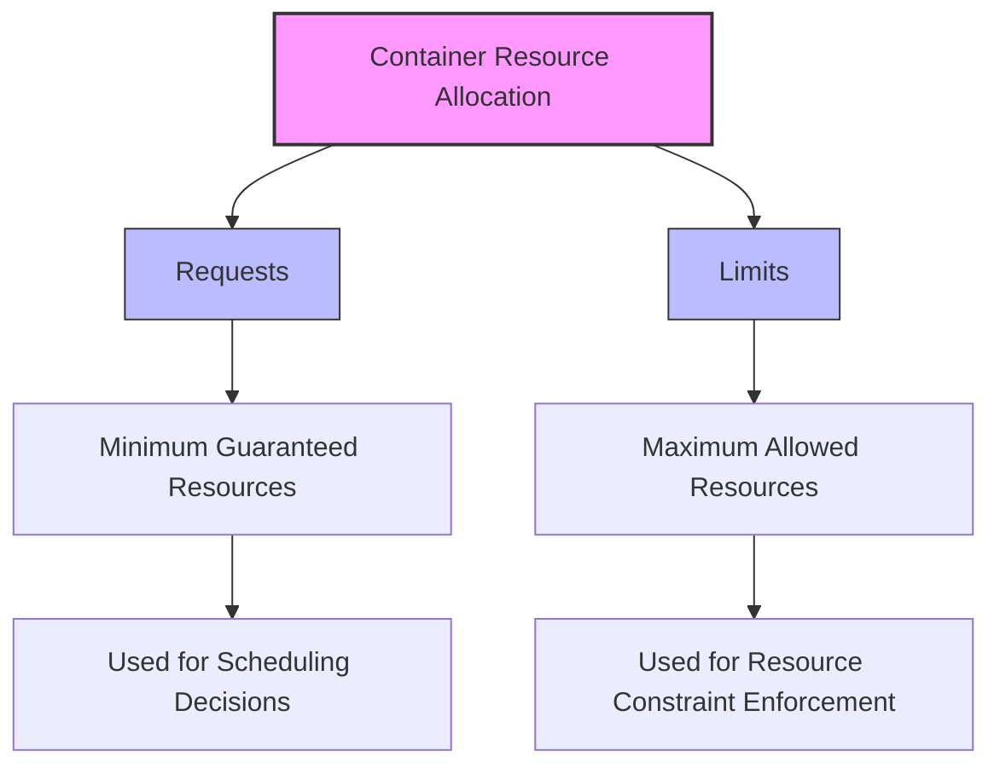

# Kubernetes Limits

## Introduction

When running applications in Kubernetes, it's essential to control how much CPU and memory resources each container can consume. Without proper constraints, a single misbehaving application might consume all available resources on a node, affecting other workloads and potentially causing system instability.

Kubernetes provides a resource management feature called **limits** that allows you to set maximum boundaries on resource consumption for containers. Think of limits as guardrails that prevent containers from using more resources than allocated, ensuring fair resource distribution across your cluster.

## Understanding Resource Limits in Kubernetes

Resource limits in Kubernetes define the maximum amount of CPU and memory a container can use. When a container attempts to exceed its memory limit, it will be terminated (OOM killed). For CPU limits, Kubernetes throttles the container, preventing it from using more CPU time than specified.

### Key Resource Types

Kubernetes primarily manages two types of resources:

1. **CPU**: Measured in cores or millicores (m). For example, `500m` means 0.5 CPU cores.
2. **Memory**: Specified in bytes or with suffixes like Ki, Mi, Gi (1024-based) or K, M, G (1000-based).

## Setting Resource Limits

Resource limits are specified in the container's configuration within a Pod specification. Let's look at the basic syntax:

```yaml
apiVersion: v1
kind: Pod
metadata:
  name: limited-pod
spec:
  containers:
  - name: app-container
    image: nginx
    resources:
      limits:
        memory: "256Mi"
        cpu: "500m"
```

This configuration limits the `app-container` to:
- A maximum of 0.5 CPU cores
- A maximum of 256 MiB of memory

## Limits vs Requests

It's important to understand the difference between **limits** and **requests** in Kubernetes:

- **Requests**: The minimum amount of resources guaranteed to the container
- **Limits**: The maximum amount of resources the container can use

Here's an example showing both:

```yaml
resources:
  requests:
    memory: "128Mi"
    cpu: "250m"
  limits:
    memory: "256Mi"
    cpu: "500m"
```



## Practical Example: Deploying an Application with Limits

Let's create a complete deployment with appropriate resource limits for a web application:

```yaml
apiVersion: apps/v1
kind: Deployment
metadata:
  name: web-app
  labels:
    app: web
spec:
  replicas: 3
  selector:
    matchLabels:
      app: web
  template:
    metadata:
      labels:
        app: web
    spec:
      containers:
      - name: web-container
        image: nginx:latest
        ports:
        - containerPort: 80
        resources:
          limits:
            cpu: "1"
            memory: "512Mi"
          requests:
            cpu: "500m"
            memory: "256Mi"
```

In this deployment:
- We create 3 replicas of an NGINX web server
- Each container requests 0.5 CPU cores and 256Mi of memory
- Each container has a limit of 1 CPU core and 512Mi of memory

## Observing Limit Enforcement

### CPU Limits in Action

When a container tries to use more CPU than its limit, Kubernetes will throttle it. This behavior can be observed by running a CPU-intensive task:

```bash
# Create a pod with CPU limits
kubectl apply -f - <<EOF
apiVersion: v1
kind: Pod
metadata:
  name: cpu-demo
spec:
  containers:
  - name: cpu-demo-container
    image: ubuntu
    command: ["/bin/sh", "-c"]
    args:
    - while true; do echo "CPU intensive task running"; done
    resources:
      limits:
        cpu: "500m"
EOF
```

You can observe the CPU throttling by checking the pod's resource usage:

```bash
kubectl top pod cpu-demo
```

Output (example):
```
NAME       CPU(cores)   MEMORY(bytes)
cpu-demo   500m         10Mi
```

Notice that the CPU usage is capped at 500m, even though the infinite loop would normally use more.

### Memory Limits in Action

When a container tries to use more memory than its limit, Kubernetes will terminate it with an OOM (Out of Memory) error:

```bash
# Create a pod with memory limits
kubectl apply -f - <<EOF
apiVersion: v1
kind: Pod
metadata:
  name: memory-demo
spec:
  containers:
  - name: memory-demo-container
    image: polinux/stress
    command: ["stress"]
    args: ["--vm", "1", "--vm-bytes", "300M", "--vm-hang", "1"]
    resources:
      limits:
        memory: "200Mi"
EOF
```

You can observe what happens by checking the pod status:

```bash
kubectl get pod memory-demo
```

Output (example):
```
NAME           READY   STATUS      RESTARTS      AGE
memory-demo    0/1     OOMKilled   1 (10s ago)   20s
```

## Best Practices for Setting Limits

1. **Always set both requests and limits** for production workloads
2. **Know your application's resource needs** by benchmarking before setting limits
3. **Set reasonable CPU:memory ratios** based on your application characteristics
4. **Leave headroom** for occasional spikes (don't set limits equal to requests)
5. **Monitor resource usage** to refine your limits over time
6. **Consider environment differences** when setting limits (dev vs. production)

## Common Pitfalls

### Setting Limits Too Low

Setting limits too low can cause:
- Frequent OOM kills for memory-intensive applications
- Excessive CPU throttling leading to poor performance

### Setting Limits Too High

Setting limits too high can cause:
- Inefficient cluster resource utilization
- Noisy neighbor problems if containers spike in resource usage

### Forgetting to Include Init Containers

Remember that init containers also need resource limits:

```yaml
spec:
  initContainers:
  - name: init-db
    image: busybox
    command: ['sh', '-c', 'until nslookup db-service; do echo waiting for db; sleep 2; done;']
    resources:
      limits:
        cpu: "100m"
        memory: "50Mi"
  containers:
  - name: app-container
    # ... rest of config
```

## Resource Units in Kubernetes

Understanding resource units is crucial for setting appropriate limits:

| Resource | Units | Description |
|----------|-------|-------------|
| CPU      | m (millicores) | 1000m = 1 CPU core |
| Memory   | Ki, Mi, Gi | Binary units (1Mi = 1024^2 bytes) |
| Memory   | K, M, G | Decimal units (1M = 1000^2 bytes) |

## Real-world Application Examples

### Web Server Configuration

```yaml
apiVersion: apps/v1
kind: Deployment
metadata:
  name: nginx-deployment
spec:
  replicas: 5
  selector:
    matchLabels:
      app: nginx
  template:
    metadata:
      labels:
        app: nginx
    spec:
      containers:
      - name: nginx
        image: nginx:1.19
        ports:
        - containerPort: 80
        resources:
          requests:
            cpu: "100m"
            memory: "128Mi"
          limits:
            cpu: "200m"
            memory: "256Mi"
```

### Database Configuration

```yaml
apiVersion: apps/v1
kind: StatefulSet
metadata:
  name: postgres-db
spec:
  serviceName: "postgres"
  replicas: 1
  selector:
    matchLabels:
      app: postgres
  template:
    metadata:
      labels:
        app: postgres
    spec:
      containers:
      - name: postgres
        image: postgres:13
        ports:
        - containerPort: 5432
          name: postgres
        env:
        - name: POSTGRES_PASSWORD
          value: "securepassword"
        resources:
          requests:
            cpu: "500m"
            memory: "1Gi"
          limits:
            cpu: "1"
            memory: "2Gi"
```

## Namespace-level Resource Quotas

You can also enforce limits at the namespace level using ResourceQuota:

```yaml
apiVersion: v1
kind: ResourceQuota
metadata:
  name: compute-quota
  namespace: development
spec:
  hard:
    pods: "10"
    requests.cpu: "4"
    requests.memory: 8Gi
    limits.cpu: "8"
    limits.memory: 16Gi
```

This ensures that all pods in the "development" namespace cannot collectively exceed the specified resource limits.

## Troubleshooting Limit-Related Issues

### Identifying OOM Kill Events

```bash
# Check for OOM kill events in pod description
kubectl describe pod <pod-name>
```

Look for messages like:
```
OOMKilled: true
Last State: Terminated
Reason: OOMKilled
```

### Checking Resource Usage

```bash
# Install metrics-server if not available
kubectl apply -f https://github.com/kubernetes-sigs/metrics-server/releases/latest/download/components.yaml

# Check pod resource usage
kubectl top pod
```

## Summary

Kubernetes resource limits provide a powerful mechanism for controlling container resource consumption in your cluster. By properly configuring limits, you can:

- Prevent resource starvation from noisy neighbors
- Improve overall cluster stability
- Ensure fair resource allocation
- Protect against application memory leaks or runaway processes

Remember that setting appropriate limits requires understanding your application's resource needs and behavior under load. Start conservative and adjust based on observed usage patterns and performance metrics.

## Additional Resources

- [Kubernetes Official Documentation on Resource Management](https://kubernetes.io/docs/concepts/configuration/manage-resources-containers/)
- [Kubernetes Best Practices: Resource Requests and Limits](https://cloud.google.com/blog/products/containers-kubernetes/kubernetes-best-practices-resource-requests-and-limits)

## Exercises

1. Deploy a simple application with different CPU and memory limits and observe how it performs under load.
2. Create a namespace with ResourceQuota and deploy multiple applications to see how the quota constraints affect deployment.
3. Experiment with setting CPU limits too low for a compute-intensive application and observe the throttling effects.
4. Set up a memory-intensive application with progressively higher memory limits to find the optimal configuration.