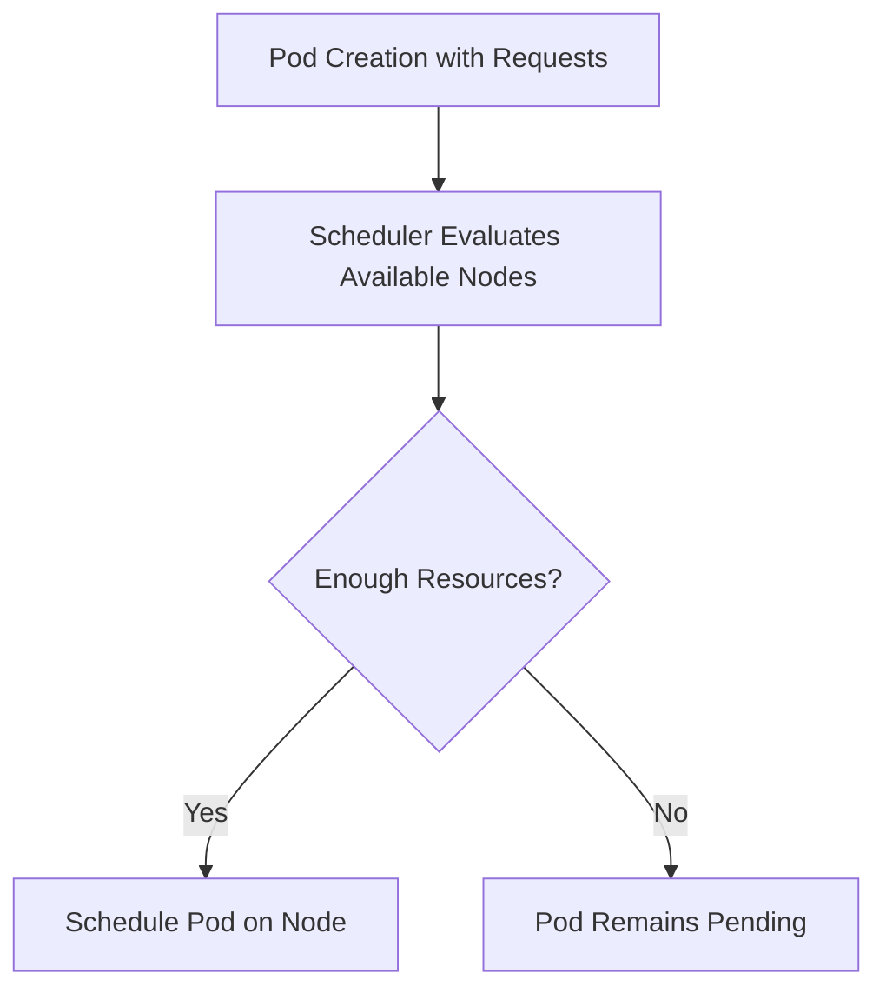

# Kubernetes Requests

## Introduction

When deploying applications on a Kubernetes cluster, one of the most important aspects of configuration is specifying the resources your applications need to run properly. Kubernetes provides a mechanism called **resource requests** that allows you to inform the scheduler about the minimum resources your containers require to function effectively.

Resource requests are part of the broader resource management system in Kubernetes that helps ensure applications are placed on nodes with sufficient resources and receive appropriate allocation during runtime. Understanding and properly configuring resource requests is crucial for maintaining a stable and efficient Kubernetes environment.

## What Are Kubernetes Requests?

Resource requests in Kubernetes specify the **minimum amount of resources** that a container needs to run properly. When you define resource requests in your pod specification, you're essentially telling the Kubernetes scheduler:

> "My container needs at least this much CPU and memory to function correctly."

These requests play a critical role in the scheduling decisions that Kubernetes makes when placing pods on nodes in your cluster.

## Key Concepts

Before diving into the details of resource requests, let's understand some fundamental concepts:

### Resources in Kubernetes

Kubernetes primarily manages two types of resources:

1. **CPU** - Measured in CPU units, where 1 CPU unit equals:
   - 1 vCPU/Core for cloud providers
   - 1 hyperthread on bare-metal Intel processors

2. **Memory** - Typically measured in bytes, with common abbreviations being:
   - Mi (Mebibytes) - 2^20 bytes
   - Gi (Gibibytes) - 2^30 bytes

### Requests vs. Limits

Kubernetes resource management has two key components:

- **Requests**: The minimum resources guaranteed to the container
- **Limits**: The maximum resources a container can use

This guide focuses primarily on requests, but understanding the relationship between requests and limits is important for comprehensive resource management.

## How Resource Requests Work

### Scheduling Phase

When you create a pod with resource requests, the Kubernetes scheduler considers these requests when deciding which node to place the pod on. The scheduler will only place the pod on nodes that have enough unallocated resources to satisfy your requests.



### Running Phase

Once a pod is scheduled on a node:

1. The requested resources are reserved for that pod
2. The container runtime (like Docker) is configured to ensure the pod gets at least the requested resources
3. Even if the pod doesn't use all its requested resources, those resources remain allocated to it

## Configuring Resource Requests

You configure resource requests in the pod specification, typically within a deployment, statefulset, or other workload resource.

### Basic Syntax

Here's how to specify resource requests in a container spec:

```yaml
apiVersion: v1
kind: Pod
metadata:
  name: frontend
spec:
  containers:
  - name: app
    image: nginx
    resources:
      requests:
        memory: "128Mi"
        cpu: "250m"
```

In this example:
- The container requests 128 Mebibytes of memory
- The container requests 250 millicpu (0.25 CPU cores)

### CPU Request Units

CPU requests can be specified in various formats:

- `0.5` or `500m` - Half a CPU core
- `1` - One full CPU core
- `250m` - Quarter of a CPU core (250 millicpu)

The `m` suffix stands for "milli," meaning 1/1000th of a CPU core.

### Memory Request Units

Memory can be specified using several suffixes:

- `128Mi` - 128 Mebibytes
- `1Gi` - 1 Gibibyte
- `512M` - 512 Megabytes
- `2G` - 2 Gigabytes

Note the difference between powers of 2 (Mi, Gi) and powers of 10 (M, G).

## Practical Examples

Let's walk through some practical examples to understand how requests work in real-world scenarios.

### Example 1: Simple Web Application

For a basic web server with low traffic:

```yaml
apiVersion: apps/v1
kind: Deployment
metadata:
  name: web-server
  labels:
    app: nginx
spec:
  replicas: 3
  selector:
    matchLabels:
      app: nginx
  template:
    metadata:
      labels:
        app: nginx
    spec:
      containers:
      - name: nginx
        image: nginx:1.19
        ports:
        - containerPort: 80
        resources:
          requests:
            memory: "64Mi"
            cpu: "100m"
```

This configuration:
- Requests 64 MiB of memory per container
- Requests 0.1 CPU cores per container
- With 3 replicas, the total request is 192 MiB of memory and 0.3 CPU cores

### Example 2: Database Application

For a database that requires more resources:

```yaml
apiVersion: apps/v1
kind: StatefulSet
metadata:
  name: postgres-db
spec:
  serviceName: "postgres"
  replicas: 1
  selector:
    matchLabels:
      app: postgres
  template:
    metadata:
      labels:
        app: postgres
    spec:
      containers:
      - name: postgres
        image: postgres:13
        env:
        - name: POSTGRES_PASSWORD
          valueFrom:
            secretKeyRef:
              name: postgres-secrets
              key: password
        ports:
        - containerPort: 5432
          name: postgres
        resources:
          requests:
            memory: "1Gi"
            cpu: "500m"
        volumeMounts:
        - name: postgres-data
          mountPath: /var/lib/postgresql/data
  volumeClaimTemplates:
  - metadata:
      name: postgres-data
    spec:
      accessModes: [ "ReadWriteOnce" ]
      resources:
        requests:
          storage: "10Gi"
```

This example:
- Requests 1 GiB of memory for the database
- Requests 0.5 CPU cores
- Also includes a storage request of 10 GiB for persistent data

## Best Practices for Setting Requests

Setting appropriate resource requests is crucial for efficient cluster operation. Here are some best practices:

### 1. Measure Actual Resource Usage

Before setting requests, monitor your application's actual resource usage using tools like:
- Kubernetes Metrics Server
- Prometheus
- Resource usage data from `kubectl top pods`

This helps you set realistic request values.

### 2. Set Requests Based on Typical Workload

Set your requests based on the typical workload of your application, not peak usage. For peak usage, you can use resource limits (which we'll cover in a separate guide).

### 3. Start Conservative and Adjust

If you're unsure:
1. Start with conservative request values
2. Monitor application performance
3. Adjust values based on observed behavior

### 4. Consider Application Startup Needs

Some applications require more resources during startup than during normal operation. Make sure your requests accommodate startup resource needs.

### 5. Be Mindful of Cluster Capacity

Always consider the total capacity of your cluster when setting requests. Overcommitting resources can lead to scheduling problems.

## Common Mistakes to Avoid

### 1. Setting Requests Too Low

If you set requests too low:
- Your application might be scheduled on a node without enough resources
- Your application might experience performance issues or unexpected behavior

### 2. Setting Requests Too High

If you set requests too high:
- You waste cluster resources
- Fewer pods can be scheduled on your cluster
- You might hit scheduling limitations

### 3. Ignoring Resource Requests Entirely

Failing to set resource requests:
- Makes the scheduler's job harder
- Can lead to resource contention
- May result in unpredictable application performance

### 4. Using the Wrong Units

Be careful about the units you use:
- `512M` vs `512Mi` makes a difference
- `0.5` CPU is equivalent to `500m` CPU

## Debugging Resource Request Issues

If your pod is stuck in a `Pending` state, it might be due to resource request issues:

1. Check pod status:
   ```bash
   kubectl describe pod [pod-name]
   ```

2. Look for messages like:
   ```
   0/3 nodes are available: 3 Insufficient cpu, 3 Insufficient memory.
   ```

3. Either adjust your resource requests or add more capacity to your cluster.

## Resource Requests in Multi-Container Pods

For pods with multiple containers, Kubernetes considers the sum of all container requests:

```yaml
apiVersion: v1
kind: Pod
metadata:
  name: multi-container-pod
spec:
  containers:
  - name: app
    image: app:latest
    resources:
      requests:
        memory: "256Mi"
        cpu: "250m"
  - name: sidecar
    image: sidecar:latest
    resources:
      requests:
        memory: "64Mi"
        cpu: "50m"
```

Total pod requests:
- CPU: 300m (250m + 50m)
- Memory: 320Mi (256Mi + 64Mi)

## Resource Requests vs. Namespace Quotas

Kubernetes allows setting resource quotas at the namespace level, which can limit the total resources requested by all pods in a namespace:

```yaml
apiVersion: v1
kind: ResourceQuota
metadata:
  name: compute-resources
  namespace: development
spec:
  hard:
    requests.cpu: "2"
    requests.memory: 2Gi
```

This quota ensures all pods in the "development" namespace can't request more than 2 CPU cores and 2 GiB of memory in total.

## Summary

Kubernetes resource requests are a fundamental part of the resource management system that help ensure pods are scheduled on nodes with sufficient resources. By properly configuring resource requests, you:

- Help the scheduler make better decisions
- Ensure your applications have the resources they need
- Improve the stability and efficiency of your Kubernetes cluster

Remember these key points:
- Requests specify the minimum resources your container needs
- They affect scheduling decisions and resource allocation
- Setting appropriate requests requires understanding your application's resource usage
- Always measure and monitor to fine-tune your resource requests

## Additional Resources

For further learning:

- [Kubernetes Official Documentation on Resource Management](https://kubernetes.io/docs/concepts/configuration/manage-resources-containers/)
- [Kubernetes Resource Quotas](https://kubernetes.io/docs/concepts/policy/resource-quotas/)
- [Kubernetes LimitRange](https://kubernetes.io/docs/concepts/policy/limit-range/)

## Exercises

1. Deploy a simple application without resource requests, then add appropriate requests and observe any differences in behavior.

2. Create a namespace with resource quotas and test how it prevents over-provisioning of resources.

3. Use `kubectl top pods` to monitor the actual resource usage of your applications and compare it with your configured requests.

4. Create a multi-container pod with different resource requests for each container and observe how Kubernetes manages resources for the pod.

5. Deliberately set resource requests higher than your node capacity and observe what happens when you try to schedule the pod.