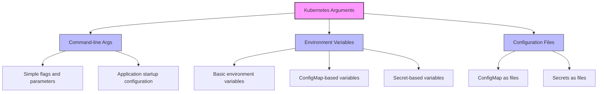

# Kubernetes Arguments

In Kubernetes, passing configuration data to your applications is a fundamental skill. This guide covers how to configure your containerized applications using various argument-passing techniques.

## Introduction

When deploying applications in Kubernetes, you'll often need to customize their behavior without changing the underlying code. Arguments provide this flexibility, allowing you to:

- Configure application settings at runtime
- Adapt deployments to different environments (development, staging, production)
- Override default values with custom configurations
- Pass sensitive information securely

Kubernetes offers multiple ways to provide arguments to your containers, each with specific use cases and advantages.

## Command-Line Arguments

The most direct way to pass arguments to a container is through command-line arguments, which are specified in your Kubernetes manifests.

### Basic Command and Args

In Kubernetes, the `command` and `args` fields in a Pod specification let you override the default behavior of a container:

```yaml
apiVersion: v1
kind: Pod
metadata:
  name: command-demo
spec:
  containers:
  - name: command-demo-container
    image: nginx
    command: ["nginx"]
    args: ["-g", "daemon off;"]
```

In this example:
- `command` replaces the Docker `ENTRYPOINT`
- `args` replaces the Docker `CMD`

The container runs `nginx -g "daemon off;"`, starting Nginx in the foreground.

### When to Use Command-Line Arguments

Command-line arguments are best for:
- Simple configurations
- Settings that rarely change
- Application startup parameters
- Overriding default behaviors

## Environment Variables

Environment variables provide another way to pass arguments to containers in Kubernetes.

### Basic Environment Variables

You can specify environment variables directly in the Pod specification:

```yaml
apiVersion: v1
kind: Pod
metadata:
  name: env-demo
spec:
  containers:
  - name: env-demo-container
    image: mysql
    env:
    - name: MYSQL_ROOT_PASSWORD
      value: "password123"
    - name: MYSQL_DATABASE
      value: "myapp"
```

This sets two environment variables (`MYSQL_ROOT_PASSWORD` and `MYSQL_DATABASE`) for the MySQL container.

### Using ConfigMaps for Environment Variables

For more complex configurations, you can use ConfigMaps to manage environment variables:

```yaml
apiVersion: v1
kind: ConfigMap
metadata:
  name: app-config
data:
  LOG_LEVEL: "info"
  APP_PORT: "8080"
  ENABLE_FEATURE_X: "true"
```

Then reference this ConfigMap in your Pod:

```yaml
apiVersion: v1
kind: Pod
metadata:
  name: configmap-env-demo
spec:
  containers:
  - name: app-container
    image: myapp:1.0
    envFrom:
    - configMapRef:
        name: app-config
```

All key-value pairs from the ConfigMap will become environment variables in the container.

### Using Secrets for Sensitive Environment Variables

For sensitive information, use Kubernetes Secrets:

```yaml
apiVersion: v1
kind: Secret
metadata:
  name: db-credentials
type: Opaque
data:
  username: YWRtaW4=  # base64 encoded "admin"
  password: cGFzc3dvcmQxMjM=  # base64 encoded "password123"
```

Reference the secret in your Pod:

```yaml
apiVersion: v1
kind: Pod
metadata:
  name: secret-env-demo
spec:
  containers:
  - name: app-container
    image: myapp:1.0
    env:
    - name: DB_USERNAME
      valueFrom:
        secretKeyRef:
          name: db-credentials
          key: username
    - name: DB_PASSWORD
      valueFrom:
        secretKeyRef:
          name: db-credentials
          key: password
```

## Configuration Files

For complex configurations, you can mount ConfigMaps or Secrets as files within your container.

### Mounting ConfigMaps as Files

Create a ConfigMap with configuration file content:

```yaml
apiVersion: v1
kind: ConfigMap
metadata:
  name: nginx-config
data:
  nginx.conf: |
    server {
      listen 80;
      server_name localhost;
      location / {
        root /usr/share/nginx/html;
        index index.html;
      }
    }
```

Mount this ConfigMap as a file in your Pod:

```yaml
apiVersion: v1
kind: Pod
metadata:
  name: nginx-configmap-demo
spec:
  containers:
  - name: nginx
    image: nginx
    volumeMounts:
    - name: config-volume
      mountPath: /etc/nginx/conf.d
  volumes:
  - name: config-volume
    configMap:
      name: nginx-config
```

The Nginx container now has the custom configuration file mounted at `/etc/nginx/conf.d/nginx.conf`.

### Mounting Secrets as Files

Similarly, you can mount Secrets as files:

```yaml
apiVersion: v1
kind: Pod
metadata:
  name: secret-file-demo
spec:
  containers:
  - name: app-container
    image: myapp:1.0
    volumeMounts:
    - name: secret-volume
      mountPath: /etc/secrets
      readOnly: true
  volumes:
  - name: secret-volume
    secret:
      secretName: db-credentials
```

This mounts the Secret as files at `/etc/secrets/username` and `/etc/secrets/password`.

## Practical Examples

Let's explore some real-world examples of using Kubernetes arguments.

### Web Server Configuration

Deploy an Nginx server with custom configuration:

```yaml
apiVersion: apps/v1
kind: Deployment
metadata:
  name: custom-nginx
spec:
  replicas: 3
  selector:
    matchLabels:
      app: custom-nginx
  template:
    metadata:
      labels:
        app: custom-nginx
    spec:
      containers:
      - name: nginx
        image: nginx:1.21
        ports:
        - containerPort: 80
        args: ["-c", "/etc/nginx/nginx-custom.conf"]
        volumeMounts:
        - name: config-volume
          mountPath: /etc/nginx
      volumes:
      - name: config-volume
        configMap:
          name: nginx-custom-config
---
apiVersion: v1
kind: ConfigMap
metadata:
  name: nginx-custom-config
data:
  nginx-custom.conf: |
    worker_processes 2;
    events {
      worker_connections 1024;
    }
    http {
      server {
        listen 80;
        server_name _;
        location / {
          root /usr/share/nginx/html;
          index index.html;
        }
      }
    }
```

This example:
1. Creates a ConfigMap with a custom Nginx configuration
2. Mounts this configuration in the container
3. Uses command-line arguments to tell Nginx to use the custom configuration file

### Database Configuration

Deploy a PostgreSQL database with custom settings:

```yaml
apiVersion: apps/v1
kind: Deployment
metadata:
  name: postgres-db
spec:
  replicas: 1
  selector:
    matchLabels:
      app: postgres
  template:
    metadata:
      labels:
        app: postgres
    spec:
      containers:
      - name: postgres
        image: postgres:14
        ports:
        - containerPort: 5432
        env:
        - name: POSTGRES_USER
          valueFrom:
            secretKeyRef:
              name: postgres-credentials
              key: username
        - name: POSTGRES_PASSWORD
          valueFrom:
            secretKeyRef:
              name: postgres-credentials
              key: password
        - name: POSTGRES_DB
          value: myapplication
        args:
        - "-c"
        - "max_connections=200"
        - "-c"
        - "shared_buffers=256MB"
---
apiVersion: v1
kind: Secret
metadata:
  name: postgres-credentials
type: Opaque
data:
  username: YWRtaW4=
  password: c2VjdXJlUGFzc3dvcmQxMjM=
```

This example:
1. Uses environment variables from a Secret for sensitive authentication data
2. Uses command-line arguments to set PostgreSQL configuration parameters

### API Server with Feature Flags

Configure an API server with different features enabled based on environment:

```yaml
apiVersion: apps/v1
kind: Deployment
metadata:
  name: api-server
spec:
  replicas: 3
  selector:
    matchLabels:
      app: api-server
  template:
    metadata:
      labels:
        app: api-server
    spec:
      containers:
      - name: api-container
        image: myapi:2.0
        ports:
        - containerPort: 8080
        envFrom:
        - configMapRef:
            name: api-config-prod
---
apiVersion: v1
kind: ConfigMap
metadata:
  name: api-config-prod
data:
  NODE_ENV: "production"
  LOG_LEVEL: "info"
  ENABLE_CACHE: "true"
  CACHE_TTL_SECONDS: "3600"
  RATE_LIMIT_REQUESTS: "100"
  RATE_LIMIT_WINDOW_MS: "60000"
  ENABLE_BETA_FEATURES: "false"
```

In this example, the API server is configured entirely through environment variables stored in a ConfigMap, allowing for easy environment-specific configurations.

## Best Practices

When using Kubernetes arguments, follow these best practices:

1. **Use the right tool for the job**:
   - Simple flags → Command-line arguments
   - App configuration → Environment variables
   - Complex/multiline configuration → ConfigMaps as files
   - Secrets → Kubernetes Secrets

2. **Separate configuration from code**:
   - Store configuration externally from your container images
   - Use ConfigMaps and Secrets for environment-specific settings

3. **Use descriptive naming**:
   - Give ConfigMaps and Secrets meaningful names
   - Use clear variable naming conventions

4. **Security considerations**:
   - Never hardcode sensitive information in Pod specs
   - Use Secrets for passwords, API keys, and certificates
   - Consider encrypting Secrets at rest

5. **Configuration hierarchy**:
   - Define a clear hierarchy for configuration (defaults → environment-specific → instance-specific)
   - Document which settings can be overridden and how

## Comparing Methods

Here's a comparison of the different argument-passing methods:



| Method | Pros | Cons | Best For |
|--------|------|------|----------|
| Command-line args | Simple, direct | Limited in complexity | Startup parameters, flags |
| Environment variables | Widely supported, easy to use | Not ideal for multiline configs | Application settings |
| ConfigMaps as files | Supports complex configurations | Requires volume mounts | Configuration files |
| Secrets as files | Secure storage of sensitive data | Requires volume mounts | Credentials, certificates |

## Summary

Kubernetes provides multiple methods for passing arguments to your containerized applications:

1. **Command-line arguments** for simple flags and parameters
2. **Environment variables** for application configuration
3. **ConfigMaps** for structured configuration data
4. **Secrets** for sensitive information

By understanding these different methods and their appropriate use cases, you can build flexible, configurable, and secure Kubernetes applications that can be deployed across different environments without code changes.

## Additional Resources

To deepen your knowledge of Kubernetes arguments and configuration, explore these resources:

- Practice creating a multi-environment application with different ConfigMaps
- Experiment with overriding default arguments in common container images
- Learn more about Kubernetes Secrets management and security

In the next section, we'll explore how to use Kubernetes Probes for health monitoring and self-healing applications.