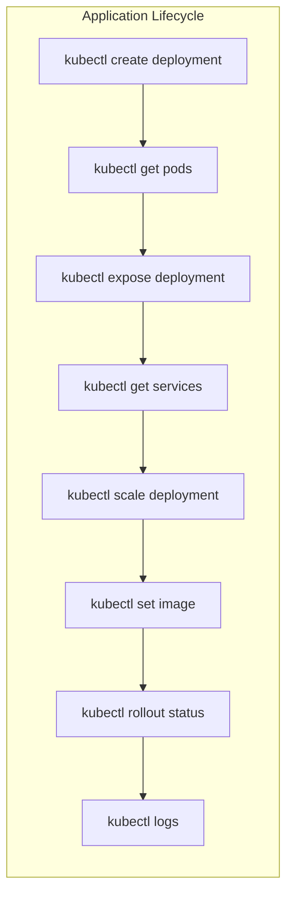

# Kubernetes Commands

## Introduction

Kubernetes is a powerful container orchestration platform that helps you deploy, scale, and manage containerized applications. One of the fundamental skills for working with Kubernetes is mastering its command-line tool, `kubectl`. This tool allows you to communicate with your Kubernetes cluster and perform various operations.

In this guide, we'll explore the most common and useful Kubernetes commands that will help you manage your clusters effectively. Whether you're setting up a development environment or managing production workloads, these commands will form the foundation of your Kubernetes journey.

## Getting Started with kubectl

Before diving into specific commands, let's understand how to install and set up kubectl.

### Installing kubectl

The `kubectl` command-line tool is necessary to interact with any Kubernetes cluster. Here's how to install it on different operating systems:

For macOS (using Homebrew):

```bash
brew install kubectl
```

For Ubuntu/Debian:

```bash
sudo apt-get update && sudo apt-get install -y kubectl
```

For Windows (using Chocolatey):

```bash
choco install kubernetes-cli
```

Verify your installation:

```bash
kubectl version --client
```

Output will look something like:

```
Client Version: version.Info{Major:"1", Minor:"25", GitVersion:"v1.25.4", GitCommit:"872a965c6c6526caa949f0c6ac028ef7aff3fb78", GitTreeState:"clean", BuildDate:"2022-11-09T13:36:36Z", GoVersion:"go1.19.3", Compiler:"gc", Platform:"darwin/amd64"}
```

### Configuring kubectl

`kubectl` needs to know which cluster to communicate with and how to authenticate. This information is stored in a configuration file called `kubeconfig`.

The default location is `~/.kube/config`, but you can specify a different location using the `--kubeconfig` flag or the `KUBECONFIG` environment variable.

To view your current configuration:

```bash
kubectl config view
```

To set a specific context (cluster):

```bash
kubectl config use-context my-cluster-name
```

## Essential Kubernetes Commands

### Cluster Information Commands

These commands help you understand your cluster's state and configuration.

#### Check cluster info

```bash
kubectl cluster-info
```

Output:
```
Kubernetes control plane is running at https://kubernetes.docker.internal:6443
CoreDNS is running at https://kubernetes.docker.internal:6443/api/v1/namespaces/kube-system/services/kube-dns:dns/proxy
```

#### List all nodes in the cluster

```bash
kubectl get nodes
```

Output:
```
NAME             STATUS   ROLES           AGE     VERSION
docker-desktop   Ready    control-plane   7d14h   v1.25.4
```

#### Get detailed information about a specific node

```bash
kubectl describe node node-name
```

### Resource Management Commands

Kubernetes organizes resources into different namespaces. Here are commands to work with them:

#### List all namespaces

```bash
kubectl get namespaces
```

Output:
```
NAME              STATUS   AGE
default           Active   7d14h
kube-node-lease   Active   7d14h
kube-public       Active   7d14h
kube-system       Active   7d14h
```

#### Create a namespace

```bash
kubectl create namespace my-namespace
```

#### Set the default namespace for kubectl commands

```bash
kubectl config set-context --current --namespace=my-namespace
```

### Pod Management Commands

Pods are the smallest deployable units in Kubernetes.

#### List all pods

```bash
kubectl get pods
```

With more details:

```bash
kubectl get pods -o wide
```

In all namespaces:

```bash
kubectl get pods --all-namespaces
```

#### Describe a specific pod

```bash
kubectl describe pod pod-name
```

#### Creating a pod from a YAML file

```bash
kubectl apply -f pod-definition.yaml
```

#### Get pod logs

```bash
kubectl logs pod-name
```

Follow logs in real-time:

```bash
kubectl logs -f pod-name
```

#### Execute a command in a pod

```bash
kubectl exec -it pod-name -- /bin/bash
```

#### Delete a pod

```bash
kubectl delete pod pod-name
```

### Deployment Commands

Deployments manage ReplicaSets, which ensure a specified number of pod replicas are running.

#### Create a deployment

```bash
kubectl create deployment nginx-deployment --image=nginx
```

#### List all deployments

```bash
kubectl get deployments
```

#### Scale a deployment

```bash
kubectl scale deployment nginx-deployment --replicas=5
```

#### Update a deployment's image

```bash
kubectl set image deployment/nginx-deployment nginx=nginx:1.19
```

#### View the rollout status

```bash
kubectl rollout status deployment/nginx-deployment
```

#### Rollback a deployment

```bash
kubectl rollout undo deployment/nginx-deployment
```

#### Delete a deployment

```bash
kubectl delete deployment nginx-deployment
```

### Service Commands

Services provide stable network endpoints for pods.

#### List all services

```bash
kubectl get services
```

#### Create a service (exposing a deployment)

```bash
kubectl expose deployment nginx-deployment --port=80 --type=LoadBalancer
```

#### Describe a service

```bash
kubectl describe service service-name
```

#### Delete a service

```bash
kubectl delete service service-name
```

## Practical Examples

Let's go through some practical examples to see how these commands work together in real-world scenarios.

### Example 1: Deploying a Web Application

Let's deploy a simple web application and expose it to the internet:

```bash
# Create a deployment
kubectl create deployment web-app --image=nginx

# Verify the deployment
kubectl get deployments
kubectl get pods

# Expose the deployment as a service
kubectl expose deployment web-app --port=80 --type=LoadBalancer

# Check the service details
kubectl get services
```

### Example 2: Scaling and Updating an Application

Now, let's scale our application and then update it:

```bash
# Scale the deployment to 3 replicas
kubectl scale deployment web-app --replicas=3

# Verify the scaling
kubectl get pods

# Update the application image
kubectl set image deployment/web-app nginx=nginx:alpine

# Check the rollout status
kubectl rollout status deployment/web-app

# View the update history
kubectl rollout history deployment/web-app
```

### Example 3: Debugging a Failed Pod

When pods fail, you need to troubleshoot:

```bash
# Identify the failed pod
kubectl get pods

# View detailed information about the pod
kubectl describe pod failed-pod-name

# Check the logs
kubectl logs failed-pod-name

# If needed, get a shell into the container
kubectl exec -it failed-pod-name -- /bin/sh
```

## Working with Configuration

### ConfigMaps and Secrets

ConfigMaps and Secrets help you manage configuration data separately from your application code.

#### Create a ConfigMap

```bash
kubectl create configmap app-config --from-literal=APP_ENV=production --from-literal=APP_DEBUG=false
```

#### View ConfigMaps

```bash
kubectl get configmaps
kubectl describe configmap app-config
```

#### Create a Secret

```bash
kubectl create secret generic app-secrets --from-literal=DB_PASSWORD=mypassword
```

#### View Secrets

```bash
kubectl get secrets
kubectl describe secret app-secrets
```

## Command Flow Visualization

Here's a visualization of the command flow for a typical Kubernetes application lifecycle:



## Tips and Tricks

### 1. Use Aliases

Create aliases for frequently used commands:

```bash
alias k='kubectl'
alias kg='kubectl get'
alias kd='kubectl describe'
```

### 2. Use kubectl Output Formats

`kubectl` can output data in different formats:

```bash
# Output in JSON format
kubectl get pods -o json

# Output in YAML format
kubectl get pods -o yaml

# Output specific fields using jsonpath
kubectl get pods -o jsonpath='{.items[0].metadata.name}'

# Custom columns
kubectl get pods -o custom-columns=NAME:.metadata.name,STATUS:.status.phase
```

### 3. Use context switching

If you work with multiple clusters:

```bash
# List all contexts
kubectl config get-contexts

# Switch context
kubectl config use-context my-other-cluster
```

## Summary

In this guide, we've covered the essential Kubernetes commands that you'll need to manage your clusters effectively. From basic cluster information and pod management to advanced deployment strategies and configuration, these commands form the backbone of Kubernetes operations.

Remember that mastering `kubectl` is a journey. Start with these fundamentals and gradually explore more complex commands as you become comfortable with the basics.

## Additional Resources

To continue your Kubernetes learning journey:

1. The official [Kubernetes documentation](https://kubernetes.io/docs/home/)
2. The `kubectl` [cheat sheet](https://kubernetes.io/docs/reference/kubectl/cheatsheet/)
3. The `kubectl` [command reference](https://kubernetes.io/docs/reference/generated/kubectl/kubectl-commands)

## Exercises

To practice what you've learned:

1. Deploy a simple multi-container application using a YAML manifest.
2. Scale the application up and down, and observe the changes.
3. Update the application to a newer version and then roll back to the previous version.
4. Create a ConfigMap and a Secret, and mount them into your application.
5. Troubleshoot a failing pod by examining its logs and events.

Happy Kubernetes journey!