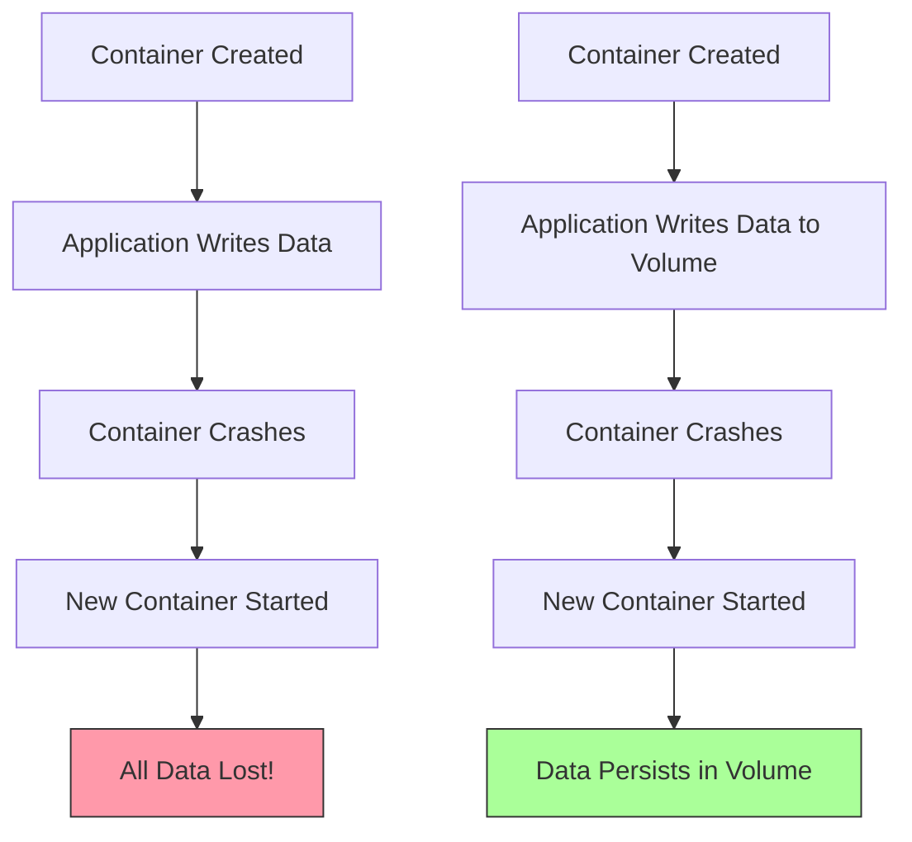
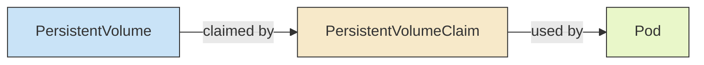

# Kubernetes Volumes

## Introduction

When working with containers in Kubernetes, one challenge you'll quickly face is **data persistence**. By design, containers are ephemeral - when a container restarts or terminates, all the data inside it is lost. This is where Kubernetes Volumes come to the rescue.

Volumes provide a way to store data outside the container lifecycle, allowing data to persist even when containers restart, terminate, or move between nodes. They are an essential component for running stateful applications in Kubernetes.

In this guide, we'll explore:
- What Kubernetes Volumes are and why they're needed
- The different types of volumes available
- How to configure and use volumes in your applications
- Best practices for managing persistent data in Kubernetes

## Why Do We Need Volumes?

To understand the importance of volumes, let's look at a simple scenario:

Imagine you're running a database in a container. If that container crashes or needs to be restarted, all the data would be lost without a persistent volume. This is clearly not acceptable for most real-world applications.



## Volume Basics

A Kubernetes volume has an explicit lifetime - the same as the Pod that contains it. This means a volume outlives any containers that run within the Pod, and data is preserved across container restarts.

### Key Concepts

- **Volume**: A directory accessible to all containers in a Pod
- **Volume Mount**: The path within a container where a volume is mounted
- **Volume Type**: Determines how and where data is stored (e.g., local disk, cloud storage)

## Types of Kubernetes Volumes

Kubernetes supports many volume types. Let's look at some of the most common ones:

### 1. `emptyDir`

The simplest volume type. It's created when a Pod is assigned to a node and exists as long as the Pod is running on that node.

**Use cases**:
- Temporary scratch space
- Sharing files between containers in the same Pod

```yaml
apiVersion: v1
kind: Pod
metadata:
  name: example-pod
spec:
  containers:
  - name: first-container
    image: nginx
    volumeMounts:
    - mountPath: /cache
      name: cache-volume
  - name: second-container
    image: busybox
    volumeMounts:
    - mountPath: /data
      name: cache-volume
  volumes:
  - name: cache-volume
    emptyDir: {}
```

In this example, both containers can access the same files, one at `/cache` and the other at `/data`.

### 2. `hostPath`

Mounts a file or directory from the host node's filesystem into your Pod.

**Use cases**:
- Accessing host system files
- Running a container that needs access to Docker internals

```yaml
apiVersion: v1
kind: Pod
metadata:
  name: hostpath-example
spec:
  containers:
  - name: test-container
    image: nginx
    volumeMounts:
    - mountPath: /test-data
      name: hostpath-volume
  volumes:
  - name: hostpath-volume
    hostPath:
      path: /data
      type: Directory
```

⚠️ **Warning**: `hostPath` volumes present security risks since they allow pods to access the host filesystem.

### 3. `configMap` and `secret`

These special volume types mount Kubernetes ConfigMaps and Secrets as volumes.

**Use cases**:
- Mounting configuration files
- Providing sensitive data to applications

```yaml
apiVersion: v1
kind: Pod
metadata:
  name: configmap-pod
spec:
  containers:
  - name: app
    image: alpine
    command: ["sh", "-c", "cat /config/app.properties"]
    volumeMounts:
    - name: config-volume
      mountPath: /config
  volumes:
  - name: config-volume
    configMap:
      name: app-config
```

### 4. Cloud Provider Volumes

Kubernetes integrates with cloud providers to offer native storage solutions:

- `awsElasticBlockStore` for AWS EBS volumes
- `azureDisk` and `azureFile` for Azure storage
- `gcePersistentDisk` for Google Compute Engine persistent disks

```yaml
apiVersion: v1
kind: Pod
metadata:
  name: aws-ebs-example
spec:
  containers:
  - name: app
    image: nginx
    volumeMounts:
    - mountPath: /data
      name: data-volume
  volumes:
  - name: data-volume
    awsElasticBlockStore:
      volumeID: <volume-id>
      fsType: ext4
```

### 5. Network Storage

Kubernetes supports various network storage systems:

- `nfs` for NFS shares
- `cephfs` for Ceph filesystems
- `glusterfs` for GlusterFS volumes

```yaml
apiVersion: v1
kind: Pod
metadata:
  name: nfs-example
spec:
  containers:
  - name: app
    image: nginx
    volumeMounts:
    - mountPath: /data
      name: nfs-volume
  volumes:
  - name: nfs-volume
    nfs:
      server: nfs-server.example.com
      path: /share
```

## Persistent Volumes and Claims

For more production-ready setups, Kubernetes offers a more sophisticated system:

- **PersistentVolume (PV)**: A piece of storage provisioned by an administrator
- **PersistentVolumeClaim (PVC)**: A request for storage by a user

This abstraction separates the consumption of storage from the details of how it's provisioned.



### Creating a PersistentVolume

```yaml
apiVersion: v1
kind: PersistentVolume
metadata:
  name: example-pv
spec:
  capacity:
    storage: 10Gi
  accessModes:
    - ReadWriteOnce
  persistentVolumeReclaimPolicy: Retain
  storageClassName: standard
  hostPath:
    path: /data/example-pv
```

### Creating a PersistentVolumeClaim

```yaml
apiVersion: v1
kind: PersistentVolumeClaim
metadata:
  name: example-pvc
spec:
  accessModes:
    - ReadWriteOnce
  resources:
    requests:
      storage: 5Gi
  storageClassName: standard
```

### Using a PVC in a Pod

```yaml
apiVersion: v1
kind: Pod
metadata:
  name: pvc-example-pod
spec:
  containers:
  - name: app
    image: mysql
    volumeMounts:
    - mountPath: /var/lib/mysql
      name: mysql-data
    env:
    - name: MYSQL_ROOT_PASSWORD
      value: "password"
  volumes:
  - name: mysql-data
    persistentVolumeClaim:
      claimName: example-pvc
```

## Storage Classes and Dynamic Provisioning

StorageClasses allow dynamic provisioning of PersistentVolumes when PVCs are created.

```yaml
apiVersion: storage.k8s.io/v1
kind: StorageClass
metadata:
  name: fast
provisioner: kubernetes.io/aws-ebs
parameters:
  type: gp2
  fsType: ext4
```

With a StorageClass defined, a PVC can request storage from it:

```yaml
apiVersion: v1
kind: PersistentVolumeClaim
metadata:
  name: fast-storage-claim
spec:
  accessModes:
    - ReadWriteOnce
  storageClassName: fast
  resources:
    requests:
      storage: 100Gi
```

## Real-World Examples

### Example 1: Running a WordPress Site with MySQL

This example shows how to deploy WordPress with MySQL, both using persistent volumes:

```yaml
apiVersion: v1
kind: PersistentVolumeClaim
metadata:
  name: mysql-pvc
spec:
  accessModes:
    - ReadWriteOnce
  resources:
    requests:
      storage: 20Gi
---
apiVersion: v1
kind: PersistentVolumeClaim
metadata:
  name: wordpress-pvc
spec:
  accessModes:
    - ReadWriteOnce
  resources:
    requests:
      storage: 10Gi
---
apiVersion: v1
kind: Secret
metadata:
  name: wordpress-mysql-secret
type: Opaque
data:
  password: cGFzc3dvcmQ=  # base64 encoded "password"
---
apiVersion: apps/v1
kind: Deployment
metadata:
  name: wordpress-mysql
spec:
  selector:
    matchLabels:
      app: wordpress-mysql
  template:
    metadata:
      labels:
        app: wordpress-mysql
    spec:
      containers:
      - name: mysql
        image: mysql:5.7
        ports:
        - containerPort: 3306
        env:
        - name: MYSQL_ROOT_PASSWORD
          valueFrom:
            secretKeyRef:
              name: wordpress-mysql-secret
              key: password
        volumeMounts:
        - name: mysql-persistent-storage
          mountPath: /var/lib/mysql
      volumes:
      - name: mysql-persistent-storage
        persistentVolumeClaim:
          claimName: mysql-pvc
---
apiVersion: apps/v1
kind: Deployment
metadata:
  name: wordpress
spec:
  selector:
    matchLabels:
      app: wordpress
  template:
    metadata:
      labels:
        app: wordpress
    spec:
      containers:
      - name: wordpress
        image: wordpress:latest
        ports:
        - containerPort: 80
        env:
        - name: WORDPRESS_DB_HOST
          value: wordpress-mysql
        - name: WORDPRESS_DB_PASSWORD
          valueFrom:
            secretKeyRef:
              name: wordpress-mysql-secret
              key: password
        volumeMounts:
        - name: wordpress-persistent-storage
          mountPath: /var/www/html
      volumes:
      - name: wordpress-persistent-storage
        persistentVolumeClaim:
          claimName: wordpress-pvc
---
apiVersion: v1
kind: Service
metadata:
  name: wordpress-mysql
spec:
  ports:
  - port: 3306
  selector:
    app: wordpress-mysql
---
apiVersion: v1
kind: Service
metadata:
  name: wordpress
spec:
  type: LoadBalancer
  ports:
  - port: 80
  selector:
    app: wordpress
```

### Example 2: Shared Volume for Log Collection

Here's an example of using a shared volume between containers for collecting logs:

```yaml
apiVersion: v1
kind: Pod
metadata:
  name: log-collection-pod
spec:
  containers:
  - name: app
    image: my-app
    volumeMounts:
    - name: logs-volume
      mountPath: /app/logs
  - name: log-collector
    image: log-collector
    volumeMounts:
    - name: logs-volume
      mountPath: /logs
      readOnly: true
  volumes:
  - name: logs-volume
    emptyDir: {}
```

## Volume Best Practices

1. **Choose the right volume type** based on your needs:
   - Use `emptyDir` for temporary storage
   - Use PVs and PVCs for persistent data
   - Use ConfigMaps and Secrets for configuration

2. **Consider access modes**:
   - `ReadWriteOnce`: Can be mounted as read-write by a single node
   - `ReadOnlyMany`: Can be mounted read-only by many nodes
   - `ReadWriteMany`: Can be mounted as read-write by many nodes

3. **Set resource limits** to prevent storage overuse

4. **Use labels and selectors** to organize your PVs and PVCs

5. **Plan for backups** of your persistent data

6. **Consider volume lifecycle**:
   - What happens when a PVC is deleted?
   - What happens to the data when a pod is deleted?

## Common Issues and Troubleshooting

### 1. Volume mounting issues

If a Pod fails to start with volume-related errors:

```bash
kubectl describe pod <pod-name>
```

Look for events related to volume mounting.

### 2. PVC remains in pending state

This often means no PV matching the requirements is available:

```bash
kubectl get pv
kubectl get pvc
```

Check if there are available PVs matching the PVC's requirements.

### 3. Data disappears after pod restart

Check if you're using the right volume type. For persistent data, you should use PVs and PVCs, not `emptyDir`.

## Summary

Kubernetes Volumes provide a powerful mechanism for managing storage in containerized applications:

- They allow data to persist beyond the lifecycle of individual containers
- Multiple volume types support different use cases, from temporary storage to cloud provider integration
- The PV and PVC system provides a way to abstract storage requests from their implementation
- StorageClasses enable dynamic provisioning of storage resources

By understanding and leveraging Kubernetes Volumes, you can build robust, stateful applications that maintain data integrity even as containers come and go.

## Additional Resources

- [Kubernetes Official Documentation on Volumes](https://kubernetes.io/docs/concepts/storage/volumes/)
- [Persistent Volumes Documentation](https://kubernetes.io/docs/concepts/storage/persistent-volumes/)
- [Storage Classes Documentation](https://kubernetes.io/docs/concepts/storage/storage-classes/)

## Practice Exercises

1. Create a Pod with an `emptyDir` volume and two containers that share it.
2. Set up a PV and PVC manually, then create a Pod that uses the PVC.
3. Configure a StorageClass for your cloud provider and create a PVC that uses it.
4. Deploy a stateful application (like a database) with proper persistent storage.
5. Create a backup solution for your persistent volumes.