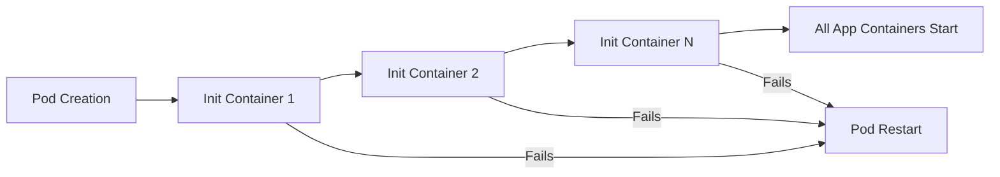

# Kubernetes Init Containers

## Introduction

When deploying applications in Kubernetes, you often need to perform certain initialization tasks before your main application starts. These could include tasks such as:

- Waiting for a database service to be ready
- Setting up configuration files
- Downloading initial data
- Running schema migrations
- Checking service dependencies

This is where Init Containers come to the rescue! **Init Containers** are specialized containers that run and complete before your main application containers start. They follow a sequential execution model, ensuring all prerequisites are met before your application boots up.

## How Init Containers Work

Init Containers run in sequence, one after another. Only when all Init Containers have successfully completed will Kubernetes start the main application containers in the Pod. If any Init Container fails, Kubernetes will restart the Pod according to its restart policy.



## Key Features of Init Containers

- **Sequential Execution**: Init Containers run one at a time, in the order defined in the Pod specification.
- **Completion Requirement**: All Init Containers must successfully complete before app containers start.
- **Restart on Failure**: If an Init Container fails, Kubernetes restarts the entire Pod (based on the Pod's `restartPolicy`).
- **Resource Isolation**: Init Containers can have different resource limits than app containers.
- **Volume Sharing**: Init Containers can access the same volumes as app containers.
- **Separate Image**: Init Containers can use different images than your application containers.

## Basic Init Container Example

Let's see a simple example of how to define Init Containers in a Kubernetes Pod:

```yaml
apiVersion: v1
kind: Pod
metadata:
  name: myapp-pod
  labels:
    app: myapp
spec:
  containers:
  - name: myapp-container
    image: busybox:1.28
    command: ['sh', '-c', 'echo The app is running! && sleep 3600']
  initContainers:
  - name: init-myservice
    image: busybox:1.28
    command: ['sh', '-c', 'until nslookup myservice; do echo waiting for myservice; sleep 2; done;']
  - name: init-mydb
    image: busybox:1.28
    command: ['sh', '-c', 'until nslookup mydb; do echo waiting for mydb; sleep 2; done;']
```

In this example:
1. First, the `init-myservice` container runs and waits until the `myservice` DNS name can be resolved.
2. Then, the `init-mydb` container runs and waits until the `mydb` DNS name can be resolved.
3. Only after both Init Containers complete successfully will the main `myapp-container` start.

## Real-World Use Cases

### 1. Database Schema Migration

Before starting your application, you might need to run database migrations:

```yaml
apiVersion: v1
kind: Pod
metadata:
  name: web-application
spec:
  containers:
  - name: web-app
    image: web-app:latest
    ports:
    - containerPort: 8080
  initContainers:
  - name: db-migration
    image: db-migration:latest
    command: ['sh', '-c', 'flyway migrate -url=jdbc:postgresql://db:5432/mydb -user=postgres -password=mypassword']
```

### 2. Configuration Setup and Validation

You can use Init Containers to set up configuration files:

```yaml
apiVersion: v1
kind: Pod
metadata:
  name: app-with-config
spec:
  volumes:
  - name: config-volume
    emptyDir: {}
  containers:
  - name: app
    image: my-app:latest
    volumeMounts:
    - name: config-volume
      mountPath: /etc/app/config
  initContainers:
  - name: config-setup
    image: busybox:1.28
    command: ['sh', '-c', 'echo "database_url=postgres://user:pass@db:5432/mydb" > /config/app.conf && echo "Config created!"']
    volumeMounts:
    - name: config-volume
      mountPath: /config
```

### 3. Waiting for Dependencies

A common pattern is to check for dependent services before starting:

```yaml
apiVersion: v1
kind: Pod
metadata:
  name: service-with-dependencies
spec:
  containers:
  - name: main-service
    image: main-service:latest
    ports:
    - containerPort: 8080
  initContainers:
  - name: wait-for-redis
    image: busybox:1.28
    command: ['sh', '-c', 'until nc -z redis-service 6379; do echo "Waiting for Redis"; sleep 2; done;']
  - name: wait-for-rabbitmq
    image: busybox:1.28
    command: ['sh', '-c', 'until nc -z rabbitmq-service 5672; do echo "Waiting for RabbitMQ"; sleep 2; done;']
```

### 4. Downloading Initial Data

You can use Init Containers to fetch data before your application starts:

```yaml
apiVersion: v1
kind: Pod
metadata:
  name: app-with-initial-data
spec:
  volumes:
  - name: data-volume
    emptyDir: {}
  containers:
  - name: app
    image: my-app:latest
    volumeMounts:
    - name: data-volume
      mountPath: /app/data
  initContainers:
  - name: data-downloader
    image: busybox:1.28
    command: ['sh', '-c', 'wget -O /data/initial-data.json https://example.com/data && echo "Data downloaded!"']
    volumeMounts:
    - name: data-volume
      mountPath: /data
```

## Best Practices for Init Containers

1. **Keep Init Containers Small and Fast**: The larger and more complex your Init Containers, the longer it will take for your Pod to become ready.

2. **Use the Right Restart Policy**: Remember that `restartPolicy` applies to all containers in the Pod. For most cases, `Always` or `OnFailure` is appropriate.

3. **Set Resource Limits**: Specify resource limits for your Init Containers to ensure they don't consume excessive resources:

```yaml
initContainers:
- name: init-database
  image: database-init:v1
  resources:
    limits:
      cpu: "0.5"
      memory: "256Mi"
    requests:
      cpu: "0.1"
      memory: "128Mi"
```

4. **Use Health Checks When Appropriate**: In your Init Containers, implement proper error handling to fail fast if something goes wrong.

5. **Leverage Volume Sharing**: Share volumes between Init Containers and app containers for efficient data passing:

```yaml
volumes:
- name: shared-data
  emptyDir: {}
initContainers:
- name: init-data
  volumeMounts:
  - name: shared-data
    mountPath: /data
containers:
- name: app
  volumeMounts:
  - name: shared-data
    mountPath: /app/data
```

## Common Troubleshooting

### Init Container Stuck or Failing

If your Pod is stuck in the `Init` state, check the Init Container logs:

```bash
kubectl logs <pod-name> -c <init-container-name>
```

### Debugging Init Container Issues

You can describe the Pod to see detailed status:

```bash
kubectl describe pod <pod-name>
```

Look for the `Events` section and the status of each Init Container.

### Init Container Status in Pod Description

When you describe a Pod, you'll see information about Init Containers:

```
Init Containers:
  init-myservice:
    Container ID: ...
    Image: busybox:1.28
    ...
    State: Terminated
      Reason: Completed
      Exit Code: 0
    ...
```

## Conclusion

Init Containers provide a powerful way to handle Pod initialization in Kubernetes. They ensure that your application containers start only when all prerequisites are met, which leads to more reliable application deployments.

By using Init Containers, you can:
- Ensure your application starts only when all dependencies are ready
- Perform one-time initialization tasks cleanly
- Improve the reliability of your application deployments
- Separate setup concerns from your main application code

Next time you need to run setup tasks before your main application starts, remember that Init Containers are the Kubernetes way to handle this common requirement!

## Exercises

1. Create a Pod with an Init Container that writes the current date to a file, and a main container that reads and displays that file.
2. Design a Pod with multiple Init Containers that check for different services (database, cache, API) before starting the main application.
3. Implement a Pod with an Init Container that sets up a configuration file with environment-specific values, and a main container that uses that configuration.

## Additional Resources

- [Kubernetes Official Documentation on Init Containers](https://kubernetes.io/docs/concepts/workloads/pods/init-containers/)
- [Kubernetes Patterns: The Init Container Pattern](https://kubernetes.io/blog/2019/03/15/kubernetes-setup-using-ansible-and-vagrant/)
- [Practical Init Container Examples](https://kubernetes.io/docs/tasks/configure-pod-container/configure-pod-initialization/)