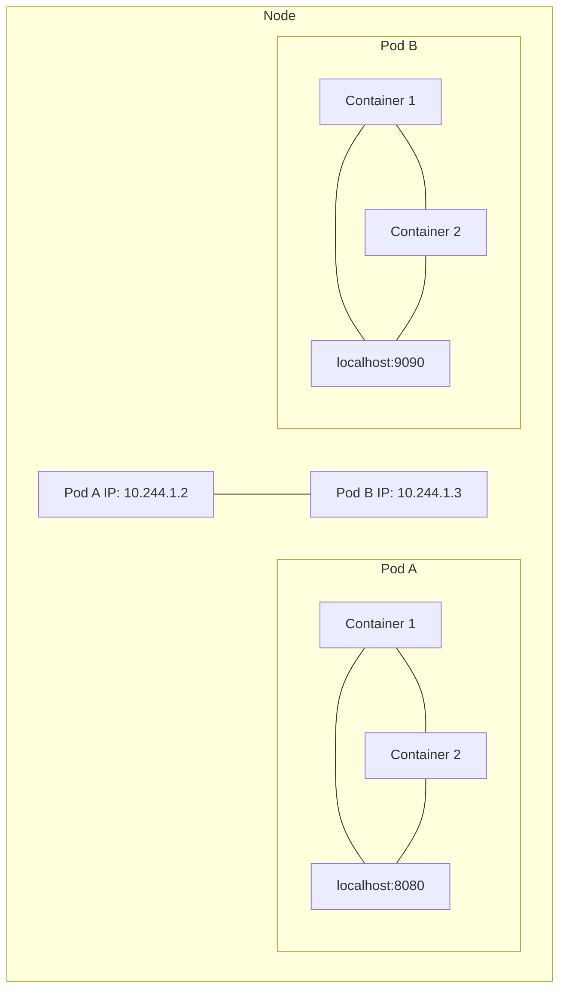
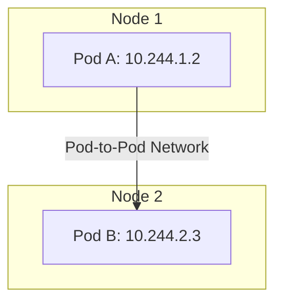
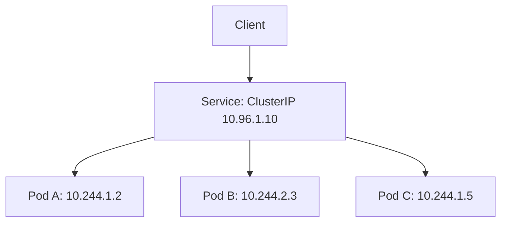

# Kubernetes Network Model

## Introduction

The Kubernetes network model is a fundamental concept that defines how networking works within a Kubernetes cluster. It establishes the rules and principles for how pods communicate with each other, how services are exposed, and how network traffic is managed. Understanding this model is essential for deploying scalable, secure, and resilient applications on Kubernetes.

In this guide, we'll explore the Kubernetes network model from the ground up, focusing on its core principles, components, and practical applications.

## Kubernetes Networking Fundamentals

Kubernetes networking follows four key principles:

1. **All pods can communicate with all other pods** without NAT (Network Address Translation)
2. **All nodes can communicate with all pods** without NAT
3. **The IP that a pod sees itself as is the same IP that others see it as**
4. **Each pod receives its own unique IP address**

These principles ensure a flat network model that simplifies application design and deployment.

## Pod Networking Basics

A Pod is the smallest deployable unit in Kubernetes and can contain one or more containers. All containers within a pod share the same network namespace, which means they:

- Share the same IP address
- Can communicate using `localhost`
- Share the same port space

Let's visualize this with a diagram:



### Example: Accessing a Container within the Same Pod

If you have a web server container and a sidecar container in the same pod, they can communicate via localhost:

```yaml
apiVersion: v1
kind: Pod
metadata:
  name: web-with-sidecar
spec:
  containers:
  - name: web-server
    image: nginx
    ports:
    - containerPort: 80
  - name: sidecar
    image: busybox
    command: ["sh", "-c", "while true; do wget -q -O- http://localhost:80; sleep 10; done"]
```

When applying this YAML:

```bash
kubectl apply -f web-with-sidecar.yaml
```

The sidecar container can access the web server using `localhost:80`.

## Container Network Interface (CNI)

Kubernetes delegates the implementation of the network model to a Container Network Interface (CNI) plugin. Popular CNI plugins include:

- Calico
- Flannel
- Cilium
- Weave Net

These plugins implement the Kubernetes networking requirements in different ways, offering various features like network policies, encryption, and performance optimizations.

## Cross-Node Pod Communication

When pods are on different nodes, the CNI plugin ensures that traffic is correctly routed between nodes.



Let's look at a simple example of how pods on different nodes communicate:

```bash
# From Pod A on Node 1
kubectl exec -it pod-a -- curl 10.244.2.3:80
```

This command would send a request from Pod A to Pod B, even though they're on different physical nodes.

## Service Networking

While pods have unique IP addresses, they are ephemeral—they can be created and destroyed at any time. Kubernetes Services provide a stable endpoint for a set of pods.

A Service has a virtual IP (called a ClusterIP) that routes traffic to the underlying pods based on label selectors.



### Example: Creating a Service for a Deployment

```yaml
apiVersion: apps/v1
kind: Deployment
metadata:
  name: web-app
spec:
  replicas: 3
  selector:
    matchLabels:
      app: web
  template:
    metadata:
      labels:
        app: web
    spec:
      containers:
      - name: web-server
        image: nginx
        ports:
        - containerPort: 80
---
apiVersion: v1
kind: Service
metadata:
  name: web-service
spec:
  selector:
    app: web
  ports:
  - port: 80
    targetPort: 80
  type: ClusterIP
```

Apply this configuration:

```bash
kubectl apply -f web-app-service.yaml
```

Now other pods within the cluster can connect to your application using the service name:

```bash
kubectl exec -it debug-pod -- curl web-service:80
```

## Service Types

Kubernetes offers several service types to expose your applications:

1. **ClusterIP**: Default type, exposes the service on a cluster-internal IP
2. **NodePort**: Exposes the service on each node's IP at a static port
3. **LoadBalancer**: Exposes the service externally using a cloud provider's load balancer
4. **ExternalName**: Maps a service to a DNS name

Let's see how a NodePort service works:

```yaml
apiVersion: v1
kind: Service
metadata:
  name: web-service-nodeport
spec:
  selector:
    app: web
  ports:
  - port: 80
    targetPort: 80
    nodePort: 30080
  type: NodePort
```

After applying this configuration, the service will be accessible via `<any-node-ip>:30080`.

## DNS in Kubernetes

Kubernetes includes a DNS service that helps pods find services by name. This means pods can talk to services using human-readable names instead of IP addresses.

For example, a service `web-service` in the `default` namespace can be accessed as:

- `web-service` (from pods in the same namespace)
- `web-service.default` (fully qualified name within the cluster)
- `web-service.default.svc.cluster.local` (fully qualified domain name)

## Network Policies

By default, Kubernetes allows all pods to communicate with any other pod. Network Policies let you control traffic flow at the IP address or port level.

```yaml
apiVersion: networking.k8s.io/v1
kind: NetworkPolicy
metadata:
  name: web-allow-frontend
spec:
  podSelector:
    matchLabels:
      app: web-backend
  ingress:
  - from:
    - podSelector:
        matchLabels:
          app: web-frontend
    ports:
    - protocol: TCP
      port: 80
```

This policy allows traffic only from pods with the label `app: web-frontend` to pods with the label `app: web-backend` on port 80.

## kube-proxy and Service Implementation

The `kube-proxy` component runs on each node and implements services by setting up iptables rules to redirect traffic from the service's ClusterIP to the appropriate pods.

There are three kube-proxy modes:

1. **userspace**: The original mode (legacy)
2. **iptables**: The default mode
3. **ipvs**: A newer mode for high performance requirements

## Service Mesh Integration

For more advanced networking features, many clusters integrate a service mesh like Istio or Linkerd, which provides:

- Advanced traffic routing
- Circuit breaking
- mTLS encryption
- Observability

## Hands-on Exercise: Exploring Kubernetes Networking

Let's create a practical example with a frontend and backend service to demonstrate the networking model:

```yaml
apiVersion: apps/v1
kind: Deployment
metadata:
  name: backend
spec:
  replicas: 2
  selector:
    matchLabels:
      app: backend
  template:
    metadata:
      labels:
        app: backend
    spec:
      containers:
      - name: backend
        image: gcr.io/google-samples/hello-app:1.0
        ports:
        - containerPort: 8080
---
apiVersion: v1
kind: Service
metadata:
  name: backend-service
spec:
  selector:
    app: backend
  ports:
  - port: 80
    targetPort: 8080
---
apiVersion: apps/v1
kind: Deployment
metadata:
  name: frontend
spec:
  replicas: 2
  selector:
    matchLabels:
      app: frontend
  template:
    metadata:
      labels:
        app: frontend
    spec:
      containers:
      - name: frontend
        image: nginx
        ports:
        - containerPort: 80
        volumeMounts:
        - name: nginx-config
          mountPath: /etc/nginx/conf.d
      volumes:
      - name: nginx-config
        configMap:
          name: nginx-config
---
apiVersion: v1
kind: ConfigMap
metadata:
  name: nginx-config
data:
  default.conf: |
    server {
        listen 80;
        location /api {
            proxy_pass http://backend-service;
        }
        location / {
            return 200 'Frontend Working!';
        }
    }
---
apiVersion: v1
kind: Service
metadata:
  name: frontend-service
spec:
  selector:
    app: frontend
  ports:
  - port: 80
    targetPort: 80
  type: NodePort
```

Apply this configuration:

```bash
kubectl apply -f frontend-backend-example.yaml
```

Test the communication:

```bash
# Get the NodePort
kubectl get service frontend-service

# Access the frontend, which will proxy to the backend
curl <node-ip>:<node-port>/api
```

This example demonstrates:
- Pod-to-Pod communication through Services
- DNS-based service discovery
- NodePort for external access

## Debugging Network Issues

Here are some common commands to debug networking issues in Kubernetes:

```bash
# Check if pods are running
kubectl get pods

# Check service endpoints
kubectl get endpoints <service-name>

# Test connectivity from within a pod
kubectl exec -it <pod-name> -- curl <service-name>

# Check logs for networking issues
kubectl logs <pod-name>

# Describe the service
kubectl describe service <service-name>
```

## Summary

The Kubernetes network model provides a robust foundation for container-to-container communication within a distributed system. Key points to remember:

1. Every pod gets its own IP address
2. Pods can communicate with all other pods without NAT
3. Containers within a pod share the same network namespace
4. Services provide stable endpoints for pods
5. CNI plugins implement the actual networking
6. Network Policies allow for fine-grained network security

Understanding these principles is crucial for designing, deploying, and troubleshooting applications in Kubernetes.

## Additional Resources

- [Kubernetes Networking Documentation](https://kubernetes.io/docs/concepts/cluster-administration/networking/)
- [CNI Specification](https://github.com/containernetworking/cni)
- [Network Policy Documentation](https://kubernetes.io/docs/concepts/services-networking/network-policies/)

## Practice Exercises

1. Deploy a multi-tier application with frontend, backend, and database pods and configure appropriate services for communication.
2. Implement Network Policies to restrict traffic between pods based on labels.
3. Test different service types (ClusterIP, NodePort, LoadBalancer) and observe how they affect accessibility.
4. Deploy a CNI plugin like Calico and explore its network policy features.
5. Use `kubectl exec` to perform network debugging from within a pod.