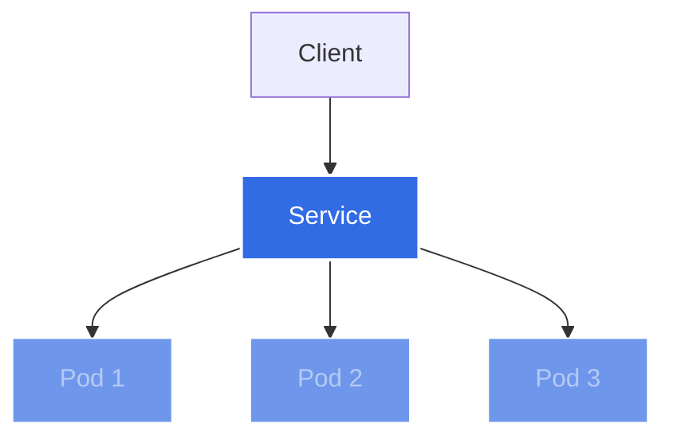
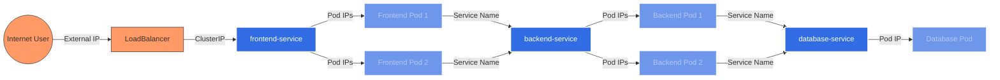

# Kubernetes Services

## Introduction

When working with containerized applications in Kubernetes, one of the key challenges is enabling reliable network communication. Pods in Kubernetes are ephemeral - they can be created, destroyed, and rescheduled based on scaling needs or node failures. This dynamic nature makes it difficult to rely on pod IP addresses for stable communication.

This is where **Kubernetes Services** come in. A Service is an abstraction that defines a logical set of pods and a policy to access them. Services provide a stable network endpoint for pods, allowing other components to reliably communicate with your application regardless of what happens to the individual pods underneath.

## Why We Need Services

Let's consider a scenario to understand why Services are essential:

1. You deploy a web application with 3 replicas (pods)
2. Each pod gets its own IP address
3. These pods might be terminated, recreated, or scaled up/down over time
4. You need a reliable way for other applications to connect to your web application

Without Services, clients would need to keep track of all pod IP addresses and update their configurations whenever pods change. Services solve this problem by providing a single, stable IP address and DNS name that routes traffic to the appropriate pods.

## Service Types

Kubernetes offers several types of Services to meet different networking requirements:

### ClusterIP (Default)

A ClusterIP Service exposes the Service on an internal IP address accessible only within the cluster. This is the default Service type and is ideal for internal communication between applications.

```yaml
apiVersion: v1
kind: Service
metadata:
  name: my-backend-service
spec:
  selector:
    app: my-backend
  ports:
    - port: 80
      targetPort: 8080
  type: ClusterIP
```

### NodePort

A NodePort Service exposes the Service on each Node's IP at a static port. This makes the Service accessible from outside the cluster using `<NodeIP>:<NodePort>`.

```yaml
apiVersion: v1
kind: Service
metadata:
  name: my-web-service
spec:
  selector:
    app: my-web
  ports:
    - port: 80
      targetPort: 8080
      nodePort: 30080  # Optional: Kubernetes assigns one if not specified (range 30000-32767)
  type: NodePort
```

### LoadBalancer

A LoadBalancer Service creates an external load balancer in cloud environments (like AWS, GCP, Azure) and assigns a fixed, external IP to the Service.

```yaml
apiVersion: v1
kind: Service
metadata:
  name: my-public-service
spec:
  selector:
    app: my-public-app
  ports:
    - port: 80
      targetPort: 8080
  type: LoadBalancer
```

### ExternalName

An ExternalName Service maps the Service to an external DNS name, acting as a CNAME record. This is useful for providing access to external services.

```yaml
apiVersion: v1
kind: Service
metadata:
  name: my-database
spec:
  type: ExternalName
  externalName: db.example.com
```

## Service Discovery in Kubernetes

Kubernetes provides two primary mechanisms for service discovery:

1. **Environment Variables**: When a Pod is created, Kubernetes adds environment variables for each active Service.
2. **DNS**: Kubernetes clusters typically have a DNS service (CoreDNS) that allows pods to resolve service names to their cluster IPs.

The DNS approach is the recommended method as it's more flexible and intuitive:

```bash
# Access a service using its name within the same namespace
curl http://my-service:80

# Access a service in a different namespace
curl http://my-service.other-namespace:80

# Access a service in a different namespace with the cluster domain suffix
curl http://my-service.other-namespace.svc.cluster.local:80
```

## Service Selectors

Services use label selectors to determine which pods should receive traffic. This is a key component of Kubernetes' loose coupling approach:

```yaml
apiVersion: v1
kind: Service
metadata:
  name: my-app-service
spec:
  selector:
    app: my-app
    tier: frontend
  ports:
    - port: 80
      targetPort: 8080
```

In this example, the Service will route traffic to all pods with labels `app: my-app` and `tier: frontend`.

## Headless Services

Sometimes you don't need load balancing or a single Service IP. In these cases, you can create a "headless" Service by setting `.spec.clusterIP` to `None`:

```yaml
apiVersion: v1
kind: Service
metadata:
  name: my-headless-service
spec:
  clusterIP: None
  selector:
    app: my-stateful-app
  ports:
    - port: 80
      targetPort: 8080
```

A headless Service returns the IP addresses of the pods directly in DNS queries, which is useful for:
- StatefulSets where each pod needs a stable identity
- Applications that want to connect to all pods (not just one randomly)
- Applications that handle their own load balancing

## EndpointSlices

Behind the scenes, Kubernetes automatically creates and manages EndpointSlices for Services. These contain the network endpoints (IP addresses, ports) of pods matching the Service selector.

You rarely need to interact with EndpointSlices directly, but understanding that they exist helps explain how Services actually route traffic to pods.

## Port Configurations

Services allow different port configurations:

```yaml
apiVersion: v1
kind: Service
metadata:
  name: my-service
spec:
  selector:
    app: my-app
  ports:
    - name: http
      port: 80        # Port exposed by the service
      targetPort: 8080 # Port of the application in the pod
      protocol: TCP   # Protocol (TCP, UDP, or SCTP)
```

For more complex scenarios, you can map to named ports in your pod specifications:

```yaml
apiVersion: v1
kind: Pod
metadata:
  name: my-pod
  labels:
    app: my-app
spec:
  containers:
    - name: my-container
      image: nginx
      ports:
        - name: http-web
          containerPort: 8080
---
apiVersion: v1
kind: Service
metadata:
  name: my-service
spec:
  selector:
    app: my-app
  ports:
    - port: 80
      targetPort: http-web  # Refers to the named port in the pod
```

## Visualizing Services

Let's visualize how a Service works in Kubernetes:



## Practical Example: Multi-Tier Application

Let's walk through a complete example of setting up Services for a three-tier application:

### Step 1: Create the Frontend Deployment

```yaml
apiVersion: apps/v1
kind: Deployment
metadata:
  name: frontend
spec:
  replicas: 3
  selector:
    matchLabels:
      app: frontend
  template:
    metadata:
      labels:
        app: frontend
    spec:
      containers:
      - name: frontend
        image: my-frontend:latest
        ports:
        - containerPort: 80
```

### Step 2: Create the Frontend Service (LoadBalancer)

```yaml
apiVersion: v1
kind: Service
metadata:
  name: frontend-service
spec:
  selector:
    app: frontend
  ports:
  - port: 80
    targetPort: 80
  type: LoadBalancer
```

### Step 3: Create the Backend Deployment

```yaml
apiVersion: apps/v1
kind: Deployment
metadata:
  name: backend
spec:
  replicas: 2
  selector:
    matchLabels:
      app: backend
  template:
    metadata:
      labels:
        app: backend
    spec:
      containers:
      - name: backend
        image: my-backend:latest
        ports:
        - containerPort: 8080
```

### Step 4: Create the Backend Service (ClusterIP)

```yaml
apiVersion: v1
kind: Service
metadata:
  name: backend-service
spec:
  selector:
    app: backend
  ports:
  - port: 80
    targetPort: 8080
  type: ClusterIP
```

### Step 5: Create the Database Deployment

```yaml
apiVersion: apps/v1
kind: Deployment
metadata:
  name: database
spec:
  replicas: 1
  selector:
    matchLabels:
      app: database
  template:
    metadata:
      labels:
        app: database
    spec:
      containers:
      - name: database
        image: postgres:13
        ports:
        - containerPort: 5432
        env:
        - name: POSTGRES_PASSWORD
          value: "mysecretpassword"
        - name: POSTGRES_DB
          value: "myapp"
```

### Step 6: Create the Database Service (ClusterIP)

```yaml
apiVersion: v1
kind: Service
metadata:
  name: database-service
spec:
  selector:
    app: database
  ports:
  - port: 5432
    targetPort: 5432
  type: ClusterIP
```

In this architecture:
- External users access the application through the `frontend-service` LoadBalancer
- The frontend pods communicate with backend pods through `backend-service`
- The backend pods communicate with the database pod through `database-service`
- All internal communication is secured within the cluster

## Service Network Traffic Flow



## Service Networking Advanced Concepts

### SessionAffinity

Services support "session affinity" which can route all traffic from a client to the same pod:

```yaml
apiVersion: v1
kind: Service
metadata:
  name: my-service
spec:
  selector:
    app: my-app
  sessionAffinity: ClientIP
  sessionAffinityConfig:
    clientIP:
      timeoutSeconds: 10800  # 3 hours
  ports:
  - port: 80
    targetPort: 8080
```

### ExternalTrafficPolicy

For NodePort and LoadBalancer services, you can configure how external traffic is handled:

```yaml
apiVersion: v1
kind: Service
metadata:
  name: my-service
spec:
  selector:
    app: my-app
  ports:
  - port: 80
    targetPort: 8080
  type: LoadBalancer
  externalTrafficPolicy: Local  # Only routes to pods on the same node
```

Options:
- `Cluster` (default): Traffic can be routed to pods on any node
- `Local`: Traffic is only routed to pods on the node that received the request (preserves client source IP and avoids extra hops)

## Troubleshooting Services

When your Services aren't working as expected, follow these troubleshooting steps:

1. **Verify Service exists:**
   ```bash
   kubectl get service my-service
   ```

2. **Check Service details:**
   ```bash
   kubectl describe service my-service
   ```

3. **Verify Endpoints are created:**
   ```bash
   kubectl get endpoints my-service
   ```

4. **Test connectivity from a pod:**
   ```bash
   kubectl run test-pod --image=busybox -it --rm -- wget -O- my-service:80
   ```

5. **Verify labels match between Service selector and Pod labels:**
   ```bash
   kubectl get pods --selector=app=my-app
   ```

## Summary

Kubernetes Services are a fundamental networking concept that:

- Provide stable network identities to pods
- Enable service discovery within your cluster
- Support different access patterns (internal-only, node-level, external)
- Abstract away the complexity of pod changes and failures
- Allow your applications to reliably communicate regardless of pod lifecycle events

Understanding Services is essential for building reliable networked applications in Kubernetes. They form the foundation for more advanced concepts like Ingress controllers and Service Meshes.

## Additional Resources

- [Kubernetes Official Documentation on Services](https://kubernetes.io/docs/concepts/services-networking/service/)
- [Kubernetes Network Policies](https://kubernetes.io/docs/concepts/services-networking/network-policies/)
- [Kubernetes Ingress](https://kubernetes.io/docs/concepts/services-networking/ingress/)

## Exercises

1. Create a simple deployment and expose it using each of the different Service types. Observe how accessibility changes with each type.

2. Create a multi-tier application (similar to our example) with frontend, backend, and database services.

3. Experiment with headless Services for a StatefulSet and observe how DNS resolution works compared to regular Services.

4. Test different service discovery methods (environment variables vs. DNS) and compare their effectiveness.

5. Implement session affinity and observe how traffic is routed consistently to the same pods.