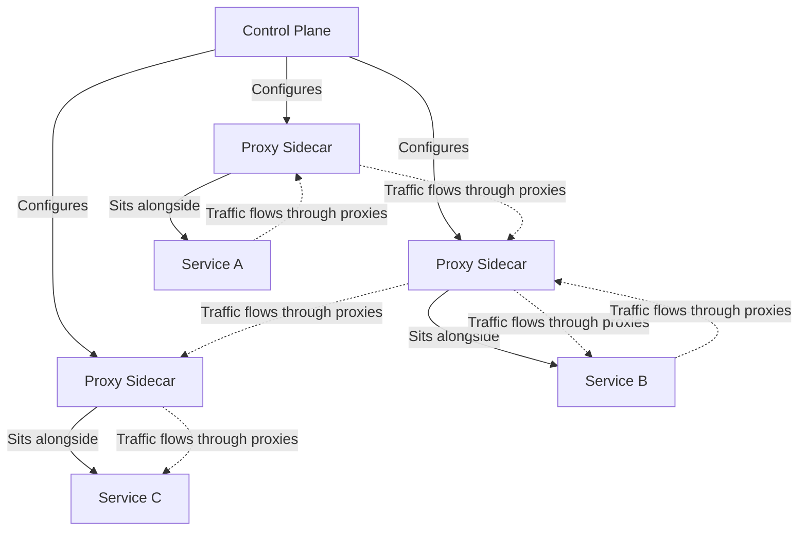

# Kubernetes Service Mesh

## Introduction

In modern cloud-native applications built on Kubernetes, services need to communicate with each other constantly. As your application grows from a few services to dozens or hundreds, managing this communication becomes increasingly complex. How do you ensure reliable, secure communication? How do you monitor all these interactions? How do you implement consistent policies?

A **service mesh** solves these challenges by providing a dedicated infrastructure layer for service-to-service communication. It abstracts away the complexities of network communication, allowing developers to focus on building business logic rather than networking code.

In this guide, we'll explore Kubernetes service meshes, how they work, popular implementations, and how to get started with implementing a service mesh in your Kubernetes cluster.

## What is a Service Mesh?

A service mesh is a dedicated infrastructure layer that handles service-to-service communication within a Kubernetes environment. Instead of services communicating directly with each other, the service mesh mediates these interactions, providing capabilities like:

- **Traffic management**: Load balancing, routing, failover
- **Security**: Authentication, authorization, encryption  
- **Observability**: Metrics, logs, traces
- **Reliability**: Retries, timeouts, circuit breaking

The key concept is that a service mesh moves these cross-cutting concerns out of your application code and into the infrastructure layer.

## Service Mesh Architecture

Most service meshes follow a similar architecture consisting of two main components:

1. **Data plane**: A set of proxies (often [Envoy](https://www.envoyproxy.io/)) that are deployed alongside each service instance as sidecars
2. **Control plane**: A centralized component that configures and manages the proxies



### Sidecar Pattern

Service meshes typically implement what's called the **sidecar pattern**. In this pattern:

- Each service pod has an additional container (the proxy) running alongside it
- All incoming and outgoing network traffic to/from the service passes through this proxy
- The application container doesn't need to be aware of the proxy's existence

This pattern allows the mesh to intercept and manage all network communication without requiring any changes to your application code.

## Key Features of a Service Mesh

### Traffic Management

Service meshes provide sophisticated traffic management capabilities:

- **Dynamic routing**: Route traffic based on HTTP headers, paths, or other attributes
- **Load balancing**: Distribute traffic across service instances using various algorithms
- **Traffic splitting**: Send different percentages of traffic to different service versions (useful for canary deployments)
- **Circuit breaking**: Prevent cascading failures by stopping traffic to failing services

### Security

Service meshes enhance security by providing:

- **Mutual TLS (mTLS)**: Encrypt all service-to-service communication
- **Identity-based authentication**: Verify the identity of services
- **Authorization policies**: Control which services can communicate with each other
- **Certificate management**: Automate the issuance and rotation of certificates

### Observability

Service meshes provide rich insights into your service interactions:

- **Metrics**: Collect detailed metrics on request volume, latency, error rates
- **Distributed tracing**: Track requests as they flow through multiple services
- **Visualization**: Visualize service dependencies and traffic flows
- **Anomaly detection**: Identify unusual patterns or degradations in performance

### Reliability

Service meshes improve application reliability with features like:

- **Retries**: Automatically retry failed requests
- **Timeouts**: Set limits on how long requests can take
- **Health checks**: Actively monitor service health
- **Fault injection**: Simulate failures to test application resilience

## Popular Service Mesh Implementations

### Istio

[Istio](https://istio.io/) is one of the most feature-rich service meshes available, developed with support from Google, IBM, and Lyft. It provides:

- Advanced traffic management
- Robust security controls
- Rich telemetry collection
- Integration with multiple monitoring and logging systems

Here's a basic example of how to deploy Istio on your Kubernetes cluster:

```bash
# Download and install Istio
curl -L https://istio.io/downloadIstio | sh -
cd istio-*
export PATH=$PWD/bin:$PATH

# Install Istio with default profile
istioctl install --set profile=default -y

# Label namespace to enable automatic sidecar injection
kubectl label namespace default istio-injection=enabled
```

### Linkerd

[Linkerd](https://linkerd.io/) is a lightweight, CNCF-incubated service mesh focused on simplicity and performance. It features:

- Ultra-low latency (microseconds)
- Small resource footprint
- Simple installation and operation
- Automatic mTLS

Here's how to install Linkerd:

```bash
# Install Linkerd CLI
curl -sL run.linkerd.io/install | sh
export PATH=$PATH:$HOME/.linkerd2/bin

# Check if cluster is ready for Linkerd
linkerd check --pre

# Install Linkerd on the cluster
linkerd install | kubectl apply -f -

# Verify installation
linkerd check
```

### Consul Connect

[HashiCorp Consul Connect](https://www.consul.io/docs/connect) is a service mesh built on Consul, providing:

- Service discovery
- Service segmentation with intention-based policies
- Multi-region support
- Multi-platform support (not limited to Kubernetes)

### AWS App Mesh

[AWS App Mesh](https://aws.amazon.com/app-mesh/) is Amazon's service mesh implementation, designed specifically for AWS services like EKS, ECS, and EC2.

## Implementing a Service Mesh: Step-by-Step Example

Let's walk through implementing Linkerd, a lightweight service mesh, on a Kubernetes cluster with a simple microservice application.

### Step 1: Install the Linkerd CLI

```bash
# Install the Linkerd CLI
curl -sL run.linkerd.io/install | sh
export PATH=$PATH:$HOME/.linkerd2/bin
```

### Step 2: Verify your Kubernetes cluster is ready

```bash
linkerd check --pre
```

You should see all checks pass. If not, address any issues before proceeding.

### Step 3: Install Linkerd on your cluster

```bash
linkerd install | kubectl apply -f -
```

This installs the Linkerd control plane components.

### Step 4: Verify the installation

```bash
linkerd check
```

All checks should pass, indicating that Linkerd is properly installed.

### Step 5: Install the Linkerd dashboard

```bash
linkerd viz install | kubectl apply -f -
```

### Step 6: Deploy a sample application

Let's deploy a simple two-service application:

```yaml
# sample-app.yaml
apiVersion: v1
kind: Namespace
metadata:
  name: sample-app
---
apiVersion: apps/v1
kind: Deployment
metadata:
  name: frontend
  namespace: sample-app
spec:
  replicas: 1
  selector:
    matchLabels:
      app: frontend
  template:
    metadata:
      labels:
        app: frontend
    spec:
      containers:
      - name: frontend
        image: nginx:latest
        ports:
        - containerPort: 80
---
apiVersion: v1
kind: Service
metadata:
  name: frontend
  namespace: sample-app
spec:
  ports:
  - port: 80
    targetPort: 80
  selector:
    app: frontend
---
apiVersion: apps/v1
kind: Deployment
metadata:
  name: backend
  namespace: sample-app
spec:
  replicas: 1
  selector:
    matchLabels:
      app: backend
  template:
    metadata:
      labels:
        app: backend
    spec:
      containers:
      - name: backend
        image: nginx:latest
        ports:
        - containerPort: 80
---
apiVersion: v1
kind: Service
metadata:
  name: backend
  namespace: sample-app
spec:
  ports:
  - port: 80
    targetPort: 80
  selector:
    app: backend
```

Apply this configuration:

```bash
kubectl apply -f sample-app.yaml
```

### Step 7: Add the application to the service mesh

To add our sample application to the Linkerd service mesh, we need to:

1. Label the namespace for automatic injection
2. Restart the deployments (or inject the sidecars manually)

```bash
# Label the namespace
kubectl label namespace sample-app linkerd.io/inject=enabled

# Restart the deployments
kubectl rollout restart deployment -n sample-app
```

### Step 8: Verify the services are meshed

```bash
linkerd viz stat -n sample-app deployments
```

You should see both the frontend and backend deployments with "MESHED" showing "1/1".

### Step 9: View the service mesh dashboard

```bash
linkerd viz dashboard
```

This will open the Linkerd dashboard in your browser, where you can see:
- A service mesh topology map
- Real-time metrics for your services
- Health indicators
- Detailed information about each service

## Service Mesh Patterns and Best Practices

### Gradual Adoption

Instead of meshing all services at once, start with non-critical services and gradually expand:

1. Install the service mesh control plane
2. Mesh one or two non-critical services
3. Monitor and fix any issues
4. Gradually expand to more services

### Traffic Management Patterns

#### Canary Deployments

Deploy a new version of a service alongside the existing version and gradually shift traffic:

```yaml
# In Istio, a VirtualService can be used for traffic splitting
apiVersion: networking.istio.io/v1alpha3
kind: VirtualService
metadata:
  name: my-service
spec:
  hosts:
  - my-service
  http:
  - route:
    - destination:
        host: my-service
        subset: v1
      weight: 90
    - destination:
        host: my-service
        subset: v2
      weight: 10
```

#### Circuit Breaking

Prevent cascading failures by setting up circuit breakers:

```yaml
# In Istio, a DestinationRule can define circuit breakers
apiVersion: networking.istio.io/v1alpha3
kind: DestinationRule
metadata:
  name: my-service
spec:
  host: my-service
  trafficPolicy:
    connectionPool:
      http:
        http1MaxPendingRequests: 100
        maxRequestsPerConnection: 10
    outlierDetection:
      consecutiveErrors: 5
      interval: 30s
      baseEjectionTime: 30s
```

### Security Patterns

#### Mutual TLS Everywhere

Enable mutual TLS for all service-to-service communication:

```yaml
# In Istio, a PeerAuthentication resource can enable mTLS
apiVersion: security.istio.io/v1beta1
kind: PeerAuthentication
metadata:
  name: default
  namespace: istio-system
spec:
  mtls:
    mode: STRICT
```

#### Granular Access Control

Define which services can communicate with each other:

```yaml
# In Istio, an AuthorizationPolicy can define access rules
apiVersion: security.istio.io/v1beta1
kind: AuthorizationPolicy
metadata:
  name: backend-policy
  namespace: sample-app
spec:
  selector:
    matchLabels:
      app: backend
  rules:
  - from:
    - source:
        principals: ["cluster.local/ns/sample-app/sa/frontend"]
```

## Common Challenges and Solutions

### Performance Overhead

**Challenge**: Service meshes introduce additional network hops, which can increase latency.

**Solutions**:
- Use a lightweight service mesh like Linkerd for performance-critical applications
- Carefully tune proxy resource requests and limits
- Consider using traffic sampling instead of capturing 100% of traffic for observability

### Resource Consumption

**Challenge**: The additional sidecar proxies consume CPU and memory resources.

**Solutions**:
- Start with reasonable resource limits for proxies
- Monitor proxy resource usage and adjust as needed
- Consider using a service mesh with a smaller footprint

### Troubleshooting Complexity

**Challenge**: Adding a service mesh introduces another layer to debug when issues arise.

**Solutions**:
- Use the mesh's observability tools to identify issues
- Set up proper logging for both the application and service mesh components
- Maintain documentation on mesh configuration and policies

## Summary

Kubernetes service meshes provide a powerful way to standardize and centralize service-to-service communication, security, and observability. While they add some complexity and resource overhead, the benefits in terms of improved security, observability, and reliability often outweigh these costs, especially as your application grows.

When getting started with service meshes:

1. Begin by understanding your specific needs (traffic management, security, observability)
2. Choose a service mesh implementation that aligns with those needs
3. Start with a non-production environment
4. Implement gradually, beginning with non-critical services
5. Develop expertise in monitoring and troubleshooting the service mesh

By following these guidelines, you can successfully implement a service mesh and reap its benefits while minimizing potential downsides.

## Additional Resources

Here are some resources to continue learning about Kubernetes service meshes:

- [Istio Documentation](https://istio.io/docs/)
- [Linkerd Getting Started Guide](https://linkerd.io/2/getting-started/)
- [Service Mesh Interface Specification](https://smi-spec.io/)
- [CNCF Service Mesh Landscape](https://landscape.cncf.io/card-mode?category=service-mesh&grouping=category)

## Exercises

1. Install Linkerd on a test Kubernetes cluster and deploy a sample application.
2. Configure a traffic split to send 80% of traffic to version 1 of a service and 20% to version 2.
3. Set up mutual TLS between services and verify the encryption using the mesh's tools.
4. Implement a circuit breaker and test it by creating a service that fails intermittently.
5. Use the service mesh dashboard to identify the slowest service in a multi-service application.